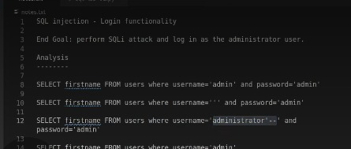
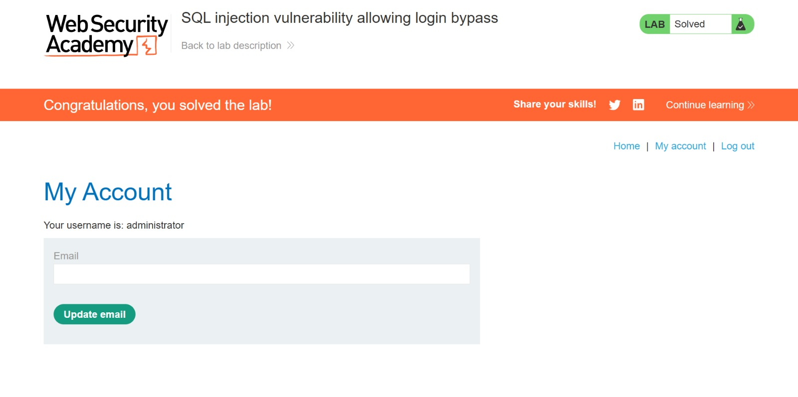

# SQLi Login Bypass — PortSwigger Web Security Academy

> SQL injection vulnerability in a login form that permits full authentication bypass, enabling unauthenticated access to privileged accounts without valid credentials.


---

## Table of Contents

- [Overview](#overview)
- [Scope & Objectives](#scope--objectives)
- [Methodology](#methodology)
- [Findings / Results](#findings--results)
- [Risk Summary](#risk-summary)
- [Attack Chain](#attack-chain)
- [Tools & Environment](#tools--environment)
- [Evidence](#evidence)
- [Remediation](#remediation)
- [Lessons Learned](#lessons-learned)
- [References](#references)
- [Author](#author)

---

## Overview

SQL injection remains one of the most prevalent and impactful vulnerability classes in web applications, ranked under **OWASP A03:2021 — Injection**. When unsanitized user input is embedded directly into SQL query strings, an attacker can manipulate query logic to bypass authentication, exfiltrate data, or gain unauthorized administrative access.

This lab, hosted on PortSwigger Web Security Academy, presents a realistic login form backed by a vulnerable SQL query. The objective was to exploit the authentication endpoint using a crafted SQL injection payload to bypass the password validation and log in as the `administrator` user.

The lab was solved successfully. Administrative access was achieved through a single injected payload that commented out the password condition in the server-side query.

> **Key Outcome:** Authentication bypass achieved via SQL injection, resulting in full administrative access without valid credentials — demonstrating a [CRITICAL] risk to account confidentiality and access control integrity.

---

## Scope & Objectives

### Objectives

- Identify the SQL injection entry point within the login form
- Analyze the likely server-side query structure to construct a valid bypass payload
- Craft and submit a payload that authenticates as the `administrator` user without a valid password
- Document the attack chain, root cause, and remediation strategy

### In Scope

| Target                       | Description                                               | Type             |
| ---------------------------- | --------------------------------------------------------- | ---------------- |
| PortSwigger Lab — Login Form | Vulnerable login endpoint provided by the lab environment | Web Application  |
| Username & Password Fields   | Injection surface for SQLi payload testing                | Input Parameters |

### Out of Scope

- Any real-world or production systems
- Automated scanning or fuzzing beyond manual payload testing
- Database enumeration beyond the authentication bypass objective

### Engagement Type

> **Type:** Gray-box (lab description confirms SQL injection is present; query structure inferred)
> **Authorization:** Sanctioned PortSwigger Web Security Academy lab environment
> **Duration:** Single session

---

## Methodology

This assessment followed the **OWASP Testing Guide (OTG-INPVAL-005)** for SQL Injection testing, combined with the **PTES** (Penetration Testing Execution Standard) for structured attack progression.

### Phase 1 — Reconnaissance & Query Inference

The lab description confirmed a SQL injection vulnerability in the login function. The likely server-side query structure was inferred based on standard authentication query patterns:

```sql
-- Standard vulnerable login query pattern
SELECT firstname FROM users WHERE username='[INPUT]' AND password='[INPUT]'
```

Three query variants were analyzed to understand how injection would manipulate the logic:

```sql
-- Test 1: Baseline — no injection
SELECT firstname FROM users WHERE username='admin' AND password='admin'

-- Test 2: Empty password — tests if password field can be nullified
SELECT firstname FROM users WHERE username='' AND password='admin'

-- Test 3: Comment injection — target payload structure
SELECT firstname FROM users WHERE username='administrator'--' AND password='admin'
```

In Test 3, the `'--` sequence closes the string literal after `administrator`, then uses `--` to comment out the remainder of the query — effectively removing the `AND password=...` condition entirely.

### Phase 2 — Payload Construction

Based on query analysis, the bypass payload was constructed as:

```
username: administrator'--
password: [any value or empty]
```

The injected payload transforms the server-side query to:

```sql
SELECT firstname FROM users WHERE username='administrator'--' AND password=''
```

Everything after `--` is treated as a comment by the SQL engine, so the query reduces to:

```sql
SELECT firstname FROM users WHERE username='administrator'
```

This returns a valid result for the `administrator` user without evaluating the password field.

### Phase 3 — Execution & Validation

The payload was submitted via the login form. Successful authentication as `administrator` confirmed the vulnerability and solved the lab.

---

## Findings / Results

### Finding F-001 — SQL Injection in Authentication Endpoint (Login Bypass)

| Field                  | Detail                                                                      |
| ---------------------- | --------------------------------------------------------------------------- |
| **ID**                 | F-001                                                                       |
| **Severity**           | [CRITICAL]                                                                  |
| **CVSS v3.1 Score**    | 9.1                                                                         |
| **CVSS Vector**        | `CVSS:3.1/AV:N/AC:L/PR:N/UI:N/S:U/C:H/I:H/A:N`                              |
| **CWE**                | CWE-89 — Improper Neutralization of Special Elements used in an SQL Command |
| **OWASP Category**     | A03:2021 — Injection                                                        |
| **MITRE ATT&CK TTP**   | T1190 — Exploit Public-Facing Application                                   |
| **Affected Component** | Login form — `username` input parameter                                     |

#### Description

The login form constructs a SQL query by directly interpolating user-supplied input into the query string without parameterization or sanitization. An attacker can inject SQL syntax into the `username` field to manipulate query logic, bypassing the password validation and authenticating as any user whose username is known — including `administrator`.

#### Technical Impact

- Password validation is entirely neutralized for any targeted account
- The `administrator` account is accessible without credentials
- The attack requires no prior authentication, elevated privileges, or user interaction
- Exploitation is trivially reproducible with a single HTTP request

#### Business Impact

- Unauthorized administrative access exposes all application data and user records
- Regulatory exposure under GDPR, NDPA (Ghana), and relevant data protection legislation
- Complete compromise of access control integrity across the application
- Reputational and legal risk proportionate to data sensitivity

#### Proof of Concept

Payload injected into the `username` field of the login form:

```
administrator'--
```

Resulting server-side query execution:

```sql
-- Intended query
SELECT firstname FROM users WHERE username='administrator'--' AND password=''

-- Effective query after SQL engine processes comment operator
SELECT firstname FROM users WHERE username='administrator'
```

#### Reproduction Steps

1. Navigate to the application login page
2. In the `username` field, enter: `administrator'--`
3. In the `password` field, enter any value (e.g., `x`)
4. Submit the form
5. The application authenticates the session as `administrator`

#### Remediation

Replace dynamic string concatenation in the SQL query with **parameterized queries** (prepared statements). See [Remediation](#remediation) section for full implementation guidance.

#### Retest Criteria

- Submit `administrator'--` as the username with an incorrect password
- Expected result after fix: authentication fails and returns a generic error
- SQL syntax characters in input must be treated as literal data, not executable SQL

---

## Risk Summary

| ID    | Title                        | Severity   | CVSS Score | CVSS Vector                                  | Priority    |
| ----- | ---------------------------- | ---------- | ---------- | -------------------------------------------- | ----------- |
| F-001 | SQL Injection — Login Bypass | [CRITICAL] | 9.1        | CVSS:3.1/AV:N/AC:L/PR:N/UI:N/S:U/C:H/I:H/A:N | [IMMEDIATE] |

---

## Attack Chain

```
[Attacker]
    |
    | 1. Identifies login form as injection surface
    v
[Login Form — username field]
    |
    | 2. Infers query structure from standard auth pattern
    v
[Query Analysis]
    |
    | 3. Constructs payload: administrator'--
    v
[SQL Engine — server-side]
    |
    | 4. Password condition commented out by -- operator
    v
[Query reduces to: SELECT ... WHERE username='administrator']
    |
    | 5. Valid row returned — session established
    v
[Authenticated as administrator]
    |
    | 6. Lab objective confirmed — full admin access
    v
[Lab Solved]
```

**MITRE ATT&CK Mapping:**

| Step                  | Tactic               | Technique                         | ID    |
| --------------------- | -------------------- | --------------------------------- | ----- |
| Exploit login form    | Initial Access       | Exploit Public-Facing Application | T1190 |
| Bypass authentication | Defense Evasion      | Abuse Elevation Control Mechanism | T1548 |
| Access admin account  | Privilege Escalation | Valid Accounts                    | T1078 |

---

## Tools & Environment

| Tool / Platform                  | Version | Purpose                                           |
| -------------------------------- | ------- | ------------------------------------------------- |
| PortSwigger Web Security Academy | N/A     | Isolated lab environment                          |
| Web Browser                      | Current | Manual payload submission via login form          |
| Burp Suite Community Edition     | Latest  | HTTP request interception and analysis (optional) |
| OWASP Testing Guide              | v4.2    | Methodology reference — OTG-INPVAL-005            |
| NVD CVSS v3.1 Calculator         | v3.1    | Severity scoring — nvd.nist.gov                   |

---

## Evidence

# SQL Injection — Login Bypass

## Evidence

### Screenshot 1 — SQL Injection Analysis & Payload Notes



> Caption: Pre-exploitation query analysis. The application’s login query structure was analyzed to identify injectable input handling. The payload used the SQL comment operator `--` to terminate the password condition and force authentication as the `administrator` account.

---

### Screenshot 2 — Lab Solved — Authenticated as Administrator



> Caption: Successful authentication bypass through SQL injection. The PortSwigger Web Security Academy lab is marked as "Solved", and the session confirms authenticated access to the `administrator` account.
---

## Remediation

### R-001 — Implement Parameterized Queries (Prepared Statements)

**Priority:** [IMMEDIATE] — fix within 24–48 hours in any production deployment

**Root Cause:** The authentication query is constructed via string concatenation, allowing user-supplied input to be interpreted as SQL syntax rather than as data.

**Fix:** Replace dynamic query construction with parameterized queries. The database driver handles escaping of all input values, preventing SQL syntax injection regardless of input content.

**Before (vulnerable):**

```python
# Insecure — direct string interpolation
query = "SELECT firstname FROM users WHERE username='" + username + "' AND password='" + password + "'"
cursor.execute(query)
```

**After (secure):**

```python
# Secure — parameterized query with bound parameters
query = "SELECT firstname FROM users WHERE username = %s AND password = %s"
cursor.execute(query, (username, password))
```

**Additional Hardening Measures:**

| Control                  | Description                                                                                             | Priority     |
| ------------------------ | ------------------------------------------------------------------------------------------------------- | ------------ |
| Input validation         | Reject or strip SQL metacharacters (`'`, `--`, `;`, `/*`) at the application layer                      | [SHORT-TERM] |
| Least privilege          | Database user account for the application should have SELECT-only permissions on the users table        | [SHORT-TERM] |
| Error handling           | Return generic error messages on login failure — do not expose SQL errors or stack traces to the client | [IMMEDIATE]  |
| Web Application Firewall | Deploy a WAF rule set to detect and block common SQLi patterns at the network perimeter                 | [PLANNED]    |
| Security logging         | Log and alert on abnormal authentication patterns, including inputs containing SQL metacharacters       | [SHORT-TERM] |

**Reference:** OWASP SQL Injection Prevention Cheat Sheet — https://cheatsheetseries.owasp.org/cheatsheets/SQL_Injection_Prevention_Cheat_Sheet.html

---

## Lessons Learned

### Technical Skills Demonstrated

| Skill                           | Application                                                                          |
| ------------------------------- | ------------------------------------------------------------------------------------ |
| SQL query logic analysis        | Inferred server-side query structure from application behavior and standard patterns |
| Injection payload construction  | Applied `'--` comment operator to neutralize password condition                      |
| CVSS v3.1 scoring               | Calculated attack vector, complexity, privilege requirements, and impact metrics     |
| MITRE ATT&CK mapping            | Mapped exploitation steps to T1190, T1548, T1078                                     |
| Parameterized query remediation | Applied Python `cursor.execute()` bound parameter fix                                |

### Key Takeaways

String concatenation in SQL queries is never an acceptable pattern for user-supplied input, regardless of the application layer or framework in use. Parameterized queries are the only defense that eliminates injection at the root cause. Input validation and WAF rules are supplementary controls — they are not substitutes for prepared statements.

The `--` comment operator is a reliable and widely applicable bypass technique. Any authentication query that fails to use bound parameters is vulnerable to this class of attack with minimal skill threshold.

**Tags:** `sql-injection` `authentication-bypass` `cwe-89` `owasp-a03` `prepared-statements` `portswigger` `web-security-academy`

---

## References

| Source                            | Description                                                | URL                                                                                      |
| --------------------------------- | ---------------------------------------------------------- | ---------------------------------------------------------------------------------------- |
| PortSwigger Web Security Academy  | Lab: SQL injection vulnerability allowing login bypass     | https://portswigger.net/web-security/sql-injection/lab-login-bypass                      |
| OWASP Top 10 2021                 | A03:2021 — Injection                                       | https://owasp.org/Top10/A03_2021-Injection/                                              |
| OWASP Testing Guide v4.2          | OTG-INPVAL-005 — Testing for SQL Injection                 | https://owasp.org/www-project-web-security-testing-guide/                                |
| CWE-89                            | Improper Neutralization of Special Elements in SQL Command | https://cwe.mitre.org/data/definitions/89.html                                           |
| MITRE ATT&CK T1190                | Exploit Public-Facing Application                          | https://attack.mitre.org/techniques/T1190/                                               |
| OWASP SQLi Prevention Cheat Sheet | Parameterized query implementation guide                   | https://cheatsheetseries.owasp.org/cheatsheets/SQL_Injection_Prevention_Cheat_Sheet.html |
| NVD CVSS v3.1 Calculator          | Severity scoring tool                                      | https://nvd.nist.gov/vuln-metrics/cvss/v3-calculator                                     |

---

## Author

**Michael Asante Anim** | `0x1aerixis`
BSc Cyber Security — University of Mines and Technology (UMaT), Tarkwa, Ghana

[](https://github.com/anim-michael-asante)
[](https://linkedin.com/in/michael-asante-anim)
[](https://tryhackme.com/p/0x1aerixis)
[](https://x.com/0x1aerixis)
[](https://discord.com/users/0x1aerixis)

> _"Built in the lab. Documented for the field."_

---

> **Disclaimer:** All work documented in this repository was conducted in authorized, isolated
> lab environments or sanctioned CTF platforms. No unauthorized systems were accessed.
> This project is intended for educational and portfolio purposes only.
