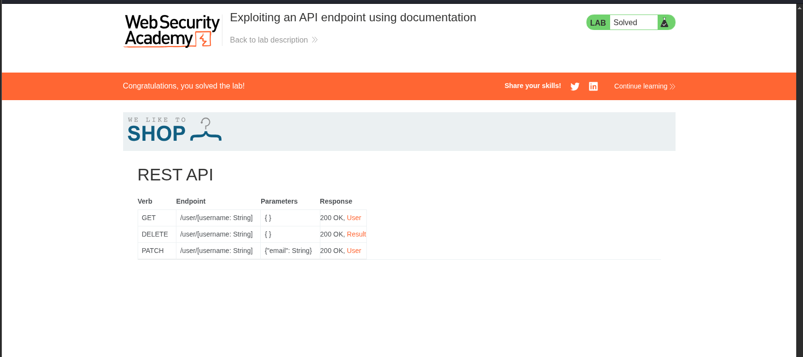
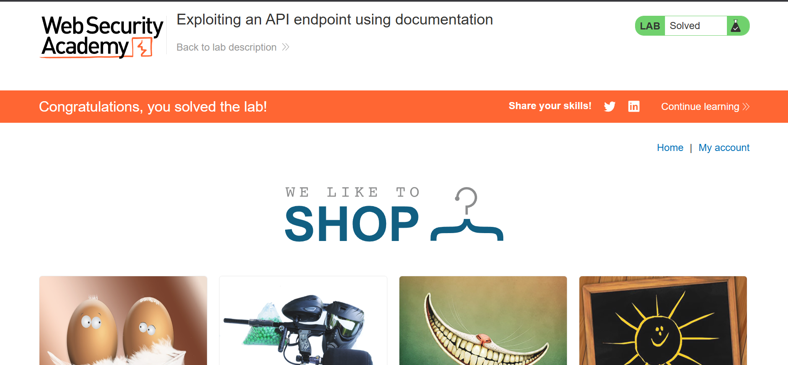

# Exploiting an API Endpoint Using Documentation

> Discovery and exploitation of an undocumented, exposed REST API endpoint that permitted unauthorized deletion of another user's account.


---

## Table of Contents
- [Overview](#overview)
- [Scope & Objectives](#scope--objectives)
- [Methodology](#methodology)
- [Findings / Results](#findings--results)
- [Attack Chain](#attack-chain)
- [Tools & Environment](#tools--environment)
- [Evidence](#evidence)
- [Lessons Learned](#lessons-learned)
- [References](#references)
- [Author](#author)

---

## Overview

Modern web applications increasingly expose REST APIs to support dynamic client functionality, but these APIs are frequently accompanied by documentation that is unintentionally reachable by unauthenticated or low-privilege parties. When authorization checks are not consistently enforced across every documented endpoint, that documentation becomes a direct roadmap for account takeover and unauthorized data manipulation.

This project targeted a PortSwigger Web Security Academy lab simulating an e-commerce platform. A low-privilege authenticated session was used to enumerate a hidden API path, retrieve its interactive documentation, and invoke a `DELETE` operation against a victim account that should not have been accessible.

> **Key Outcome:** Identified an exposed, undocumented API root that disclosed full REST API documentation, enabling unauthorized deletion of another user's account (`carlos`) via a `DELETE /api/user/{username}` request with no ownership or authorization check.

---

## Scope & Objectives

### Objectives
- Enumerate hidden or undocumented API endpoints reachable from an authenticated low-privilege session
- Determine whether API-level authorization checks were enforced independently of the primary web application
- Exploit any discovered gap to demonstrate impact (unauthorized account deletion)

### In Scope
| Target | Description | Type |
|--------|-------------|------|
| PortSwigger Academy lab instance | "We Like To Shop" e-commerce simulation | Web Application |
| `/api/user/{username}` | REST endpoint for user account management | API Endpoint |

### Out of Scope
- Underlying lab infrastructure and hosting platform
- Other PortSwigger Academy labs and shared infrastructure
- Any account other than `wiener` (attacker-controlled) and `carlos` (designated lab target)

### Engagement Type
> **Type:** Gray-box (authenticated low-privilege access provided)
> **Authorization:** PortSwigger Web Security Academy — sanctioned lab environment
> **Duration:** Single session

---

## Methodology

Testing followed a manual API discovery and abuse workflow aligned with **OWASP API Security Top 10 (2023)** and **PTES** exploitation phases.

1. **Baseline traffic capture** — Authenticated as `wiener` and performed a legitimate profile update (email change) to capture a known-good API call in Burp Suite's HTTP history.
2. **Endpoint isolation** — Sent the captured `PATCH /api/user/wiener` request to Repeater to manipulate it independently of the browser.
3. **Path truncation / forced browsing** — Progressively stripped path segments (`/wiener`, then `/user`) to identify the API's root and surface any default or diagnostic responses.
4. **Documentation discovery** — Requesting the bare `/api` root returned full, interactive REST API documentation rather than an error, indicating no authorization gate on the documentation endpoint itself.
5. **Authorization testing** — Used the disclosed documentation to construct a `DELETE` request against a username the attacker session did not own, to test whether object-level authorization was enforced server-side.

This sequence maps directly to **API9:2023 – Improper Inventory Management** (undocumented API surface reachable without restriction) chained into **API1:2023 – Broken Object Level Authorization** (no server-side check that `wiener` was authorized to delete `carlos`).

---

## Findings / Results

### Finding 01 — Broken Object Level Authorization via Exposed API Documentation

| Field | Detail |
|---|---|
| **Severity** | [HIGH] |
| **CVSS v3.1 Score** | 8.0 |
| **CVSS Vector** | `CVSS:3.1/AV:N/AC:L/PR:L/UI:N/S:U/C:N/I:H/A:H` |
| **CWE** | CWE-862: Missing Authorization; CWE-200: Exposure of Sensitive Information to an Unauthorized Actor |
| **OWASP Category** | API1:2023 – Broken Object Level Authorization; API9:2023 – Improper Inventory Management |
| **MITRE ATT&CK** | T1590 – Gather Victim Network Information (API discovery); T1078 – Valid Accounts (authenticated abuse) |
| **Affected Component** | `/api` documentation root; `/api/user/{username}` (`GET`, `DELETE`, `PATCH`) |

**Description**
The application exposed a REST API alongside its primary web interface. While the standard user-facing flows only ever invoked `PATCH /api/user/{own-username}`, the API itself accepted requests for arbitrary usernames and imposed no server-side check confirming the authenticated session owned the target account. Requesting the bare `/api` path — with no username or resource identifier — returned interactive documentation listing every available verb, parameter, and response for the `/user` resource, effectively self-disclosing the full attack surface.

**Technical Impact**
An authenticated low-privilege user (`wiener`) was able to issue `GET`, `PATCH`, and `DELETE` requests against any other account by username, with no ownership validation performed by the API layer.

**Business Impact**
In a production deployment, this class of flaw permits any authenticated customer to read, modify, or delete other customers' accounts, resulting in account takeover, data loss, and service disruption at scale — independent of any protections implemented in the primary web application.

**Proof of Concept**
```http
DELETE /api/user/carlos HTTP/1.1
Host: <lab-id>.web-security-academy.net
Cookie: session=<wiener-session-token>

```
Response: `200 OK` — account `carlos` deleted.

**Reproduction Steps**
1. Authenticate to the application as `wiener:peter` and update the account email to generate a `PATCH /api/user/wiener` request.
2. Send the request to Burp Repeater.
3. Truncate the path to `/api/user`, then to `/api`, observing the responses at each step.
4. Retrieve the API documentation returned at `/api` and open it in-browser.
5. Use the documented `DELETE /user/{username}` operation, supplying `carlos` as the target, and submit the request.
6. Confirm deletion via `200 OK` response and lab status change to "Solved."

**Remediation**
- Enforce server-side object-level authorization on every API operation that accepts a resource identifier, verifying the authenticated principal owns or is entitled to act on that resource before executing the operation (do not rely on the client only ever requesting its own username).
- Restrict access to API documentation endpoints to authenticated internal tooling or remove them entirely from production deployments; do not serve interactive schema documentation from a publicly reachable path.
- Apply the same authorization middleware to API routes as is applied to equivalent web application routes — API and UI layers must not be treated as separately trusted.

**Retest Criteria**
Re-issue the PoC `DELETE` request as `wiener` against an account other than `wiener`; the request must return an authorization failure (`403 Forbidden`) rather than a successful deletion.

---

## Attack Chain

```
[1] Authenticate as wiener
        |
        v
[2] Capture legitimate PATCH /api/user/wiener request
        |
        v
[3] Truncate path -> /api/user  (error: no identifier)
        |
        v
[4] Truncate path -> /api  (200 OK: API documentation disclosed)
        |
        v
[5] Extract documented DELETE /user/{username} operation
        |
        v
[6] Issue DELETE /api/user/carlos as wiener
        |
        v
[7] 200 OK — carlos account deleted (Broken Object Level Authorization confirmed)
```

---

## Tools & Environment

| Tool | Purpose |
|---|---|
| Burp Suite (Proxy, Repeater) | Traffic interception, request manipulation, replay |
| Burp's embedded browser | Session handling and documentation rendering |
| PortSwigger Web Security Academy | Sanctioned, isolated lab environment |

---

## Evidence


*Caption: Interactive API documentation returned at the bare `/api` path, disclosing `GET`, `DELETE`, and `PATCH` operations against `/user/{username}` with no authentication gate on the documentation itself.*


*Caption: PortSwigger Academy lab marked "Solved" following successful `DELETE` of the `carlos` account via the disclosed API.*

---

## Lessons Learned

- API layers must be treated as a first-class attack surface, not an implementation detail hidden behind the primary web UI — authorization logic has to be enforced independently at the API layer, not inherited from the frontend.
- Forced browsing by progressively truncating a REST path is a low-cost, high-yield technique for surfacing undocumented API roots and diagnostic responses.
- Self-documenting APIs (Swagger/OpenAPI-style interactive docs) are a significant reconnaissance asset for an attacker when reachable without authentication — inventory management (API9:2023) failures routinely precede object-level authorization failures (API1:2023).
- **Skills demonstrated:** API reconnaissance, forced browsing, Burp Suite Repeater workflow, REST API authorization testing, OWASP API Security Top 10 mapping.

---

## References

- OWASP API Security Top 10 (2023) — API1: Broken Object Level Authorization, API9: Improper Inventory Management
- PortSwigger Web Security Academy — API Testing learning path
- CWE-862: Missing Authorization
- CWE-200: Exposure of Sensitive Information to an Unauthorized Actor

---

## Author

**Michael Asante Anim** | `0x1aerixis`
BSc Cyber Security — University of Mines and Technology (UMaT), Tarkwa, Ghana

[](https://github.com/anim-michael-asante)
[](https://linkedin.com/in/michael-asante-anim)
[](https://tryhackme.com/p/0x1aerixis)
[](https://x.com/0x1aerixis)
[](https://discord.com/users/0x1aerixis)

> *"Built in the lab. Documented for the field."*

---
> **Disclaimer:** All work documented in this repository was conducted in authorized, isolated lab environments or sanctioned CTF platforms. No unauthorized systems were accessed. This project is intended for educational and portfolio purposes only.
