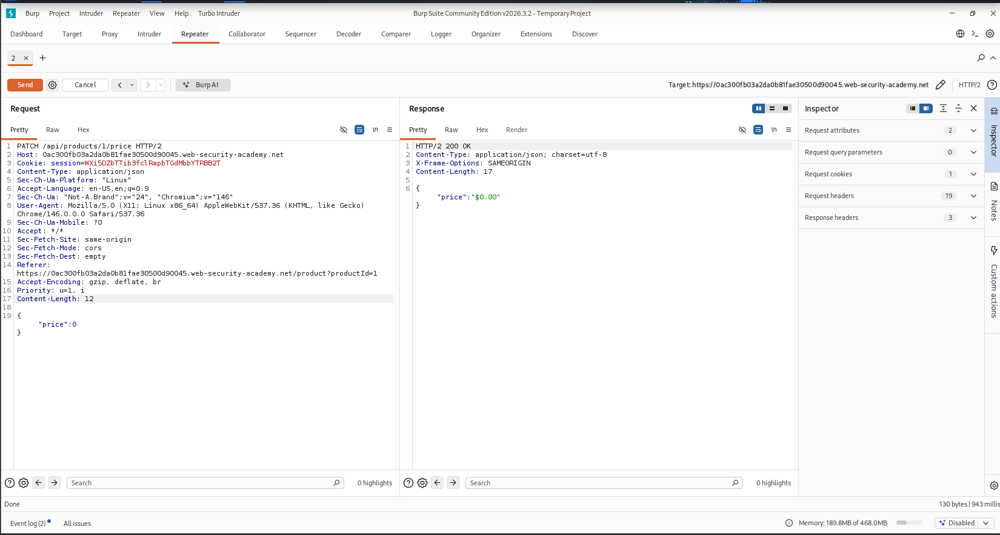
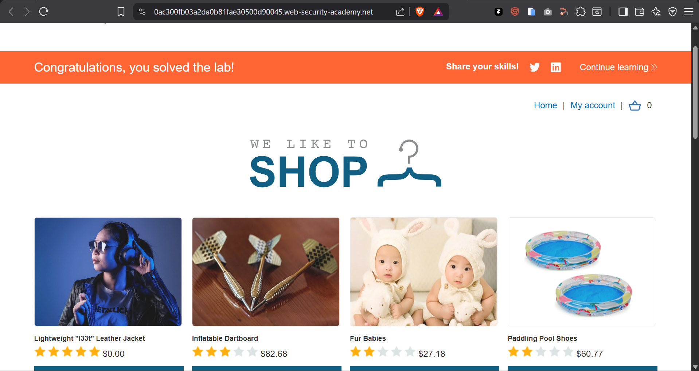

# Finding and Exploiting an Unused API Endpoint

## Table of Contents
- [Overview](#overview)
- [Scope & Objectives](#scope--objectives)
- [Methodology](#methodology)
- [Findings / Results](#findings--results)
- [Attack Chain](#attack-chain)
- [Tools & Environment](#tools--environment)
- [Evidence](#evidence)
- [Lessons Learned](#lessons-learned)
- [References](#references)
- [Author](#author)

---

## Overview

This lab demonstrates exploitation of an undocumented, unused API endpoint in a shopping application to bypass intended business logic and purchase an item for zero cost. HTTP method enumeration via `OPTIONS` revealed a hidden `PATCH` operation on a product pricing endpoint that was not exposed through the normal application UI or documentation. Chaining authentication, content-type correction, and parameter tampering against this endpoint allowed direct manipulation of a product's price, resulting in an unauthorized $0.00 purchase. The finding illustrates the risk of shadow APIs and insufficient object-level authorization on state-changing endpoints.

## Scope & Objectives

**In scope:**
- PortSwigger Web Security Academy shop application (`*.web-security-academy.net`)
- `/api/products/{id}/price` endpoint and associated HTTP methods

**Out of scope:**
- Any endpoint or functionality unrelated to the product pricing API
- Infrastructure-level testing (this is a managed lab environment)

**Objective:** Exploit a hidden API endpoint to acquire the Lightweight "l33t" Leather Jacket without paying its listed price, using account credentials `wiener:peter`.

## Methodology

Testing followed a structured API reconnaissance and exploitation approach aligned with OWASP API Security Testing guidance and PTES active testing principles:

1. **Discovery** — Captured legitimate API traffic via Burp Proxy while browsing product pages.
2. **Method enumeration** — Sent an `OPTIONS` request to the identified endpoint to enumerate all HTTP methods supported by the server, independent of what the front-end UI exposed.
3. **Authorization probing** — Attempted the discovered `PATCH` method unauthenticated to confirm an access control boundary existed.
4. **Authenticated exploitation** — Repeated the request as an authenticated low-privilege user and iteratively resolved server-returned errors (content-type, missing parameter) to construct a valid malicious request.
5. **Impact validation** — Confirmed the tampered state persisted server-side and could be carried through to order completion.

## Findings / Results

### Finding 01 — Broken Object Level Authorization via Undocumented API Endpoint

- **Severity:** [MEDIUM]
- **CVSS v3.1 Score:** 6.5
- **CVSS Vector:** `CVSS:3.1/AV:N/AC:L/PR:L/UI:N/S:U/C:N/I:H/A:N`
- **CWE:** CWE-284 (Improper Access Control), CWE-915 (Improper Control of Dynamically-Determined Object Attributes)
- **OWASP API Security Top 10:** API1:2023 Broken Object Level Authorization, API9:2023 Improper Inventory Management
- **MITRE ATT&CK:** T1190 — Exploit Public-Facing Application
- **Affected component:** `PATCH /api/products/{id}/price`

**Description**
The application exposes a `PATCH` method on the product price endpoint that is not linked from, or documented within, the visible application UI. The endpoint accepts a client-supplied `price` field and applies it directly to server-side product state without validating that the requesting user is authorized to modify pricing data.

**Technical Impact**
Any authenticated user can overwrite the price of any product to an arbitrary value, including zero, by directly issuing crafted HTTP requests to the undocumented endpoint.

**Business Impact**
An attacker can acquire paid goods at no cost, causing direct financial loss and undermining the integrity of the order and pricing system.

**Proof of Concept**
```http
PATCH /api/products/1/price HTTP/2
Host: <lab-id>.web-security-academy.net
Cookie: session=<authenticated-session>
Content-Type: application/json
Content-Length: 12

{"price":0}
```

Server response:
```http
HTTP/2 200 OK
Content-Type: application/json; charset=utf-8
Content-Length: 17

{"price":"$0.00"}
```

**Reproduction Steps**
1. Browse to a product page and capture the associated `/api/products/{id}/price` request in Burp Proxy.
2. Send the request to Repeater; change the method to `OPTIONS` and send. The `Allow` response header confirms `GET` and `PATCH` are both supported.
3. Change the method to `PATCH` while unauthenticated; observe an `Unauthorized` response, confirming an authorization gate on the method.
4. Authenticate as `wiener:peter` in the browser, then repeat the `PATCH` request against `/api/products/1/price` (the leather jacket) using the authenticated session cookie.
5. Add header `Content-Type: application/json` to resolve the initial content-type error.
6. Submit an empty JSON body `{}`; observe an error indicating a missing `price` parameter.
7. Submit `{"price":0}`; the server responds `200 OK` with the price updated to `$0.00`.
8. Reload the product page to confirm the price change persisted server-side, add the item to the basket, and complete checkout.

**Remediation**
- **[IMMEDIATE]** Enforce server-side authorization checks on all state-changing HTTP methods (`PATCH`, `PUT`, `DELETE`), not only on methods surfaced by the front-end.
- **[SHORT-TERM]** Remove or properly gate unused/undocumented endpoints; maintain an accurate API inventory (OpenAPI/Swagger) covering every method exposed by each route.
- **[SHORT-TERM]** Never accept client-supplied values for server-authoritative fields such as price; recalculate pricing server-side from a trusted source at checkout.
- **[PLANNED]** Add automated API method enumeration (e.g., `OPTIONS` fuzzing) to CI/CD security testing to catch shadow endpoints before release.

**Retest Criteria**
Re-issue the PoC request post-fix; the endpoint should return `403 Forbidden` or equivalent for unauthorized price modification, and any accepted price value must be validated against the authoritative catalog price server-side.

## Attack Chain

```
Recon (Proxy capture of pricing API)
        |
Method enumeration (OPTIONS -> reveals PATCH)
        |
Auth boundary probe (unauthenticated PATCH -> Unauthorized)
        |
Authenticate as low-privilege user (wiener:peter)
        |
Iterative error-driven request construction
   (Content-Type fix -> missing parameter fix)
        |
Price tamper (PATCH {"price":0} -> 200 OK)
        |
Business logic bypass (checkout at $0.00)
```

## Tools & Environment

| Tool | Purpose |
|---|---|
| Burp Suite Community Edition v2026.3.2 | Traffic interception, Repeater-based request tampering |
| Burp Proxy / HTTP history | API endpoint discovery |
| Target environment | PortSwigger Web Security Academy (managed lab instance) |

## Evidence

**Request/response showing successful price tampering (200 OK, price set to $0.00):**



**Confirmed exploitation — item purchased at $0.00 and lab marked solved:**



## Lessons Learned

Front-end navigation is not a reliable map of an API's attack surface. HTTP method enumeration (`OPTIONS`) is a low-cost, high-value reconnaissance step that can surface functionality never intended for client use. Authorization controls must be enforced per-method and per-field at the server layer; gating only the methods a UI happens to call leaves adjacent methods on the same route exposed.

## References

- [PortSwigger: Finding and exploiting an unused API endpoint](https://portswigger.net/web-security/api-testing/lab-exploiting-a-mass-assignment-vulnerability)
- [OWASP API Security Top 10 (2023)](https://owasp.org/API-Security/editions/2023/en/0x11-t10/)
- [CWE-284: Improper Access Control](https://cwe.mitre.org/data/definitions/284.html)
- [CWE-915: Improper Control of Dynamically-Determined Object Attributes](https://cwe.mitre.org/data/definitions/915.html)
- [MITRE ATT&CK T1190: Exploit Public-Facing Application](https://attack.mitre.org/techniques/T1190/)

---

## Author

**Michael Asante Anim** | `0x1aerixis`
BSc Cyber Security — University of Mines and Technology (UMaT), Tarkwa, Ghana

[](https://github.com/anim-michael-asante)
[](https://linkedin.com/in/michael-asante-anim)
[](https://tryhackme.com/p/0x1aerixis)
[](https://x.com/0x1aerixis)
[](https://discord.com/users/0x1aerixis)

> *"Built in the lab. Documented for the field."*

---
> **Disclaimer:** All work documented in this repository was conducted in authorized, isolated
> lab environments or sanctioned CTF platforms. No unauthorized systems were accessed.
> This project is intended for educational and portfolio purposes only.
