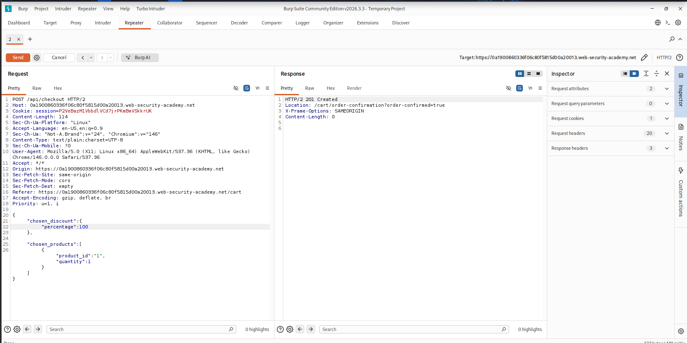
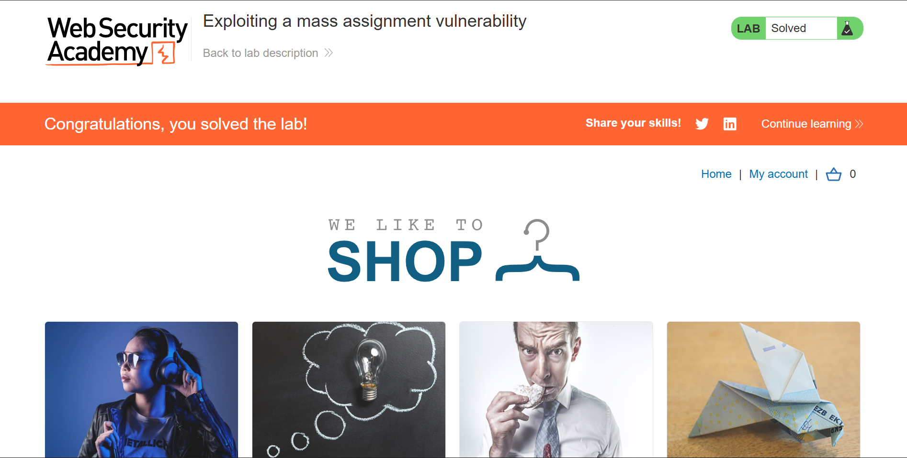

<h1 align="center">Exploiting a Mass Assignment Vulnerability</h1>
<p align="center">PortSwigger Web Security Academy — API Security</p>

<p align="center">


<a href="https://github.com/anim-michael-asante"></a>
</p>

---

## Table of Contents
- [Overview](#overview)
- [Scope & Objectives](#scope--objectives)
- [Methodology](#methodology)
- [Findings / Results](#findings--results)
- [Attack Chain](#attack-chain)
- [Tools & Environment](#tools--environment)
- [Evidence](#evidence)
- [Remediation](#remediation)
- [Lessons Learned](#lessons-learned)
- [References](#references)
- [Author](#author)

---

## Overview

Modern APIs frequently bind incoming JSON directly to internal data models for convenience, a pattern that becomes a business-logic vulnerability when the model exposes more fields than the client is meant to control. This project targeted a checkout API endpoint to determine whether server-side objects were being over-bound to client-supplied JSON.

Analysis of the API's GET and POST responses for the checkout resource revealed a discrepancy in exposed fields, which was then leveraged to inject a parameter absent from the documented request schema.

> **Key Outcome:** Identified and exploited a mass assignment vulnerability in the `/api/checkout` endpoint, enabling an authenticated low-privilege user to apply an unauthorized 100% discount and complete a purchase without sufficient account credit.

---

## Scope & Objectives

### Objectives
- Identify hidden or undocumented parameters processed by the checkout API.
- Determine whether server-side attribute binding could be manipulated by the client.
- Exploit the identified mass assignment flaw to purchase the "Lightweight l33t Leather Jacket" without adequate account balance.

### In Scope
| Target | Description | Type |
|---|---|---|
| PortSwigger Academy lab instance | E-commerce application with checkout API | Web App / API |
| `/api/checkout` (GET/POST) | Checkout resource exposing product and discount data | REST API Endpoint |

### Out of Scope
- Any infrastructure outside the provisioned lab instance.
- Authentication mechanism itself (valid low-privilege credentials `wiener:peter` were provided).

### Engagement Type
> **Type:** Authenticated, gray-box (credentials provided; internal object schema inferred through response analysis)
> **Authorization:** PortSwigger Web Security Academy — sanctioned lab environment
> **Duration:** Single session

---

## Methodology

Approach followed a standard API testing sequence aligned with OWASP API Security Testing guidance: recon → response/schema comparison → parameter injection → impact validation.

1. **Recon** — Authenticated as `wiener:peter` and walked the standard purchase flow to establish a baseline set of requests.
2. **Traffic capture** — Used Burp Proxy to capture both the `GET /api/checkout` and `POST /api/checkout` requests generated during the purchase attempt.
3. **Schema comparison** — Diffed the JSON structure returned by the GET request against the JSON structure accepted by the POST request, isolating a `chosen_discount` object present only in the GET response.
4. **Hypothesis validation** — Sent the POST request to Repeater and manually added the `chosen_discount` field to test whether the server would process a client-supplied value it does not normally expose in the request schema.
5. **Type probing** — Set `chosen_discount.percentage` to a non-numeric string (`"x"`) to confirm the field was being parsed and validated server-side, rather than silently ignored.
6. **Exploitation** — Set `chosen_discount.percentage` to `100` and resent the request to apply a full discount and complete checkout below the account's credit threshold.

---

## Findings / Results

### MA-2026-001 — Mass Assignment via Undocumented `chosen_discount` Parameter

| Field | Value |
|---|---|
| **Severity** | `[MEDIUM]` |
| **CVSS v3.1 Score** | 6.5 |
| **CVSS Vector** | `CVSS:3.1/AV:N/AC:L/PR:L/UI:N/S:U/C:N/I:H/A:N` |
| **CWE** | CWE-915: Improperly Controlled Modification of Dynamically-Determined Object Attributes |
| **OWASP API Top 10 (2023)** | API3:2023 — Broken Object Property Level Authorization |
| **OWASP Top 10 (2021)** | A01:2021 — Broken Access Control |
| **MITRE ATT&CK** | T1190 — Exploit Public-Facing Application |
| **Affected Component** | `POST /api/checkout` |

**Description**
The checkout API's internal object model includes a `chosen_discount` attribute that is serialized into GET responses but is not documented or expected in POST request bodies. Because the server binds incoming JSON directly to the internal order object without an explicit allow-list, submitting the field in the POST request causes it to be accepted and processed rather than rejected as an unknown parameter.

**Technical Impact**
An authenticated client can set arbitrary values on server-side object attributes that are meant to be system-controlled, bypassing the intended discount-assignment logic entirely.

**Business Impact**
Enables unauthorized discounting or free acquisition of goods, directly affecting revenue integrity in any production system implementing equivalent binding behavior.

**Proof of Concept**
```json
POST /api/checkout HTTP/2
Host: <lab-id>.web-security-academy.net
Cookie: session=<redacted>

{
    "chosen_discount":{
        "percentage":100
    },
    "chosen_products":[
        {
            "product_id":"1",
            "quantity":1
        }
    ]
}
```

**Reproduction Steps**
1. Log in as `wiener:peter` and add the Lightweight "l33t" Leather Jacket to the basket.
2. Attempt checkout via **Place order**; confirm the purchase fails due to insufficient credit.
3. In **Proxy > HTTP history**, compare the `GET /api/checkout` and `POST /api/checkout` requests; note `chosen_discount` appears only in the GET response.
4. Send the POST request to **Repeater** and add a `chosen_discount` object with `percentage: 0` — confirm no error is returned, indicating the field is accepted.
5. Set `percentage` to a non-numeric string (`"x"`) — confirm a type-validation error, confirming server-side processing of the field.
6. Set `percentage` to `100` and resend — order completes, confirming exploitation.

**Remediation**
Bind incoming request bodies to an explicit allow-list of client-modifiable fields (DTOs / serializers) rather than the full internal model. Reject any request containing unrecognized or server-only attributes instead of silently accepting them.

**Retest Criteria**
Resend the PoC request with `chosen_discount.percentage` set to a nonzero value; the request should be rejected (400/422) or the field should be silently ignored server-side, with the discount amount instead derived from a validated, server-controlled source.

---

## Attack Chain

```
Authenticate (wiener:peter)
        |
        v
Baseline checkout attempt --> insufficient credit
        |
        v
Compare GET vs POST /api/checkout JSON schemas
        |
        v
Identify undocumented "chosen_discount" field (GET-only)
        |
        v
Inject "chosen_discount" into POST body via Repeater
        |
        v
Validate server-side processing (type-error probe with "x")
        |
        v
Set percentage: 100 --> order placed below credit threshold
        |
        v
Lab objective solved
```

---

## Tools & Environment

| Tool | Purpose |
|---|---|
| Burp Suite (Proxy, Repeater) | Traffic interception, request manipulation, and replay |
| Burp's built-in browser | Authenticated session interaction with the lab application |
| PortSwigger Web Security Academy | Hosted, sanctioned lab environment |

---

## Evidence

**Exploit request — `chosen_discount` parameter injected in Repeater**



*Modified POST /api/checkout request with `chosen_discount.percentage` set to 100, sent via Burp Repeater.*

**Lab solved confirmation**



*PortSwigger Academy lab banner confirming the objective was completed.*

---

## Remediation

| Priority | Action |
|---|---|
| `[IMMEDIATE]` | Introduce explicit request DTOs/serializers that allow-list only client-editable fields for `/api/checkout`. |
| `[SHORT-TERM]` | Add server-side integration tests asserting that server-controlled fields (discounts, prices, roles) cannot be set via client-supplied JSON. |
| `[PLANNED]` | Audit all API endpoints for symmetric GET/POST object exposure and apply the same allow-list pattern across the API surface. |

---

## Lessons Learned

Comparing the response schema of a read endpoint against the accepted schema of its corresponding write endpoint is a reliable technique for surfacing hidden, server-only attributes. Frameworks that auto-bind request bodies to internal models without an explicit allow-list remain a recurring source of object-property-level authorization flaws, consistent with API3:2023 in the OWASP API Security Top 10.

---

## References

- OWASP API Security Top 10 (2023) — API3:2023 Broken Object Property Level Authorization
- CWE-915 — Improperly Controlled Modification of Dynamically-Determined Object Attributes
- MITRE ATT&CK — T1190: Exploit Public-Facing Application
- PortSwigger Web Security Academy — API Testing topic

---

## Author

**Michael Asante Anim** | `0x1aerixis`
BSc Cyber Security — University of Mines and Technology (UMaT), Tarkwa, Ghana

[](https://github.com/anim-michael-asante)
[](https://linkedin.com/in/michael-asante-anim)
[](https://tryhackme.com/p/0x1aerixis)
[](https://x.com/0x1aerixis)
[](https://discord.com/users/0x1aerixis)

> *"Built by Grace."*

---
> **Disclaimer:** All work documented in this repository was conducted in authorized, isolated
> lab environments or sanctioned CTF platforms. No unauthorized systems were accessed.
> This project is intended for educational and portfolio purposes only.
