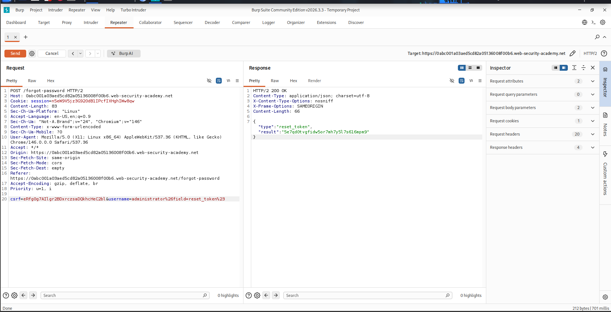

<h1 align="center">Exploiting Server-Side Parameter Pollution in a Query String</h1>
<p align="center">PortSwigger Web Security Academy — API Security</p>

<p align="center">


<a href="https://github.com/anim-michael-asante"></a>
</p>

---

## Table of Contents
- [Overview](#overview)
- [Scope & Objectives](#scope--objectives)
- [Methodology](#methodology)
- [Findings / Results](#findings--results)
- [Attack Chain](#attack-chain)
- [Tools & Environment](#tools--environment)
- [Evidence](#evidence)
- [Remediation](#remediation)
- [Lessons Learned](#lessons-learned)
- [References](#references)
- [Author](#author)

---

## Overview

Applications that forward user-controlled input into an internal, server-side query string without strict field validation risk exposing far more of their internal API surface than intended. This project targeted a password-reset flow to determine whether client input could influence which internal field the backend API queried on.

Systematic use of delimiter characters and server error messages was used to map an undocumented internal parameter, which was then abused to retrieve a password reset token for the administrator account.

> **Key Outcome:** Achieved full administrator account takeover via server-side parameter pollution in the `/forgot-password` flow, and used the compromised account to delete a user from the application's admin panel.

---

## Scope & Objectives

### Objectives
- Determine whether the `username` parameter of the password reset flow is passed unsanitized into a server-side query string.
- Enumerate any hidden internal API parameters reachable through parameter pollution.
- Escalate the finding to full administrator account takeover.

### In Scope
| Target | Description | Type |
|---|---|---|
| PortSwigger Academy lab instance | Password reset flow and internal user-lookup API | Web App / API |
| `POST /forgot-password` | Public-facing password reset endpoint | API Endpoint |
| `GET /forgot-password?reset_token=` | Password reset confirmation endpoint | Web Endpoint |

### Out of Scope
- Any infrastructure outside the provisioned lab instance.
- Brute-forcing of the `reset_token` value itself (token was disclosed directly via the vulnerability, not guessed).

### Engagement Type
> **Type:** Unauthenticated, black-box (no prior credentials required)
> **Authorization:** PortSwigger Web Security Academy — sanctioned lab environment
> **Duration:** Single session

---

## Methodology

Approach followed a standard injection-testing sequence: baseline capture → error-driven fuzzing → internal parameter discovery → token disclosure → account takeover.

1. **Recon** — Triggered a password reset for the `administrator` user and captured the resulting `POST /forgot-password` request in Burp Proxy, alongside the associated `forgotPassword.js` client script.
2. **Baseline** — Resent the unmodified request in Repeater to confirm a consistent, stable response.
3. **Delimiter probing** — Appended a URL-encoded `&` to the `username` value (`administrator%26x=y`) to test whether the value was concatenated unsanitized into a server-side query string. The `Parameter is not supported` error confirmed the server-side API was parsing an injected second parameter.
4. **Truncation probing** — Appended a URL-encoded `#` (`administrator%23`) to test whether the query string could be truncated. The resulting `Field not specified` error revealed an undocumented internal `field` parameter.
5. **Field discovery** — Injected a placeholder `field` value (`administrator%26field=x%23`) and observed an `Invalid field` error, confirming the parameter was recognized but validated against an allow-list.
6. **Brute-force** — Sent the request to Intruder, positioned the payload on the `field` value, and ran Burp's built-in server-side variable name wordlist to enumerate valid field names.
7. **Confirmation** — Verified `email` as a valid field value, then, based on the `reset_token` reference found in `forgotPassword.js`, set `field=reset_token` to retrieve the administrator's password reset token directly in the response.
8. **Takeover** — Used the disclosed token via `/forgot-password?reset_token=<token>` to set a new administrator password, logged in, and deleted the `carlos` user from the admin panel to confirm full impact.

---

## Findings / Results

### SSPP-2026-001 — Server-Side Parameter Pollution Leading to Administrator Account Takeover

| Field | Value |
|---|---|
| **Severity** | `[CRITICAL]` |
| **CVSS v3.1 Score** | 9.1 |
| **CVSS Vector** | `CVSS:3.1/AV:N/AC:L/PR:N/UI:N/S:U/C:H/I:H/A:N` |
| **CWE** | CWE-88: Improper Neutralization of Argument Delimiters in a Command ('Argument Injection'); contributing factor CWE-640: Weak Password Recovery Mechanism |
| **OWASP Top 10 (2021)** | A03:2021 — Injection |
| **OWASP API Top 10 (2023)** | API8:2023 — Security Misconfiguration |
| **MITRE ATT&CK** | T1190 — Exploit Public-Facing Application |
| **Affected Component** | `POST /forgot-password` (internal query-string construction) |

**Description**
The password reset endpoint forwards the client-supplied `username` value into an internal, server-side API query string without neutralizing delimiter characters. Because `&` and `#` retain their query-string meaning when decoded server-side, an attacker can inject an additional parameter (`field`) into the internal request, redirecting which attribute of the target user record the backend API returns.

**Technical Impact**
An unauthenticated attacker can enumerate and query arbitrary internal fields on a targeted user record, including the password reset token, without needing to intercept email delivery or guess the token value.

**Business Impact**
Directly enables full account takeover of any user, including administrator accounts, and any subsequent actions available to that account (here, deletion of another user's account).

**Proof of Concept**
```
POST /forgot-password HTTP/2
Host: <lab-id>.web-security-academy.net
Content-Type: application/x-www-form-urlencoded

csrf=<redacted>&username=administrator%26field=reset_token%23
```
Server response discloses the administrator's password reset token directly in the JSON body, which is then submitted to:
```
GET /forgot-password?reset_token=<disclosed_token>
```

**Reproduction Steps**
1. Trigger a password reset for `administrator` and capture `POST /forgot-password` in Repeater.
2. Confirm baseline behavior, then submit `username=administratorx` to observe an `Invalid username` error.
3. Submit `username=administrator%26x=y` to observe a `Parameter is not supported` error, confirming parameter injection into the internal query.
4. Submit `username=administrator%23` to observe a `Field not specified` error, revealing an internal `field` parameter.
5. Submit `username=administrator%26field=x%23` to confirm the `field` parameter is recognized and validated.
6. Use Intruder with Burp's server-side variable name list to brute-force valid values of `field`; confirm `email` returns a 200 response.
7. From `forgotPassword.js`, identify `reset_token` as the parameter used to complete a reset.
8. Submit `username=administrator%26field=reset_token%23` to disclose the administrator's reset token.
9. Navigate to `/forgot-password?reset_token=<token>`, set a new password, log in as administrator, and delete `carlos` via the admin panel.

**Remediation**
Reject or strictly validate any delimiter characters (`&`, `#`, `=`) present in user-supplied input before it is used to construct any internal, server-side query string. Internal APIs should validate `field`-style parameters against a strict allow-list and never expose sensitive attributes such as password reset tokens through a generically queryable field mechanism.

**Retest Criteria**
Resubmit the PoC request with `field=reset_token`; the request should return a generic error or be rejected outright, with no reset token disclosed in the response body.

---

## Attack Chain

```
Trigger password reset for administrator
        |
        v
Capture POST /forgot-password baseline
        |
        v
Inject "&" delimiter --> "Parameter is not supported"
        |
        v
Inject "#" truncation --> "Field not specified" (reveals internal "field" param)
        |
        v
Brute-force "field" values via Intruder --> "email" confirmed valid
        |
        v
Identify "reset_token" reference in forgotPassword.js
        |
        v
Set field=reset_token --> administrator reset token disclosed
        |
        v
Submit token via /forgot-password?reset_token=... --> set new admin password
        |
        v
Log in as administrator --> delete carlos via admin panel
        |
        v
Lab objective solved
```

---

## Tools & Environment

| Tool | Purpose |
|---|---|
| Burp Suite Community Edition v2026.3.3 | Traffic interception, Repeater manipulation, Intruder brute-forcing |
| Burp's built-in browser | Password reset flow interaction and admin panel access |
| Burp Intruder — server-side variable names list | Enumeration of the internal `field` parameter |
| PortSwigger Web Security Academy | Hosted, sanctioned lab environment |

---

## Evidence

**Administrator reset token disclosed via injected `field` parameter**



*Burp Repeater request with `username=administrator%26field=reset_token%23`, returning the administrator's `reset_token` directly in the JSON response body.*

---

## Remediation

| Priority | Action |
|---|---|
| `[IMMEDIATE]` | Sanitize or reject delimiter characters (`&`, `#`, `=`) in any user input forwarded to an internal server-side query string. |
| `[SHORT-TERM]` | Restrict the internal user-lookup API's `field` parameter to a strict allow-list that excludes sensitive attributes such as reset tokens. |
| `[PLANNED]` | Move internal service-to-service calls to structured request formats (e.g. typed RPC or JSON bodies) instead of concatenated query strings, and add fuzz testing for parameter pollution across all internal APIs. |

---

## Lessons Learned

Server-side error messages are a reliable oracle for reconstructing the shape of an internal API, even without any direct visibility into backend code. Delimiter-based truncation and injection (`&`, `#`) remain effective against systems that concatenate user input into internal query strings rather than treating each parameter as a discrete, validated value — this pattern generalizes well beyond password reset flows to any endpoint that proxies input into an internal service call.

---

## References

- OWASP Top 10 (2021) — A03:2021 Injection
- OWASP API Security Top 10 (2023) — API8:2023 Security Misconfiguration
- CWE-88 — Improper Neutralization of Argument Delimiters in a Command ('Argument Injection')
- CWE-640 — Weak Password Recovery Mechanism
- MITRE ATT&CK — T1190: Exploit Public-Facing Application
- PortSwigger Web Security Academy — API Testing topic

---

## Author

**Michael Asante Anim** | `0x1aerixis`
BSc Cyber Security — University of Mines and Technology (UMaT), Tarkwa, Ghana

[](https://github.com/anim-michael-asante)
[](https://linkedin.com/in/michael-asante-anim)
[](https://tryhackme.com/p/0x1aerixis)
[](https://x.com/0x1aerixis)
[](https://discord.com/users/0x1aerixis)

> *"Built by Grace."*

---
> **Disclaimer:** All work documented in this repository was conducted in authorized, isolated
> lab environments or sanctioned CTF platforms. No unauthorized systems were accessed.
> This project is intended for educational and portfolio purposes only.
