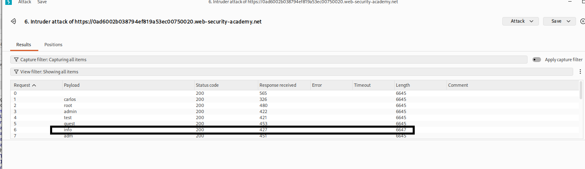
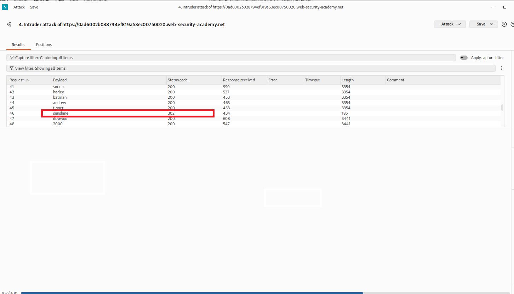
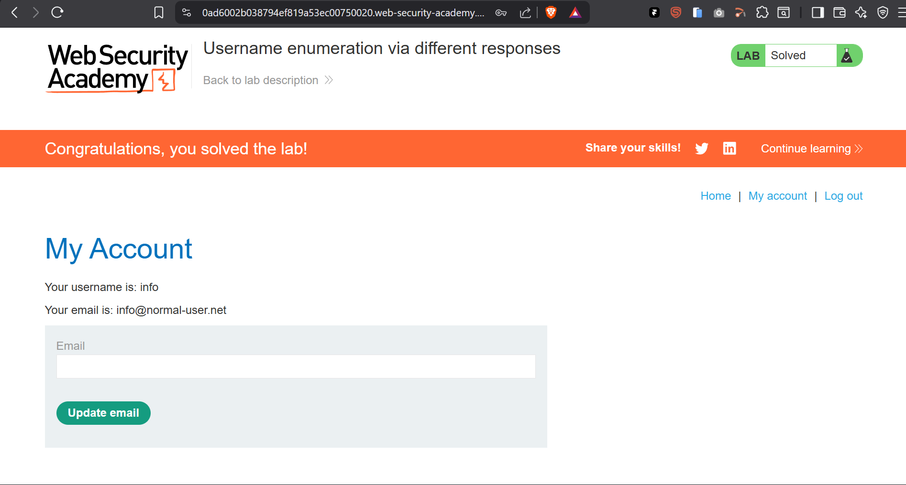

# Username Enumeration via Different Responses

> PortSwigger Web Security Academy lab demonstrating username enumeration via a response-content discrepancy in login error messages, chained with password brute-forcing to compromise a user account.


## Table of Contents

- [Overview](#overview)
- [Scope & Objectives](#scope--objectives)
- [Methodology](#methodology)
- [Findings / Results](#findings--results)
- [Attack Chain](#attack-chain)
- [Tools & Environment](#tools--environment)
- [Evidence](#evidence)
- [Lessons Learned](#lessons-learned)
- [References](#references)
- [Author](#author)

## Overview

Authentication endpoints that return different error messages for invalid usernames versus incorrect passwords expose an observable discrepancy an attacker can use to enumerate valid accounts without any password guessing. This lab targets a login form where the two failure states produce responses of different lengths, despite appearing similar on the surface.

The account was compromised in two automated stages: first isolating the valid username by comparing response lengths across a username wordlist, then brute-forcing the corresponding password against that confirmed username.

> **Key Outcome:** Enumerated a valid username by identifying a response-length discrepancy between "Invalid username" and "Incorrect password" error states, then recovered the matching password via a follow-up Intruder attack, gaining full account access.

## Scope & Objectives

### Objectives

- Enumerate a valid username on the `/login` endpoint using response-length analysis
- Brute-force the password for the confirmed username
- Authenticate and access the compromised account's account page

### In Scope

| Target                                        | Description                     | Type     |
| --------------------------------------------- | ------------------------------- | -------- |
| PortSwigger Web Security Academy lab instance | Authentication labs environment | Web App  |
| `/login` (POST)                               | Authentication endpoint         | Endpoint |

### Out of Scope

- All other lab endpoints not related to authentication
- Any infrastructure outside the provisioned lab instance

### Engagement Type

> **Type:** Black-box
> **Authorization:** PortSwigger Web Security Academy sanctioned lab environment
> **Duration:** Single session

## Methodology

This exercise followed a reconnaissance-to-exploitation approach aligned with the OWASP Testing Guide's authentication testing methodology, structured across the following phases:

| Phase          | Activity                                                                        | Framework Reference                                       |
| -------------- | ------------------------------------------------------------------------------- | --------------------------------------------------------- |
| Reconnaissance | Captured baseline `POST /login` request with invalid credentials via Burp Proxy | OWASP WSTG-ATHN-04                                        |
| Enumeration    | Automated username brute-force with response-length analysis in Burp Intruder   | OWASP WSTG-ATHN-04 — Testing for User Enumeration         |
| Exploitation   | Automated password brute-force against confirmed username                       | MITRE ATT&CK — Brute Force: Password Guessing (T1110.001) |
| Verification   | Manual login and account page access                                            | PTES — Vulnerability Exploitation                         |

> **Note:** All testing was conducted against a purpose-built, authorized PortSwigger lab instance. No production systems were accessed.

## Findings / Results

### Username Enumeration via Different Responses — Category: Web / Authentication

| Field               | Detail                                                                                                                                                                                                      |
| ------------------- | ----------------------------------------------------------------------------------------------------------------------------------------------------------------------------------------------------------- |
| **Platform**        | PortSwigger Web Security Academy                                                                                                                                                                            |
| **Difficulty**      | Practitioner                                                                                                                                                                                                |
| **Category**        | Authentication (Broken Authentication)                                                                                                                                                                      |
| **Flag**            | Lab marked `Solved`                                                                                                                                                                                         |
| **CWE (Primary)**   | [CWE-204: Observable Response Discrepancy](https://cwe.mitre.org/data/definitions/204.html)                                                                                                                 |
| **CWE (Secondary)** | [CWE-307: Improper Restriction of Excessive Authentication Attempts](https://cwe.mitre.org/data/definitions/307.html)                                                                                       |
| **OWASP Category**  | [A07:2021 – Identification and Authentication Failures](https://owasp.org/Top10/A07_2021-Identification_and_Authentication_Failures/)                                                                       |
| **CVSS v3.1 Score** | 5.3 [MEDIUM]                                                                                                                                                                                                |
| **CVSS Vector**     | `CVSS:3.1/AV:N/AC:L/PR:N/UI:N/S:U/C:L/I:N/A:N`                                                                                                                                                              |
| **MITRE ATT&CK**    | [T1589.001 – Gather Victim Identity Information: Credentials](https://attack.mitre.org/techniques/T1589/001/), [T1110.001 – Brute Force: Password Guessing](https://attack.mitre.org/techniques/T1110/001/) |

#### Approach

The login form returns two distinct failure states depending on which credential field is incorrect: an "Invalid username" message for unrecognized usernames, and an "Incorrect password" message once a valid username is submitted. The approach was to detect this discrepancy through response-length comparison rather than relying on visual inspection of message text alone.

#### Solution Walkthrough

**Step 1 — Baseline capture**
An invalid username and password were submitted through the proxied login form, and the resulting `POST /login` request was located in Proxy > HTTP History and sent to Burp Intruder.

**Step 2 — Username enumeration (sniper attack)**

```
username=§invalid-user§&password=invalid-password
```

The `username` parameter was marked as the payload position and the candidate username wordlist was loaded as a Simple list payload. Results were sorted by response `Length`.

> **Output:** One entry returned a distinct response length (6647 bytes) against a baseline of 6645 bytes for all other candidates, corresponding to the "Incorrect password" message rather than "Invalid username" — confirming a valid username.

**Step 3 — Password brute-force (sniper attack)**

```
username=info&password=§invalid-password§
```

With the username fixed at `info`, the payload position was moved to `password` and the candidate password wordlist was loaded in its place. Results were sorted by `Status code`.

> **Output:** All requests returned HTTP `200 OK` except one, which returned HTTP `302 Found` — indicating a successful authentication redirect for password `sunshine`.

**Step 4 — Verification**
Login was performed manually using `info:sunshine`, and the account page confirmed access to the compromised account, solving the lab.

#### Key Technique

Response-length analysis to detect an observable discrepancy between two distinct authentication failure states. This demonstrates that differentiated error messaging — even when both messages appear generic — leaks sufficient information to enumerate valid accounts. See [CWE-204: Observable Response Discrepancy](https://cwe.mitre.org/data/definitions/204.html).

#### Tools Used

- Burp Suite — proxy interception, Intruder sniper attacks, response-length and status-code analysis
- PortSwigger-provided candidate username and password wordlists

## Attack Chain

```
[Baseline Capture] → [Username Enumeration] → [Password Brute-Force] → [Account Access]
        ↓                     ↓                        ↓                     ↓
  [Burp Proxy]        [Intruder + Length]        [Intruder Sniper]      [Manual Login]
```

| Stage                | Technique                                       | Tool                   | MITRE ATT&CK TTP |
| -------------------- | ----------------------------------------------- | ---------------------- | ---------------- |
| Reconnaissance       | Captured login request structure                | Burp Proxy             | T1592            |
| Username Enumeration | Response-length discrepancy on error state      | Burp Intruder (Sniper) | T1589.001        |
| Credential Access    | Password brute-force against confirmed username | Burp Intruder (Sniper) | T1110.001        |
| Account Access       | Authenticated login with recovered credentials  | Manual                 | T1078            |

## Tools & Environment

### Environment

| Component         | Specification                                          |
| ----------------- | ------------------------------------------------------ |
| **OS / Platform** | Kali Linux                                             |
| **Target**        | PortSwigger Web Security Academy — Authentication labs |
| **Network**       | Lab-provisioned, isolated instance over HTTPS          |

### Tools Used

| Tool       | Version           | Purpose                                                 |
| ---------- | ----------------- | ------------------------------------------------------- |
| Burp Suite | Community Edition | Proxy interception, Intruder attacks, response analysis |

## Evidence

All supporting evidence is organized in the `/evidence/` directory.

| Reference                   | File                               | Description                                                                                |
| --------------------------- | ---------------------------------- | ------------------------------------------------------------------------------------------ |
| Username Enumeration Result | `evidence/bruteforce-username.png` | Intruder results showing the anomalous response length for username `info`                 |
| Password Brute-Force Result | `evidence/bruteforce-password.png` | Intruder results showing HTTP `302` for password `sunshine` against the confirmed username |
| Lab Solved Confirmation     | `evidence/lab-solved.png`          | Authenticated account page confirming successful compromise of the `info` account          |

> **Note:** Screenshots are reproduced as captured from Burp Suite and the lab account page.


_Caption: Sniper attack results sorted by response length; the entry for username `info` diverges from the uniform baseline, indicating a valid account._


_Caption: Sniper attack against the confirmed username `info`, sorted by status code; the entry for password `sunshine` returns HTTP 302, confirming successful authentication._


_Caption: Authenticated account page confirming the lab was solved using username `info` and password `sunshine`._

## Root Cause Analysis

The authentication endpoint implemented differentiated error messaging ("Invalid username" versus "Incorrect password") for its two failure states. This design choice, intended to give end users clearer feedback, instead created an observable side channel: the response length varied consistently between the two states, allowing an attacker to distinguish valid from invalid accounts without knowledge of any password. This reduces the effective credential search space from `usernames × passwords` to `passwords` alone once a single valid username is confirmed.

## Remediation Strategy

### Prioritized Action Plan

| Priority     | Finding                                         | Effort | Recommended Action                                                                                                                                   | Deadline       |
| ------------ | ----------------------------------------------- | ------ | ---------------------------------------------------------------------------------------------------------------------------------------------------- | -------------- |
| [SHORT-TERM] | Observable response discrepancy in login errors | Low    | Return a single, generic error message (e.g., "Invalid username or password") for all failed login attempts, regardless of which field was incorrect | Within 2 weeks |
| [SHORT-TERM] | Absent rate-limiting on authentication endpoint | Medium | Implement account lockout or rate-limiting (exponential backoff or CAPTCHA) after a threshold of failed login attempts                               | Within 2 weeks |
| [PLANNED]    | Single-factor authentication                    | High   | Introduce multi-factor authentication as a defense-in-depth control                                                                                  | Within 30 days |

### Strategic Recommendations

1. **Response Normalization** — Ensure response length, timing, and status code are consistent across valid and invalid username submissions, not just the displayed error text.
2. **Brute-Force Mitigation** — Apply progressive delays or lockouts tied to source IP and account identifier to limit automated credential-guessing throughput.
3. **Defense in Depth** — Layer multi-factor authentication on top of password-based login so that a recovered credential pair alone is insufficient for account takeover.

## Lessons Learned

### Technical Takeaways

- Differentiated error messages, even when both appear generic to a casual reader, can still leak an observable discrepancy through response length or timing
- Sorting Intruder results by response `Length` and `Status code` is a fast, reliable way to surface single-outlier responses across large wordlists
- Confirming a valid username before brute-forcing passwords substantially reduces the effective attack surface compared to a combined cluster-bomb approach

### What I Would Do Differently

- Cross-check response length discrepancies against response timing to build a more resilient enumeration oracle in cases where length alone is inconclusive

### Skills Demonstrated

> `Burp Intruder` `Response-Length Analysis` `Authentication Testing` `Username Enumeration` `Password Brute-Forcing` `OWASP WSTG Methodology`

## References

- [OWASP Top 10 2021 — A07: Identification and Authentication Failures](https://owasp.org/Top10/A07_2021-Identification_and_Authentication_Failures/)
- [OWASP Authentication Cheat Sheet](https://cheatsheetseries.owasp.org/cheatsheets/Authentication_Cheat_Sheet.html)
- [CWE-204: Observable Response Discrepancy](https://cwe.mitre.org/data/definitions/204.html)
- [CWE-307: Improper Restriction of Excessive Authentication Attempts](https://cwe.mitre.org/data/definitions/307.html)
- [MITRE ATT&CK — T1110.001: Password Guessing](https://attack.mitre.org/techniques/T1110/001/)
- [NIST SP 800-63B — Digital Identity Guidelines, Authentication and Lifecycle Management](https://csrc.nist.gov/publications/detail/sp/800-63b/final)

## Author

**Michael Asante Anim** | `0x1aerixis`
BSc Cyber Security — University of Mines and Technology (UMaT), Tarkwa, Ghana

[](https://github.com/anim-michael-asante)
[](https://linkedin.com/in/michael-asante-anim)
[](https://tryhackme.com/p/0x1aerixis)
[](https://x.com/0x1aerixis)
[](https://discord.com/users/0x1aerixis)

> _"Built in the lab. Documented for the field."_

---

**Disclaimer:** All work documented in this repository was conducted in authorized, isolated lab environments or sanctioned CTF platforms. No unauthorized systems were accessed. This project is intended for educational and portfolio purposes only.
