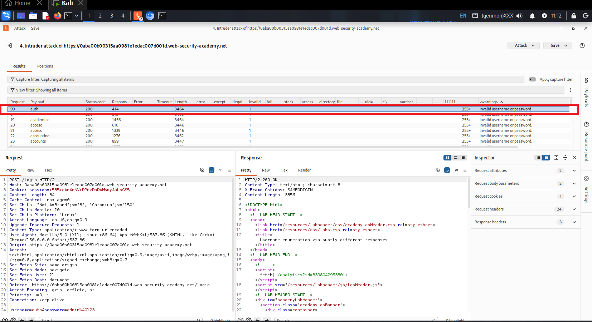
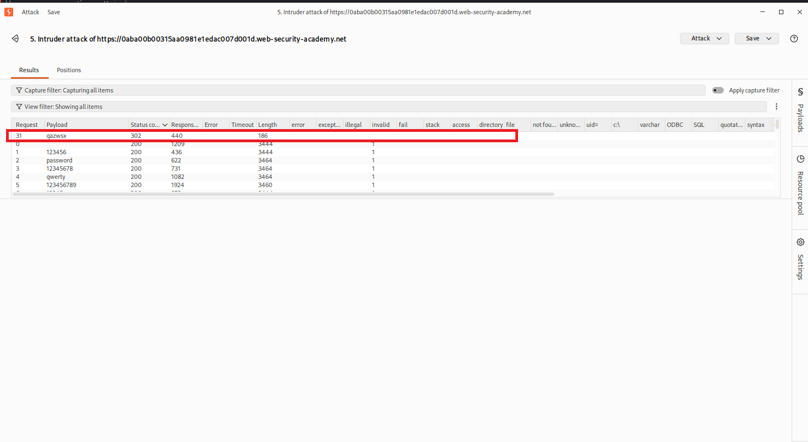
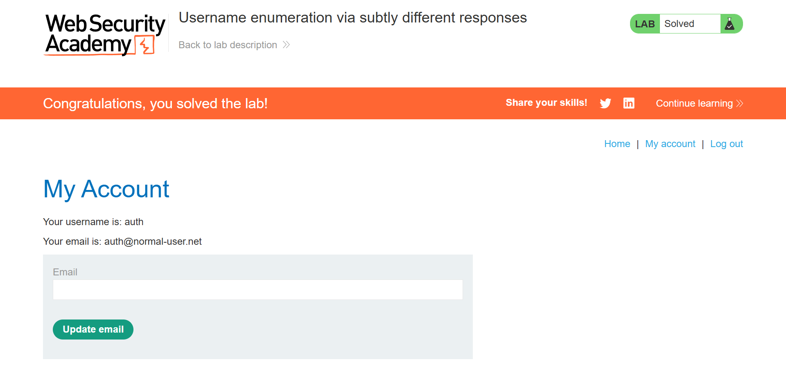

# Username Enumeration via Subtly Different Responses

> PortSwigger Web Security Academy lab demonstrating username enumeration through a response-content discrepancy, chained with password brute-forcing to fully compromise a user account.


## Table of Contents
- [Overview](#overview)
- [Scope & Objectives](#scope--objectives)
- [Methodology](#methodology)
- [Findings / Results](#findings--results)
- [Attack Chain](#attack-chain)
- [Tools & Environment](#tools--environment)
- [Evidence](#evidence)
- [Lessons Learned](#lessons-learned)
- [References](#references)
- [Author](#author)

## Overview

Authentication endpoints that return response content varying by even a single character between valid and invalid usernames give an attacker a reliable oracle for username enumeration, independent of status codes, headers, or timing. This lab targets a login form where the standard error message contains an undetected typo — a trailing space — present only when a submitted username exists.

The account was compromised in two automated stages: first isolating the valid username by diffing error-message content across a username wordlist, then brute-forcing the corresponding password against that confirmed username.

> **Key Outcome:** Enumerated a valid username from a 3,000+ entry candidate list using a single-character response discrepancy, then recovered the matching password via a follow-up Burp Intruder sniper attack, gaining full account access.

## Scope & Objectives

### Objectives
- Enumerate a valid username on the `/login` endpoint using response-content analysis
- Brute-force the password for the confirmed username
- Authenticate and access the compromised account's `/my-account` page

### In Scope
| Target | Description | Type |
|--------|-------------|------|
| `0aba00b00315aa0981e1edac007d001d.web-security-academy.net` | PortSwigger Web Security Academy lab instance | Web App |
| `/login` (POST) | Authentication endpoint | Endpoint |

### Out of Scope
- All other lab endpoints not related to authentication
- Any infrastructure outside the provisioned lab instance

### Engagement Type
> **Type:** Black-box
> **Authorization:** PortSwigger Web Security Academy sanctioned lab environment
> **Duration:** Single session

## Methodology

This exercise followed a reconnaissance-to-exploitation approach aligned with the OWASP Testing Guide's authentication testing methodology, structured across the following phases:

| Phase | Activity | Framework Reference |
|-------|----------|-------------------|
| Reconnaissance | Captured baseline `POST /login` request with invalid credentials via Burp Proxy | OWASP WSTG-ATHN-04 |
| Enumeration | Automated username brute-force with Grep-Extract response-diffing in Burp Intruder | OWASP WSTG-ATHN-04 — Testing for Weak Lock-out Mechanism / User Enumeration |
| Exploitation | Automated password brute-force against confirmed username | MITRE ATT&CK — Brute Force: Password Guessing (T1110.001) |
| Verification | Manual login and account page access | PTES — Vulnerability Exploitation |

> **Note:** All testing was conducted against a purpose-built, authorized PortSwigger lab instance. No production systems were accessed.

## Findings / Results

### Username Enumeration via Subtly Different Responses — Category: Web / Authentication

| Field | Detail |
|-------|--------|
| **Platform** | PortSwigger Web Security Academy |
| **Difficulty** | Practitioner |
| **Category** | Authentication (Broken Authentication) |
| **Flag** | Lab marked `Solved` |

#### Approach
The login form returns a generic `Invalid username or password.` message regardless of which field is wrong, which is the intended countermeasure against enumeration. The approach was to test whether the response was truly identical byte-for-byte across all invalid attempts, rather than trusting the message text alone.

#### Solution Walkthrough

**Step 1 — Baseline capture**
An invalid username and password were submitted through the proxied login form, and the resulting `POST /login` request was sent to Burp Intruder with the `username` parameter marked as the payload position.

**Step 2 — Username enumeration (sniper attack)**
```
username=§invalid-user§&password=invalid-password
```
The candidate username wordlist was loaded as a Simple list payload. A Grep-Extract rule was configured to capture the exact text between `-warning>` and `</p>\n        <form` in each response, isolating the literal error-message string per request.

> **Output:** All 3,000+ responses returned `Invalid username or password.` except one, which returned `Invalid username or password. ` — an identical string with a trailing space appended, confirming a valid username (`auth`) was submitted.

**Step 3 — Password brute-force (sniper attack)**
```
username=auth&password=§invalid-password§
```
With the username fixed, the payload position was moved to `password` and the candidate password wordlist was loaded in its place.

> **Output:** One request (`qazwsx`) returned HTTP `302` while every other candidate returned `200`, indicating a successful authentication redirect.

**Step 4 — Verification**
Login was performed manually using `auth:qazwsx`, and the `/my-account` page confirmed access to the compromised account.

#### Key Technique
Response-content diffing via Burp Intruder's Grep-Extract feature to detect a single-character discrepancy in an otherwise generic error message. This demonstrates that identical-looking security messaging is insufficient without byte-level response verification — see [CWE-204: Observable Response Discrepancy](https://cwe.mitre.org/data/definitions/204.html).

#### Tools Used
- Burp Suite Community Edition — proxy interception, Intruder sniper attacks, Grep-Extract response analysis
- PortSwigger-provided candidate username and password wordlists

## Attack Chain

```
[Baseline Capture] → [Username Enumeration] → [Password Brute-Force] → [Account Access]
        ↓                     ↓                        ↓                     ↓
  [Burp Proxy]      [Intruder + Grep-Extract]   [Intruder Sniper]      [Manual Login]
```

| Stage | Technique | Tool | MITRE ATT&CK TTP |
|-------|-----------|------|-------------------|
| Reconnaissance | Captured login request structure | Burp Proxy | T1592 |
| Username Enumeration | Response-content diffing on error message | Burp Intruder (Grep-Extract) | T1589.001 |
| Credential Access | Password brute-force against confirmed username | Burp Intruder (Sniper) | T1110.001 |
| Account Access | Authenticated login with recovered credentials | Manual | T1078 |

## Tools & Environment

### Environment
| Component | Specification |
|-----------|---------------|
| **OS / Platform** | Kali Linux |
| **Target** | PortSwigger Web Security Academy lab instance (`web-security-academy.net`) |
| **Network** | Lab-provisioned, isolated instance over HTTPS |

### Tools Used
| Tool | Version | Purpose |
|------|---------|---------|
| Burp Suite | Community Edition 2026.7 | Proxy interception, Intruder attacks, response analysis |

## Evidence

All supporting evidence is organized in the `/evidence/` directory.

| Reference | File | Description |
|-----------|------|--------------|
| Username Enumeration Result | `evidence/username.png` | Grep-Extract column showing the anomalous response for username `auth`, with a trailing space distinguishing it from all other candidates |
| Password Brute-Force Result | `evidence/password.png` | Sniper attack results showing password `qazwsx` returning HTTP `302` against the confirmed username |
| Lab Solved Confirmation | `evidence/lab-solved.png` | Authenticated `/my-account` page confirming successful compromise of the `auth` account |

> **Note:** Screenshots are reproduced as captured from Burp Suite and the lab account page, with the relevant result rows highlighted.


*Caption: Grep-Extract column isolates the error-message text per request; the highlighted row for username `auth` carries a trailing space absent from all other entries.*


*Caption: Sniper attack against the confirmed username; the highlighted row for payload `qazwsx` returns HTTP 302, indicating successful authentication.*


*Caption: Authenticated account page confirming the lab was solved using username `auth` and password `qazwsx`.*

## Lessons Learned

### Technical Takeaways
- A generic, identically-worded error message is not sufficient to prevent enumeration if the underlying response bytes differ even slightly
- Burp Intruder's Grep-Extract feature is significantly more reliable than eyeballing response length or status codes when hunting for subtle response discrepancies
- Enumerating a valid username first, then brute-forcing only its password, is far more efficient than a single combined cluster-bomb attack across both parameters

### What I Would Do Differently
- Automate the response-diffing step with a script comparing raw response bytes rather than relying on manual column sorting, to make the technique repeatable outside Burp's UI

### Skills Demonstrated
> `Burp Intruder` `Grep-Extract Response Analysis` `Authentication Testing` `Username Enumeration` `Password Brute-Forcing` `OWASP WSTG Methodology`

## References

- [OWASP Top 10 2025 — A07: Identification and Authentication Failures](https://owasp.org/Top10/A07_2021-Identification_and_Authentication_Failures/)
- [CWE-204: Observable Response Discrepancy](https://cwe.mitre.org/data/definitions/204.html)
- [MITRE ATT&CK — T1110.001: Password Guessing](https://attack.mitre.org/techniques/T1110/001/)
- [PortSwigger Web Security Academy — Username enumeration via subtly different responses](https://portswigger.net/web-security/authentication/other-mechanisms/lab-username-enumeration-via-subtly-different-responses)

## Author

**Michael Asante Anim** | `0x1aerixis`
BSc Cyber Security — University of Mines and Technology (UMaT), Tarkwa, Ghana

[](https://github.com/anim-michael-asante)
[](https://linkedin.com/in/michael-asante-anim)
[](https://tryhackme.com/p/0x1aerixis)
[](https://x.com/0x1aerixis)
[](https://discord.com/users/0x1aerixis)

> *"Built in the lab. Documented for the field."*

---
**Disclaimer:** All work documented in this repository was conducted in authorized, isolated lab environments or sanctioned CTF platforms. No unauthorized systems were accessed. This project is intended for educational and portfolio purposes only.
