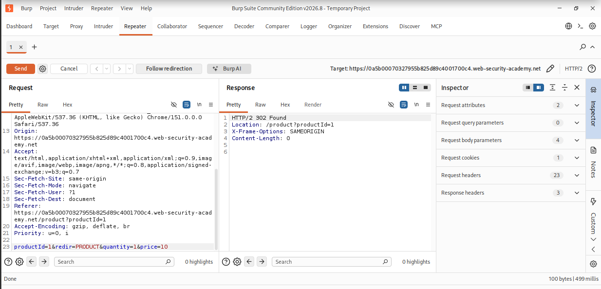
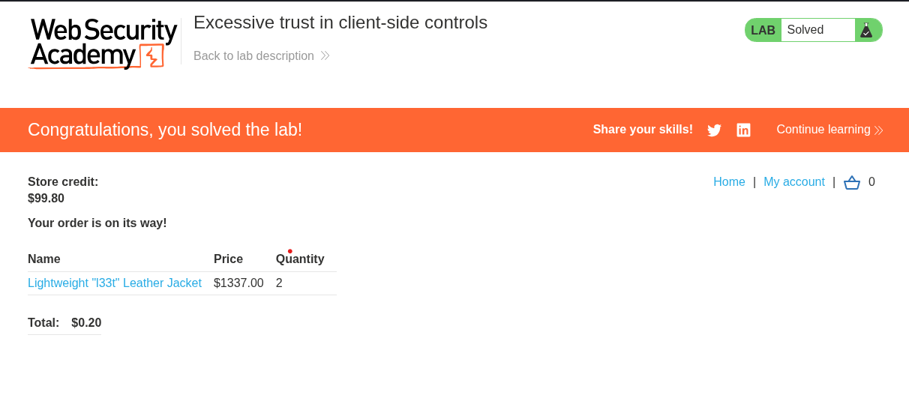

# Excessive Trust in Client-Side Controls

> PortSwigger Web Security Academy lab demonstrating exploitation of server-side trust in a client-supplied price parameter to manipulate an e-commerce checkout flow.


## Table of Contents
- [Overview](#overview)
- [Scope & Objectives](#scope--objectives)
- [Methodology](#methodology)
- [Findings / Results](#findings--results)
- [Attack Chain](#attack-chain)
- [Tools & Environment](#tools--environment)
- [Evidence](#evidence)
- [Lessons Learned](#lessons-learned)
- [References](#references)
- [Author](#author)

---

## Overview

E-commerce checkout flows that rely on client-supplied pricing data expose a common business logic flaw: if the server does not independently validate the price of an item at purchase time, a user can alter that value in transit and pay an arbitrary amount for any product.

This project documents the identification and exploitation of this flaw in a PortSwigger Web Security Academy lab. The purchase workflow was intercepted and analyzed using Burp Suite, and the `price` parameter submitted in the `POST /cart` request was modified before the order was finalized.

> **Key Outcome:** Purchased a product listed at $1,337.00 for $0.10 by tampering with the client-submitted `price` parameter, confirming the server performed no authoritative server-side price validation.

---

## Scope & Objectives

### Objectives
- Identify how the purchasing workflow calculates and validates item price
- Determine whether price is trusted from the client or recalculated server-side
- Exploit any identified trust boundary to purchase an item below its listed price
- Confirm the flaw by completing checkout at store credit levels below the item's real price

### In Scope
| Target | Description | Type |
|--------|-------------|------|
| `*.web-security-academy.net` (lab instance) | PortSwigger-hosted vulnerable e-commerce application | Web App |
| `/cart` endpoint | Cart-add request carrying `productId`, `redir`, `quantity`, `price` | Web Endpoint |
| `/product` checkout flow | Store credit deduction and order confirmation | Web Endpoint |

### Out of Scope
- Any other PortSwigger Academy lab instance or shared infrastructure
- Authentication/session mechanisms (not the target of this exercise)
- Any system outside the isolated lab instance provided by PortSwigger

### Engagement Type
> **Type:** Authenticated, white-box (source behavior observed via intercepting proxy)
> **Authorization:** PortSwigger Web Security Academy — sanctioned lab environment
> **Duration:** Single session

---

## Methodology

This exercise followed a standard web application testing approach aligned with the OWASP Testing Guide, focused on business logic validation.

| Phase | Activity | Framework Reference |
|-------|----------|-------------------|
| Reconnaissance | Logged in with provided credentials (`wiener:peter`) and reviewed the purchase workflow | OWASP Testing Guide — Business Logic |
| Enumeration | Reviewed Burp Suite HTTP history to identify parameters submitted during add-to-cart | PTES — Vulnerability Identification |
| Exploitation | Intercepted and modified the `price` parameter in `POST /cart` via Burp Repeater | MITRE ATT&CK — Initial Access (T1190) |
| Verification | Refreshed the cart and confirmed the modified price persisted server-side | OWASP Testing Guide |
| Impact Confirmation | Completed checkout using available store credit against the tampered price | OWASP Testing Guide |

> **Note:** All testing was conducted against an isolated PortSwigger Academy lab instance provisioned for this exercise. No production systems were accessed.

---

## Findings / Results

### Excessive Trust in Client-Side Controls — Web

| Field | Detail |
|-------|--------|
| **Platform** | PortSwigger Web Security Academy |
| **Difficulty** | Apprentice |
| **Category** | Business Logic Vulnerabilities |
| **Flag** | Lab marked `Solved` |

#### Approach
The application's cart-add request included a `price` parameter submitted directly by the client alongside `productId` and `quantity`. Attempting to purchase the target item with the default account's store credit failed due to insufficient funds, indicating the price was enforced but raised the question of where that enforcement occurred — client or server.

#### Solution Walkthrough

**Step 1 — Baseline request capture**
With Burp Suite running, the target item was added to cart and checkout was attempted, confirming rejection due to insufficient store credit. The `POST /cart` request was located in Proxy > HTTP History and sent to Repeater.

**Step 2 — Parameter analysis**
```
productId=1&redir=PRODUCT&quantity=1&price=100
```
> **Observation:** The request body carries `price` as a plain, unsigned, client-controlled integer with no accompanying token or signature tying it to the server-side catalog value.

**Step 3 — Price tampering**
The `price` field was modified to a value below the account's available store credit and resent via Repeater.

**Step 4 — Verification**
The cart was refreshed and the listed price reflected the tampered value rather than the catalog price of $1,337.00, confirming the server accepted the client-supplied figure without recalculation.

**Step 5 — Checkout**
The order was completed using the manipulated price, and the application returned `HTTP/2 302 Found` with a `Location: /product?productId=1` redirect, confirming successful order placement.
> **Output:** `HTTP/2 302 Found`, `Location: /product?productId=1`, `X-Frame-Options: SAMEORIGIN`

#### Key Technique
**Business logic flaw — client-side trust of price data (CWE-602: Client-Side Enforcement of Server-Side Security).** The purchase total was derived from a value the client controlled rather than being recalculated from the authoritative product catalog at the point of order confirmation. Reference: [CWE-602](https://cwe.mitre.org/data/definitions/602.html).

#### Tools Used
- Burp Suite Community Edition (Proxy, Repeater) — request interception and parameter tampering

---

## Attack Chain

```
[Reconnaissance] → [Enumeration] → [Exploitation] → [Verification]
       ↓                 ↓                ↓                ↓
  [Login/browse]   [Burp HTTP history]  [Repeater price   [Cart refresh +
                    parameter review]    tampering]         checkout]
```

| Stage | Technique | Tool | MITRE ATT&CK TTP |
|-------|-----------|------|-------------------|
| Reconnaissance | Reviewed checkout workflow and failed purchase due to store credit | Browser | — |
| Enumeration | Identified `price` as a client-submitted, unvalidated parameter | Burp Proxy | T1592 |
| Exploitation | Modified `price` parameter and replayed the request | Burp Repeater | T1190 |
| Impact | Completed purchase of a $1,337.00 item below actual cost | Browser | T1565.001 |

---

## Tools & Environment

### Environment
| Component | Specification |
|-----------|---------------|
| **OS / Platform** | Linux (local workstation) |
| **Target** | PortSwigger Web Security Academy — hosted lab instance |
| **Network** | Direct HTTPS to PortSwigger-provisioned lab domain |

### Tools Used
| Tool | Version | Purpose |
|------|---------|---------|
| Burp Suite Community Edition | 2026.8 | HTTP interception, request tampering (Repeater) |
| Chromium | 151 | Browser client for lab interaction |

---

## Evidence

All supporting evidence is organized in the `/evidence/` directory.

| Reference | File | Description |
|-----------|------|--------------|
| Tampered Purchase PoC | `evidence/payload.png` | Burp Repeater view of the `POST /cart` request with modified `price` parameter, showing a `302 Found` success response |
| Lab Completion | `evidence/lab-solved.png` | Application confirmation screen showing the lab marked `Solved`, order total reduced to $0.20, and remaining store credit of $99.80 |


*Caption: Repeater view of the POST /cart request. The price field was modified before the request was sent; the 302 Found response confirms the server accepted it without recalculating from the catalog.*


*Caption: Lab status changed to Solved after checkout completed at a manipulated order total of $0.20 against $99.80 of available store credit.*

---

## Lessons Learned

### Technical Takeaways
- Client-submitted parameters in cart/checkout flows must never be trusted as the source of truth for pricing; the server must recalculate totals from the authoritative product catalog at order confirmation time.
- Burp Repeater is sufficient to identify and confirm this class of flaw without needing automated scanning — manual parameter review of the add-to-cart request was the deciding step.
- A `302 Found` redirect to the product/confirmation page, rather than a re-rendered error page, was the clearest signal that the tampered request was accepted server-side.

### What I Would Do Differently
- Would inspect the full checkout flow (including any subsequent confirmation POST) earlier to confirm there was no secondary server-side price check acting as a safety net before order finalization.

### Skills Demonstrated
> `Burp Suite` `HTTP Request Tampering` `Business Logic Testing` `Web Application Security` `OWASP Methodology`

---

## References

- [OWASP Top 10 2021 — A04: Insecure Design](https://owasp.org/Top10/A04_2021-Insecure_Design/)
- [CWE-602: Client-Side Enforcement of Server-Side Security](https://cwe.mitre.org/data/definitions/602.html)
- [MITRE ATT&CK — T1190: Exploit Public-Facing Application](https://attack.mitre.org/techniques/T1190/)
- [PortSwigger Web Security Academy — Business Logic Vulnerabilities](https://portswigger.net/web-security/logic-flaws)

---

## Author

**Michael Asante Anim** | `0x1aerixis`
BSc Cyber Security — University of Mines and Technology (UMaT), Tarkwa, Ghana
Member, The Digital Frontline

[](https://github.com/anim-michael-asante)
[](https://linkedin.com/in/michael-asante-anim)
[](https://tryhackme.com/p/0x1aerixis)
[](https://x.com/0x1aerixis)
[](https://discord.com/users/0x1aerixis)

> *"Built in the lab. Documented for the field."*

---
> **Disclaimer:** All work documented in this repository was conducted in authorized, isolated lab environments or sanctioned CTF platforms. No unauthorized systems were accessed. This project is intended for educational and portfolio purposes only.
