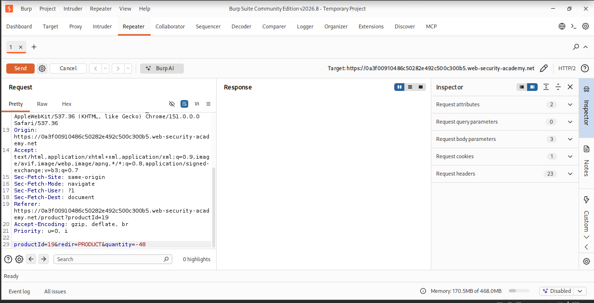
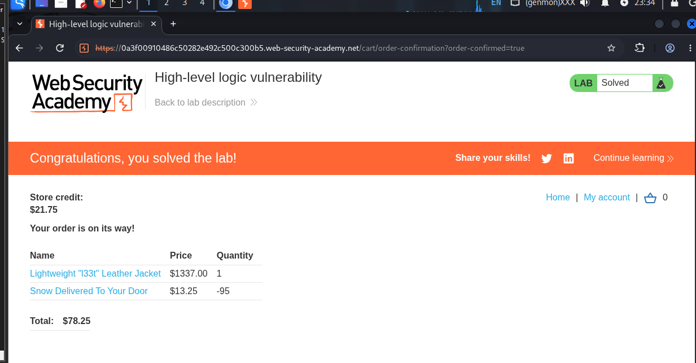

# High-Level Logic Vulnerability — Cart Quantity Manipulation

> Business logic flaw in an e-commerce checkout workflow permits negative-quantity cart manipulation, allowing an authenticated user to force a negative order total and complete a purchase below the intended price.


## Table of Contents
- [Overview](#overview)
- [Scope & Objectives](#scope--objectives)
- [Methodology](#methodology)
- [Findings / Results](#findings--results)
- [Attack Chain](#attack-chain)
- [Tools & Environment](#tools--environment)
- [Evidence](#evidence)
- [Lessons Learned](#lessons-learned)
- [References](#references)
- [Author](#author)

## Overview

E-commerce checkout flows frequently trust client-influenced parameters to determine cart totals rather than deriving them independently on the server. This creates a class of vulnerability that automated scanners rarely detect, since no malformed syntax is present — only an unexpected value in a legitimate field.

This project documents exploitation of PortSwigger Web Security Academy's "High-level logic vulnerability" lab. The cart's `quantity` parameter was found to accept negative integers, which the server applied directly to cart totals without a lower-bound check.

By combining a full-price item with a deliberately over-negative quantity of a second item, the total order value was driven below the account's available store credit, and the order was placed successfully.

> **Key Outcome:** Forced a cart containing a full-priced item to a negative net total using unvalidated negative-quantity input, completing checkout for less than the intended price.

## Scope & Objectives

### Objectives
- Identify how cart quantity is calculated and validated server-side
- Determine whether quantity bounds are enforced (minimum/maximum)
- Exploit any missing bound to manipulate the cart total
- Complete checkout for the "Lightweight l33t leather jacket" using store credit alone

### In Scope
| Target | Description | Type |
|--------|-------------|------|
| `*.web-security-academy.net` (lab instance) | PortSwigger-hosted vulnerable e-commerce application | Web App |
| `POST /cart` | Cart-update endpoint accepting `productId`, `redir`, `quantity` | API Endpoint |

### Out of Scope
- Any PortSwigger infrastructure outside the assigned lab instance
- Authentication mechanism (credentials were provided: `wiener:peter`)
- Any account other than the provided lab account

### Engagement Type
> **Type:** Authorized lab exercise (white-box, credentials provided)
> **Authorization:** PortSwigger Web Security Academy sanctioned lab environment
> **Duration:** Single session

## Methodology

Testing followed a manual, proxy-driven approach consistent with the OWASP Testing Guide's business logic testing category (OTG-BUSLOGIC) and PTES post-exploitation-free "application logic" testing phase, since no traditional vulnerability class (injection, XSS, etc.) was involved.

1. Authenticated as `wiener` and added a low-cost item to the cart while capturing traffic in Burp Proxy.
2. Reviewed `HTTP history` to isolate the `POST /cart` request and identify the `quantity` parameter.
3. Used Burp Intercept to modify `quantity` to an arbitrary positive integer and confirmed the server applied it without a maximum-bound check.
4. Repeated with a negative integer and confirmed the server subtracted it from the existing cart quantity without a minimum-bound check.
5. Escalated the negative quantity beyond the item's current cart count, forcing the cart line — and the cart total — negative.
6. Added the target item ("Lightweight l33t leather jacket," full price) to the cart.
7. Sent a `POST /cart` request for a second, cheap item with a negative `quantity` sized to bring the total below the account's store credit ($21.75), verified in Burp Repeater.
8. Submitted the order and confirmed lab completion.

## Findings / Results

#### Finding LOGIC-01 — Unvalidated Negative Quantity in Cart Update Enables Negative Order Total

| Field | Detail |
|---|---|
| **Severity** | [MEDIUM] |
| **CVSS v3.1 Score** | 6.5 |
| **CVSS Vector** | `AV:N/AC:L/PR:L/UI:N/S:U/C:N/I:H/A:N` |
| **CWE** | CWE-840: Business Logic Errors |
| **OWASP Category** | OWASP Top 10 — A04:2021 Insecure Design |
| **MITRE ATT&CK** | T1565.001 — Data Manipulation: Stored Data Manipulation |
| **Affected Component** | `POST /cart` — `quantity` parameter |

**Description:** The cart-update endpoint accepts arbitrary integer values for `quantity`, including negative values, and applies them directly to the stored cart-item count and computed total without enforcing a minimum bound of zero.

**Technical Impact:** An authenticated user can drive an individual cart line, and consequently the cart total, to a negative value. Combined with a full-priced item in the same cart, this reduces the net payable amount arbitrarily.

**Business Impact:** In a production deployment this would permit customers to acquire goods for less than their listed price, or reduce an order total below zero, directly impacting revenue integrity.

**Proof of Concept:**
```http
POST /cart HTTP/2
Host: 0a3f00910486c50282e492c500c300b5.web-security-academy.net
Content-Type: application/x-www-form-urlencoded

productId=19&redir=PRODUCT&quantity=-48
```

**Reproduction Steps:**
1. Log in as `wiener:peter`.
2. Add the target item (`productId=19`, leather jacket) to the cart at its listed price.
3. Intercept a `POST /cart` request for a second, low-cost item.
4. Set `quantity` to a negative value sized so `(item_price * quantity) + jacket_price < store_credit`.
5. Forward the request and proceed to checkout.

**Remediation:**
- Enforce `quantity >= 1` server-side on every `POST /cart` request; reject non-positive values with HTTP 400.
- Recompute cart totals independently of client-supplied line values at checkout time, using authoritative catalog prices.
- Add a server-side invariant check rejecting any order with a computed total less than or equal to zero.

**Retest Criteria:** Submit `quantity=-1` and `quantity=0` against `POST /cart`; both must be rejected, and no cart total may resolve below the sum of listed item prices.

## Attack Chain

```
Authenticate (wiener:peter)
        |
        v
Add cheap item to cart -> capture POST /cart in Burp
        |
        v
Identify unbounded 'quantity' parameter
        |
        v
Test negative quantity -> confirmed accepted, no lower bound
        |
        v
Drive cart line quantity negative -> cart total goes negative
        |
        v
Add full-price target item (leather jacket) to cart
        |
        v
Apply sized negative quantity to second item -> total < store credit
        |
        v
Submit order -> checkout succeeds -> lab solved
```

## Tools & Environment

| Tool | Purpose |
|---|---|
| Burp Suite Community Edition (v2026.8) | Proxy interception, request tampering (Proxy, Intercept, Repeater) |
| Firefox | Browser client for lab interaction |
| PortSwigger Web Security Academy | Hosted, disposable lab environment |

## Evidence


*Caption: `POST /cart` request in Burp Repeater with `quantity=-48` used to force the cart line negative.*


*Caption: Lab marked "Solved" after order confirmation, evidencing successful exploitation of the unvalidated quantity field.*

## Lessons Learned

- Business logic flaws often survive input-validation review because the input itself is syntactically valid — only the range is wrong. Range and invariant checks (quantity >= 0, total > 0) must be treated as explicit security controls, not incidental validation.
- Client-observable totals (cart pages, order confirmations) should never be treated as trustworthy inputs to a checkout decision; the server must recompute from source data at the point of payment.
- Skills demonstrated: Burp Suite Proxy/Intercept/Repeater workflow, business logic testing methodology, HTTP parameter tampering, root-cause identification of a missing server-side invariant.

## References

- [PortSwigger — High-level logic vulnerability lab](https://portswigger.net/web-security/logic-flaws/examples/lab-logic-flaws-negative-quantity-allowing-price-manipulation)
- [PortSwigger — Business logic vulnerabilities](https://portswigger.net/web-security/logic-flaws)
- [OWASP Top 10 2021 — A04: Insecure Design](https://owasp.org/Top10/A04_2021-Insecure_Design/)
- [CWE-840: Business Logic Errors](https://cwe.mitre.org/data/definitions/840.html)

## Author

**Michael Asante Anim** | `0x1aerixis`
BSc Cyber Security — University of Mines and Technology (UMaT), Tarkwa, Ghana

[](https://github.com/anim-michael-asante)
[](https://linkedin.com/in/michael-asante-anim)
[](https://tryhackme.com/p/0x1aerixis)
[](https://x.com/0x1aerixis)
[](https://discord.com/users/0x1aerixis)

> *"Built in the lab. Documented for the field."*

---
> **Disclaimer:** All work documented in this repository was conducted in authorized, isolated lab environments or sanctioned CTF platforms. No unauthorized systems were accessed. This project is intended for educational and portfolio purposes only.
