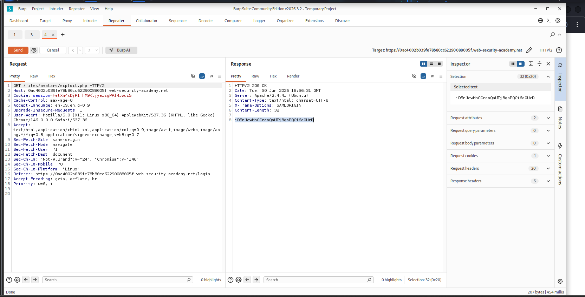
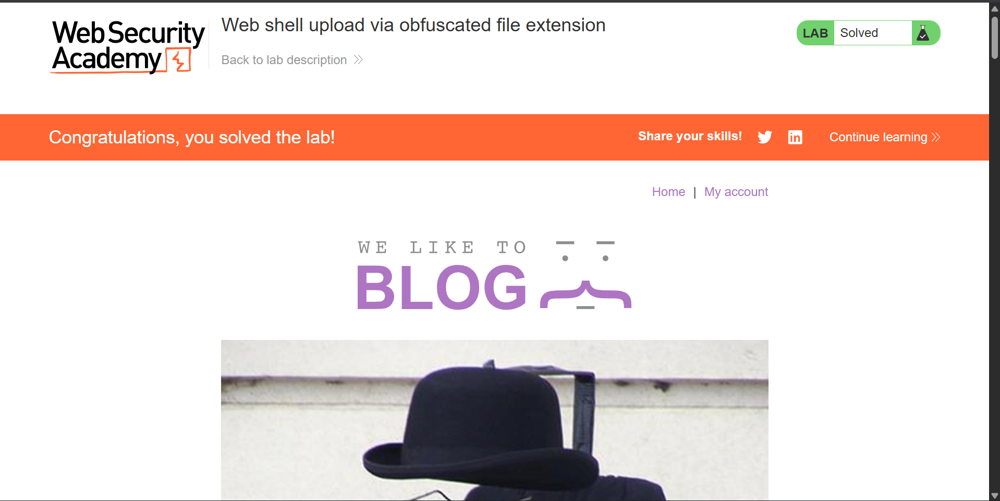

# Web Shell Upload via Obfuscated File Extension

> Bypassed a file extension blacklist by injecting a URL-encoded null byte into the multipart filename parameter, truncating the filename before the enforced extension and achieving remote code execution via arbitrary file upload.


## Table of Contents
- [Overview](#overview)
- [Scope & Objectives](#scope--objectives)
- [Methodology](#methodology)
- [Findings / Results](#findings--results)
- [Attack Chain](#attack-chain)
- [Tools & Environment](#tools--environment)
- [Evidence](#evidence)
- [Lessons Learned](#lessons-learned)
- [References](#references)
- [Author](#author)

---

## Overview

Blacklist-based file extension filtering is a common but fragile control against malicious file uploads. When the underlying filesystem or interpreter uses null-terminated strings, filenames can be truncated at an embedded null byte, allowing an attacker to satisfy a blacklist check on the visible suffix while the file is actually stored under a different, executable extension.

This project targeted a PortSwigger Web Security Academy lab simulating an avatar upload function that blacklisted dangerous file extensions. A URL-encoded null byte (`%00`) was inserted into the multipart `filename` parameter between a malicious `.php` filename and a trailing `.jpg` extension, causing the server to store the file under its true `.php` name while the blacklist check evaluated only the appended, permitted extension.

> **Key Outcome:** Achieved remote code execution by bypassing a file extension blacklist via null byte filename truncation, and exfiltrated a protected server-side file through the resulting PHP web shell.

---

## Scope & Objectives

### Objectives
- Identify the file extension blacklist enforced on the avatar upload function
- Determine whether filename parsing was vulnerable to null byte truncation
- Bypass the blacklist to upload a functional PHP web shell
- Exfiltrate the contents of a restricted file (`/home/carlos/secret`) as proof of impact

### In Scope
| Target | Description | Type |
|--------|-------------|------|
| PortSwigger Web Security Academy lab instance | Avatar upload feature on user account page | Web Application |
| `/my-account/avatar` | File upload endpoint (multipart form) | Upload Function |
| `/files/avatars/` | Static file serving path for uploaded avatars | File Serving Path |

### Out of Scope
- Any system outside the provisioned PortSwigger lab instance
- Authentication bypass or privilege escalation — valid low-privilege credentials (`wiener:peter`) were provided
- Denial-of-service or destructive testing

### Engagement Type
> **Type:** White-box (lab objective and vulnerability class disclosed in advance)
> **Authorization:** PortSwigger Web Security Academy — sanctioned training lab
> **Duration:** Single session

---

## Methodology

Testing followed a structured bypass-validation approach aligned with **OWASP Top 10 A03:2021 (Injection)**, referencing **CWE-434: Unrestricted Upload of File with Dangerous Type** and **CWE-626: Null Byte Interaction Error**.

1. **Baseline behavior** — Uploaded a legitimate image as the avatar and used Burp Proxy history to identify the `GET /files/avatars/<filename>` request used to retrieve it, confirming the file-serving path.
2. **Blacklist identification** — Attempted to upload `exploit.php` directly and observed a server response indicating only `.jpg` and `.png` extensions were permitted, confirming extension-based blacklist enforcement.
3. **Request isolation** — Captured the `POST /my-account/avatar` multipart upload request in Burp Proxy history and sent it to Repeater for manipulation.
4. **Null byte injection** — Modified the `Content-Disposition` header's `filename` parameter from `exploit.php` to `exploit.php%00.jpg`, exploiting the difference between how the application's blacklist check parsed the filename (evaluating the trailing `.jpg`) and how the underlying storage layer terminated the string at the null byte (storing the file as `exploit.php`).
5. **Verification and execution** — Confirmed successful upload via the server's response, then modified the previously captured `GET /files/avatars/<filename>` request to reference `exploit.php` directly, triggering server-side PHP execution and returning the target file's contents.

---

## Findings / Results

### Finding 05-01 — File Extension Blacklist Bypass via Null Byte Injection Leading to Remote Code Execution

| Field | Detail |
|---|---|
| **Severity** | [CRITICAL] |
| **CVSS v3.1 Score** | 9.8 |
| **CVSS Vector** | `AV:N/AC:L/PR:L/UI:N/S:U/C:H/I:H/A:H` |
| **CWE** | CWE-434: Unrestricted Upload of File with Dangerous Type; CWE-626: Null Byte Interaction Error |
| **OWASP Category** | A03:2021 – Injection |
| **MITRE ATT&CK** | T1505.003 – Server Software Component: Web Shell |
| **Affected Component** | Avatar upload feature (`/my-account/avatar`) |

**Description**
The upload endpoint enforced an extension blacklist by inspecting the filename supplied in the multipart `Content-Disposition` header. This check evaluated the string as submitted, including any appended extension, without accounting for null byte truncation at the filesystem or language runtime level. Appending a URL-encoded null byte followed by a permitted extension (`exploit.php%00.jpg`) caused the validation logic to see a `.jpg` file while the storage layer wrote the file using only the portion preceding the null byte, resulting in a stored file named `exploit.php`.

**Technical Impact**
Arbitrary PHP code execution in the context of the web server process, enabling arbitrary file read, and depending on server configuration, potential arbitrary file write, command execution, or full host compromise.

**Business Impact**
An authenticated low-privilege user could bypass a core upload security control to achieve remote code execution, compromising confidentiality and integrity of all data accessible to the web server process, including other users' data and server configuration.

**Proof of Concept**

Payload file (`exploit.php`):
```php
<?php echo file_get_contents('/home/carlos/secret'); ?>
```

Modified multipart filename parameter in the upload request:
```http
Content-Disposition: form-data; name="avatar"; filename="exploit.php%00.jpg"
Content-Type: image/jpeg
```

Execution trigger (direct request to the stored filename, ignoring the served original name):
```http
GET /files/avatars/exploit.php HTTP/2
Host: <lab-id>.web-security-academy.net
```

The server response returned the exfiltrated file contents directly in the response body, confirming successful blacklist bypass and code execution.

**Remediation**
- `[IMMEDIATE]` Reject or sanitize any filename containing null bytes (`%00`, `\x00`) prior to any extension or blacklist evaluation.
- `[SHORT-TERM]` Replace blacklist-based extension filtering with a strict allow-list, and derive the stored file extension independently from a validated, server-generated value rather than trusting client-supplied filenames.
- `[PLANNED]` Serve uploaded files from a directory or storage layer where the web server does not interpret executable script extensions, regardless of filename.

**Retest Criteria**
Re-attempt upload with a null-byte-obfuscated filename and confirm the server either rejects the request outright or stores the file using a extension derived independently of client input, preventing script execution when the file is later requested.

---

## Attack Chain

```
[1] Upload legitimate image -> identify /files/avatars/<filename> serving path
        |
        v
[2] Attempt direct exploit.php upload -> blocked by extension blacklist
        |
        v
[3] Capture POST /my-account/avatar in Burp Repeater
        |
        v
[4] Inject null byte into filename: exploit.php%00.jpg
        |
        v
[5] Blacklist check evaluates ".jpg" -> upload accepted
        |
        v
[6] Storage layer truncates at null byte -> file saved as exploit.php
        |
        v
[7] Request /files/avatars/exploit.php directly -> PHP payload executes
        |
        v
[8] Target file contents returned in response body
```

---

## Tools & Environment

| Tool | Purpose |
|---|---|
| Kali Linux | Attack platform |
| Burp Suite Community Edition | Proxy interception, request replay, multipart body manipulation |
| PortSwigger Web Security Academy | Lab environment |

---

## Evidence


*Caption: `GET /files/avatars/exploit.php` response in Burp Repeater, confirming server-side execution of the uploaded PHP file and exfiltration of the target file's contents.*


*Caption: Lab marked as solved after submitting the exfiltrated secret value.*

---

## Lessons Learned

- Extension blacklists are inherently fragile when filename parsing and file storage rely on different string-handling semantics; a mismatch between validation logic and storage logic creates an exploitable gap.
- Null byte injection remains effective against any code path that performs string comparison or regex matching on a filename before that filename reaches a null-terminated storage or filesystem API.
- Client-supplied filenames should never directly determine the extension under which a file is persisted; the server should derive and enforce this independently.
- **Skills demonstrated:** file upload vulnerability exploitation, multipart HTTP request manipulation, null byte injection technique, HTTP proxy-based request/response analysis, vulnerability impact translation to CVSS.

---

## References

- [OWASP Top 10:2021 – A03 Injection](https://owasp.org/Top10/A03_2021-Injection/)
- [CWE-434: Unrestricted Upload of File with Dangerous Type](https://cwe.mitre.org/data/definitions/434.html)
- [CWE-626: Null Byte Interaction Error](https://cwe.mitre.org/data/definitions/626.html)
- [MITRE ATT&CK T1505.003 – Server Software Component: Web Shell](https://attack.mitre.org/techniques/T1505/003/)
- [PortSwigger Web Security Academy – File Upload Vulnerabilities](https://portswigger.net/web-security/file-upload)

---

## Author

**Michael Asante Anim** | `0x1aerixis`
BSc Cyber Security — University of Mines and Technology (UMaT), Tarkwa, Ghana

[](https://github.com/anim-michael-asante)
[](https://linkedin.com/in/michael-asante-anim)
[](https://tryhackme.com/p/0x1aerixis)
[](https://x.com/0x1aerixis)
[](https://discord.com/users/0x1aerixis)

> *"Built by Grace."*

---
> **Disclaimer:** All work documented in this repository was conducted in authorized, isolated lab environments or sanctioned CTF platforms. No unauthorized systems were accessed. This project is intended for educational and portfolio purposes only.
