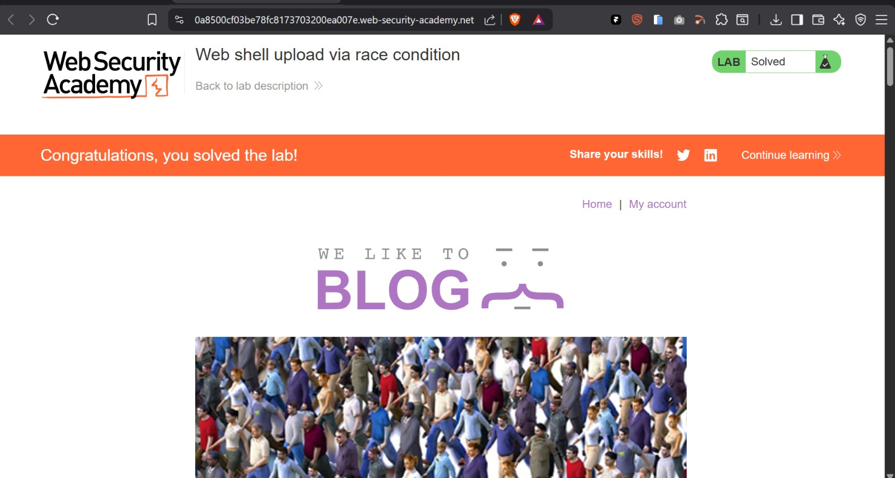
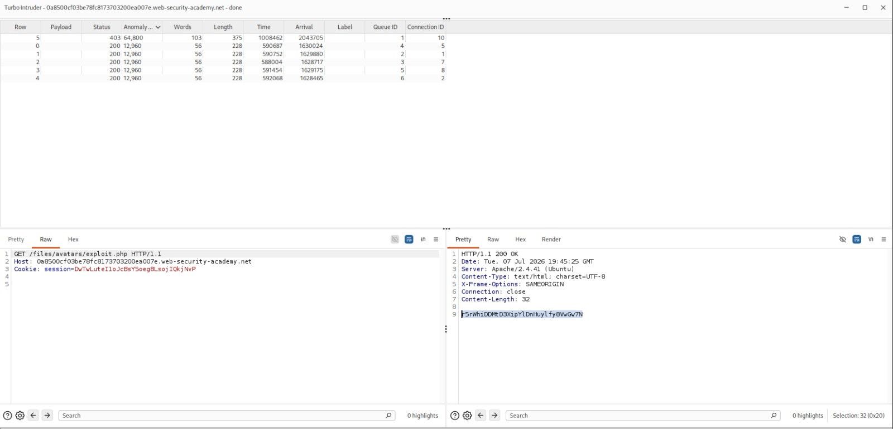

-orange>)

# Web Shell Upload via Race Condition (TOCTOU)

## Table of Contents

1. [Overview](#overview)
2. [Scope & Objectives](#scope--objectives)
3. [Methodology](#methodology)
4. [Findings / Results](#findings--results)
5. [Attack Chain](#attack-chain)
6. [Tools & Environment](#tools--environment)
7. [Evidence](#evidence)
8. [Remediation Strategy](#remediation-strategy)
9. [Lessons Learned](#lessons-learned)
10. [References](#references)
11. [Author](#author)

---

## Overview

This writeup documents the exploitation of an Expert-rated PortSwigger Web Security Academy lab
demonstrating a Time-of-Check to Time-of-Use (TOCTOU) race condition in an avatar upload feature.
Although the application enforced file-type validation and asynchronous virus scanning to prevent
malicious uploads, a race condition existed between the moment a file was written to a
publicly accessible directory and the moment it was validated and deleted. By using Burp Suite's
Turbo Intruder extension to fire a malicious PHP upload alongside multiple concurrent requests for
that file, it was possible to execute a web shell during the validation window and exfiltrate a
protected file from the server before deletion occurred.

## Scope & Objectives

**In Scope**

- `POST /my-account/avatar` (authenticated avatar upload endpoint)
- `GET /files/avatars/<filename>` (public avatar retrieval endpoint)

**Out of Scope**

- All other application functionality unrelated to the avatar upload/validation pipeline
- Infrastructure, network layer, and third-party services

**Objective**
Upload a PHP web shell disguised as an avatar image, bypass server-side file-type validation via
a race condition, and use the resulting remote code execution to read the contents of
`/home/carlos/secret`.

## Methodology

Testing followed a structured black-box approach aligned with **PTES** (Pre-engagement,
Intelligence Gathering, Vulnerability Analysis, Exploitation, Reporting) and referenced
**OWASP A04:2021 – Insecure Design**, which covers race condition flaws arising from unsafe
assumptions about operation ordering.

1. Authenticated as the low-privileged user `wiener` and confirmed the avatar upload accepted
   only valid image files, rejecting `.php` uploads through both extension checks and content-type
   validation.
2. Identified the retrieval path for uploaded avatars (`GET /files/avatars/<filename>`) via Burp
   Proxy history.
3. Hypothesized a TOCTOU race condition based on the lab category and the described server-side
   flow: file is written to disk immediately, then asynchronously scanned and deleted if invalid.
4. Constructed a malicious payload (`exploit.php`) that reads and returns the contents of the
   target file.
5. Used **Burp Suite Turbo Intruder** to submit the malicious upload request gated alongside five
   concurrent `GET` requests for the not-yet-deleted file, exploiting the narrow validation window.
6. Confirmed successful exploitation when one of the gated `GET` requests returned a `200 OK`
   containing the contents of `/home/carlos/secret`.

## Findings / Results

### Finding 1 — Race Condition Enabling Unrestricted File Upload and Remote Code Execution

| Field                  | Detail                                                                                      |
| ---------------------- | ------------------------------------------------------------------------------------------- |
| **ID**                 | F-01                                                                                        |
| **Severity**           | `[HIGH]`                                                                                    |
| **CVSS v3.1 Score**    | 8.5                                                                                         |
| **CVSS v3.1 Vector**   | `CVSS:3.1/AV:N/AC:H/PR:L/UI:N/S:U/C:H/I:H/A:H`                                              |
| **CWE**                | CWE-367: Time-of-check Time-of-use (TOCTOU) Race Condition                                  |
| **OWASP Category**     | A04:2021 – Insecure Design                                                                  |
| **MITRE ATT&CK TTP**   | T1190 – Exploit Public-Facing Application; T1505.003 – Server Software Component: Web Shell |
| **Affected Component** | `POST /my-account/avatar` upload handler and asynchronous file-validation process           |

**Description**
The avatar upload handler wrote uploaded files directly to a publicly reachable directory
(`/files/avatars/`) before validation completed. File-type and content validation, along with
malicious file deletion, occurred asynchronously after the file was already accessible. This
created a window in which an attacker-controlled file could be requested and executed before
being removed.

**Technical Impact**
Full remote code execution in the context of the web server, enabling arbitrary file read as
demonstrated, with the same primitive extending to arbitrary file write, further command
execution, or lateral movement within the hosting environment.

**Business Impact**
An attacker exploiting this flaw could read sensitive server-side files, extract credentials or
secrets, modify application data, or pivot further into the hosting infrastructure — representing
a critical breach of confidentiality, integrity, and availability for any production deployment of
this pattern.

**Proof of Concept**

`exploit.php` payload:

```php
<?php echo file_get_contents('/home/carlos/secret'); ?>
```

**Reproduction Steps**

1. Authenticate as a low-privileged user and confirm the avatar upload rejects non-image files.
2. Capture a legitimate `POST /my-account/avatar` request and a `GET /files/avatars/<file>`
   request in Burp Proxy.
3. Send the `POST` request to Turbo Intruder. Replace the file contents and filename with the
   PHP payload (`exploit.php`) while retaining a valid multipart structure.
4. Build a companion `GET /files/avatars/exploit.php` request.
5. Use the `gate` mechanism to queue the `POST` request alongside five `GET` requests, releasing
   all of them simultaneously with `engine.openGate()`.
6. Review the results table for a `GET` request returning `200 OK` with the secret file contents
   in the response body.

**Remediation**
See [Remediation Strategy](#remediation-strategy) below.

**Retest Criteria**
Re-attempt the same Turbo Intruder attack sequence post-fix and confirm all `GET` requests to the
malicious filename return `403`/`404` at every point after upload, with no window in which the
file is servable.

## Attack Chain

```
[1] Authenticate as wiener
        |
        v
[2] Identify avatar upload + retrieval endpoints
        |
        v
[3] Confirm synchronous validation blocks direct .php upload
        |
        v
[4] Craft exploit.php (arbitrary file read payload)
        |
        v
[5] Race POST /my-account/avatar against 5x GET /files/avatars/exploit.php
    (Turbo Intruder, single gate, 10 concurrent connections)
        |
        v
[6] File servable during validation window --> 200 OK with secret contents
        |
        v
[7] Secret exfiltrated --> Lab objective achieved
```

## Tools & Environment

| Tool                             | Purpose                                                                 |
| -------------------------------- | ----------------------------------------------------------------------- |
| Burp Suite (Proxy, Repeater)     | Request interception, manual verification, Content-Length recalculation |
| Turbo Intruder (BApp)            | Precision request racing via gated concurrent connections               |
| PHP                              | Web shell payload for file read primitive                               |
| PortSwigger Web Security Academy | Isolated, authorized lab environment                                    |

## Evidence

### Lab Solved Confirmation


_Figure 1: Lab status confirmed as Solved following secret submission._

### Race Condition Exploitation Result


_Figure 2: Turbo Intruder results table showing a gated GET request to /files/avatars/exploit.php returning a 200 OK with the extracted secret in the response body._

| Evidence                   | Description                                                                                                                                                          |
| -------------------------- | -------------------------------------------------------------------------------------------------------------------------------------------------------------------- |
| `evidence/lab-solved.png`  | Lab status confirmed as Solved following secret submission                                                                                                           |
| `evidence/flag.png`        | Turbo Intruder results table showing a `200 OK` response on a gated `GET /files/avatars/exploit.php` request, with the extracted secret visible in the response body |
| `exploit.php`              | Malicious payload used to read `/home/carlos/secret`                                                                                                                 |
| `race_condition_attack.py` | Turbo Intruder Python script used to execute the gated race attack                                                                                                   |

## Remediation Strategy

| Priority       | Action                                                                                                                                                                                    |
| -------------- | ----------------------------------------------------------------------------------------------------------------------------------------------------------------------------------------- |
| `[IMMEDIATE]`  | Validate file type, content, and malware-scan results **before** the file is written to any publicly accessible path. Stage uploads in a non-web-accessible quarantine location.          |
| `[SHORT-TERM]` | Generate a random, unpredictable filename on upload rather than preserving attacker-controlled filenames, reducing the ability to reference the file directly even if briefly accessible. |
| `[PLANNED]`    | Perform all validation and file-move operations within a single atomic operation or transaction to eliminate any TOCTOU window between check and use.                                     |

## Lessons Learned

Asynchronous validation pipelines that make a file publicly reachable before validation completes
introduce a race condition regardless of how strict the validation logic itself is. Correctness of
a check is irrelevant if there exists any window, however small, in which the checked resource is
usable by an attacker. Precision tooling such as Turbo Intruder is necessary to reliably exploit
race windows that are too narrow for manual request timing, and should equally be considered
during defensive testing to validate that no such window exists.

## References

- [PortSwigger: Web shell upload via race condition](https://portswigger.net/web-security/race-conditions)
- [CWE-367: Time-of-check Time-of-use Race Condition](https://cwe.mitre.org/data/definitions/367.html)
- [OWASP Top 10 2021 – A04: Insecure Design](https://owasp.org/Top10/A04_2021-Insecure_Design/)
- [MITRE ATT&CK T1190 – Exploit Public-Facing Application](https://attack.mitre.org/techniques/T1190/)
- [Turbo Intruder – PortSwigger BApp Store](https://portswigger.net/bappstore/9abaa233088242e8be252cd4ff534988)

---

## Author

**Michael Asante Anim** | `0x1aerixis`
BSc Cyber Security — University of Mines and Technology (UMaT), Tarkwa, Ghana

[](https://github.com/anim-michael-asante)
[](https://linkedin.com/in/michael-asante-anim)
[](https://tryhackme.com/p/0x1aerixis)
[](https://x.com/0x1aerixis)
[](https://discord.com/users/0x1aerixis)

> _"Built in the lab. Documented for the field."_

---

> **Disclaimer:** All work documented in this repository was conducted in authorized, isolated
> lab environments or sanctioned CTF platforms. No unauthorized systems were accessed.
> This project is intended for educational and portfolio purposes only.
