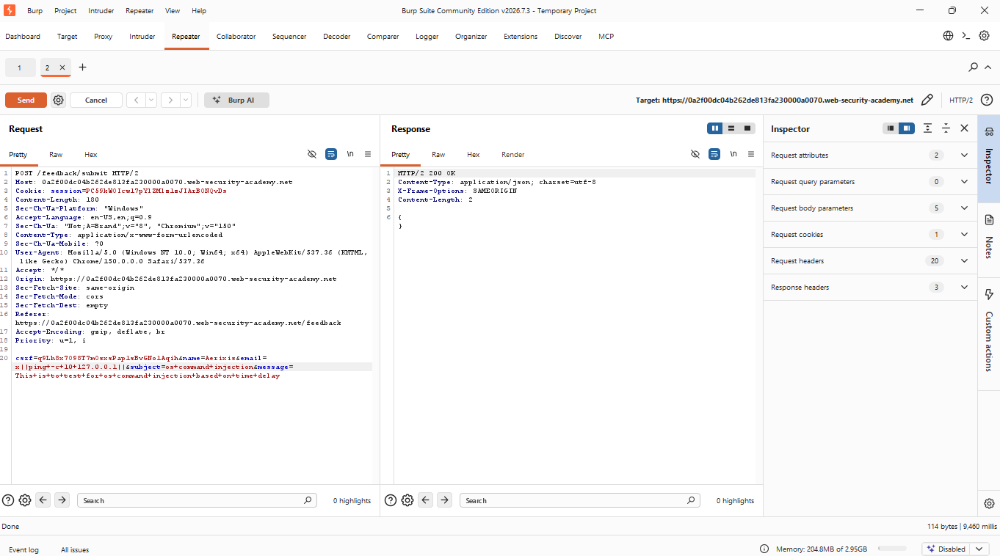
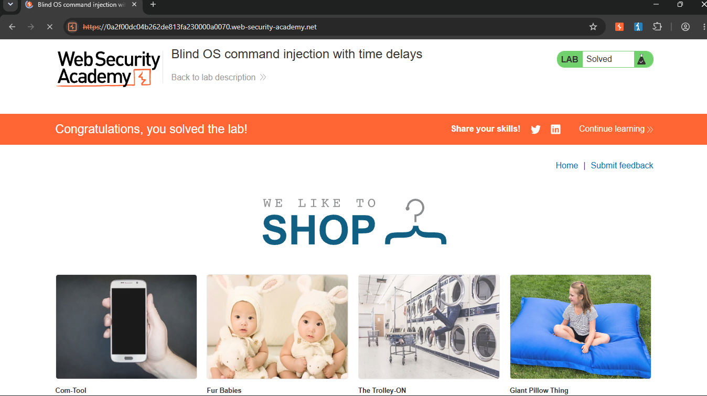

# Blind OS Command Injection with Time Delays

> PortSwigger Web Security Academy lab demonstrating blind OS command injection in a feedback submission feature, confirmed via a time-based side channel rather than reflected command output.


## Table of Contents

- [Overview](#overview)
- [Scope & Objectives](#scope--objectives)
- [Methodology](#methodology)
- [Findings / Results](#findings--results)
- [Tools & Environment](#tools--environment)
- [Evidence](#evidence)
- [Lessons Learned](#lessons-learned)
- [References](#references)
- [Author](#author)

## Overview

Not every command injection vulnerability returns command output directly in the HTTP response. When output is suppressed or discarded server-side, the flaw is still exploitable — it simply requires a blind exploitation technique, most commonly a time-based side channel using commands like `ping` or `sleep`.

This project documents a PortSwigger Web Security Academy lab (Blind OS command injection with time delays) in which a feedback submission feature passed the `email` parameter into a server-side shell command without sanitization. Because the command's output was never reflected back to the client, exploitation was validated by injecting a command that caused a measurable, attacker-controlled delay in the HTTP response.

Burp Suite was used to intercept the feedback submission request and modify the `email` parameter to chain a `ping` command with a fixed packet count, producing a consistent ten-second delay that confirmed successful command execution.

> **Key Outcome:** Confirmed blind OS command injection in the feedback `email` parameter by observing a reproducible 10-second response delay triggered by an injected `ping` command, with no reliance on reflected output.

## Scope & Objectives

### Objectives

- Identify the feedback submission request and the parameter passed into the server-side shell command
- Inject a command chained via `||` to trigger a time-based side effect (`ping -c 10 127.0.0.1`)
- Confirm exploitation by measuring the induced response delay rather than reading command output

### In Scope

| Target                                                      | Description                                                                  | Type     |
| ----------------------------------------------------------- | ---------------------------------------------------------------------------- | -------- |
| `0a6700dd0401874980d7a310001800b8.web-security-academy.net` | PortSwigger Web Security Academy lab instance                                | Web App  |
| Feedback submission endpoint                                | Accepts `email` (and related) parameters used in a server-side shell command | Endpoint |

### Out of Scope

- All other lab endpoints not related to the feedback feature
- Any infrastructure outside the provisioned PortSwigger lab instance

### Engagement Type

> **Type:** Black-box
> **Authorization:** PortSwigger Web Security Academy — sanctioned training lab
> **Duration:** Single session

## Methodology

This exercise followed a condensed recon-to-exploitation approach aligned with the OWASP Testing Guide and MITRE ATT&CK, adapted for blind exploitation.

| Phase          | Activity                                                                                                       | Framework Reference                      |
| -------------- | -------------------------------------------------------------------------------------------------------------- | ---------------------------------------- |
| Reconnaissance | Identified the feedback submission request and its parameters via Burp Proxy                                   | OWASP Testing Guide                      |
| Enumeration    | Sent the request to Burp Repeater; confirmed no command output was reflected in the response                   | PTES — Vulnerability Identification      |
| Exploitation   | Injected `x\|\|ping -c 10 127.0.0.1\|\|` into the `email` parameter to chain a delay-inducing command          | MITRE ATT&CK — Execution (TA0002), T1059 |
| Validation     | Measured response time to confirm a consistent ~10-second delay, indicating successful blind command execution | OWASP Testing Guide                      |

> **Note:** All testing was conducted against an isolated, authorized PortSwigger Web Security Academy lab instance. No production systems were accessed.

## Findings / Results

---

### VULN-001 — Blind OS Command Injection via `email` Parameter (Time-Based)

| Field                  | Detail                                                                                                                      |
| ---------------------- | --------------------------------------------------------------------------------------------------------------------------- |
| **Severity**           | [CRITICAL]                                                                                                                  |
| **CVSS v3.1 Score**    | 9.8                                                                                                                         |
| **CVSS Vector**        | `CVSS:3.1/AV:N/AC:L/PR:N/UI:N/S:U/C:H/I:H/A:H`                                                                              |
| **CWE**                | [CWE-78: Improper Neutralization of Special Elements used in an OS Command](https://cwe.mitre.org/data/definitions/78.html) |
| **OWASP Category**     | [A03:2021 – Injection](https://owasp.org/Top10/A03_2021-Injection/)                                                         |
| **MITRE ATT&CK**       | [T1059 – Command and Scripting Interpreter](https://attack.mitre.org/techniques/T1059/)                                     |
| **Affected Component** | Feedback submission handler — `email` request parameter                                                                     |

#### Description

The feedback submission feature passes the `email` parameter, unsanitized, into a server-side shell command. Unlike a reflected command injection, the output of the executed command is not returned in the HTTP response, making the vulnerability blind. Exploitation was demonstrated by chaining a `ping` command using the `||` operator so it executes regardless of the outcome of the intended command, and observing the resulting response delay as a side channel.

#### Technical Impact

An attacker can execute arbitrary operating system commands with the privileges of the web application process, with no direct visibility into command output. Blind command injection is still fully exploitable for data exfiltration (e.g., via out-of-band channels, DNS lookups, or timing-based boolean/byte extraction), file writes, or further compromise of the host, despite the lack of reflected output.

#### Business Impact

Because output suppression does not prevent exploitation, this finding carries the same real-world risk as a directly reflected command injection: full compromise of the affected server, exposure of business or customer data, and potential regulatory and reputational consequences. The blind nature of the flaw may also delay detection, increasing dwell time for an attacker.

#### Proof of Concept

```http
POST /feedback/submit HTTP/2
Host: 0a6700dd0401874980d7a310001800b8.web-security-academy.net
Content-Type: application/x-www-form-urlencoded

csrf=[token]&name=test&email=x||ping+-c+10+127.0.0.1||&subject=test&message=test
```

> **Screenshot:** `evidence/vuln-001-poc-request.png`
> _Burp Suite Repeater request showing the `email` parameter modified to `x||ping -c 10 127.0.0.1||`, with the response taking approximately 10 seconds to return despite no output being reflected._

#### Reproduction Steps

1. Submit the feedback form and capture the resulting `POST` request in Burp Proxy.
2. Send the request to Burp Repeater.
3. Modify the `email` parameter value to `x||ping+-c+10+127.0.0.1||`.
4. Send the request and measure response time; observe a delay of approximately 10 seconds, confirming blind command execution.

#### Remediation

> **Priority:** Immediate
> **Effort:** Medium

Eliminate direct concatenation of user input into shell commands, including fields such as `email` that are not typically treated as command-execution sinks. Replace shell invocation with a safe API that does not interpret shell metacharacters. Where shelling out is unavoidable, strictly validate the `email` parameter against a proper email format (e.g., RFC 5322-compliant regex or a vetted validation library) and reject any input containing shell metacharacters (`|`, `;`, `&`, `` ` ``, `$( )`) before it reaches the command execution layer. Invoke any required system commands using an argument array rather than a concatenated shell string.

#### Retest Criteria

- [ ] Submitting `email=x||ping -c 10 127.0.0.1||` (and equivalent separators `;`, `&&`, `` ` ``, `$( )`) no longer produces a measurable response delay
- [ ] The `email` field rejects non-email-formatted input with a controlled validation error

## Tools & Environment

| Tool                                   | Purpose                                                                                                          |
| -------------------------------------- | ---------------------------------------------------------------------------------------------------------------- |
| Burp Suite Community Edition v2026.7.3 | Intercepting proxy and Repeater used to modify and replay the vulnerable request, and to measure response timing |
| PortSwigger Web Security Academy       | Hosted, sanctioned lab environment                                                                               |
| Chrome                                 | Browser used to interact with the lab application                                                                |

## Evidence

> **Note:** Replace the placeholder images below with the actual Repeater screenshot showing the `email=x||ping -c 10 127.0.0.1||` payload and the measured ~10-second response delay before publishing.


_Figure 1 — PoC request/response for the blind OS command injection via the `email` parameter._


_Figure 2 — PortSwigger Web Security Academy lab status confirming successful exploitation._

| File                                | Description                                                                                                             |
| ----------------------------------- | ----------------------------------------------------------------------------------------------------------------------- |
| `evidence/vuln-001-poc-request.png` | Burp Repeater request/response showing the `email=x\|\|ping -c 10 127.0.0.1\|\|` payload and the induced response delay |
| `evidence/vuln-001-lab-solved.png`  | Lab status confirmation showing "Congratulations, you solved the lab!"                                                  |

## Lessons Learned

- Absence of reflected command output does not indicate absence of command injection; blind exploitation techniques (time-based, out-of-band) remain viable.
- Fields not obviously tied to system commands (such as `email`) can still be command-injection sinks if backend logic passes them into a shell.
- The `||` operator is effective for blind injection because it guarantees execution of the injected command independent of whether the preceding command succeeds or fails.
- Time-based confirmation requires care to rule out network jitter or server load as a false positive — repeat the request and compare against a baseline (unmodified) request timing.

## References

- [PortSwigger Web Security Academy — Blind OS command injection with time delays](https://portswigger.net/web-security/os-command-injection/lab-blind-time-delays)
- [CWE-78: OS Command Injection](https://cwe.mitre.org/data/definitions/78.html)
- [OWASP Top 10 2021 — A03: Injection](https://owasp.org/Top10/A03_2021-Injection/)
- [MITRE ATT&CK — T1059: Command and Scripting Interpreter](https://attack.mitre.org/techniques/T1059/)

## Author

**Michael Asante Anim** | `0x1aerixis`
BSc Cyber Security — University of Mines and Technology (UMaT), Tarkwa, Ghana

[](https://github.com/anim-michael-asante)
[](https://linkedin.com/in/michael-asante-anim)
[](https://tryhackme.com/p/0x1aerixis)
[](https://x.com/0x1aerixis)
[](https://discord.com/users/0x1aerixis)

> _"Built in the lab. Documented for the field."_

---

> **Disclaimer:** All work documented in this repository was conducted in authorized, isolated
> lab environments or sanctioned CTF platforms. No unauthorized systems were accessed.
> This project is intended for educational and portfolio purposes only.
