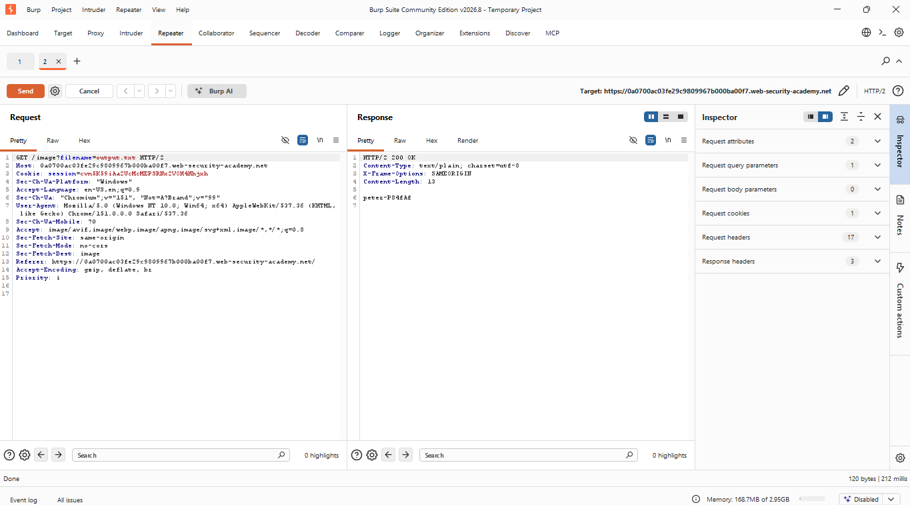
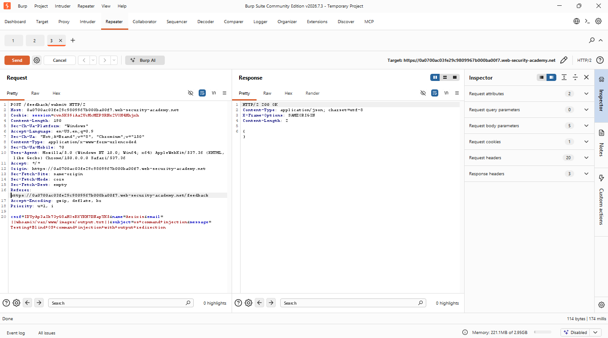
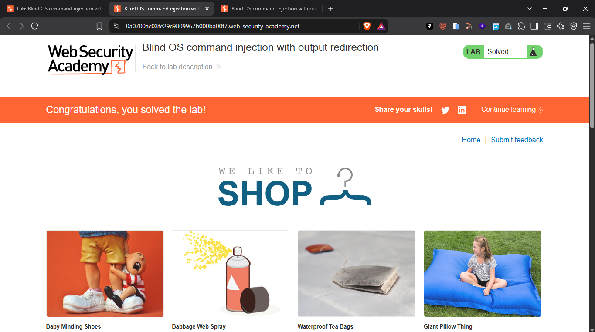

# Blind OS Command Injection with Output Redirection

> PortSwigger Web Security Academy lab demonstrating blind OS command injection in a feedback submission feature, with command output exfiltrated by redirecting it to a file served by the application's static image handler.


## Table of Contents

- [Overview](#overview)
- [Scope & Objectives](#scope--objectives)
- [Methodology](#methodology)
- [Findings / Results](#findings--results)
- [Tools & Environment](#tools--environment)
- [Evidence](#evidence)
- [Lessons Learned](#lessons-learned)
- [References](#references)
- [Author](#author)

## Overview

Blind command injection vulnerabilities that suppress command output are not necessarily unrecoverable for an attacker. When the compromised application also exposes a mechanism for serving files from disk — such as a static file or image handler — output redirection can be used to write command results to a location the attacker can subsequently retrieve over HTTP.

This project documents a PortSwigger Web Security Academy lab (Blind OS command injection with output redirection) in which the feedback submission feature passed the `email` parameter into a server-side shell command without sanitization. Command output was not reflected in the response, but the application served images for its product catalog from a writable directory (`/var/www/images/`), which was used as an exfiltration path.

The injected command redirected the output of `whoami` to a file within the writable image directory. The product image-loading endpoint was then used to retrieve that file directly, disclosing the identity of the user running the backend process.

> **Key Outcome:** Achieved full disclosure of blind command execution output by redirecting `whoami` to a file in a web-servable directory and retrieving it via the application's image-loading endpoint.

## Scope & Objectives

### Objectives

- Identify the feedback submission request and the parameter passed into the server-side shell command
- Redirect the output of an injected `whoami` command to a file within a directory served by the application
- Retrieve the redirected output via the product image-loading endpoint to confirm full read access to command results

### In Scope

| Target                                                      | Description                                                                          | Type     |
| ----------------------------------------------------------- | ------------------------------------------------------------------------------------ | -------- |
| `0a0700ac03fe29c9809967b000ba00f7.web-security-academy.net` | PortSwigger Web Security Academy lab instance                                        | Web App  |
| `POST /feedback/submit`                                     | Feedback submission endpoint accepting `csrf`, `name`, `email`, `subject`, `message` | Endpoint |
| `GET /image?filename=`                                      | Product image-loading endpoint serving files from `/var/www/images/`                 | Endpoint |

### Out of Scope

- All other lab endpoints not related to the feedback or image-loading features
- Any infrastructure outside the provisioned PortSwigger lab instance

### Engagement Type

> **Type:** Black-box
> **Authorization:** PortSwigger Web Security Academy — sanctioned training lab
> **Duration:** Single session

## Methodology

This exercise followed a condensed recon-to-exploitation approach aligned with the OWASP Testing Guide and MITRE ATT&CK, combining blind command injection with a secondary file-retrieval step.

| Phase          | Activity                                                                                                                                                 | Framework Reference                       |
| -------------- | -------------------------------------------------------------------------------------------------------------------------------------------------------- | ----------------------------------------- |
| Reconnaissance | Identified the feedback submission request and the image-loading endpoint via Burp Proxy                                                                 | OWASP Testing Guide                       |
| Enumeration    | Confirmed no command output was reflected by the feedback endpoint; identified `/var/www/images/` as the source directory for the image-loading endpoint | PTES — Vulnerability Identification       |
| Exploitation   | Injected `\|\|whoami>/var/www/images/output.txt\|\|` into the `email` parameter to redirect command output to a web-servable file                        | MITRE ATT&CK — Execution (TA0002), T1059  |
| Exfiltration   | Requested `GET /image?filename=output.txt` to retrieve the redirected output directly                                                                    | MITRE ATT&CK — Collection (TA0009), T1005 |

> **Note:** All testing was conducted against an isolated, authorized PortSwigger Web Security Academy lab instance. No production systems were accessed.

## Findings / Results

---

### VULN-001 — Blind OS Command Injection with Output Exfiltration via File Redirection

| Field                  | Detail                                                                                                                      |
| ---------------------- | --------------------------------------------------------------------------------------------------------------------------- |
| **Severity**           | [CRITICAL]                                                                                                                  |
| **CVSS v3.1 Score**    | 9.8                                                                                                                         |
| **CVSS Vector**        | `CVSS:3.1/AV:N/AC:L/PR:N/UI:N/S:U/C:H/I:H/A:H`                                                                              |
| **CWE**                | [CWE-78: Improper Neutralization of Special Elements used in an OS Command](https://cwe.mitre.org/data/definitions/78.html) |
| **OWASP Category**     | [A03:2021 – Injection](https://owasp.org/Top10/A03_2021-Injection/)                                                         |
| **MITRE ATT&CK**       | [T1059 – Command and Scripting Interpreter](https://attack.mitre.org/techniques/T1059/)                                     |
| **Affected Component** | `POST /feedback/submit` (`email` parameter) and `GET /image` (`filename` parameter)                                         |

#### Description

The feedback submission handler passes the `email` parameter, unsanitized, into a server-side shell command. The command's output is not returned in the HTTP response, making the injection point blind. However, the application separately exposes a product image-loading endpoint that serves arbitrary files from `/var/www/images/`, a directory writable by the shell command's execution context. Chaining these two behaviors converts a blind injection into a fully readable one: the injected command's output is redirected to a file in the writable directory, then retrieved via the image-loading endpoint.

#### Technical Impact

An attacker can execute arbitrary operating system commands with the privileges of the web application process and fully recover the output of those commands by writing them to a location the application itself serves over HTTP. This effectively removes the "blind" constraint, granting the same level of visibility as a directly reflected command injection, including the ability to read local files, enumerate the file system, and exfiltrate sensitive data.

#### Business Impact

The combination of command injection and an unrestricted file-serving path allows a complete compromise cycle — execution and full data retrieval — without needing an out-of-band channel. This significantly lowers the bar for real-world exploitation and increases the likelihood of large-scale data exposure, regulatory breach-notification obligations, and reputational damage.

#### Proof of Concept

```http
POST /feedback/submit HTTP/2
Host: 0a0700ac03fe29c9809967b000ba00f7.web-security-academy.net
Content-Type: application/x-www-form-urlencoded
Content-Length: 190

csrf=IDYyAp3aIk73yG8aHOsK6YKH7DHapYK5&name=Aerixis&email=||whoami>/var/www/images/output.txt||&subject=os+command+injection&message=Testing+Blind+OS+command+injection+with+output+redirection
```

```http
GET /image?filename=output.txt HTTP/2
Host: 0a0700ac03fe29c9809967b000ba00f7.web-security-academy.net
```


_Figure 1 — Feedback submission request with `email` set to `||whoami>/var/www/images/output.txt||`, redirecting the command's output to a web-servable file._


_Figure 2 — Subsequent `GET /image?filename=output.txt` request, with the response body containing the disclosed output of `whoami`._

#### Reproduction Steps

1. Submit the feedback form and capture the resulting `POST /feedback/submit` request in Burp Proxy.
2. Send the request to Burp Repeater and modify the `email` parameter to `||whoami>/var/www/images/output.txt||`.
3. Send the modified request; the response contains no visible command output.
4. Capture a product image request (`GET /image?filename=...`) and send it to Repeater.
5. Modify the `filename` parameter to `output.txt` and send the request.
6. Observe that the response body now contains the output of the injected `whoami` command.

#### Remediation

> **Priority:** Immediate
> **Effort:** Medium

Eliminate direct concatenation of user input into shell commands, including fields such as `email` that are not typically treated as command-execution sinks. Where shelling out is unavoidable, strictly validate the `email` parameter against a proper email format and reject input containing shell metacharacters (`|`, `;`, `&`, `` ` ``, `>`, `<`, `$( )`) before it reaches the command layer. Separately, ensure the image-loading endpoint's source directory is not writable by the application's shell execution context, and that the `filename` parameter is restricted to an allowlist of known, application-generated filenames rather than arbitrary user-supplied values.

#### Retest Criteria

- [ ] Submitting `email=||whoami>/var/www/images/output.txt||` (and equivalent redirection/separator payloads) no longer results in file creation within the served image directory
- [ ] The `email` field rejects non-email-formatted input with a controlled validation error
- [ ] The `filename` parameter on the image endpoint cannot be used to read arbitrary files outside the intended image set

## Tools & Environment

| Tool                                             | Purpose                                                                                   |
| ------------------------------------------------ | ----------------------------------------------------------------------------------------- |
| Burp Suite Community Edition v2026.7.3 / v2026.8 | Intercepting proxy and Repeater used to modify and replay the feedback and image requests |
| PortSwigger Web Security Academy                 | Hosted, sanctioned lab environment                                                        |
| Brave / Chromium-based browser                   | Browser used to interact with the lab application                                         |

## Evidence


_Figure 1 — Feedback submission request with the `email` parameter set to `||whoami>/var/www/images/output.txt||`._


_Figure 2 — `GET /image?filename=output.txt` request/response disclosing the `whoami` output._


_Figure 3 — PortSwigger Web Security Academy lab status confirming successful exploitation._

| File                                         | Description                                                                                                              |
| -------------------------------------------- | ------------------------------------------------------------------------------------------------------------------------ |
| `evidence/vuln-001-poc-feedback-request.png` | Burp Repeater request showing the injected `email` parameter redirecting `whoami` output to `/var/www/images/output.txt` |
| `evidence/vuln-001-poc-output-retrieval.png` | Burp Repeater request/response showing `GET /image?filename=output.txt` returning the command output                     |
| `evidence/vuln-001-lab-solved.png`           | Lab status confirmation showing "Congratulations, you solved the lab!"                                                   |

## Lessons Learned

- A blind command injection is not necessarily low-severity: any co-located file-serving functionality can convert it into a fully readable primitive via output redirection.
- Directories used to serve static application content (images, assets) should never be writable by a process capable of executing shell commands on user input.
- File-serving endpoints that accept a `filename` parameter directly from the client should validate against an allowlist, not merely check that the file exists.
- Testing for command injection should include checks for writable, web-accessible paths as a secondary exfiltration channel, not just direct output reflection or time-based side channels.

## References

- [PortSwigger Web Security Academy — Blind OS command injection with output redirection](https://portswigger.net/web-security/os-command-injection/lab-blind-output-redirection)
- [CWE-78: OS Command Injection](https://cwe.mitre.org/data/definitions/78.html)
- [OWASP Top 10 2021 — A03: Injection](https://owasp.org/Top10/A03_2021-Injection/)
- [MITRE ATT&CK — T1059: Command and Scripting Interpreter](https://attack.mitre.org/techniques/T1059/)
- [MITRE ATT&CK — T1005: Data from Local System](https://attack.mitre.org/techniques/T1005/)

## Author

**Michael Asante Anim** | `0x1aerixis`
BSc Cyber Security — University of Mines and Technology (UMaT), Tarkwa, Ghana

[](https://github.com/anim-michael-asante)
[](https://linkedin.com/in/michael-asante-anim)
[](https://tryhackme.com/p/0x1aerixis)
[](https://x.com/0x1aerixis)
[](https://discord.com/users/0x1aerixis)

> _"Built in the lab. Documented for the field."_

---

> **Disclaimer:** All work documented in this repository was conducted in authorized, isolated
> lab environments or sanctioned CTF platforms. No unauthorized systems were accessed.
> This project is intended for educational and portfolio purposes only.
