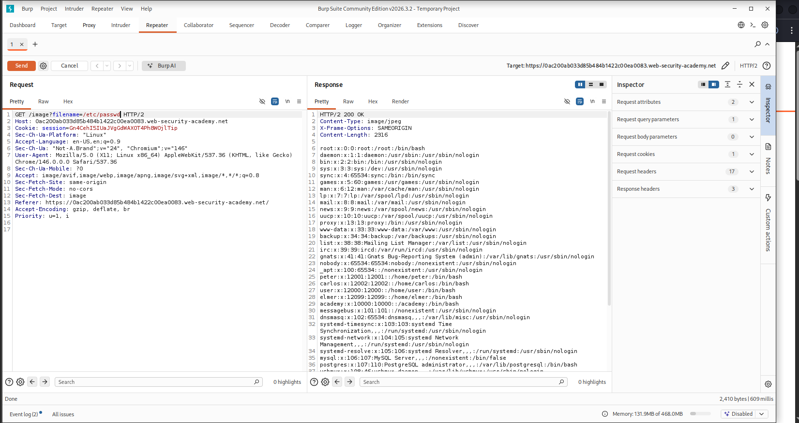
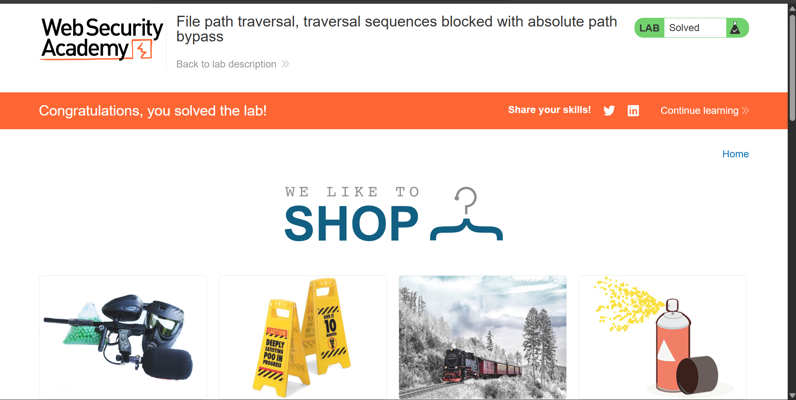

# File Path Traversal — Lab 02: Traversal Sequences Blocked with Absolute Path Bypass

> Exploitation of a path traversal filter bypass using an absolute path (`/etc/passwd`) on a PortSwigger Web Security Academy lab where relative traversal sequences (`../`) are blocked.


---

## Table of Contents

- [Overview](#overview)
- [Scope & Objectives](#scope--objectives)
- [Methodology](#methodology)
- [Findings](#findings)
- [Risk Summary](#risk-summary)
- [Tools & Environment](#tools--environment)
- [Evidence](#evidence)
- [Remediation](#remediation)
- [Lessons Learned](#lessons-learned)
- [References](#references)
- [Author](#author)

---

## Overview

A common developer response to path traversal reports is to strip or block traversal sequences (`../`) from user-supplied input. This approach constitutes a denylist-based defence — and denylists are consistently bypassable. When an application blocks relative traversal sequences but still passes the `filename` parameter directly to a filesystem read operation, an attacker can supply an absolute path (e.g., `/etc/passwd`) to achieve the same result without any traversal characters.

This write-up documents the exploitation of a path traversal vulnerability in a PortSwigger Web Security Academy lab where `../` sequences are blocked but the application treats the `filename` value as relative to a default working directory, allowing absolute path injection to read arbitrary server-side files.

> **Key Outcome:** Arbitrary file read achieved by supplying `/etc/passwd` as an absolute path in the `filename` parameter, bypassing traversal sequence filtering and exposing the full contents of the Linux password file.

---

## Scope & Objectives

### Objectives

- Confirm that the application blocks relative traversal sequences (`../`).
- Identify and exploit the absolute path bypass to retrieve `/etc/passwd`.
- Document the root cause, bypass mechanism, business impact, and specific remediation guidance.

### In Scope

| Target | Description | Type |
|--------|-------------|------|
| PortSwigger Web Security Academy Lab | "File path traversal, traversal sequences blocked with absolute path bypass" — Practitioner difficulty | Web Application |
| `GET /image?filename=` endpoint | Image-serving parameter with partial traversal filtering | HTTP Endpoint |

### Out of Scope

- All endpoints not directly related to the image-serving functionality.
- Other traversal bypass techniques (encoding, nested sequences, null bytes) — not required for this lab objective.
- Any systems outside the authorized lab instance.

### Engagement Type

> **Type:** White-box (lab environment with known vulnerability context)
> **Authorization:** PortSwigger Web Security Academy — authorized sandboxed lab
> **Duration:** Single session

---

## Methodology

Testing followed the **OWASP Testing Guide v4.2** (OTG-AUTHZ-001 — Testing Directory Traversal) and **PTES** (Vulnerability Analysis and Exploitation phases).

### Phase 1 — Filter Enumeration

Reviewed the lab description to confirm that the application blocks traversal sequences (`../`) but treats the `filename` value as relative to a default working directory. This context indicated the server performs a string-match denylist on the input rather than validating the resolved canonical path.

### Phase 2 — Traffic Interception

Configured Burp Suite as an intercepting proxy. Loaded a product page and captured the outbound `GET /image?filename=<product>.jpg` request in the Repeater module.

### Phase 3 — Payload Construction

Since relative traversal sequences are blocked, an absolute path was used directly:

```
/etc/passwd
```

An absolute path bypasses `../` filtering entirely because it contains no traversal sequences — it simply instructs the filesystem to resolve from root. If the application passes this value to a filesystem read function without canonicalization checks, the read succeeds.

### Phase 4 — Exploitation

Submitted the crafted request via Burp Suite Repeater:

```http
GET /image?filename=/etc/passwd HTTP/2
Host: <lab-id>.web-security-academy.net
```

The server returned `HTTP/2 200 OK` with `Content-Type: image/jpeg` and the full contents of `/etc/passwd` in the response body — confirming the filter only strips traversal sequences and does not validate the resolved path against a permitted base directory.

---

## Findings

### FINDING-01 — Path Traversal Filter Bypass via Absolute Path Injection

| Field | Value |
|-------|-------|
| **ID** | FINDING-01 |
| **Severity** | [HIGH] |
| **CVSS v3.1 Score** | 7.5 |
| **CVSS v3.1 Vector** | `CVSS:3.1/AV:N/AC:L/PR:N/UI:N/S:U/C:H/I:N/A:N` |
| **CWE** | CWE-22: Improper Limitation of a Pathname to a Restricted Directory |
| **OWASP Category** | A01:2021 — Broken Access Control |
| **MITRE ATT&CK TTP** | T1083 — File and Directory Discovery |
| **Affected Component** | `GET /image?filename=` HTTP endpoint |

#### Description

The application implements a denylist filter that blocks relative traversal sequences (`../`) in the `filename` parameter. However, the filter does not validate the canonical resolved path against the intended base directory. When an absolute path is supplied (e.g., `/etc/passwd`), the filter finds no traversal sequences to block and passes the value directly to the filesystem read operation. The OS resolves the absolute path from root, bypassing the intended directory restriction entirely.

#### Technical Impact

- Unauthenticated read access to any file accessible to the web server process, achieved without any traversal characters in the payload.
- Confirmed read of `/etc/passwd`, exposing all system usernames, UIDs, GIDs, home directory paths, and shell assignments.
- The bypass technique is trivial — a single well-known path with no encoding or obfuscation required — indicating the filter provides no meaningful security boundary.

#### Business Impact

Exposure of `/etc/passwd` enables system account enumeration for follow-on attacks. The ease of bypass (one-character payload change from a known technique) means this vulnerability would be trivially rediscovered by any attacker who tested beyond the most basic traversal sequence. If the web server process has read access to application configuration files, the path to credential compromise and data exfiltration is direct.

#### Proof of Concept

Request:

```http
GET /image?filename=/etc/passwd HTTP/2
Host: <lab-id>.web-security-academy.net
Cookie: session=<session-token>
```

Response (partial):

```
HTTP/2 200 OK
Content-Type: image/jpeg

root:x:0:0:root:/root:/bin/bash
daemon:x:1:1:daemon:/usr/sbin:/usr/sbin/nologin
bin:x:2:2:bin:/bin:/usr/sbin/nologin
...
peter:x:12001:12001::/home/peter:/bin/bash
carlos:x:12002:12002::/home/carlos:/bin/bash
user:x:12000:12000::/home/user:/bin/bash
```

#### Reproduction Steps

1. Open the lab application in a browser with Burp Suite configured as the intercepting proxy.
2. Navigate to any product page. Identify the image load request: `GET /image?filename=<product>.jpg`.
3. Send this request to Burp Suite Repeater.
4. Replace the `filename` value with `/etc/passwd`.
5. Send the modified request.
6. Observe the server returns `HTTP/2 200 OK` with `/etc/passwd` content in the response body.

---

## Risk Summary

| ID | Finding | Severity | CVSS | Priority |
|----|---------|----------|------|----------|
| FINDING-01 | Path Traversal Filter Bypass via Absolute Path Injection | [HIGH] | 7.5 | [IMMEDIATE] |

---

## Tools & Environment

| Tool | Version | Purpose |
|------|---------|---------|
| Burp Suite Community Edition | 2026.3.2 | HTTP interception, request manipulation, Repeater |
| Brave Browser | Current | Lab access and proxy traffic generation |
| PortSwigger Web Security Academy | Lab: "Traversal sequences blocked with absolute path bypass" | Authorized target environment |
| Kali Linux (VMware) | Rolling | Attacker OS |

---

## Evidence

All evidence files are stored in the `evidence/` directory of this repository.

### Suggested File Names

| File | Description |
|------|-------------|
| `evidence/01-burp-repeater-exploit.png` | Burp Suite Repeater showing `GET /image?filename=/etc/passwd` request and full `/etc/passwd` response body |
| `evidence/02-lab-solved-confirmation.png` | PortSwigger lab interface confirming "Congratulations, you solved the lab!" with lab title visible |

---


*Caption: Burp Suite Repeater — `GET /image?filename=/etc/passwd` returns HTTP 200 with the full contents of `/etc/passwd`, confirming the traversal sequence filter is bypassed by an absolute path with no `../` sequences.*

---


*Caption: PortSwigger Web Security Academy — lab marked "Solved" after successful retrieval of `/etc/passwd` via absolute path injection.*

---

## Remediation

### FINDING-01 — Path Traversal Filter Bypass via Absolute Path Injection

**Priority:** [IMMEDIATE]

#### Root Cause

The application validates input by checking for the presence of traversal sequences (`../`) rather than validating the resolved canonical path against the permitted base directory. This is a denylist approach — it attempts to enumerate bad inputs rather than enforcing a known-good boundary. Denylists are structurally insufficient for path validation because bypass variants (absolute paths, URL encoding, null bytes, nested sequences) are numerous and well-documented.

#### Recommended Fix

Replace denylist filtering with canonical path validation. After receiving the `filename` input, resolve the absolute path and assert it falls within the permitted base directory before opening the file:

```python
import os

BASE_DIR = os.path.realpath("/var/www/html/images/")

def get_image(filename):
    requested_path = os.path.realpath(os.path.join(BASE_DIR, filename))
    if not requested_path.startswith(BASE_DIR + os.sep):
        raise PermissionError("Access denied: path outside permitted directory.")
    return open(requested_path, "rb").read()
```

This approach is bypass-resistant because `os.path.realpath()` resolves all traversal sequences, symlinks, and absolute paths before the boundary check — rendering both `../` and `/etc/passwd` payloads ineffective.

Additional controls:

- Apply an allowlist of permitted file extensions (e.g., `.jpg`, `.png`, `.webp`) and reject anything outside the list.
- Serve static files via a hardened file server (nginx `alias` with `root` restriction) rather than application-level filesystem reads.
- Run the web server process under a least-privilege OS user restricted to the web root.

#### Retest Criteria

Submit both `GET /image?filename=../../../etc/passwd` and `GET /image?filename=/etc/passwd` after the fix is deployed. Both should return `HTTP 400` or `HTTP 403`. Valid image filenames should continue to resolve correctly.

---

## Lessons Learned

**Vulnerability class:** CWE-22 — Path Traversal, filter bypass variant. This lab demonstrates a critical principle: patching a symptom (blocking `../`) without addressing the root cause (unvalidated resolved path) produces a security control that fails against the next obvious variant.

**Key technical insight:** The filter checked input syntax, not filesystem semantics. An absolute path like `/etc/passwd` contains no traversal sequences, so it passes the filter cleanly. The correct fix operates on the resolved canonical path, not the raw input string — making the validation bypass-resistant regardless of how the input is constructed.

**Filter bypass hierarchy:** When relative traversal sequences are blocked, the standard progression is: (1) absolute path, (2) URL encoding (`%2e%2e%2f`), (3) double URL encoding (`%252e%252e%252f`), (4) nested sequences (`....//`), (5) null byte injection (in older runtimes). This lab covers the first and most straightforward bypass.

**Comparison with Lab 01:** Lab 01 had no filtering at all — the simplest case. Lab 02 introduces a partial control that fails against a trivial bypass. The progression from lab to lab maps directly to how real-world defences are incrementally added and incrementally bypassed.

**Skills demonstrated:** HTTP request manipulation, Burp Suite Repeater, path traversal filter bypass (absolute path), denylist vs. allowlist security design, OWASP A01 exploitation, CVSS v3.1 scoring, CWE-22 / MITRE ATT&CK T1083 mapping.

---

## References

- [PortSwigger Web Security Academy — Path Traversal](https://portswigger.net/web-security/file-path-traversal)
- [PortSwigger — Bypassing Path Traversal Defences](https://portswigger.net/web-security/file-path-traversal#how-to-prevent-a-path-traversal-attack)
- [OWASP Testing Guide v4.2 — OTG-AUTHZ-001: Testing Directory Traversal](https://owasp.org/www-project-web-security-testing-guide/)
- [OWASP Top 10 2021 — A01: Broken Access Control](https://owasp.org/Top10/A01_2021-Broken_Access_Control/)
- [CWE-22: Improper Limitation of a Pathname to a Restricted Directory](https://cwe.mitre.org/data/definitions/22.html)
- [MITRE ATT&CK T1083 — File and Directory Discovery](https://attack.mitre.org/techniques/T1083/)
- [NIST CVSS v3.1 Calculator](https://nvd.nist.gov/vuln-metrics/cvss/v3-calculator)

---

## Author

**Michael Asante Anim** | `0x1aerixis`
BSc Cyber Security — University of Mines and Technology (UMaT), Tarkwa, Ghana

[](https://github.com/anim-michael-asante)
[](https://linkedin.com/in/michael-asante-anim)
[](https://tryhackme.com/p/0x1aerixis)
[](https://x.com/0x1aerixis)
[](https://discord.com/users/0x1aerixis)

> *"Built in the lab. Documented for the field."*

---

> **Disclaimer:** All work documented in this repository was conducted in authorized, isolated lab environments or sanctioned CTF platforms. No unauthorized systems were accessed. This project is intended for educational and portfolio purposes only.
