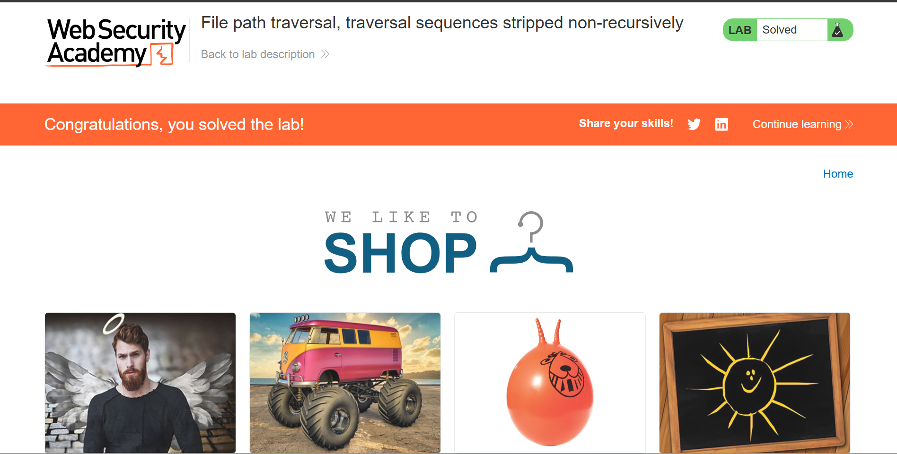
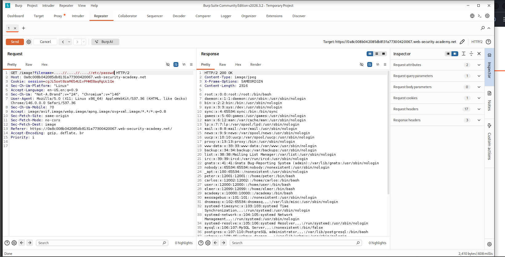

# 03 — File Path Traversal: Traversal Sequences Stripped Non-Recursively

> PortSwigger Web Security Academy lab demonstrating how non-recursive sanitization of path traversal sequences can be bypassed to achieve unauthorized file system read access.


---

## Table of Contents

- [Overview](#overview)
- [Scope & Objectives](#scope--objectives)
- [Methodology](#methodology)
- [Findings](#findings)
- [Risk Summary](#risk-summary)
- [Attack Chain](#attack-chain)
- [Tools & Environment](#tools--environment)
- [Evidence](#evidence)
- [Remediation](#remediation)
- [Lessons Learned](#lessons-learned)
- [References](#references)
- [Author](#author)

---

## Overview

Path traversal vulnerabilities allow attackers to read arbitrary files on a server's file system by manipulating file path inputs. A common but insufficient mitigation is stripping `../` sequences from user input before processing — if this stripping is performed only once (non-recursively), it can be bypassed using nested traversal sequences that reconstitute a valid `../` after the filter is applied.

This lab demonstrates the real-world weakness of non-recursive input sanitization in the context of a web application that serves product images via a user-controlled `filename` parameter.

> **Key Outcome:** Successfully bypassed a non-recursive path traversal filter using nested sequences (`....//`) to read `/etc/passwd` from the server, confirming unauthenticated arbitrary file read via the product image endpoint.

---

## Scope & Objectives

### Objectives

- Identify the path traversal vulnerability in the application's image-serving endpoint
- Determine the exact sanitization mechanism in use (non-recursive stripping)
- Craft a bypass payload that survives a single-pass filter and resolves to a valid directory traversal
- Retrieve the contents of `/etc/passwd` to confirm exploitation

### In Scope

| Target | Description | Type |
|--------|-------------|------|
| PortSwigger Web Security Academy Lab | Isolated browser-based lab environment | Web Application |
| `/image?filename=` endpoint | Product image serving parameter | HTTP Parameter |

### Out of Scope

- Any real-world systems or infrastructure
- Authentication bypass or session-based attacks
- Any components beyond the `filename` parameter and image endpoint

### Engagement Type

> **Type:** White-box (lab environment with known vulnerability category)
> **Authorization:** Authorized — PortSwigger Web Security Academy sandboxed lab
> **Duration:** Single session

---

## Methodology

The testing approach followed the **OWASP Testing Guide (OTG-AUTHZ-001)** for path traversal and file include testing, combined with manual parameter manipulation via Burp Suite Repeater.

### Phase 1 — Reconnaissance

Browsed the application, identified that product images are loaded via a `GET /image?filename=` request with a filename value referencing image files (e.g., `filename=product1.jpg`).

### Phase 2 — Baseline Traversal Attempt

Sent a standard path traversal payload to probe the filter behavior:

```
GET /image?filename=../../../etc/passwd
```

This was blocked or sanitized by the application, returning no file content — confirming a filter is active.

### Phase 3 — Filter Analysis

Based on the lab description, the application strips `../` sequences from the input **once, non-recursively**. This means the string `....//` after a single-pass strip of `../` resolves as follows:

```
....//  →  strip inner ../  →  ../
```

The outer `.` characters and trailing `/` reconstitute a valid traversal sequence after the filter pass.

### Phase 4 — Bypass Payload Construction

Constructed a nested traversal payload across three directory levels to reach the filesystem root:

```
....//....//....//etc/passwd
```

After single-pass stripping of `../`, this resolves to:

```
../../../etc/passwd
```

### Phase 5 — Exploitation

Sent the crafted payload via Burp Suite Repeater and confirmed the response body contained the contents of `/etc/passwd`.

---

## Findings

### FIND-01 — Path Traversal via Non-Recursive Sequence Stripping [HIGH]

| Field | Detail |
|-------|--------|
| **ID** | FIND-01 |
| **Severity** | [HIGH] |
| **CVSS v3.1 Score** | 7.5 |
| **CVSS Vector** | `CVSS:3.1/AV:N/AC:L/PR:N/UI:N/S:U/C:H/I:N/A:N` |
| **CWE** | CWE-22: Improper Limitation of a Pathname to a Restricted Directory ('Path Traversal') |
| **OWASP Category** | A01:2021 — Broken Access Control |
| **MITRE ATT&CK TTP** | T1083 — File and Directory Discovery |
| **Affected Component** | `GET /image?filename=` |

#### Description

The application's product image endpoint accepts a user-controlled `filename` parameter. A sanitization routine strips `../` sequences from the input, but does so only once and non-recursively. Submitting a nested traversal sequence (`....//`) causes the filter to remove the inner `../` and leave behind a reconstructed `../`, enabling directory traversal to arbitrary filesystem locations accessible by the web server process.

#### Technical Impact

An unauthenticated attacker can read any file accessible to the web server process on the host file system, including sensitive configuration files, credentials, private keys, application source code, and system-level files such as `/etc/passwd` and `/etc/shadow` (if permissions allow).

#### Business Impact

Exposure of server credentials, API keys, database passwords, or TLS private keys stored on the file system could lead to full system compromise, data breach, or lateral movement into connected infrastructure. No authentication is required to trigger this vulnerability.

#### Proof of Concept

**Request:**

```http
GET /image?filename=....//....//....//etc/passwd HTTP/2
Host: <lab-id>.web-security-academy.net
```

**Payload breakdown:**

```
Input:   ....//....//....//etc/passwd
Filter:  strips ../ once per occurrence
Result:  ../../../etc/passwd
```

**Response:** HTTP 200 with full contents of `/etc/passwd` in the response body.

#### Reproduction Steps

1. Open Burp Suite and configure the browser to proxy traffic through it.
2. Load the lab application and navigate to any product page.
3. Intercept a `GET /image?filename=<product_image>` request in Burp Suite.
4. Send the request to Repeater.
5. Replace the `filename` value with: `....//....//....//etc/passwd`
6. Send the request.
7. Observe the `/etc/passwd` contents in the response body.

---

## Risk Summary

| ID | Finding | Severity | CVSS | Status |
|----|---------|----------|------|--------|
| FIND-01 | Path Traversal via Non-Recursive Sequence Stripping | [HIGH] | 7.5 | Confirmed |

---

## Attack Chain

```
[Attacker]
    |
    | HTTP GET /image?filename=....//....//....//etc/passwd
    v
[Web Application — Image Endpoint]
    |
    | Non-recursive filter strips inner ../
    | Reconstituted payload: ../../../etc/passwd
    v
[File System Read]
    |
    | Resolved path: /etc/passwd
    v
[Response: /etc/passwd contents returned to attacker]
```

**MITRE ATT&CK Mapping:**

| Stage | Technique | ID |
|-------|-----------|-----|
| Discovery | File and Directory Discovery | T1083 |
| Collection | Data from Local System | T1005 |

---

## Tools & Environment

| Tool | Version | Purpose |
|------|---------|---------|
| Burp Suite Community Edition | v2026.3.2 | HTTP interception, request modification, and replay |
| Chromium Browser | v146 | Lab access and proxy configuration |
| PortSwigger Web Security Academy | — | Sandboxed lab environment |

---

## Evidence

### Lab Solved Confirmation


*Caption: Lab status confirmed as "Solved" by the PortSwigger platform after successful retrieval of `/etc/passwd`.*

### Exploitation — Burp Suite Repeater


*Caption: Burp Suite Repeater request with `filename=....//....//....//etc/passwd`. Response body (HTTP 200) returns the full contents of `/etc/passwd`, confirming unauthenticated arbitrary file read.*

---

## Remediation

### FIND-01 — Recommended Fix

**Priority:** [SHORT-TERM]

#### Primary Fix — Validate Against an Allowlist of Permitted Files

Replace free-form filename input with a reference to an internal file store. Map user-controlled identifiers (e.g., integer product IDs) to filenames server-side, never constructing file paths directly from user input.

```python
# Example: secure server-side file resolution
PRODUCT_IMAGES = {
    1: "angel-wings.jpg",
    2: "monster-truck.jpg",
}

def get_product_image(product_id):
    filename = PRODUCT_IMAGES.get(product_id)
    if not filename:
        abort(404)
    return send_from_directory(IMAGES_DIR, filename)
```

#### Secondary Fix — Canonicalize and Validate the Resolved Path

If dynamic filenames are necessary, canonicalize the resolved path and verify it falls within the intended base directory before serving:

```python
import os

BASE_DIR = "/var/www/app/images/"

def safe_serve_image(filename):
    safe_path = os.path.realpath(os.path.join(BASE_DIR, filename))
    if not safe_path.startswith(os.path.realpath(BASE_DIR)):
        abort(403)
    return send_file(safe_path)
```

#### What Not to Do

- Do not rely on stripping or blocking traversal sequences as a security control — this approach is fragile and bypass-prone regardless of recursion depth if not canonicalized first.
- Do not blocklist specific characters (`..`, `/`, `\`) — encoding variants and nested sequences will bypass character-based filters.

#### Retest Criteria

The fix is confirmed effective when:
1. `GET /image?filename=....//....//....//etc/passwd` returns HTTP 400 or 403 with no file content.
2. `GET /image?filename=../../../etc/passwd` returns HTTP 400 or 403 with no file content.
3. `GET /image?filename=%2e%2e%2f%2e%2e%2f%2e%2e%2fetc%2fpasswd` returns HTTP 400 or 403 with no file content.
4. Legitimate product image requests continue to resolve correctly.

---

## Lessons Learned

**Non-recursive sanitization is not a security control.** String-replacement filters that process input once are reliably bypassed by nesting the disallowed sequence inside itself. The filter removes one layer; the attacker designs input that regenerates the sequence after that removal. This technique applies to any single-pass filter regardless of the pattern being stripped.

**Path canonicalization must precede access control decisions.** The correct approach is to resolve the full filesystem path using `os.path.realpath()` (or equivalent) and then validate the result against the permitted base directory — never to sanitize the raw input string.

**The attack surface for file path parameters is wide.** Any parameter that influences a file system read operation — regardless of intended use — should be treated as a high-risk input requiring strict validation. Image serving, log retrieval, template loading, and configuration parsing are all common vectors.

**Skills demonstrated:** Path traversal exploitation, filter bypass analysis, HTTP request manipulation with Burp Suite Repeater, CVSS v3.1 scoring, CWE/OWASP mapping.

---

## References

- [PortSwigger Web Security Academy — Path Traversal](https://portswigger.net/web-security/file-path-traversal)
- [CWE-22: Improper Limitation of a Pathname to a Restricted Directory](https://cwe.mitre.org/data/definitions/22.html)
- [OWASP Testing Guide — OTG-AUTHZ-001: Testing Directory Traversal File Include](https://owasp.org/www-project-web-security-testing-guide/)
- [MITRE ATT&CK T1083 — File and Directory Discovery](https://attack.mitre.org/techniques/T1083/)
- [MITRE ATT&CK T1005 — Data from Local System](https://attack.mitre.org/techniques/T1005/)
- [NIST NVD CVSS v3.1 Calculator](https://nvd.nist.gov/vuln-metrics/cvss/v3-calculator)

---

## Author

**Michael Asante Anim** | `0x1aerixis`
BSc Cyber Security — University of Mines and Technology (UMaT), Tarkwa, Ghana

[](https://github.com/anim-michael-asante)
[](https://linkedin.com/in/michael-asante-anim)
[](https://tryhackme.com/p/0x1aerixis)
[](https://x.com/0x1aerixis)
[](https://discord.com/users/0x1aerixis)

> *"Built in the lab. Documented for the field."*

---

> **Disclaimer:** All work documented in this repository was conducted in authorized, isolated
> lab environments or sanctioned CTF platforms. No unauthorized systems were accessed.
> This project is intended for educational and portfolio purposes only.
