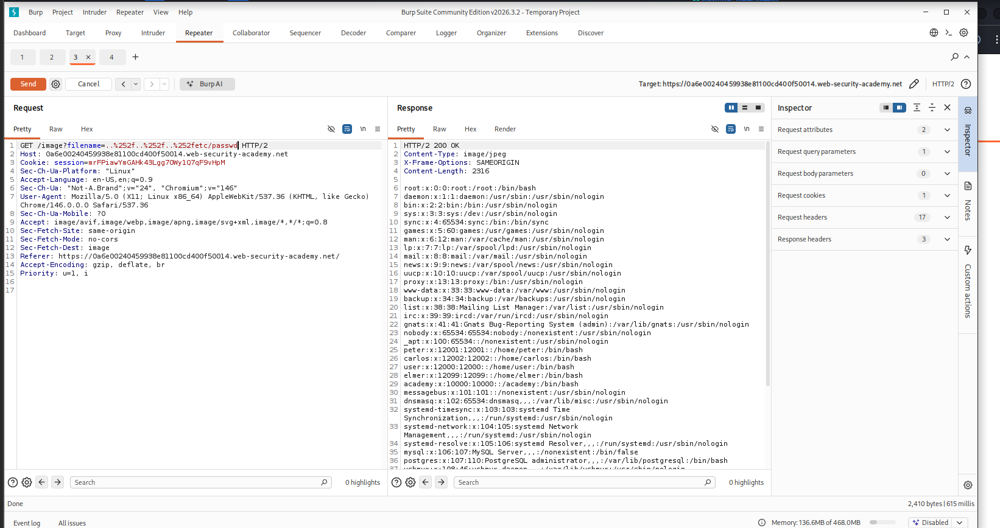

# 04 — File Path Traversal: Traversal Sequences Stripped with Superfluous URL-Decode

> Path traversal vulnerability exploited by double-URL-encoding traversal sequences to bypass server-side input stripping and retrieve `/etc/passwd` from the target web server.


---

## Table of Contents

- [Overview](#overview)
- [Scope & Objectives](#scope--objectives)
- [Methodology](#methodology)
- [Findings](#findings)
- [Risk Summary](#risk-summary)
- [Attack Chain](#attack-chain)
- [Tools & Environment](#tools--environment)
- [Evidence](#evidence)
- [Remediation](#remediation)
- [Lessons Learned](#lessons-learned)
- [References](#references)
- [Author](#author)

---

## Overview

Path traversal vulnerabilities allow attackers to read arbitrary files from the server filesystem by manipulating file path parameters in HTTP requests. When applications attempt to sanitize traversal sequences (`../`) without accounting for encoding variations, attackers can bypass those controls using double-URL-encoded payloads.

This lab demonstrates a real-world bypass scenario: the server strips `../` sequences from user input before using the value in a filesystem operation, but performs URL-decoding after stripping. By submitting a double-encoded payload (`..%252f` instead of `../`), the traversal sequence survives the stripping step and resolves to the intended path after server-side decoding.

The lab was solved by retrieving the contents of `/etc/passwd` from the target server using Burp Suite Repeater.

> **Key Outcome:** Successfully retrieved `/etc/passwd` from a live lab environment by bypassing a traversal-sequence stripping filter using double URL-encoding (`%252f` → `%2f` → `/`).

---

## Scope & Objectives

### Objectives

- Identify the vulnerable `filename` parameter in the product image endpoint.
- Construct a double-URL-encoded path traversal payload that survives the application's stripping filter.
- Retrieve the contents of `/etc/passwd` from the server to confirm exploitation.

### In Scope

| Target | Description | Type |
|--------|-------------|------|
| PortSwigger Web Security Academy lab instance | Intentionally vulnerable e-commerce web application | Web Application |
| `/image?filename=` endpoint | File retrieval parameter subject to path traversal | HTTP Parameter |

### Out of Scope

- Any system outside the assigned PortSwigger lab instance.
- Authentication bypass, privilege escalation, or any attack vector beyond path traversal.
- Automated scanning or fuzzing beyond manual payload crafting.

### Engagement Type

> **Type:** White-box (lab environment with defined vulnerability and solution path)
> **Authorization:** PortSwigger Web Security Academy — authorized training platform
> **Duration:** Single session

---

## Methodology

This lab was approached following the OWASP Testing Guide (OTG-AUTHZ-001 — Path Traversal) and PTES Phase 4 (Vulnerability Analysis).

**Phase 1 — Reconnaissance**
Browsed the target application to identify all parameters that reference server-side file paths. The `/image?filename=` endpoint was identified as the primary attack surface, as it directly accepts a filename value and returns image content from the server filesystem.

**Phase 2 — Interception**
Used Burp Suite Proxy to intercept the image load request triggered by loading a product page. The raw `GET /image?filename=<product_image>` request was forwarded to Burp Suite Repeater for controlled manipulation.

**Phase 3 — Payload Construction**
Standard traversal sequences (`../../../etc/passwd`) were blocked by the server's input stripping filter. The bypass was constructed by double-URL-encoding the forward slash component of the traversal sequence:

- Standard traversal: `../../../etc/passwd`
- URL-encoded slash: `%2f` → stripped by the filter
- Double-encoded slash: `%252f` → passes the filter as literal `%2f`, then decoded by the server to `/`

Final payload:
```
..%252f..%252f..%252fetc/passwd
```

**Phase 4 — Exploitation**
The crafted payload was submitted via Burp Suite Repeater. The server decoded `%252f` to `%2f`, then decoded `%2f` to `/`, resolving the full path `../../../etc/passwd` and returning the file contents in the HTTP response body.

---

## Findings

### Finding PT-001 — Path Traversal via Double URL-Encoded Traversal Sequences

| Field | Detail |
|-------|--------|
| **ID** | PT-001 |
| **Severity** | [HIGH] |
| **CVSS v3.1 Score** | 7.5 |
| **CVSS v3.1 Vector** | `CVSS:3.1/AV:N/AC:L/PR:N/UI:N/S:U/C:H/I:N/A:N` |
| **CWE** | CWE-22 — Improper Limitation of a Pathname to a Restricted Directory |
| **OWASP Top 10 (2021)** | A01:2021 — Broken Access Control |
| **MITRE ATT&CK** | T1083 — File and Directory Discovery |
| **Affected Component** | `GET /image?filename=` parameter |

#### Description

The application's image retrieval endpoint accepts a `filename` parameter and uses it to construct a filesystem path for reading and returning a file. An input stripping filter removes traversal sequences (`../`) before the path is used. However, because the application performs URL-decoding after stripping, double-encoded traversal sequences (`..%252f`) pass through the filter intact and resolve to functional traversal sequences (`../`) after server-side decoding. This permits an unauthenticated attacker to read arbitrary files from the server filesystem.

#### Technical Impact

An attacker with network access to the application can read any file accessible to the web server process. Confirmed file retrieval includes `/etc/passwd`, which exposes system usernames, user IDs, home directories, and shell assignments. Depending on server permissions, this technique may also permit retrieval of application source code, configuration files, private keys, and credentials stored in plaintext.

#### Business Impact

Unauthorized access to system-level files constitutes a breach of confidentiality. For a production system, this could result in credential theft enabling lateral movement, exposure of application secrets leading to further compromise, and regulatory non-compliance under data protection frameworks.

#### Proof of Concept

**Request:**

```http
GET /image?filename=..%252f..%252f..%252fetc/passwd HTTP/2
Host: <lab-id>.web-security-academy.net
```

**Response (HTTP 200 OK):**

```
root:x:0:0:root:/root:/bin/bash
daemon:x:1:1:daemon:/usr/sbin:/usr/sbin/nologin
bin:x:2:2:bin:/bin:/usr/sbin/nologin
...
peter:x:12001:12001::/home/peter:/bin/bash
carlos:x:12002:12002::/home/carlos:/bin/bash
user:x:12000:12000::/home/user:/bin/bash
```

#### Reproduction Steps

1. Load any product page on the target application.
2. Intercept the image load request in Burp Suite Proxy.
3. Forward the request (`GET /image?filename=<product>.jpg`) to Burp Suite Repeater.
4. Replace the `filename` value with `..%252f..%252f..%252fetc/passwd`.
5. Send the request and observe the HTTP 200 response containing `/etc/passwd` file contents.

#### Retest Criteria

The finding is remediated when:
- The endpoint returns HTTP 400 or 403 for the payload `..%252f..%252f..%252fetc/passwd`.
- No filesystem content outside the designated image directory is returned for any encoded traversal variant.
- A WAF or validation layer rejects the request before it reaches application logic.

---

## Risk Summary

| ID | Title | Severity | CVSS | OWASP | Status |
|----|-------|----------|------|-------|--------|
| PT-001 | Path Traversal via Double URL-Encoded Sequences | [HIGH] | 7.5 | A01:2021 | Confirmed |

---

## Attack Chain

```
[1] Identify endpoint
    GET /image?filename=<product>.jpg
         |
         v
[2] Intercept request in Burp Suite Proxy
         |
         v
[3] Craft double-URL-encoded payload
    ..%252f..%252f..%252fetc/passwd
    (%252f → decoded once → %2f → decoded again → /)
         |
         v
[4] Submit via Burp Suite Repeater
         |
         v
[5] Server strips ../  (but %252f passes — not recognized as ../)
         |
         v
[6] Server URL-decodes %252f → %2f → /
    Resolved path: ../../../etc/passwd
         |
         v
[7] HTTP 200 response returns /etc/passwd contents
```

---

## Tools & Environment

| Tool | Version | Purpose |
|------|---------|---------|
| Burp Suite Community Edition | 2026.3.2 | HTTP interception, request manipulation, Repeater |
| Brave Browser | Current | Proxy-configured lab browser |
| Kali Linux | Rolling | Attack platform (VMware) |
| PortSwigger Web Security Academy | — | Authorized lab environment |

---

## Evidence

### Screenshot 1 — Burp Suite Repeater: Exploit Request and /etc/passwd Response



*Caption: Burp Suite Repeater with the payload `..%252f..%252f..%252fetc/passwd` submitted in the `filename` parameter. The response body (HTTP 200, Content-Type: image/jpeg) contains the full `/etc/passwd` file, confirming successful path traversal bypass.*

---

### Screenshot 2 — Lab Solved Confirmation


*Caption: PortSwigger Web Security Academy confirmation banner indicating successful completion of the lab.*

---

## Remediation

### PT-001 — Path Traversal via Double URL-Encoded Traversal Sequences

**Priority:** [SHORT-TERM]

**Root Cause:**
Input validation is applied before URL-decoding. Stripping `../` from raw input does not account for encoded representations of the same characters. Any subsequent decoding step restores the stripped sequences.

**Recommended Fix:**

1. **Decode before validating.** Apply all URL-decoding to user input before running sanitization or stripping logic. Validate the fully-decoded value, not the raw encoded string.

   ```python
   import urllib.parse
   import os

   def get_image(filename):
       # Decode all encoding layers before validation
       decoded = urllib.parse.unquote(urllib.parse.unquote(filename))

       # Resolve the absolute path
       base_dir = "/var/www/images"
       resolved = os.path.realpath(os.path.join(base_dir, decoded))

       # Enforce path confinement
       if not resolved.startswith(base_dir + os.sep):
           raise ValueError("Path traversal attempt detected")

       return open(resolved, "rb").read()
   ```

2. **Use canonical path resolution.** After decoding, resolve the full canonical path using `os.path.realpath()` (Python) or equivalent. Verify the resolved path starts with the intended base directory before reading.

3. **Do not rely on stripping alone.** Blocklist-based stripping of traversal patterns is inherently bypassable through encoding variations, nested sequences (`....//`), and OS-specific path separators. Canonical path validation is the only reliable control.

4. **Apply principle of least privilege.** Ensure the web server process runs with the minimum filesystem permissions necessary. The process should not have read access to `/etc/passwd` or any file outside the web root.

**Retest Criteria:**
- `..%252f..%252f..%252fetc/passwd` returns HTTP 400 or 403.
- `../../../etc/passwd` (raw) returns HTTP 400 or 403.
- `....//....//....//etc/passwd` returns HTTP 400 or 403.
- Only files within the designated image directory are accessible via the `filename` parameter.

---

## Lessons Learned

**Technical Takeaway — Decode First, Validate Second**
Sanitization applied to encoded input is unreliable. Any validation or stripping logic must operate on the fully-decoded value. The correct order is: receive input → fully decode → validate → use. Skipping or reversing this order creates encoding bypass opportunities.

**Technique — Double URL-Encoding**
`%252f` is the double-encoded form of `/`. The first `%25` decodes to `%`, yielding `%2f`, which then decodes to `/`. This encoding chain is well-known and should be accounted for in any input handling pipeline that performs URL-decoding.

**Skill Tags:** `path-traversal` · `encoding-bypass` · `burp-suite-repeater` · `input-validation` · `CWE-22` · `OWASP-A01`

**BSCP Relevance:** Path traversal with encoding bypass is a documented technique category in the PortSwigger Web Security Academy learning path and is directly relevant to BSCP exam preparation.

---

## References

- [PortSwigger Web Security Academy — File Path Traversal](https://portswigger.net/web-security/file-path-traversal)
- [CWE-22: Improper Limitation of a Pathname to a Restricted Directory](https://cwe.mitre.org/data/definitions/22.html)
- [OWASP Testing Guide — OTG-AUTHZ-001: Testing Directory Traversal](https://owasp.org/www-project-web-security-testing-guide/)
- [OWASP Top 10 2021 — A01: Broken Access Control](https://owasp.org/Top10/A01_2021-Broken_Access_Control/)
- [MITRE ATT&CK — T1083: File and Directory Discovery](https://attack.mitre.org/techniques/T1083/)
- [NIST SP 800-115 — Technical Guide to Information Security Testing and Assessment](https://csrc.nist.gov/publications/detail/sp/800-115/final)
- [CVSS v3.1 Calculator — NVD/NIST](https://nvd.nist.gov/vuln-metrics/cvss/v3-calculator)

---

## Author

**Michael Asante Anim** | `0x1aerixis`
BSc Cyber Security — University of Mines and Technology (UMaT), Tarkwa, Ghana

[](https://github.com/anim-michael-asante)
[](https://linkedin.com/in/michael-asante-anim)
[](https://tryhackme.com/p/0x1aerixis)
[](https://x.com/0x1aerixis)
[](https://discord.com/users/0x1aerixis)

> *"Built in the lab. Documented for the field."*

---

> **Disclaimer:** All work documented in this repository was conducted in authorized, isolated lab environments or sanctioned CTF platforms. No unauthorized systems were accessed. This project is intended for educational and portfolio purposes only.
