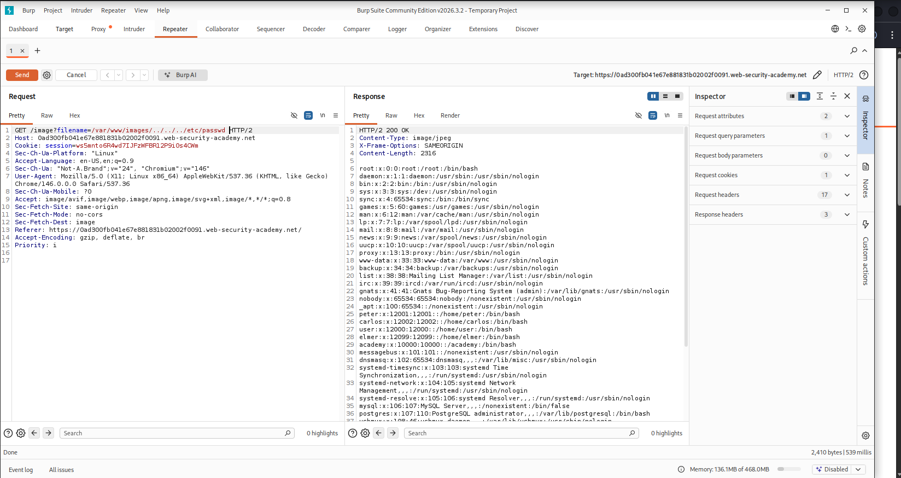

# 05 — File Path Traversal: Validation of Start of Path
 
> Path traversal vulnerability exploited by prefixing the expected base directory to a traversal payload, bypassing a start-of-path validation check to retrieve `/etc/passwd` from the target web server.
 


 
---
 
## Table of Contents
 
- [Overview](#overview)
- [Scope & Objectives](#scope--objectives)
- [Methodology](#methodology)
- [Findings](#findings)
- [Risk Summary](#risk-summary)
- [Attack Chain](#attack-chain)
- [Tools & Environment](#tools--environment)
- [Evidence](#evidence)
- [Remediation](#remediation)
- [Lessons Learned](#lessons-learned)
- [References](#references)
- [Author](#author)
---
 
## Overview
 
Path traversal vulnerabilities allow attackers to read arbitrary files from the server filesystem by manipulating file path parameters in HTTP requests. When applications validate only that a supplied path begins with an expected prefix — without resolving the canonical path first — attackers can satisfy the prefix check while appending traversal sequences that escape the intended directory.
 
This lab demonstrates a bypass against start-of-path validation: the application transmits the full file path in the `filename` parameter and checks that the value begins with `/var/www/images`. By constructing a payload that starts with the expected prefix but appends `../../../etc/passwd`, the validation passes while the resolved filesystem path points outside the intended directory.
 
The lab was solved by retrieving the contents of `/etc/passwd` from the target server using Burp Suite Repeater.
 
> **Key Outcome:** Successfully retrieved `/etc/passwd` by satisfying a start-of-path validation check with the legitimate base path prefix while appending traversal sequences to escape the restricted directory.
 
---
 
## Scope & Objectives
 
### Objectives
 
- Identify the `filename` parameter that transmits a full filesystem path in the product image endpoint.
- Construct a payload that satisfies the application's start-of-path validation while traversing outside the intended directory.
- Retrieve the contents of `/etc/passwd` from the server to confirm exploitation.
### In Scope
 
| Target | Description | Type |
|--------|-------------|------|
| PortSwigger Web Security Academy lab instance | Intentionally vulnerable e-commerce web application | Web Application |
| `/image?filename=` endpoint | Full-path file retrieval parameter subject to path traversal | HTTP Parameter |
 
### Out of Scope
 
- Any system outside the assigned PortSwigger lab instance.
- Authentication bypass, privilege escalation, or any attack vector beyond path traversal.
- Automated scanning or fuzzing beyond manual payload crafting.
### Engagement Type
 
> **Type:** White-box (lab environment with defined vulnerability and solution path)
> **Authorization:** PortSwigger Web Security Academy — authorized training platform
> **Duration:** Single session
 
---
 
## Methodology
 
This lab was approached following the OWASP Testing Guide (OTG-AUTHZ-001 — Path Traversal) and PTES Phase 4 (Vulnerability Analysis).
 
**Phase 1 — Reconnaissance**
Browsed the target application and observed that product image requests transmit the full server-side filesystem path in the `filename` parameter (e.g., `/var/www/images/product.jpg`), rather than a relative filename. This indicated the application validates paths using the full client-supplied value, making the validation logic testable.
 
**Phase 2 — Interception**
Used Burp Suite Proxy to intercept a product image load request. The raw `GET /image?filename=/var/www/images/<product>.jpg` request was forwarded to Burp Suite Repeater for controlled manipulation.
 
**Phase 3 — Payload Construction**
The application's validation checks that the `filename` value starts with `/var/www/images`. The bypass is constructed by retaining the expected prefix and appending traversal sequences after it:
 
- Passing value: `/var/www/images/product.jpg`
- Bypass payload: `/var/www/images/../../../etc/passwd`
The prefix `/var/www/images` satisfies the validation check. The subsequent `../../../` sequences traverse three directory levels up from `/var/www/images`, resolving to the filesystem root, then append `etc/passwd` to reach the target file.
 
**Phase 4 — Exploitation**
The crafted payload was submitted via Burp Suite Repeater. The server accepted the value (prefix check passed), resolved the full path to `/etc/passwd`, and returned the file contents in the HTTP response body.
 
---
 
## Findings
 
### Finding PT-001 — Path Traversal via Start-of-Path Validation Bypass
 
| Field | Detail |
|-------|--------|
| **ID** | PT-001 |
| **Severity** | [HIGH] |
| **CVSS v3.1 Score** | 7.5 |
| **CVSS v3.1 Vector** | `CVSS:3.1/AV:N/AC:L/PR:N/UI:N/S:U/C:H/I:N/A:N` |
| **CWE** | CWE-22 — Improper Limitation of a Pathname to a Restricted Directory |
| **OWASP Top 10 (2021)** | A01:2021 — Broken Access Control |
| **MITRE ATT&CK** | T1083 — File and Directory Discovery |
| **Affected Component** | `GET /image?filename=` parameter |
 
#### Description
 
The application's image retrieval endpoint accepts a full filesystem path in the `filename` parameter and validates that the value begins with `/var/www/images`. The validation does not resolve the canonical path before checking the prefix. An attacker can satisfy the prefix check by supplying the expected base directory, then appending `../` sequences to traverse outside the intended directory. The server resolves the traversal sequences after the validation check passes, granting read access to arbitrary files on the filesystem.
 
#### Technical Impact
 
An unauthenticated attacker with network access to the application can read any file readable by the web server process. Confirmed retrieval includes `/etc/passwd`, exposing system usernames, user IDs, home directory paths, and default shells. Depending on server permissions, additional targets may include application configuration files, private keys, environment files containing credentials, and application source code.
 
#### Business Impact
 
Unauthorized retrieval of server-side files constitutes a confidentiality breach. In a production environment, this class of vulnerability can facilitate credential theft enabling lateral movement, exposure of application secrets enabling escalation to code execution, and potential regulatory exposure under data protection requirements.
 
#### Proof of Concept
 
**Request:**
 
```http
GET /image?filename=/var/www/images/../../../etc/passwd HTTP/2
Host: <lab-id>.web-security-academy.net
```
 
**Response (HTTP 200 OK):**
 
```
root:x:0:0:root:/root:/bin/bash
daemon:x:1:1:daemon:/usr/sbin:/usr/sbin/nologin
bin:x:2:2:bin:/bin:/usr/sbin/nologin
...
peter:x:12001:12001::/home/peter:/bin/bash
carlos:x:12002:12002::/home/carlos:/bin/bash
user:x:12000:12000::/home/user:/bin/bash
```
 
#### Reproduction Steps
 
1. Load any product page on the target application.
2. Intercept the image load request in Burp Suite Proxy.
3. Forward the request (`GET /image?filename=/var/www/images/<product>.jpg`) to Burp Suite Repeater.
4. Replace the `filename` value with `/var/www/images/../../../etc/passwd`.
5. Send the request and observe the HTTP 200 response containing `/etc/passwd` file contents.
#### Retest Criteria
 
The finding is remediated when:
- The endpoint returns HTTP 400 or 403 for the payload `/var/www/images/../../../etc/passwd`.
- The canonical resolved path is verified to fall within `/var/www/images` before the file is read.
- No file outside `/var/www/images` is accessible via the `filename` parameter under any path construction.
---
 
## Risk Summary
 
| ID | Title | Severity | CVSS | OWASP | Status |
|----|-------|----------|------|-------|--------|
| PT-001 | Path Traversal via Start-of-Path Validation Bypass | [HIGH] | 7.5 | A01:2021 | Confirmed |
 
---
 
## Attack Chain
 
```
[1] Identify endpoint transmitting full filesystem path
    GET /image?filename=/var/www/images/product.jpg
         |
         v
[2] Intercept request in Burp Suite Proxy
    Forward to Repeater for controlled modification
         |
         v
[3] Craft bypass payload
    /var/www/images/../../../etc/passwd
    ↑ prefix satisfies validation ↑   ↑ traversal appended after ↑
         |
         v
[4] Application checks: does value start with /var/www/images? → YES
    Validation passes
         |
         v
[5] Server resolves full path:
    /var/www/images/../../../etc/passwd
    → /var/www/../../etc/passwd
    → /etc/passwd
         |
         v
[6] HTTP 200 response returns /etc/passwd contents
```
 
---
 
## Tools & Environment
 
| Tool | Version | Purpose |
|------|---------|---------|
| Burp Suite Community Edition | 2026.3.2 | HTTP interception, request manipulation, Repeater |
| Brave Browser | Current | Proxy-configured lab browser |
| Kali Linux | Rolling | Attack platform (VMware) |
| PortSwigger Web Security Academy | — | Authorized lab environment |
 
---
 
## Evidence
 
### Screenshot 1 — Burp Suite Repeater: Exploit Request and /etc/passwd Response
 

 
*Caption: Burp Suite Repeater with the payload `/var/www/images/../../../etc/passwd` submitted in the `filename` parameter. The response body (HTTP 200) contains the full `/etc/passwd` file, confirming the start-of-path validation was bypassed.*
 
---
 
### Screenshot 2 — Lab Solved Confirmation
 

 
*Caption: PortSwigger Web Security Academy confirmation banner indicating successful completion of the lab.*
 
---
 
## Remediation
 
### PT-001 — Path Traversal via Start-of-Path Validation Bypass
 
**Priority:** [SHORT-TERM]
 
**Root Cause:**
The application validates the raw user-supplied string against an expected prefix before the path is resolved. Because the prefix check operates on the literal string value — not the canonical filesystem path — appending traversal sequences after the prefix bypasses the check entirely. The server then resolves the traversal sequences during the filesystem operation, after validation has already passed.
 
**Recommended Fix:**
 
1. **Resolve the canonical path before validating.** Use `os.path.realpath()` (Python), `Paths.get().toRealPath()` (Java), or `realpath()` (PHP/C) to resolve the absolute canonical path. Validate the resolved path against the expected base directory after resolution.
```python
import os
 
def get_image(filename):
    base_dir = "/var/www/images"
 
    # Combine base directory with user-supplied value, then resolve canonically
    resolved = os.path.realpath(os.path.join(base_dir, filename))
 
    # Validate the resolved path is confined to the base directory
    if not resolved.startswith(base_dir + os.sep):
        raise ValueError("Path traversal attempt detected")
 
    return open(resolved, "rb").read()
```
 
2. **Do not accept full filesystem paths from the client.** The application transmits the full server-side path to the client and reads it back unmodified. The client should supply only a filename or opaque identifier. The server constructs the full path internally.
```python
# Insecure — full path accepted from client
filename = request.args.get("filename")  # /var/www/images/../../../etc/passwd
 
# Secure — filename only; path constructed server-side
filename = os.path.basename(request.args.get("filename"))
full_path = os.path.join("/var/www/images", filename)
```
 
3. **Apply extension allowlisting.** If the endpoint serves only image files, validate the resolved filename extension against a permitted set (`.jpg`, `.jpeg`, `.png`, `.gif`, `.webp`) before reading.
4. **Apply principle of least privilege.** Ensure the web server process has read access only to directories required for operation. The process should not have read access to `/etc/passwd` or any path outside the web root.
**Retest Criteria:**
- `/var/www/images/../../../etc/passwd` returns HTTP 400 or 403.
- `../../../etc/passwd` (relative traversal) returns HTTP 400 or 403.
- Only files within `/var/www/images` with permitted extensions are served via the endpoint.
---
 
## Lessons Learned
 
**Technical Takeaway — Prefix Checks Do Not Enforce Directory Confinement**
Validating that a path string starts with an expected value is not equivalent to verifying that the resolved file resides within the expected directory. String-level prefix checks are bypassed by appending traversal sequences after the prefix. Canonical path resolution via `realpath()` is the only reliable control for directory confinement.
 
**Design Takeaway — Never Trust Client-Supplied Full Paths**
Transmitting server-side filesystem paths to the client and accepting them back is an insecure design pattern that exposes internal path structure and creates unnecessary attack surface. The client should supply the minimum necessary identifier, and the server should construct the full path internally.
 
**Progression Across Path Traversal Labs:**
 
| Lab | Bypass Primitive | Root Cause |
|-----|-----------------|------------|
| 03 — Absolute Path Bypass | Omit traversal entirely | No validation at all |
| 04 — Superfluous URL-Decode | Double-encode `../` sequences | Validate before decoding |
| 05 — Start-of-Path Validation (this lab) | Prefix the expected base dir | String check vs. canonical path |
 
**Skill Tags:** `path-traversal` · `prefix-bypass` · `canonical-path-resolution` · `burp-suite-repeater` · `input-validation` · `CWE-22` · `OWASP-A01`
 
**BSCP Relevance:** Start-of-path validation bypass is a documented path traversal variant in the PortSwigger Web Security Academy learning path and is directly testable in BSCP exam scenarios.
 
---
 
## References
 
- [PortSwigger Web Security Academy — File Path Traversal](https://portswigger.net/web-security/file-path-traversal)
- [CWE-22: Improper Limitation of a Pathname to a Restricted Directory](https://cwe.mitre.org/data/definitions/22.html)
- [OWASP Testing Guide — OTG-AUTHZ-001: Testing Directory Traversal](https://owasp.org/www-project-web-security-testing-guide/)
- [OWASP Top 10 2021 — A01: Broken Access Control](https://owasp.org/Top10/A01_2021-Broken_Access_Control/)
- [MITRE ATT&CK — T1083: File and Directory Discovery](https://attack.mitre.org/techniques/T1083/)
- [NIST SP 800-115 — Technical Guide to Information Security Testing and Assessment](https://csrc.nist.gov/publications/detail/sp/800-115/final)
- [CVSS v3.1 Calculator — NVD/NIST](https://nvd.nist.gov/vuln-metrics/cvss/v3-calculator)
---
 
## Author
 
**Michael Asante Anim** | `0x1aerixis`
BSc Cyber Security — University of Mines and Technology (UMaT), Tarkwa, Ghana
 
[](https://github.com/anim-michael-asante)
[](https://linkedin.com/in/michael-asante-anim)
[](https://tryhackme.com/p/0x1aerixis)
[](https://x.com/0x1aerixis)
[](https://discord.com/users/0x1aerixis)
 
> *"Built in the lab. Documented for the field."*
 
---
 
> **Disclaimer:** All work documented in this repository was conducted in authorized, isolated lab environments or sanctioned CTF platforms. No unauthorized systems were accessed. This project is intended for educational and portfolio purposes only.
 
