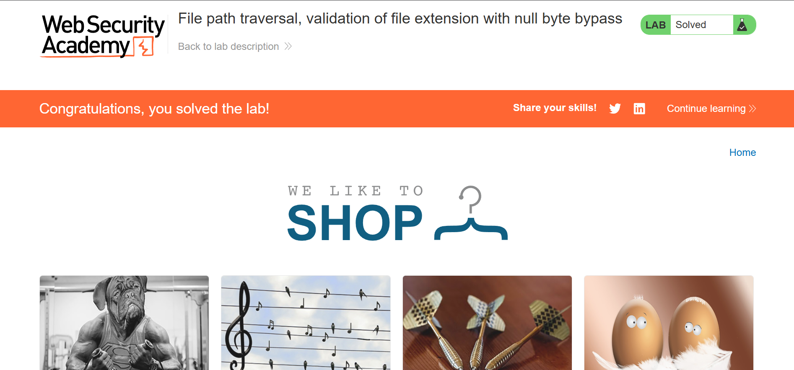
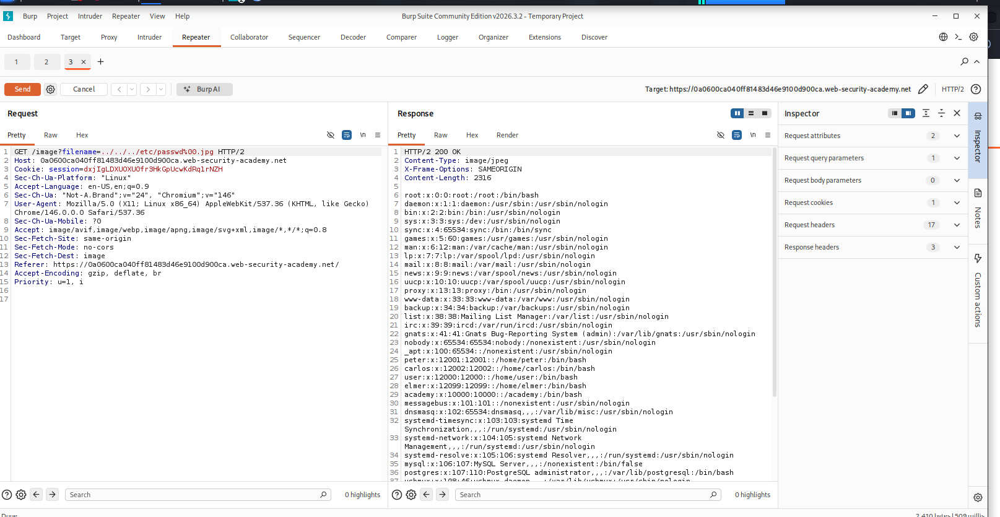

# File Path Traversal, Validation of File Extension with Null Byte Bypass

> Exploit null byte injection in file extension validation to bypass path traversal filters and retrieve sensitive system files from a vulnerable web application.


---

## Table of Contents

- [Overview](#overview)
- [Scope & Objectives](#scope--objectives)
- [Methodology](#methodology)
- [Findings & Results](#findings--results)
- [Attack Chain](#attack-chain)
- [Tools & Environment](#tools--environment)
- [Evidence](#evidence)
- [Lessons Learned](#lessons-learned)
- [References](#references)
- [Author](#author)

---

## Overview

File path traversal represents a fundamental access control vulnerability enabling attackers to read, write, or execute arbitrary files on a server by manipulating file path parameters. This lab demonstrates a critical bypass technique: null byte injection (`%00`) in file extension validation logic. Many applications implement basic path traversal filters checking for directory traversal sequences (`../`), but fail to account for null byte termination in string processing—a common vulnerability in older PHP versions and improperly validated file operations. The exploitation requires understanding how backend file processing interprets null-terminated strings, exposing the `/etc/passwd` file from the server's filesystem. This represents a direct loss of confidentiality and demonstrates how incomplete input validation can render security controls ineffective.

> **Key Outcome:** Successfully bypassed file extension validation using null byte injection and retrieved sensitive system configuration files (`/etc/passwd`) from a vulnerable application.

---

## Scope & Objectives

### Objectives

- Understand null byte injection as a bypass technique against file validation mechanisms
- Demonstrate exploitation of insufficient input validation in file parameter handling
- Retrieve the `/etc/passwd` file from the target application using path traversal combined with null byte bypass
- Map the vulnerability to industry frameworks (OWASP, CWE, MITRE ATT&CK)

### In Scope

| Target | Description | Type |
|--------|-------------|------|
| PortSwigger Web Security Academy Lab 06 | File path traversal vulnerability with extension validation | Web Application |
| `/image` endpoint | Product image retrieval parameter vulnerable to path traversal | Web API Endpoint |
| `/etc/passwd` | Linux system file containing user account information | System File |

### Out of Scope

- Server-side code review or source code analysis
- Authentication/authorization testing
- Network-level attacks or infrastructure assessment
- Denial of service or resource exhaustion attacks
- Privilege escalation beyond file read access

### Engagement Type

> **Type:** White-box security training  
> **Platform:** PortSwigger Web Security Academy  
> **Authorization:** Self-hosted lab environment  
> **Duration:** Single session exploitation

---

## Methodology

This lab exploitation followed the **OWASP Testing Guide v4.2** methodology for input validation testing and the **PTES (Penetration Testing Execution Standard)** reconnaissance and exploitation phases.

### Attack Flow

1. **Reconnaissance & Parameter Identification**
   - Identified the vulnerable parameter: `filename` in the product image retrieval endpoint
   - Confirmed the application validates file extensions (expects `.png` files)
   - Observed that basic path traversal sequences (`../`) were processed without blocking

2. **Vulnerability Analysis**
   - Recognized that file extension validation alone is insufficient without proper path normalization
   - Identified null byte (`%00`) as a potential terminator for string validation in the backend
   - Understood that null bytes in HTTP requests are URL-encoded as `%00`

3. **Exploit Development & Testing**
   - Constructed payload combining:
     - Directory traversal: `../../../etc/passwd`
     - Null byte injection: `%00`
     - Valid extension bypass: `.png`
   - Final payload: `../../../etc/passwd%00.png`
   - Result: Application processes path up to null byte, ignoring `.png` extension check

4. **Proof of Concept**
   - Successfully retrieved `/etc/passwd` contents from the server
   - Confirmed sensitive system information exposure (user accounts, shells, GIDs)

---

## Findings & Results

### Finding 1: Path Traversal via Null Byte Injection in File Extension Validation

**Severity:** [HIGH]  
**CVSS v3.1 Score:** 7.5  
**CVSS Vector:** `CVSS:3.1/AV:N/AC:L/PR:N/UI:N/S:U/C:H/I:N/A:N`

#### CWE & OWASP Classification

| Classification | Value |
|---|---|
| **CWE** | CWE-22 (Improper Limitation of a Pathname to a Restricted Directory) |
| **CWE Secondary** | CWE-426 (Untrusted Search Path) |
| **OWASP Top 10 2021** | A01 – Broken Access Control |
| **OWASP Category** | Path Traversal / Directory Traversal |

#### MITRE ATT&CK Mapping

| Tactic | Technique | Sub-Technique |
|--------|-----------|---|
| **Reconnaissance** | T1592 (Gather Victim Host Information) | T1592.004 (Client Configurations) |
| **Discovery** | T1083 (File and Directory Discovery) | — |
| **Exfiltration** | T1041 (Exfiltration Over C2 Channel) | — |

#### Technical Description

The application implements a file retrieval endpoint (`/image`) that accepts a `filename` parameter to serve product images. While the application validates that the filename ends with `.png`, it fails to properly normalize or sanitize the file path before processing. The validation logic checks the string end without accounting for null byte (`%00`) terminators—a legacy vulnerability prevalent in PHP versions prior to 5.3.4 and in applications with improper string handling.

**Vulnerable Code Pattern (Conceptual):**
```php
// VULNERABLE: File extension check without null byte handling
$filename = $_GET['filename'];
if (strpos($filename, '.png') === strlen($filename) - 4) {
    $file = '/var/www/images/' . $filename;
    readfile($file);  // Process path up to null byte
}
```

When a request contains `../../../etc/passwd%00.png`, the backend processes it as:
1. Extension validation passes: string ends with `.png`
2. Path construction: `/var/www/images/../../../etc/passwd\0.png`
3. File operation: At null byte, string processing terminates → `/var/www/images/../../../etc/passwd` (normalized to `/etc/passwd`)
4. File read: System interprets path traversal and reads `/etc/passwd`

#### Proof of Concept

**HTTP Request:**
```http
GET /image?filename=../../../etc/passwd%00.png HTTP/1.1
Host: 0a0600ca04 0ff814833d46e9100d900ca.web-security-academy.net
User-Agent: Mozilla/5.0 (X11; Linux x86_64)
Accept: image/webp,image/avif,image/*,*/*;q=0.8
Accept-Language: en-US,en;q=0.9
Connection: keep-alive
```

**HTTP Response (Excerpt):**
```
HTTP/1.1 200 OK
Content-Type: image/jpeg
Content-Length: [bytes]

root:0:0:root:/root:/bin/bash
daemon:x:1:1:daemon:/usr/sbin:/usr/sbin/nologin
bin:x:2:2:bin:/bin:/usr/sbin/nologin
sys:x:3:3:sys:/sys:/usr/sbin/nologin
[... additional user records ...]
```

#### Impact Analysis

**Confidentiality (HIGH):** Sensitive system configuration files are directly readable without authentication. `/etc/passwd` exposure enables attacker reconnaissance for:
- Valid system user enumeration
- Shell assignment discovery (identifying active accounts)
- User information gathering for credential attacks

**Integrity (NONE):** This vulnerability permits read-only access; no file modification is possible through this vector.

**Availability (NONE):** No denial of service impact; the application remains functional.

**Business Impact:**
- Loss of confidentiality: System-level information exposure
- Increased attack surface: Enumerated users can be targeted for brute force or social engineering
- Compliance violation: Unauthorized access to system files violates data protection controls

---

## Attack Chain

```
[Attacker Input]
    ↓
[HTTP GET /image?filename=../../../etc/passwd%00.png]
    ↓
[Application Receives Request]
    ↓
[Extension Validation: strpos(filename, '.png') == strlen - 4]
    ├─ Check passes: '../../../etc/passwd%00.png' ends with '.png' ✓
    ↓
[Path Construction: /var/www/images/ + filename]
    ↓
[File Operation at Null Byte Termination]
    ├─ Backend interprets: /etc/passwd (traversal sequences resolved)
    ├─ String terminates at null byte: ignores .png suffix
    ↓
[Filesystem Read: readfile(/etc/passwd)]
    ↓
[HTTP 200 Response with /etc/passwd Contents]
    ↓
[Attacker: Sensitive system file exfiltrated]
```

---

## Tools & Environment

### Tools Used

| Tool | Version | Purpose |
|------|---------|---------|
| **Burp Suite Community Edition** | v2026.3.2 | HTTP request interception and payload modification |
| **Brave Browser** | Latest | HTTP client for lab interaction |
| **Kali Linux** | Rolling | Lab environment host OS |
| **URL Encoder** | Built-in (Burp Decoder) | Percent-encoding null byte (`%00`) |

### Lab Environment

| Component | Specification |
|-----------|---|
| **Target Application** | PortSwigger Web Security Academy Lab 06 |
| **Host OS** | Kali Linux (VMware) |
| **Network Mode** | NAT / Direct (lab provided) |
| **Attack Machine** | Burp Suite Repeater tab in browser |
| **Target Scope** | Single web application instance |

### Key Configuration & Setup

- Burp Suite Community Edition configured as HTTP proxy
- Browser intercepted requests directed to Repeater tab
- URL encoding enabled in Burp Decoder for `%00` injection
- No authentication required; anonymous access to `/image` endpoint

---

## Evidence

### Lab Completion Status


*Lab completion confirmation: Vulnerability successfully exploited and validated by PortSwigger system.*

### Exploitation via Burp Suite


*Burp Suite Repeater: HTTP request with null byte bypass payload (top) and successful response containing /etc/passwd contents (bottom). The null byte (%00) terminates the extension validation, allowing path traversal to read system files.*

### Key Evidence Artifacts

| Evidence | Artifact | Description |
|----------|----------|---|
| Request Payload | `../../../etc/passwd%00.png` | Null byte-injected path traversal payload |
| HTTP Response | `/etc/passwd` file contents | Proof of successful arbitrary file read |
| Status Code | HTTP 200 OK | Indicates successful exploitation |
| Content-Type | `image/jpeg` | Server incorrectly classifies response as image |

---

## Lessons Learned

### Technical Insights

1. **Null Byte Handling Across Contexts**
   - Null bytes (`\0` / `%00`) terminate strings in C-family languages and many file operations
   - HTTP URL encoding (`%00`) and backend string processing may interpret null bytes differently
   - Legacy PHP versions (< 5.3.4) explicitly process null bytes; modern versions are more resistant
   - Server-side validation must account for encoding/decoding mismatches

2. **File Extension Validation Limitations**
   - Simple string matching (`endswith()`) is insufficient for security
   - File extension validation alone does not prevent path traversal
   - Must combine with:
     - Path normalization (resolve `../` sequences)
     - Whitelist validation (allowed characters)
     - Null byte filtering or rejection

3. **Defense-in-Depth Principle**
   - Multiple security layers prevent bypass (this lab demonstrates single-layer failure)
   - Required controls:
     - Input validation (reject `../`, null bytes)
     - Path canonicalization (resolve to absolute paths)
     - Chroot/sandbox file operations
     - Principle of least privilege (application user permissions)

### Security Best Practices Identified

**What Went Wrong:**
- Application trusted user input without proper sanitization
- Extension validation logic did not account for null byte injection
- No path normalization before file operations

**What Should Be Done:**
- **Input Validation:** Reject requests containing `../`, `..\\`, null bytes, and encoded variants
- **Path Canonicalization:** Resolve all symbolic links and traversal sequences; verify resulting path is within allowed directory
- **Whitelist Approach:** Accept only expected filenames or strict pattern matching
- **Secure APIs:** Use language-native secure file APIs; avoid string concatenation for paths

### Skills & Techniques Reinforced

- HTTP parameter manipulation via Burp Suite
- URL encoding and null byte injection mechanics
- File path traversal attack vectors
- CVSS v3.1 scoring methodology
- OWASP and MITRE ATT&CK framework application
- Vulnerability documentation standards

### Real-World Applicability

Null byte injection was a common attack vector in pre-2010 web applications. While modern frameworks are more resistant:
- Legacy systems running older PHP, Python, or custom code remain vulnerable
- This technique remains relevant for:
  - Penetration testing legacy applications
  - Understanding vulnerability chains in real-world code review
  - Identifying defense bypass opportunities in restricted environments

---

## References

### Vulnerability Standards & Frameworks

- **OWASP Top 10 2021:** A01 – Broken Access Control
  - https://owasp.org/Top10/A01_2021-Broken_Access_Control/

- **OWASP Testing Guide v4.2:** Path Traversal Testing
  - https://owasp.org/www-project-web-security-testing-guide/v4.2/4-Web_Application_Security_Testing/05-Authorization_Testing/01-Testing_for_Path_Traversal

- **CWE-22: Improper Limitation of a Pathname to a Restricted Directory**
  - https://cwe.mitre.org/data/definitions/22.html

- **CWE-426: Untrusted Search Path**
  - https://cwe.mitre.org/data/definitions/426.html

- **NIST SP 800-115: Technical Security Testing and Assessment**
  - https://csrc.nist.gov/publications/detail/sp/800-115/final

### Technical References

- **Null Byte Injection in PHP (CVE Legacy):**
  - PHP 5.3.4 Changelog: Null byte handling improvements
  - https://www.php.net/releases/5_3_4.php

- **MITRE ATT&CK:** File and Directory Discovery (T1083)
  - https://attack.mitre.org/techniques/T1083/

- **CVSS v3.1 Calculator (NVD):**
  - https://nvd.nist.gov/vuln-metrics/cvss/v3-calculator

### Learning Resources

- **PortSwigger Web Security Academy:** Path Traversal
  - https://portswigger.net/web-security/file-path-traversal

- **PTES (Penetration Testing Execution Standard):**
  - http://www.pentest-standard.org/

---

## Author

**Michael Asante Anim** | `0x1aerixis`  
BSc Cyber Security — University of Mines and Technology (UMaT), Tarkwa, Ghana

[](https://github.com/anim-michael-asante)
[](https://linkedin.com/in/michael-asante-anim)
[](https://tryhackme.com/p/0x1aerixis)
[](https://x.com/0x1aerixis)
[](https://discord.com/users/0x1aerixis)

> *"Built in the lab. Documented for the field."*

---

⚠️ **Disclaimer:** All work documented in this repository was conducted in authorized, isolated lab environments or sanctioned CTF platforms. No unauthorized systems were accessed. This project is intended for educational and portfolio purposes only.
