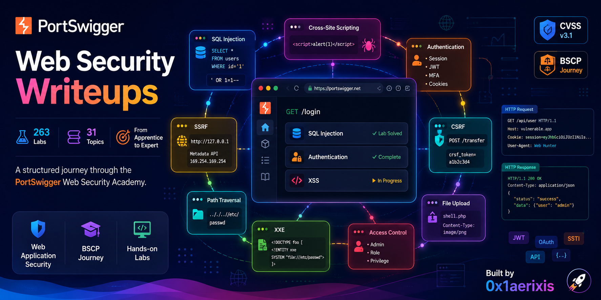

<div align="center">

<p align="center">
  
</p>

</br>

[](https://portswigger.net/web-security)
[](https://github.com/anim-michael-asante/portswigger-web-security-writeups)
[](https://portswigger.net/web-security/all-topics)
[](https://owasp.org/Top10/)
[](https://attack.mitre.org/)
[](LICENSE)
[](https://github.com/anim-michael-asante)

# PortSwigger Web Security Academy — Write-Ups

_Structured, evidence-driven write-ups for every lab across 31 web security topic areas._

[Browse Write-Ups](#server-side-topics) · [Track Progress](#progress-tracker) · [View Standards](#standards-and-frameworks)

</div>

---

## Table of Contents

- [Overview](#overview)
- [Why This Repository](#why-this-repository)
- [Progress Tracker](#progress-tracker)
- [Repository Structure](#repository-structure)
- [Server-Side Topics](#server-side-topics)
- [Client-Side Topics](#client-side-topics)
- [Advanced Topics](#advanced-topics)
- [Standards and Frameworks](#standards-and-frameworks)
- [Tools and Environment](#tools-and-environment)
- [Author](#author)

---

## Overview

This repository documents hands-on exploitation of real-world web vulnerability classes through the [PortSwigger Web Security Academy](https://portswigger.net/web-security) — 263 labs across 31 topic areas spanning server-side, client-side, and advanced attack techniques.

Each write-up follows an industry-standard penetration testing report format: scope, methodology, technical findings with CVSS v3.1 scoring, proof-of-concept, and remediation strategy. The repository is organised by vulnerability category, with each lab in its own subdirectory containing a `README.md` and an `evidence/` folder.

Coverage spans the full OWASP Top 10 (2021) and maps findings to MITRE ATT&CK, CWE, and NIST SP 800-115 throughout.

---

## Why This Repository

The PortSwigger Web Security Academy is the closest freely available proxy for real-world web application penetration testing. Labs are built on production-representative frameworks with genuine vulnerability chains — not toy examples.

This repository exists for three reasons:

**1. Portfolio evidence.**
Each write-up is structured as a deliverable a junior pentester would produce for a client — scope, methodology, findings, CVSS score, PoC, remediation. Recruiters and hiring managers can read any write-up and evaluate both technical depth and communication quality.

**2. BSCP preparation.**
The Burp Suite Certified Practitioner exam requires timed, unaided exploitation across the same 31 topic areas. This repository builds the muscle memory and structured thinking required to pass under exam conditions.

**3. Structured learning.**
Writing forces full understanding. A lab is not complete until the exploitation steps, root cause, CWE, and remediation can be explained in writing without referencing the solution.

---

## Progress Tracker

| #   | Category                                                                      | Difficulty Range          |  Total  |  Done  | Status                                                                   |
| --- | ----------------------------------------------------------------------------- | ------------------------- | :-----: | :----: | ------------------------------------------------------------------------ |
| 01  | [SQL Injection](#01-sql-injection--18-labs)                                   | Apprentice — Practitioner |   18    |   16   |   |
| 02  | [Authentication](#02-authentication--14-labs)                                 | Apprentice — Expert       |   14    |   2    |     |
| 03  | [Path Traversal](#03-path-traversal--6-labs)                                  | Apprentice — Practitioner |    6    |   6    |     |
| 04  | [OS Command Injection](#04-os-command-injection--5-labs)                      | Apprentice — Practitioner |    5    |   0    |       |
| 05  | [Business Logic Vulnerabilities](#05-business-logic-vulnerabilities--11-labs) | Apprentice — Expert       |   11    |   0    |      |
| 06  | [Information Disclosure](#06-information-disclosure--5-labs)                  | Apprentice — Practitioner |    5    |   0    |       |
| 07  | [Access Control Vulnerabilities](#07-access-control-vulnerabilities--13-labs) | Apprentice — Practitioner |   13    |   0    |      |
| 08  | [File Upload Vulnerabilities](#08-file-upload-vulnerabilities--7-labs)        | Apprentice — Expert       |    7    |   7    |     |
| 09  | [Race Conditions](#09-race-conditions--6-labs)                                | Apprentice — Expert       |    6    |   0    |       |
| 10  | [SSRF](#10-server-side-request-forgery-ssrf--7-labs)                          | Apprentice — Expert       |    7    |   0    |       |
| 11  | [XXE Injection](#11-xml-external-entity-xxe-injection--9-labs)                | Apprentice — Expert       |    9    |   0    |       |
| 12  | [NoSQL Injection](#12-nosql-injection--4-labs)                                | Apprentice — Practitioner |    4    |   0    |       |
| 13  | [API Testing](#13-api-testing--5-labs)                                        | Apprentice — Practitioner |    5    |   4    |     |
| 14  | [Web Cache Deception](#14-web-cache-deception--5-labs)                        | Apprentice — Expert       |    5    |   0    |       |
| 15  | [Cross-Site Scripting (XSS)](#15-cross-site-scripting-xss--30-labs)           | Apprentice — Expert       |   30    |   0    |      |
| 16  | [CSRF](#16-cross-site-request-forgery-csrf--12-labs)                          | Apprentice — Expert       |   12    |   0    |      |
| 17  | [CORS](#17-cross-origin-resource-sharing-cors--3-labs)                        | Apprentice — Practitioner |    3    |   0    |       |
| 18  | [Clickjacking](#18-clickjacking--5-labs)                                      | Apprentice — Practitioner |    5    |   0    |       |
| 19  | [DOM-Based Vulnerabilities](#19-dom-based-vulnerabilities--7-labs)            | Apprentice — Expert       |    7    |   0    |       |
| 20  | [WebSockets](#20-websockets--3-labs)                                          | Apprentice — Practitioner |    3    |   0    |       |
| 21  | [Insecure Deserialization](#21-insecure-deserialization--10-labs)             | Apprentice — Expert       |   10    |   0    |      |
| 22  | [Web LLM Attacks](#22-web-llm-attacks--7-labs)                                | Apprentice — Practitioner |    7    |   0    |       |
| 23  | [GraphQL API Vulnerabilities](#23-graphql-api-vulnerabilities--5-labs)        | Apprentice — Practitioner |    5    |   0    |       |
| 24  | [Server-Side Template Injection](#24-server-side-template-injection--7-labs)  | Practitioner — Expert     |    7    |   0    |       |
| 25  | [Web Cache Poisoning](#25-web-cache-poisoning--13-labs)                       | Practitioner — Expert     |   13    |   0    |      |
| 26  | [HTTP Host Header Attacks](#26-http-host-header-attacks--7-labs)              | Apprentice — Expert       |    7    |   0    |       |
| 27  | [HTTP Request Smuggling](#27-http-request-smuggling--22-labs)                 | Practitioner — Expert     |   22    |   0    |      |
| 28  | [OAuth Authentication](#28-oauth-authentication--6-labs)                      | Apprentice — Expert       |    6    |   0    |       |
| 29  | [JWT Attacks](#29-jwt-attacks--8-labs)                                        | Apprentice — Expert       |    8    |   0    |       |
| 30  | [Prototype Pollution](#30-prototype-pollution--10-labs)                       | Apprentice — Expert       |   10    |   0    |      |
| 31  | [Essential Skills](#31-essential-skills--2-labs)                              | Practitioner              |    2    |   0    |       |
|     | **TOTAL**                                                                     |                           | **263** | **35** |  |

> **Status key:** `[SOLVED]` — Write-up published &nbsp;·&nbsp; `[IN PROGRESS]` — Active &nbsp;·&nbsp; `[PENDING]` — Not started

---

## Repository Structure

```
portswigger-web-security-writeups/
├── README.md
├── .gitignore
│
├── 01-sql-injection/
│   ├── 01-where-clause-hidden-data/
│   │   ├── README.md
│   │   └── evidence/
│   │       └── lab-solved.png
│   ├── 02-sqli-login-bypass/
│   │   ├── README.md
│   │   └── evidence/
│   │       ├── lab-solved-administrator.jpeg
│   │       └── sqli-analysis-notes.jpeg
│   ├── 03-sqli-union-oracle-version-disclosure/
│   ├── 04-sqli-union-mysql-version-enum/
│   ├── 05-sqli-union-db-enumeration/
│   ├── 06-sqli-oracle-union-db-enumeration/
│   ├── 07-sqli-union-column-count-null-probing/
│   ├── 08-sqli-union-finding-a-column-containing-text/
│   ├── 09-sqli-union-data-extraction/
│   ├── 10-sqli-union-multiple-values-single-column/
│   └── 11-sqli-blind-boolean-conditional-response-trackingid-cookie/
│   └── 12-sqli-blind-conditional-errors/
│   └── 13-sqli-visible-error-based/
│   └── 14-sqli-blind-time-based-pg-sleep/
│   └── 15-sqli-blind-time-based-password-extraction/
│   └── 16-sqli-blind-oob-dns-interaction/
├── 02-authentication/
      01-lab-username-enumeration-via-different-responses/
│      ├── README.md
│      └── evidence/
│          └── bruteforce-password.png
│          └──  bruteforce-username.png
│          └── lab-solved.png
      02-lab-username-enumeration-subtly-different-responses/
│      ├── README.md
│      └── evidence/
│          └── password.png
│          └── username.png
│          └── lab-solved.png
├── 03-path-traversal/
|       01-lab-file-path-traversal-simple-case/
│        ├── README.md
│        └── evidence/
│        └── 01-burp-repeater-exploit.png
│        └── 02-lab-solved-confirmation.png
|       02-lab-file-path-traversal-traversal-sequences-blocked-with-absolute-path-bypass/
│        ├── README.md
│        └── evidence/
│        └── 01-burp-repeater-exploit.png
│        └── 02-lab-solved-confirmation.png
|       03-lab-traversal-sequences-stripped-non-recursively/
│        ├── README.md
│        └── evidence/
│        └── exploitation.png
│        └── lab-solved.png
|       04-lab-file-path-traversal-traversal-sequences-stripped-with-superfluous-url-decode/
│        ├── README.md
│        └── evidence/
│        └── 01-burp-repeater-exploit.png
│        └── 02-lab-solved-confirmation.png
|       05-lab-file-path-traversal-traversal-sequences-blocked-with-absolute-path-bypass/
│        ├── README.md
│        └── evidence/
│        └── 01-burp-repeater-exploit.png
│        └── 02-lab-solved-confirmation.png
|       06-lab-file-path-traversal-validation-of-file-extension-with-null-byte-bypass/
│        ├── README.md
│        └── evidence/
│        └── 01-burp-repeater-exploit.png
│        └── 02-lab-solved-confirmation.png
├── 04-os-command-injection/
├── 05-business-logic/
├── 06-information-disclosure/
├── 07-access-control/
├── 08-file-upload-vulnerabilities/
|       01-file-upload-rce-web-shell/
│        ├── README.md
│        ├── exploit.php
│        └── evidence/
│        └── flag.png
│        └── lab-solved.png
|        02-file-upload-content-type-bypass/
│        ├── README.md
│        ├── exploit.php
│        └── evidence/
│        └── flag.png
│        └── lab-solved.png
|        03-file-upload-path-traversal-bypass/
│        ├── README.md
│        ├── exploit.php
│        └── evidence/
│        └── flag.png
│        └── lab-solved.png
|        04-lab-web-shell-upload-via-extension-blacklist-bypass/
│        ├── README.md
│        ├── exploit.php
│        └── evidence/
│        └── flag.png
│        └── lab-solved.png
|        05-lab-web-shell-upload-via-obfuscated-file-extension/
│        ├── README.md
│        ├── exploit.php
│        └── evidence/
│        └── flag.png
│        └── lab-solved.png
|        06-lab-remote-code-execution-via-polyglot-web-shell-upload/
│        ├── README.md
│        ├── exploit.php
│        └── evidence/
│        └── flag.png
│        └── lab-solved.png
|          07-web-shell-upload-race-condition/
│        ├── README.md
│        ├── exploit.php
│        ├── race_condition_attack.py
│        └── evidence/
│        └── flag.png
│        └── lab-solved.png
├── 09-race-conditions/
├── 10-ssrf/
├── 11-xxe-injection/
├── 12-nosql-injection/
├── 13-api-testing/           ├01-lab-exploiting-api-endpoint-using-documentation/
│        ├── README.md
│        └── evidence/
│        └── exposed-apis.png
│        └── lab-solved.png          ├02-lab-finding-and-exploiting-unused-api-endpoint//
│        ├── README.md
│        └── evidence/
│        └── exploitation.png
│        └── lab-solved.png
│        └── lab-solved.png          ├
03-lab-mass-assignment/
│        ├── README.md
│        └── evidence/
│        └── exploitation.png
│        └── lab-solved.png
│        └── lab-solved.png          ├04-lab-server-side-parameter-pollution-query-string/
│        ├── README.md
│        └── evidence/
│        └── exploitation.png
│        └── lab-solved.png
├── 14-web-cache-deception/
├── 15-cross-site-scripting/
├── 16-csrf/
├── 17-cors/
├── 18-clickjacking/
├── 19-dom-based/
├── 20-websockets/
├── 21-insecure-deserialization/
├── 22-web-llm-attacks/
├── 23-graphql/
├── 24-ssti/
├── 25-web-cache-poisoning/
├── 26-http-host-header/
├── 27-http-request-smuggling/
├── 28-oauth/
├── 29-jwt/
├── 30-prototype-pollution/
└── 31-essential-skills/
```

Each solved lab directory contains:

```
<lab-slug>/
├── README.md       ← Write-up: scope, methodology, findings, CVSS, PoC, remediation
└── evidence/       ← Screenshots and terminal output confirming lab completion
```

## Server-Side Topics

---

### 01. SQL Injection — 18 Labs

SQL injection enables attackers to interfere with database queries to retrieve hidden data, bypass authentication, and in some configurations execute OS-level commands.

**Classification:** OWASP A03:2021 · CWE-89 · MITRE ATT&CK T1190

|  #  | Lab Title                                                                           |  Difficulty  |   Status    |                                                                             Write-Up                                                                              |
| :-: | ----------------------------------------------------------------------------------- | :----------: | :---------: | :---------------------------------------------------------------------------------------------------------------------------------------------------------------: |
| 01  | SQL injection vulnerability in WHERE clause allowing retrieval of hidden data       |  Apprentice  | `[SOLVED]`  |              [View](https://github.com/anim-michael-asante/portswigger-web-security-writeups/blob/main/sql-injection/01-sqli-where-clause/README.md)              |
| 02  | SQL injection vulnerability allowing login bypass                                   |  Apprentice  | `[SOLVED]`  |              [View](https://github.com/anim-michael-asante/portswigger-web-security-writeups/blob/main/sql-injection/02-sqli-login-bypass/README.md)              |
| 03  | SQL injection attack, querying the database type and version on Oracle              | Practitioner | `[SOLVED]`  |    [View](https://github.com/anim-michael-asante/portswigger-web-security-writeups/blob/main/sql-injection/03-sqli-union-oracle-version-disclosure/README.md)     |
| 04  | SQL injection attack, querying the database type and version on MySQL and Microsoft | Practitioner | `[SOLVED]`  |        [View](https://github.com/anim-michael-asante/portswigger-web-security-writeups/blob/main/sql-injection/04-sqli-union-mysql-version-enum/README.md)        |
| 05  | SQL injection attack, listing the database contents on non-Oracle databases         | Practitioner | `[SOLVED]`  |          [View](https://github.com/anim-michael-asante/portswigger-web-security-writeups/blob/main/sql-injection/05-sqli-union-db-enumeration/README.md)          |
| 06  | SQL injection attack, listing the database contents on Oracle                       | Practitioner | `[SOLVED]`  |      [View](https://github.com/anim-michael-asante/portswigger-web-security-writeups/blob/main/sql-injection/06-sqli-oracle-union-db-enumeration/README.md)       |
| 07  | SQL injection UNION attack, determining the number of columns returned by the query | Practitioner | `[SOLVED]`  |    [View](https://github.com/anim-michael-asante/portswigger-web-security-writeups/blob/main/sql-injection/07-sqli-union-column-count-null-probing/README.md)     |
| 08  | SQL injection UNION attack, finding a column containing text                        | Practitioner | `[SOLVED]`  | [View](https://github.com/anim-michael-asante/portswigger-web-security-writeups/blob/main/sql-injection/08-sqli-union-finding-a-column-containing-text/README.md) |
| 09  | SQL injection UNION attack, retrieving data from other tables                       | Practitioner | `[SOLVED]`  |         [View](https://github.com/anim-michael-asante/portswigger-web-security-writeups/tree/main/sql-injection/09-sqli-union-data-extraction/README.md)          |
| 10  | SQL injection UNION attack, retrieving multiple values in a single column           | Practitioner | `[SOLVED]`  |  [View](https://github.com/anim-michael-asante/portswigger-web-security-writeups/blob/main/sql-injection/10-sqli-union-multiple-values-single-column/README.md)   |
| 11  | Blind SQL injection with conditional responses                                      | Practitioner | `[SOLVED]`  |                        [View](https://github.com/anim-michael-asante/portswigger-web-security-writeups/blob/main/sql-injection/README.md)                         |
| 12  | Blind SQL injection with conditional errors                                         | Practitioner | `[SOLVED]`  |             [View](https://github.com/anim-michael-asante/portswigger-web-security-writeups/tree/main/sql-injection/12-sqli-blind-conditional-errors)             |
| 13  | Visible error-based SQL injection                                                   | Practitioner | `[SOLVED]`  |               [View](https://github.com/anim-michael-asante/portswigger-web-security-writeups/tree/main/sql-injection/13-sqli-visible-error-based)                |
| 14  | Blind SQL injection with time delays                                                | Practitioner | `[SOLVED]`  |            [View](https://github.com/anim-michael-asante/portswigger-web-security-writeups/tree/main/sql-injection/14-sqli-blind-time-based-pg-sleep)             |
| 15  | Blind SQL injection with time delays and information retrieval                      | Practitioner | `[SOLVED]`  |       [View](https://github.com/anim-michael-asante/portswigger-web-security-writeups/tree/main/sql-injection/15-sqli-blind-time-based-password-extraction)       |
| 16  | Blind SQL injection with out-of-band interaction                                    | Practitioner | `[SOLVED]`  |            [View](https://github.com/anim-michael-asante/portswigger-web-security-writeups/tree/main/sql-injection/16-sqli-blind-oob-dns-interaction)             |
| 17  | Blind SQL injection with out-of-band data exfiltration                              | Practitioner | `[PENDING]` |                                                                                 —                                                                                 |
| 18  | SQL injection with filter bypass via XML encoding                                   | Practitioner | `[PENDING]` |                                                                                 —                                                                                 |

---

### 02. Authentication — 14 Labs

Authentication vulnerabilities allow attackers to bypass login controls, enumerate valid usernames, brute-force credentials, and hijack sessions through flawed multi-factor logic.

**Classification:** OWASP A07:2021 · CWE-287 · MITRE ATT&CK T1110

|  #  | Lab Title                                                       |  Difficulty  |   Status    |                                                                                  Write-Up                                                                                  |
| :-: | --------------------------------------------------------------- | :----------: | :---------: | :------------------------------------------------------------------------------------------------------------------------------------------------------------------------: |
| 01  | Username enumeration via different responses                    |  Apprentice  | `[SOLVED]`  |       [View](https://github.com/anim-michael-asante/portswigger-web-security-writeups/tree/main/Authentication/01-lab-username-enumeration-via-different-responses)        |
| 02  | 2FA simple bypass                                               |  Apprentice  | `[PENDING]` |                                                                                     —                                                                                      |
| 03  | Password reset broken logic                                     |  Apprentice  | `[PENDING]` |                                                                                     —                                                                                      |
| 04  | Username enumeration via subtly different responses             | Practitioner | `[SOLVED]`  | [View](https://github.com/anim-michael-asante/portswigger-web-security-writeups/blob/main/Authentication/02-lab-username-enumeration-subtly-different-responses/README.md) |
| 05  | Username enumeration via response timing                        | Practitioner | `[PENDING]` |                                                                                     —                                                                                      |
| 06  | Broken brute-force protection, IP block                         | Practitioner | `[PENDING]` |                                                                                     —                                                                                      |
| 07  | Username enumeration via account lock                           | Practitioner | `[PENDING]` |                                                                                     —                                                                                      |
| 08  | 2FA broken logic                                                | Practitioner | `[PENDING]` |                                                                                     —                                                                                      |
| 09  | Brute-forcing a stay-logged-in cookie                           | Practitioner | `[PENDING]` |                                                                                     —                                                                                      |
| 10  | Offline password cracking                                       | Practitioner | `[PENDING]` |                                                                                     —                                                                                      |
| 11  | Password reset poisoning via middleware                         | Practitioner | `[PENDING]` |                                                                                     —                                                                                      |
| 12  | Password brute-force via password change                        | Practitioner | `[PENDING]` |                                                                                     —                                                                                      |
| 13  | Broken brute-force protection, multiple credentials per request |    Expert    | `[PENDING]` |                                                                                     —                                                                                      |
| 14  | 2FA bypass using a brute-force attack                           |    Expert    | `[PENDING]` |                                                                                     —                                                                                      |

---

### 03. Path Traversal — 6 Labs

Path traversal allows attackers to read arbitrary files on the server filesystem, including credentials, configuration files, and application source code, by manipulating file path parameters.

**Classification:** OWASP A01:2021 · CWE-22 · MITRE ATT&CK T1083

|  #  | Lab Title                                                                     |  Difficulty  |   Status   |                                                                                                Write-Up                                                                                                |
| :-: | ----------------------------------------------------------------------------- | :----------: | :--------: | :----------------------------------------------------------------------------------------------------------------------------------------------------------------------------------------------------: |
| 01  | File path traversal, simple case                                              |  Apprentice  | `[SOLVED]` |                      [View](https://github.com/anim-michael-asante/portswigger-web-security-writeups/blob/main/Path%20Traversal/01-lab-file-path-traversal-simple-case/README.md)                      |
| 02  | File path traversal, traversal sequences blocked with absolute path bypass    | Practitioner | `[SOLVED]` | [View](https://github.com/anim-michael-asante/portswigger-web-security-writeups/blob/main/Path%20Traversal/02-lab-file-path-traversal-traversal-sequences-blocked-with-absolute-path-bypass/README.md) |
| 03  | File path traversal, traversal sequences stripped non-recursively             | Practitioner | `[SOLVED]` |               [View](https://github.com/anim-michael-asante/portswigger-web-security-writeups/blob/main/Path%20Traversal/03-lab-traversal-sequences-stripped-non-recursively/README.md)                |
| 04  | File path traversal, traversal sequences stripped with superfluous URL-decode | Practitioner | `[SOLVED]` |               [View](https://github.com/anim-michael-asante/portswigger-web-security-writeups/blob/main/Path%20Traversal/03-lab-traversal-sequences-stripped-non-recursively/README.md)                |
| 05  | File path traversal, validation of start of path                              | Practitioner | `[SOLVED]` |      [View](https://github.com/anim-michael-asante/portswigger-web-security-writeups/tree/main/Path%20Traversal/05-lab-file-path-traversal-traversal-sequences-blocked-with-absolute-path-bypass)      |
| 06  | File path traversal, validation of file extension with null byte bypass       | Practitioner | `[SOLVED]` |       [View](https://github.com/anim-michael-asante/portswigger-web-security-writeups/tree/main/Path%20Traversal/06-lab-file-path-traversal-validation-of-file-extension-with-null-byte-bypass)        |

---

### 04. OS Command Injection — 5 Labs

OS command injection enables arbitrary system command execution on the host server, typically resulting in full system compromise, data exfiltration, or lateral movement.

**Classification:** OWASP A03:2021 · CWE-78 · MITRE ATT&CK T1059

|  #  | Lab Title                                                     |  Difficulty  |   Status    | Write-Up |
| :-: | ------------------------------------------------------------- | :----------: | :---------: | :------: |
| 01  | OS command injection, simple case                             |  Apprentice  | `[PENDING]` |    —     |
| 02  | Blind OS command injection with time delays                   | Practitioner | `[PENDING]` |    —     |
| 03  | Blind OS command injection with output redirection            | Practitioner | `[PENDING]` |    —     |
| 04  | Blind OS command injection with out-of-band interaction       | Practitioner | `[PENDING]` |    —     |
| 05  | Blind OS command injection with out-of-band data exfiltration | Practitioner | `[PENDING]` |    —     |

---

### 05. Business Logic Vulnerabilities — 11 Labs

Business logic flaws arise from improper enforcement of application workflow assumptions, enabling price manipulation, privilege escalation, and workflow bypass that standard vulnerability scanners cannot detect.

**Classification:** OWASP A04:2021 · CWE-840

|  #  | Lab Title                                      |  Difficulty  |   Status    | Write-Up |
| :-: | ---------------------------------------------- | :----------: | :---------: | :------: |
| 01  | Excessive trust in client-side controls        |  Apprentice  | `[PENDING]` |    —     |
| 02  | High-level logic vulnerability                 |  Apprentice  | `[PENDING]` |    —     |
| 03  | Low-level logic flaw                           | Practitioner | `[PENDING]` |    —     |
| 04  | Inconsistent handling of exceptional input     | Practitioner | `[PENDING]` |    —     |
| 05  | Inconsistent security controls                 | Practitioner | `[PENDING]` |    —     |
| 06  | Weak isolation on dual-use endpoint            | Practitioner | `[PENDING]` |    —     |
| 07  | Insufficient workflow validation               | Practitioner | `[PENDING]` |    —     |
| 08  | Authentication bypass via flawed state machine | Practitioner | `[PENDING]` |    —     |
| 09  | Flawed enforcement of business rules           | Practitioner | `[PENDING]` |    —     |
| 10  | Infinite money logic flaw                      | Practitioner | `[PENDING]` |    —     |
| 11  | Authentication bypass via encryption oracle    |    Expert    | `[PENDING]` |    —     |

---

### 06. Information Disclosure — 5 Labs

Information disclosure vulnerabilities expose sensitive data — credentials, internal paths, source code, server configuration — to unauthorised parties through error messages, backup files, or debug interfaces.

**Classification:** OWASP A02:2021 · CWE-200

|  #  | Lab Title                                         |  Difficulty  |   Status    | Write-Up |
| :-: | ------------------------------------------------- | :----------: | :---------: | :------: |
| 01  | Information disclosure in error messages          |  Apprentice  | `[PENDING]` |    —     |
| 02  | Information disclosure on debug page              |  Apprentice  | `[PENDING]` |    —     |
| 03  | Source code disclosure via backup files           |  Apprentice  | `[PENDING]` |    —     |
| 04  | Authentication bypass via information disclosure  |  Apprentice  | `[PENDING]` |    —     |
| 05  | Information disclosure in version control history | Practitioner | `[PENDING]` |    —     |

---

### 07. Access Control Vulnerabilities — 13 Labs

Access control flaws allow users to act outside their intended permissions, enabling horizontal and vertical privilege escalation, IDOR exploitation, and administrative function access.

**Classification:** OWASP A01:2021 · CWE-284 · MITRE ATT&CK T1078

|  #  | Lab Title                                                             |  Difficulty  |   Status    | Write-Up |
| :-: | --------------------------------------------------------------------- | :----------: | :---------: | :------: |
| 01  | Unprotected admin functionality                                       |  Apprentice  | `[PENDING]` |    —     |
| 02  | Unprotected admin functionality with unpredictable URL                |  Apprentice  | `[PENDING]` |    —     |
| 03  | User role controlled by request parameter                             |  Apprentice  | `[PENDING]` |    —     |
| 04  | User role can be modified in user profile                             |  Apprentice  | `[PENDING]` |    —     |
| 05  | User ID controlled by request parameter                               |  Apprentice  | `[PENDING]` |    —     |
| 06  | User ID controlled by request parameter, with unpredictable user IDs  |  Apprentice  | `[PENDING]` |    —     |
| 07  | User ID controlled by request parameter with data leakage in redirect |  Apprentice  | `[PENDING]` |    —     |
| 08  | User ID controlled by request parameter with password disclosure      |  Apprentice  | `[PENDING]` |    —     |
| 09  | Insecure direct object references                                     |  Apprentice  | `[PENDING]` |    —     |
| 10  | URL-based access control can be circumvented                          | Practitioner | `[PENDING]` |    —     |
| 11  | Method-based access control can be circumvented                       | Practitioner | `[PENDING]` |    —     |
| 12  | Multi-step process with no access control on one step                 | Practitioner | `[PENDING]` |    —     |
| 13  | Referer-based access control                                          | Practitioner | `[PENDING]` |    —     |

---

### 08. File Upload Vulnerabilities — 7 Labs

File upload flaws allow attackers to upload and execute malicious files, enabling remote code execution, web shell deployment, and full server compromise through insufficient validation or content-type controls.

**Classification:** OWASP A04:2021 · CWE-434 · MITRE ATT&CK T1505.003

|  #  | Lab Title                                            |  Difficulty  |   Status   |                                                                                       Write-Up                                                                                        |
| :-: | ---------------------------------------------------- | :----------: | :--------: | :-----------------------------------------------------------------------------------------------------------------------------------------------------------------------------------: |
| 01  | Remote code execution via web shell upload           |  Apprentice  | `[SOLVED]` |           [View](https://github.com/anim-michael-asante/portswigger-web-security-writeups/blob/main/File%20upload%20vulnerabilities/01-file-upload-rce-web-shell/README.md)           |
| 02  | Web shell upload via Content-Type restriction bypass |  Apprentice  | `[SOLVED]` |             [View](https://github.com/anim-michael-asante/portswigger-web-security-writeups/tree/main/File%20upload%20vulnerabilities/02-file-upload-content-type-bypass)             |
| 03  | Web shell upload via path traversal                  | Practitioner | `[SOLVED]` |             [View](https://github.com/anim-michael-asante/portswigger-web-security-writeups/tree/main/File%20upload%20vulnerabilities/02-file-upload-content-type-bypass)             |
| 04  | Web shell upload via extension blacklist bypass      | Practitioner | `[SOLVED]` |   [View](https://github.com/anim-michael-asante/portswigger-web-security-writeups/tree/main/File%20upload%20vulnerabilities/04-lab-web-shell-upload-via-extension-blacklist-bypass)   |
| 05  | Web shell upload via obfuscated file extension       | Practitioner | `[SOLVED]` |   [View](https://github.com/anim-michael-asante/portswigger-web-security-writeups/tree/main/File%20upload%20vulnerabilities/05-lab-web-shell-upload-via-obfuscated-file-extension)    |
| 06  | Remote code execution via polyglot web shell upload  | Practitioner | `[SOLVED]` | [View](https://github.com/anim-michael-asante/portswigger-web-security-writeups/tree/main/File%20upload%20vulnerabilities/06-lab-remote-code-execution-via-polyglot-web-shell-upload) |
| 07  | Web shell upload via race condition                  |    Expert    | `[SOLVED]` |             [View](https://github.com/anim-michael-asante/portswigger-web-security-writeups/tree/main/File%20upload%20vulnerabilities/07-web-shell-upload-race-condition)             |

---

### 09. Race Conditions — 6 Labs

Race conditions occur when an application processes concurrent requests in an unpredictable order, enabling limit bypass, double-spending, and authentication circumvention through sub-millisecond timing exploitation.

**Classification:** OWASP A04:2021 · CWE-362 · MITRE ATT&CK T1499

|  #  | Lab Title                                 |  Difficulty  |   Status    | Write-Up |
| :-: | ----------------------------------------- | :----------: | :---------: | :------: |
| 01  | Limit overrun race conditions             |  Apprentice  | `[PENDING]` |    —     |
| 02  | Bypassing rate limits via race conditions | Practitioner | `[PENDING]` |    —     |
| 03  | Multi-endpoint race conditions            | Practitioner | `[PENDING]` |    —     |
| 04  | Single-endpoint race conditions           | Practitioner | `[PENDING]` |    —     |
| 05  | Partial construction race conditions      |    Expert    | `[PENDING]` |    —     |
| 06  | Exploiting time-sensitive vulnerabilities |    Expert    | `[PENDING]` |    —     |

---

### 10. Server-Side Request Forgery (SSRF) — 7 Labs

SSRF vulnerabilities allow attackers to induce the server to issue HTTP requests to unintended destinations, enabling access to internal services, cloud metadata APIs, and back-end systems unreachable from the internet.

**Classification:** OWASP A10:2021 · CWE-918 · MITRE ATT&CK T1090

|  #  | Lab Title                                  |  Difficulty  |   Status    | Write-Up |
| :-: | ------------------------------------------ | :----------: | :---------: | :------: |
| 01  | Basic SSRF against the local server        |  Apprentice  | `[PENDING]` |    —     |
| 02  | Basic SSRF against another back-end system |  Apprentice  | `[PENDING]` |    —     |
| 03  | SSRF with blacklist-based input filter     | Practitioner | `[PENDING]` |    —     |
| 04  | SSRF with whitelist-based input filter     | Practitioner | `[PENDING]` |    —     |
| 05  | SSRF via open redirection                  | Practitioner | `[PENDING]` |    —     |
| 06  | Blind SSRF with out-of-band detection      | Practitioner | `[PENDING]` |    —     |
| 07  | Blind SSRF with Shellshock exploitation    |    Expert    | `[PENDING]` |    —     |

---

### 11. XML External Entity (XXE) Injection — 9 Labs

XXE injection enables attackers to interfere with XML processing to retrieve server-side files, perform SSRF, and in certain configurations achieve remote code execution through maliciously crafted XML documents.

**Classification:** OWASP A05:2021 · CWE-611 · MITRE ATT&CK T1190

|  #  | Lab Title                                                              |  Difficulty  |   Status    | Write-Up |
| :-: | ---------------------------------------------------------------------- | :----------: | :---------: | :------: |
| 01  | Exploiting XXE using external entities to retrieve files               |  Apprentice  | `[PENDING]` |    —     |
| 02  | Exploiting XXE to perform SSRF attacks                                 |  Apprentice  | `[PENDING]` |    —     |
| 03  | Blind XXE with out-of-band interaction                                 | Practitioner | `[PENDING]` |    —     |
| 04  | Blind XXE with out-of-band interaction via XML parameter entities      | Practitioner | `[PENDING]` |    —     |
| 05  | Exploiting blind XXE to exfiltrate data using a malicious external DTD | Practitioner | `[PENDING]` |    —     |
| 06  | Exploiting blind XXE to retrieve data via error messages               | Practitioner | `[PENDING]` |    —     |
| 07  | Exploiting XInclude to retrieve files                                  | Practitioner | `[PENDING]` |    —     |
| 08  | Exploiting XXE via image file upload                                   | Practitioner | `[PENDING]` |    —     |
| 09  | Exploiting XXE to retrieve data by repurposing a local DTD             |    Expert    | `[PENDING]` |    —     |

---

### 12. NoSQL Injection — 4 Labs

NoSQL injection allows attackers to manipulate query logic through operator injection, enabling authentication bypass, arbitrary data extraction, and field enumeration against document-based databases.

**Classification:** OWASP A03:2021 · CWE-943

|  #  | Lab Title                                                     |  Difficulty  |   Status    | Write-Up |
| :-: | ------------------------------------------------------------- | :----------: | :---------: | :------: |
| 01  | Detecting NoSQL injection                                     |  Apprentice  | `[PENDING]` |    —     |
| 02  | Exploiting NoSQL operator injection to bypass authentication  |  Apprentice  | `[PENDING]` |    —     |
| 03  | Exploiting NoSQL injection to extract data                    | Practitioner | `[PENDING]` |    —     |
| 04  | Exploiting NoSQL operator injection to extract unknown fields | Practitioner | `[PENDING]` |    —     |

---

### 13. API Testing — 5 Labs

API testing vulnerabilities include exposed documentation, mass assignment, parameter pollution, and undocumented endpoint abuse that expose sensitive backend functionality beyond the intended API surface.

**Classification:** OWASP A01:2021 / A04:2021

|  #  | Lab Title                                                    |  Difficulty  |   Status    |                                                                                Write-Up                                                                                |
| :-: | ------------------------------------------------------------ | :----------: | :---------: | :--------------------------------------------------------------------------------------------------------------------------------------------------------------------: |
| 01  | Exploiting an API endpoint using documentation               |  Apprentice  | `[SOLVED]`  | [View](https://github.com/anim-michael-asante/portswigger-web-security-writeups/blob/main/API%20testing/01-lab-exploiting-api-endpoint-using-documentation/README.md)  |
| 02  | Exploiting unused API endpoint                               |  Apprentice  | `[SOLVED]`  |  [View](https://github.com/anim-michael-asante/portswigger-web-security-writeups/blob/main/API%20testing/02-lab-finding-and-exploiting-unused-api-endpoint/README.md)  |
| 03  | Finding and exploiting an unused API endpoint                | Practitioner | `[SOLVED]`  |               [View](https://github.com/anim-michael-asante/portswigger-web-security-writeups/blob/main/API%20testing/03-lab-mass-assignment/README.md)                |
| 04  | Exploiting a mass assignment vulnerability                   | Practitioner | `[SOLVED]`  | [View](https://github.com/anim-michael-asante/portswigger-web-security-writeups/blob/main/API%20testing/04-lab-server-side-parameter-pollution-query-string/README.md) |
| 05  | Exploiting server-side parameter pollution in a query string | Practitioner | `[PENDING]` |                                                                                   —                                                                                    |

---

### 14. Web Cache Deception — 5 Labs

Web cache deception tricks caching infrastructure into storing sensitive, user-specific responses under publicly accessible URLs, enabling credential and session token theft without active user interaction.

**Classification:** OWASP A05:2021 · CWE-525

|  #  | Lab Title                                                      |  Difficulty  |   Status    | Write-Up |
| :-: | -------------------------------------------------------------- | :----------: | :---------: | :------: |
| 01  | Exploiting path mapping for web cache deception                |  Apprentice  | `[PENDING]` |    —     |
| 02  | Exploiting path delimiters for web cache deception             | Practitioner | `[PENDING]` |    —     |
| 03  | Exploiting origin server normalization for web cache deception | Practitioner | `[PENDING]` |    —     |
| 04  | Exploiting cache server normalization for web cache deception  | Practitioner | `[PENDING]` |    —     |
| 05  | Exploiting exact-match cache rules for web cache deception     |    Expert    | `[PENDING]` |    —     |

---

## Client-Side Topics

---

### 15. Cross-Site Scripting (XSS) — 30 Labs

XSS enables injection of malicious scripts into pages viewed by other users, enabling session hijacking, credential theft, keylogging, and chained CSRF attacks across reflected, stored, and DOM-based delivery mechanisms.

**Classification:** OWASP A03:2021 · CWE-79 · MITRE ATT&CK T1059.007

|  #  | Lab Title                                                                                                                 |  Difficulty  |   Status    | Write-Up |
| :-: | ------------------------------------------------------------------------------------------------------------------------- | :----------: | :---------: | :------: |
| 01  | Reflected XSS into HTML context with nothing encoded                                                                      |  Apprentice  | `[PENDING]` |    —     |
| 02  | Stored XSS into HTML context with nothing encoded                                                                         |  Apprentice  | `[PENDING]` |    —     |
| 03  | DOM XSS in document.write sink using source location.search                                                               |  Apprentice  | `[PENDING]` |    —     |
| 04  | DOM XSS in innerHTML sink using source location.search                                                                    |  Apprentice  | `[PENDING]` |    —     |
| 05  | DOM XSS in jQuery anchor href attribute sink using location.search source                                                 |  Apprentice  | `[PENDING]` |    —     |
| 06  | DOM XSS in jQuery selector sink using a hashchange event                                                                  |  Apprentice  | `[PENDING]` |    —     |
| 07  | Reflected XSS into attribute with angle brackets HTML-encoded                                                             |  Apprentice  | `[PENDING]` |    —     |
| 08  | Stored XSS into anchor href attribute with double quotes HTML-encoded                                                     |  Apprentice  | `[PENDING]` |    —     |
| 09  | Reflected XSS into a JavaScript string with angle brackets HTML encoded                                                   |  Apprentice  | `[PENDING]` |    —     |
| 10  | DOM XSS in document.write sink using source location.search inside a select element                                       | Practitioner | `[PENDING]` |    —     |
| 11  | DOM XSS in AngularJS expression with angle brackets and double quotes HTML-encoded                                        | Practitioner | `[PENDING]` |    —     |
| 12  | Reflected DOM XSS                                                                                                         | Practitioner | `[PENDING]` |    —     |
| 13  | Stored DOM XSS                                                                                                            | Practitioner | `[PENDING]` |    —     |
| 14  | Exploiting cross-site scripting to steal cookies                                                                          | Practitioner | `[PENDING]` |    —     |
| 15  | Exploiting cross-site scripting to capture passwords                                                                      | Practitioner | `[PENDING]` |    —     |
| 16  | Exploiting XSS to perform CSRF                                                                                            | Practitioner | `[PENDING]` |    —     |
| 17  | Reflected XSS into HTML context with most tags and attributes blocked                                                     | Practitioner | `[PENDING]` |    —     |
| 18  | Reflected XSS into HTML context with all tags blocked except custom ones                                                  | Practitioner | `[PENDING]` |    —     |
| 19  | Reflected XSS with some SVG markup allowed                                                                                | Practitioner | `[PENDING]` |    —     |
| 20  | Reflected XSS in canonical link tag                                                                                       | Practitioner | `[PENDING]` |    —     |
| 21  | Reflected XSS into a JavaScript string with single quote and backslash escaped                                            | Practitioner | `[PENDING]` |    —     |
| 22  | Reflected XSS into a JavaScript string with angle brackets and double quotes HTML-encoded and single quotes escaped       | Practitioner | `[PENDING]` |    —     |
| 23  | Stored XSS into onclick event with angle brackets and double quotes HTML-encoded and single quotes and backslash escaped  | Practitioner | `[PENDING]` |    —     |
| 24  | Reflected XSS into a template literal with angle brackets, single, double quotes, backslash and backticks Unicode-escaped | Practitioner | `[PENDING]` |    —     |
| 25  | Reflected XSS with event handlers and href attributes blocked                                                             |    Expert    | `[PENDING]` |    —     |
| 26  | Reflected XSS in a JavaScript URL with some characters blocked                                                            |    Expert    | `[PENDING]` |    —     |
| 27  | Reflected XSS with AngularJS sandbox escape without strings                                                               |    Expert    | `[PENDING]` |    —     |
| 28  | Reflected XSS with AngularJS sandbox escape and CSP                                                                       |    Expert    | `[PENDING]` |    —     |
| 29  | Reflected XSS protected by very strict CSP, with dangling markup attack                                                   |    Expert    | `[PENDING]` |    —     |
| 30  | Reflected XSS protected by CSP, with CSP bypass                                                                           |    Expert    | `[PENDING]` |    —     |

---

### 16. Cross-Site Request Forgery (CSRF) — 12 Labs

CSRF tricks authenticated users into unknowingly submitting malicious requests, enabling account takeover, state-changing actions, and privilege escalation without requiring stolen credentials.

**Classification:** OWASP A01:2021 · CWE-352 · MITRE ATT&CK T1185

|  #  | Lab Title                                                     |  Difficulty  |   Status    | Write-Up |
| :-: | ------------------------------------------------------------- | :----------: | :---------: | :------: |
| 01  | CSRF vulnerability with no defenses                           |  Apprentice  | `[PENDING]` |    —     |
| 02  | CSRF where token validation depends on request method         | Practitioner | `[PENDING]` |    —     |
| 03  | CSRF where token validation depends on token being present    | Practitioner | `[PENDING]` |    —     |
| 04  | CSRF where token is not tied to user session                  | Practitioner | `[PENDING]` |    —     |
| 05  | CSRF where token is tied to non-session cookie                | Practitioner | `[PENDING]` |    —     |
| 06  | CSRF where token is duplicated in cookie                      | Practitioner | `[PENDING]` |    —     |
| 07  | SameSite Lax bypass via method override                       | Practitioner | `[PENDING]` |    —     |
| 08  | SameSite Strict bypass via client-side redirect               | Practitioner | `[PENDING]` |    —     |
| 09  | SameSite Strict bypass via sibling domain                     |    Expert    | `[PENDING]` |    —     |
| 10  | SameSite Lax bypass via cookie refresh                        |    Expert    | `[PENDING]` |    —     |
| 11  | CSRF where Referer validation depends on header being present | Practitioner | `[PENDING]` |    —     |
| 12  | CSRF with broken Referer validation                           | Practitioner | `[PENDING]` |    —     |

---

### 17. Cross-Origin Resource Sharing (CORS) — 3 Labs

Misconfigured CORS policies allow malicious cross-origin sites to issue authenticated requests on behalf of users, exposing sensitive data, API keys, and account actions.

**Classification:** OWASP A01:2021 · CWE-942

|  #  | Lab Title                                          |  Difficulty  |   Status    | Write-Up |
| :-: | -------------------------------------------------- | :----------: | :---------: | :------: |
| 01  | CORS vulnerability with basic origin reflection    |  Apprentice  | `[PENDING]` |    —     |
| 02  | CORS vulnerability with trusted null origin        | Practitioner | `[PENDING]` |    —     |
| 03  | CORS vulnerability with trusted insecure protocols | Practitioner | `[PENDING]` |    —     |

---

### 18. Clickjacking — 5 Labs

Clickjacking embeds victim pages in invisible iframes, deceiving users into performing unintended actions including credential submission, fund transfers, and account modification on the underlying application.

**Classification:** OWASP A04:2021 · CWE-1021

|  #  | Lab Title                                                        |  Difficulty  |   Status    | Write-Up |
| :-: | ---------------------------------------------------------------- | :----------: | :---------: | :------: |
| 01  | Basic clickjacking with CSRF token protection                    |  Apprentice  | `[PENDING]` |    —     |
| 02  | Clickjacking with form input data prefilled from a URL parameter |  Apprentice  | `[PENDING]` |    —     |
| 03  | Clickjacking with a frame buster script                          |  Apprentice  | `[PENDING]` |    —     |
| 04  | Exploiting clickjacking vulnerability to trigger DOM-based XSS   | Practitioner | `[PENDING]` |    —     |
| 05  | Multistep clickjacking                                           | Practitioner | `[PENDING]` |    —     |

---

### 19. DOM-Based Vulnerabilities — 7 Labs

DOM-based vulnerabilities arise when client-side JavaScript processes attacker-controlled data and passes it to a dangerous sink without sanitisation, enabling XSS, open redirection, and cookie manipulation entirely within the browser.

**Classification:** OWASP A03:2021 · CWE-79 · MITRE ATT&CK T1059.007

|  #  | Lab Title                                        |  Difficulty  |   Status    | Write-Up |
| :-: | ------------------------------------------------ | :----------: | :---------: | :------: |
| 01  | DOM XSS using web messages                       |  Apprentice  | `[PENDING]` |    —     |
| 02  | DOM XSS using web messages and a JavaScript URL  | Practitioner | `[PENDING]` |    —     |
| 03  | DOM XSS using web messages and JSON.parse        | Practitioner | `[PENDING]` |    —     |
| 04  | DOM-based open redirection                       | Practitioner | `[PENDING]` |    —     |
| 05  | DOM-based cookie manipulation                    | Practitioner | `[PENDING]` |    —     |
| 06  | Exploiting DOM clobbering to enable XSS          |    Expert    | `[PENDING]` |    —     |
| 07  | Clobbering DOM attributes to bypass HTML filters |    Expert    | `[PENDING]` |    —     |

---

### 20. WebSockets — 3 Labs

WebSocket vulnerabilities include live message manipulation, cross-site WebSocket hijacking, and handshake tampering that expose real-time application data and enable persistent session abuse.

**Classification:** OWASP A01:2021 · CWE-345

|  #  | Lab Title                                                       |  Difficulty  |   Status    | Write-Up |
| :-: | --------------------------------------------------------------- | :----------: | :---------: | :------: |
| 01  | Manipulating WebSocket messages to exploit vulnerabilities      |  Apprentice  | `[PENDING]` |    —     |
| 02  | Cross-site WebSocket hijacking                                  | Practitioner | `[PENDING]` |    —     |
| 03  | Manipulating the WebSocket handshake to exploit vulnerabilities | Practitioner | `[PENDING]` |    —     |

---

## Advanced Topics

---

### 21. Insecure Deserialization — 10 Labs

Insecure deserialization enables object injection, gadget chain exploitation, and remote code execution by allowing applications to process attacker-controlled serialized data without integrity checking.

**Classification:** OWASP A08:2021 · CWE-502 · MITRE ATT&CK T1059

|  #  | Lab Title                                                           |  Difficulty  |   Status    | Write-Up |
| :-: | ------------------------------------------------------------------- | :----------: | :---------: | :------: |
| 01  | Modifying serialized objects                                        |  Apprentice  | `[PENDING]` |    —     |
| 02  | Modifying serialized data types                                     | Practitioner | `[PENDING]` |    —     |
| 03  | Using application functionality to exploit insecure deserialization | Practitioner | `[PENDING]` |    —     |
| 04  | Arbitrary object injection in PHP                                   | Practitioner | `[PENDING]` |    —     |
| 05  | Exploiting Java deserialization with Apache Commons                 | Practitioner | `[PENDING]` |    —     |
| 06  | Exploiting PHP deserialization with a pre-built gadget chain        | Practitioner | `[PENDING]` |    —     |
| 07  | Exploiting Ruby deserialization using a documented gadget chain     | Practitioner | `[PENDING]` |    —     |
| 08  | Developing a custom gadget chain for Java deserialization           |    Expert    | `[PENDING]` |    —     |
| 09  | Developing a custom gadget chain for PHP deserialization            |    Expert    | `[PENDING]` |    —     |
| 10  | Using PHAR deserialization to deploy a custom gadget chain          |    Expert    | `[PENDING]` |    —     |

---

### 22. Web LLM Attacks — 7 Labs

Web LLM attacks exploit AI-integrated applications through prompt injection, excessive agency abuse, and insecure output handling to exfiltrate data, manipulate application behaviour, and pivot through LLM-connected APIs.

**Classification:** OWASP Top 10 for LLMs (2025) · MITRE ATLAS

|  #  | Lab Title                                                      |  Difficulty  |   Status    | Write-Up |
| :-: | -------------------------------------------------------------- | :----------: | :---------: | :------: |
| 01  | Exploiting LLM APIs with excessive agency                      |  Apprentice  | `[PENDING]` |    —     |
| 02  | Exploiting vulnerabilities in LLM APIs                         |  Apprentice  | `[PENDING]` |    —     |
| 03  | Indirect prompt injection                                      | Practitioner | `[PENDING]` |    —     |
| 04  | Exploiting insecure output handling in LLMs                    | Practitioner | `[PENDING]` |    —     |
| 05  | Indirect prompt injection via stored content                   | Practitioner | `[PENDING]` |    —     |
| 06  | Exploiting LLM APIs with excessive agency via function calling | Practitioner | `[PENDING]` |    —     |
| 07  | Indirect prompt injection via rendered markdown                |    Expert    | `[PENDING]` |    —     |

---

### 23. GraphQL API Vulnerabilities — 5 Labs

GraphQL vulnerabilities include introspection exposure, IDOR through query manipulation, CSRF over GraphQL endpoints, and type system abuse that bypasses access controls and exposes backend schema and data.

**Classification:** OWASP A01:2021 / A03:2021

|  #  | Lab Title                                     |  Difficulty  |   Status    | Write-Up |
| :-: | --------------------------------------------- | :----------: | :---------: | :------: |
| 01  | Accessing private GraphQL posts               |  Apprentice  | `[PENDING]` |    —     |
| 02  | Accidental exposure of private GraphQL fields |  Apprentice  | `[PENDING]` |    —     |
| 03  | Finding a hidden GraphQL endpoint             | Practitioner | `[PENDING]` |    —     |
| 04  | Bypassing GraphQL introspection defences      | Practitioner | `[PENDING]` |    —     |
| 05  | Performing CSRF exploits over GraphQL         | Practitioner | `[PENDING]` |    —     |

---

### 24. Server-Side Template Injection — 7 Labs

SSTI occurs when user input is unsafely embedded into server-side templates, enabling template expression evaluation and in most confirmed cases full remote code execution on the underlying host.

**Classification:** OWASP A03:2021 · CWE-94 · MITRE ATT&CK T1059

|  #  | Lab Title                                                                            |  Difficulty  |   Status    | Write-Up |
| :-: | ------------------------------------------------------------------------------------ | :----------: | :---------: | :------: |
| 01  | Basic server-side template injection                                                 | Practitioner | `[PENDING]` |    —     |
| 02  | Basic server-side template injection (code context)                                  | Practitioner | `[PENDING]` |    —     |
| 03  | Server-side template injection using documentation                                   | Practitioner | `[PENDING]` |    —     |
| 04  | Server-side template injection in an unknown language with a documented exploit      | Practitioner | `[PENDING]` |    —     |
| 05  | Server-side template injection with information disclosure via user-supplied objects | Practitioner | `[PENDING]` |    —     |
| 06  | Server-side template injection in a sandboxed environment                            |    Expert    | `[PENDING]` |    —     |
| 07  | Server-side template injection with a custom exploit                                 |    Expert    | `[PENDING]` |    —     |

---

### 25. Web Cache Poisoning — 13 Labs

Web cache poisoning manipulates unkeyed request components to store and serve malicious responses to other users, enabling persistent XSS and targeted content injection delivered at cache scale.

**Classification:** OWASP A05:2021 · CWE-444

|  #  | Lab Title                                                                                        |  Difficulty  |   Status    | Write-Up |
| :-: | ------------------------------------------------------------------------------------------------ | :----------: | :---------: | :------: |
| 01  | Web cache poisoning with an unkeyed header                                                       | Practitioner | `[PENDING]` |    —     |
| 02  | Web cache poisoning with an unkeyed cookie                                                       | Practitioner | `[PENDING]` |    —     |
| 03  | Web cache poisoning with multiple headers                                                        | Practitioner | `[PENDING]` |    —     |
| 04  | Targeted web cache poisoning using an unknown header                                             | Practitioner | `[PENDING]` |    —     |
| 05  | Web cache poisoning to exploit a DOM vulnerability via a cache with strict cacheability criteria | Practitioner | `[PENDING]` |    —     |
| 06  | Combining web cache poisoning vulnerabilities                                                    |    Expert    | `[PENDING]` |    —     |
| 07  | Web cache poisoning via an unkeyed query string                                                  | Practitioner | `[PENDING]` |    —     |
| 08  | Web cache poisoning via an unkeyed query parameter                                               | Practitioner | `[PENDING]` |    —     |
| 09  | Parameter cloaking                                                                               | Practitioner | `[PENDING]` |    —     |
| 10  | Web cache poisoning via a fat GET request                                                        | Practitioner | `[PENDING]` |    —     |
| 11  | URL normalization                                                                                | Practitioner | `[PENDING]` |    —     |
| 12  | Cache key injection                                                                              |    Expert    | `[PENDING]` |    —     |
| 13  | Internal cache poisoning                                                                         |    Expert    | `[PENDING]` |    —     |

---

### 26. HTTP Host Header Attacks — 7 Labs

HTTP Host header attacks exploit applications that trust the Host header for routing or URL generation, enabling password reset poisoning, web cache poisoning, SSRF, and authentication bypass.

**Classification:** OWASP A03:2021 · CWE-20

|  #  | Lab Title                                          |  Difficulty  |   Status    | Write-Up |
| :-: | -------------------------------------------------- | :----------: | :---------: | :------: |
| 01  | Basic password reset poisoning                     |  Apprentice  | `[PENDING]` |    —     |
| 02  | Host header authentication bypass                  |  Apprentice  | `[PENDING]` |    —     |
| 03  | Web cache poisoning via ambiguous requests         | Practitioner | `[PENDING]` |    —     |
| 04  | Routing-based SSRF                                 | Practitioner | `[PENDING]` |    —     |
| 05  | SSRF via flawed request parsing                    |    Expert    | `[PENDING]` |    —     |
| 06  | Host validation bypass via connection state attack |    Expert    | `[PENDING]` |    —     |
| 07  | Password reset poisoning via dangling markup       |    Expert    | `[PENDING]` |    —     |

---

### 27. HTTP Request Smuggling — 22 Labs

HTTP request smuggling exploits parsing discrepancies between front-end and back-end systems to smuggle malicious requests past security controls, enabling request hijacking, access control bypass, and cache poisoning.

**Classification:** OWASP A04:2021 · CWE-444 · MITRE ATT&CK T1190

|  #  | Lab Title                                                                                    |  Difficulty  |   Status    | Write-Up |
| :-: | -------------------------------------------------------------------------------------------- | :----------: | :---------: | :------: |
| 01  | HTTP request smuggling, basic CL.TE vulnerability                                            | Practitioner | `[PENDING]` |    —     |
| 02  | HTTP request smuggling, basic TE.CL vulnerability                                            | Practitioner | `[PENDING]` |    —     |
| 03  | HTTP request smuggling, obfuscating the TE header                                            |    Expert    | `[PENDING]` |    —     |
| 04  | HTTP request smuggling, confirming a CL.TE vulnerability via differential responses          | Practitioner | `[PENDING]` |    —     |
| 05  | HTTP request smuggling, confirming a TE.CL vulnerability via differential responses          | Practitioner | `[PENDING]` |    —     |
| 06  | Exploiting HTTP request smuggling to bypass front-end security controls, CL.TE vulnerability | Practitioner | `[PENDING]` |    —     |
| 07  | Exploiting HTTP request smuggling to bypass front-end security controls, TE.CL vulnerability | Practitioner | `[PENDING]` |    —     |
| 08  | Exploiting HTTP request smuggling to reveal front-end request rewriting                      | Practitioner | `[PENDING]` |    —     |
| 09  | Exploiting HTTP request smuggling to capture other users' requests                           | Practitioner | `[PENDING]` |    —     |
| 10  | Exploiting HTTP request smuggling to deliver reflected XSS                                   | Practitioner | `[PENDING]` |    —     |
| 11  | Response queue poisoning via H2.TE request smuggling                                         |    Expert    | `[PENDING]` |    —     |
| 12  | H2.CL request smuggling                                                                      |    Expert    | `[PENDING]` |    —     |
| 13  | HTTP/2 request smuggling via CRLF injection                                                  |    Expert    | `[PENDING]` |    —     |
| 14  | HTTP/2 request splitting via CRLF injection                                                  |    Expert    | `[PENDING]` |    —     |
| 15  | CL.0 request smuggling                                                                       | Practitioner | `[PENDING]` |    —     |
| 16  | Exploiting HTTP request smuggling to perform web cache poisoning                             |    Expert    | `[PENDING]` |    —     |
| 17  | Exploiting HTTP request smuggling to perform web cache deception                             |    Expert    | `[PENDING]` |    —     |
| 18  | Bypassing access controls via HTTP/2 request tunnelling                                      |    Expert    | `[PENDING]` |    —     |
| 19  | Web cache poisoning via HTTP/2 request tunnelling                                            |    Expert    | `[PENDING]` |    —     |
| 20  | Client-side desync                                                                           |    Expert    | `[PENDING]` |    —     |
| 21  | Browser-powered desync attacks                                                               |    Expert    | `[PENDING]` |    —     |
| 22  | Pause-based desync                                                                           |    Expert    | `[PENDING]` |    —     |

---

### 28. OAuth Authentication — 6 Labs

OAuth implementation flaws allow attackers to hijack authorization flows, steal access tokens, force account linking via CSRF, and in some configurations perform SSRF through dynamic client registration.

**Classification:** OWASP A07:2021 · CWE-601 · MITRE ATT&CK T1550

|  #  | Lab Title                                         |  Difficulty  |   Status    | Write-Up |
| :-: | ------------------------------------------------- | :----------: | :---------: | :------: |
| 01  | Authentication bypass via OAuth implicit flow     |  Apprentice  | `[PENDING]` |    —     |
| 02  | Forced OAuth profile linking                      | Practitioner | `[PENDING]` |    —     |
| 03  | OAuth account hijacking via redirect_uri          | Practitioner | `[PENDING]` |    —     |
| 04  | Stealing OAuth access tokens via an open redirect |    Expert    | `[PENDING]` |    —     |
| 05  | SSRF via OpenID dynamic client registration       | Practitioner | `[PENDING]` |    —     |
| 06  | Stealing OAuth access tokens via a proxy page     |    Expert    | `[PENDING]` |    —     |

---

### 29. JWT Attacks — 8 Labs

JWT attacks exploit weak or absent signature verification, allowing attackers to forge tokens with arbitrary claims, escalate privileges, and bypass authentication by manipulating header parameters or brute-forcing signing secrets.

**Classification:** OWASP A07:2021 · CWE-347 · MITRE ATT&CK T1550.001

|  #  | Lab Title                                                             |  Difficulty  |   Status    | Write-Up |
| :-: | --------------------------------------------------------------------- | :----------: | :---------: | :------: |
| 01  | JWT authentication bypass via unverified signature                    |  Apprentice  | `[PENDING]` |    —     |
| 02  | JWT authentication bypass via flawed signature verification           |  Apprentice  | `[PENDING]` |    —     |
| 03  | JWT authentication bypass via weak signing secret                     | Practitioner | `[PENDING]` |    —     |
| 04  | JWT authentication bypass via jwk header injection                    | Practitioner | `[PENDING]` |    —     |
| 05  | JWT authentication bypass via jku header injection                    | Practitioner | `[PENDING]` |    —     |
| 06  | JWT authentication bypass via kid header path traversal               | Practitioner | `[PENDING]` |    —     |
| 07  | JWT authentication bypass via algorithm confusion                     |    Expert    | `[PENDING]` |    —     |
| 08  | JWT authentication bypass via algorithm confusion without exposed key |    Expert    | `[PENDING]` |    —     |

---

### 30. Prototype Pollution — 10 Labs

Prototype pollution injects properties into JavaScript's Object prototype through unsafe merge or recursive copy operations, enabling client-side XSS, server-side privilege escalation, and remote code execution via polluted gadget chains.

**Classification:** OWASP A03:2021 · CWE-1321 · MITRE ATT&CK T1059.007

|  #  | Lab Title                                                                      |  Difficulty  |   Status    | Write-Up |
| :-: | ------------------------------------------------------------------------------ | :----------: | :---------: | :------: |
| 01  | DOM XSS via client-side prototype pollution                                    | Practitioner | `[PENDING]` |    —     |
| 02  | DOM XSS via an alternative prototype pollution vector                          | Practitioner | `[PENDING]` |    —     |
| 03  | Client-side prototype pollution via flawed sanitization                        | Practitioner | `[PENDING]` |    —     |
| 04  | Client-side prototype pollution in third-party libraries                       | Practitioner | `[PENDING]` |    —     |
| 05  | Client-side prototype pollution via browser APIs                               | Practitioner | `[PENDING]` |    —     |
| 06  | Privilege escalation via server-side prototype pollution                       | Practitioner | `[PENDING]` |    —     |
| 07  | Detecting server-side prototype pollution without polluted property reflection | Practitioner | `[PENDING]` |    —     |
| 08  | Bypassing flawed input filters for server-side prototype pollution             | Practitioner | `[PENDING]` |    —     |
| 09  | Remote code execution via server-side prototype pollution                      |    Expert    | `[PENDING]` |    —     |
| 10  | Exfiltrating sensitive data via server-side prototype pollution                |    Expert    | `[PENDING]` |    —     |

---

### 31. Essential Skills — 2 Labs

Essential skills labs develop the foundational recon and scanning techniques required to identify and exploit unknown vulnerabilities under timed exam conditions, directly replicating the BSCP exam environment.

**Classification:** BSCP Exam Readiness

|  #  | Lab Title                                                  |  Difficulty  |   Status    | Write-Up |
| :-: | ---------------------------------------------------------- | :----------: | :---------: | :------: |
| 01  | Discovering vulnerabilities quickly with targeted scanning | Practitioner | `[PENDING]` |    —     |
| 02  | Scanning non-standard data structures                      | Practitioner | `[PENDING]` |    —     |

---

## Standards and Frameworks

All write-ups reference one or more of the following industry standards for classification, scoring, and remediation guidance.

| Framework                                                                             | Purpose                                              |
| ------------------------------------------------------------------------------------- | ---------------------------------------------------- |
| [OWASP Testing Guide v4.2](https://owasp.org/www-project-web-security-testing-guide/) | Vulnerability classification and testing methodology |
| [OWASP Top 10 (2021)](https://owasp.org/Top10/)                                       | Risk categorisation                                  |
| [NIST SP 800-115](https://csrc.nist.gov/publications/detail/sp/800-115/final)         | Technical guide to security testing and assessment   |
| [PTES](http://www.pentest-standard.org/)                                              | Penetration testing execution standard               |
| [MITRE ATT&CK](https://attack.mitre.org/)                                             | Adversary tactic and technique mapping               |
| [CVSS v3.1](https://www.first.org/cvss/v3.1/specification-document)                   | Vulnerability severity scoring                       |
| [CWE](https://cwe.mitre.org/)                                                         | Weakness enumeration and root cause classification   |

---

## Tools and Environment

| Tool                                                                     | Purpose                                                       |
| ------------------------------------------------------------------------ | ------------------------------------------------------------- |
| [Burp Suite Community / Pro](https://portswigger.net/burp)               | Primary HTTP interception, scanning, and exploitation proxy   |
| [PortSwigger Web Security Academy](https://portswigger.net/web-security) | Target lab environment                                        |
| Firefox / Chromium                                                       | Browser-based payload delivery and response observation       |
| [Python 3] (https://www.python.org/downloads/)                           | Scripted exploitation and payload generation where applicable |
| SQLMap                                                                   | SQL injection automation and confirmation (selected labs)     |
| jwt_tool                                                                 | JWT manipulation, cracking, and injection                     |
| Burp Collaborator / OAST                                                 | Out-of-band interaction detection                             |
| curl / httpie                                                            | Low-level HTTP request crafting                               |
| PHP                                                                      | Scripted exploitation and payload generation where applicable |

---

## Author

**Michael Asante Anim** | `0x1aerixis`
BSc Cyber Security — University of Mines and Technology (UMaT), Tarkwa, Ghana

[](https://github.com/anim-michael-asante)
[](https://linkedin.com/in/michael-asante-anim)
[](https://tryhackme.com/p/0x1aerixis)
[](https://x.com/0x1aerixis)
[](https://discord.com/users/0x1aerixis)

> _"Built in the lab. Documented for the field."_

---

> **Disclaimer:** All work documented in this repository was conducted in authorized, isolated
> lab environments or sanctioned CTF platforms. No unauthorized systems were accessed.
> This project is intended for educational and portfolio purposes only.
